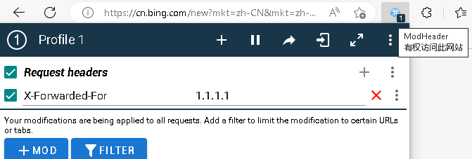
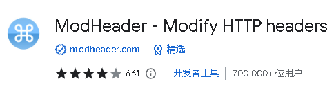

= 方案 ChatGPT
:toc: left
:toclevels: 3
:sectnums:

---

== 在 edge 中使用 new bing

https://www.bing.com/new

edge dev 浏览器的下载地址: +
https://www.microsoftedgeinsider.com/en-us/download

== 在 chrome中 访问 open AI 的 ChatGPT

https://chat.openai.com/chat

== 在 chrome中 访问 new bing 的 ChatGPT

https://www.bing.com/new

https://www.bing.com/search?q=Bing+AI&showconv=1

要先安装插件:

[options="autowidth"]
|===
|Header 1 |Header 2

|ModHeader
|允许强制访问 new bing 网址, 而不跳转到国内bing

插件安装地址: +
https://chrome.google.com/webstore/detail/modheader-modify-http-hea/idgpnmonknjnojddfkpgkljpfnnfcklj?hl=zh-CN

|Bing Unchained - Use new Bing in Chrome
|允许在 chrome中 访问 new bing 的 ChatGPT

插件安装地址: +
https://chrome.google.com/webstore/detail/bing-unchained-use-new-bi/laldfnbbeocphnilnofhedhcjcnchbld/related?hl=zh-CN

|===

