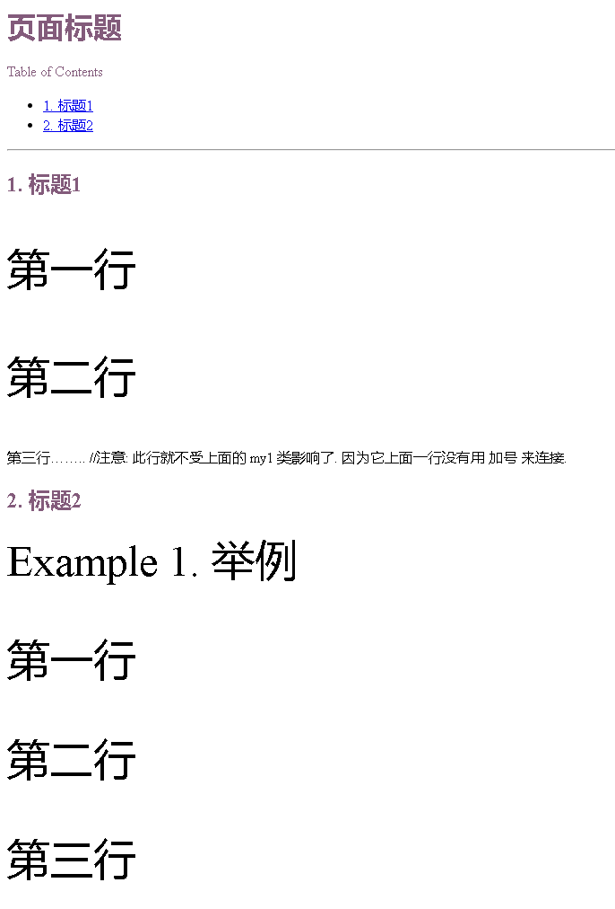
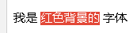

= asciidoc 自定义 css 样式
:toc: left
:toclevels: 3
:sectnums:

'''

== adoc 自定义 css 样式

比如, 你的css文件名是: myAdocCss.css

css文件里面, 这样写:

....
/* 下面的代码, 将 h1等标题, 和 toc目录的字体, 都改变了字体颜色 */

h1, h2, h3, h4, h5, h6, #toctitle,
.sidebarblock > .content > .title {
  color: rgba(100, 50, 90, 0.8);
}

/* 注释: 下面的 my1 是在asciidoc文件中你自定义的class类名 */

.my1 {
  font-size: 3em;    /* 设置my1类的 字号大小 */
}

....

然后, 你在 asciidoc中, 这样写:

....
= 页面标题
:stylesheet: myAdocCss.css   //注意: 这里就嵌入了你的外链css
:toc: left
:toclevels: 3
:sectnums:

'''

== 标题1

[.my1]    //这里, 将下面的两行, 定义成 my1 类. 注意: class类, 默认只能管一行, 如果你想要让该类管到多行, 就必须用 加号+  来连接每一行
第一行 +
 +
第二行

第三行........   //注意: 此行就不受上面的 my1 类影响了. 因为它上面一行没有用 加号 来连接.

== 标题2

[.my1]   //但是, my1类可以默认管到用 ==== 包括起来的所有内容
.举例
====
第一行

第二行

第三行
====

....

效果:

注意: 你使用上边的自定义css时, 会把 asciidoc的默认css给完全覆盖掉, 这意味着你的 目录显示在左侧的代码会失效, 表格也会变得不好看.

你要看默认的 css 是怎样的, 可以搜索名叫 asciidoctor.css 的文件. 可以直接修改这个默认的css即可.

'''

== 自定义某一文字的某景色

在css文件中, 创建一个类, 比如写作:
....
.myRed {
    color: white;  /* 白色字体 */
    background-color: #e34838; /* 红色背景 */

}
....

然后, 在 adoc中, 这样写:

....
我是 [.myRed]#红色背景的# 字体    //注意: 包起来的代码, 前后都要有一个空格
....

效果如下:

可以看出来 `[.myRed]# ... #` 相当于这个html标签 `
...
`

'''

== #自定义css, 来取代 asciidoc 默认的样式#

官方教程: https://docs.asciidoctor.org/asciidoctor/latest/html-backend/custom-stylesheet/

(1).在和你的 asciidoc文件的 同目录中, 创建css文件, 比如起名叫 my-stylesheet.css

css内容比如如下:
....
body {
  color: #ff0000;
}
....

(2).将 `:stylesheet: my-stylesheet.css` 这句话, 添加到你的asciidoc文档标题中.

....
= 方法论
:stylesheet: my-stylesheet.css   ← 写在这里
:toc: left
:toclevels: 3
:sectnums:
....

'''

== 修改asciidoc自带的默认css样式

官方教程: https://docs.asciidoctor.org/asciidoctor/latest/html-backend/default-stylesheet/#customize-extend

''''

