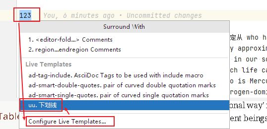

= asciidoc 设置
:toc: left
:toclevels: 3
:sectnums:
:stylesheet: myAdocCss.css

'''

== #预览窗口中, 记住缩放页面的比例#

'''

== #在 pycharm 中 配置 asciidoc 的下划线快捷键#

先设置 pycharm的 :

即, 输入代码
....
[underline]#$SELECTION$#
....

并指定给 asciidoc 文档编辑.

然后, 在 asciidoc页面中, 就能选中你的某个文本, 按 ctrl + alt + T, 然后点击 你刚才起名的下划线功能. 就能包围住该文本了.

'''

