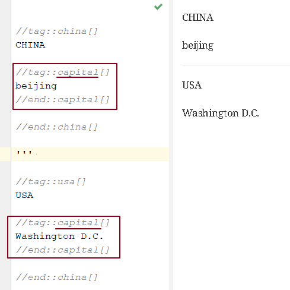

= asciidoc 技巧 - 嵌入块
:toc: left
:toclevels: 3
:sectnums:
:stylesheet: myAdocCss.css

'''

== ★ #引用并嵌入另一个adoc文章中的内容 -> include::example.adoc[]#

比如, 你在你当前编辑文件的同一目录下,有一个 example.adoc, 里面的内容如下:

....
[#sec-a]
== Section A

content

[#sec-b]
== Section B

content

[#sec-c]
== Section C

content
....

现在, 你要在当前编辑的文档中, 嵌入example.adoc 中的内容. 就可以写成:

(注意, 下面include前没有反斜杠, 这里写反斜杠是为了在adoc渲染中进行转义. 不然渲染不出来.)
....
\include::example.adoc[]
// 嵌入 example.adoc 的所有内容进来

\include::example.adoc[lines=5..10]
//嵌入 example.adoc 中的第5到10行的内容进来

....

---

==== include 完整的命令

完整的命令和参数是: +
(注意, 下面include前没有反斜杠, 这里写反斜杠是为了在adoc渲染中进行转义.)
....
\include::path[leveloffset=offset,lines=ranges,tag(s)=name(s),indent=depth,opts=optional]
....

---

== ★★★ 块嵌入 : 引用并嵌入另一个文件中的某个tag 的内容 -> ① 定义tag, 要写成 tag::yourTagName[], end::yourTagName[] ->  ② 调用tag时, 要写成 include::被调用的文件名.adoc[tag=yourTagName]

官方文档  +
https://webcache.googleusercontent.com/search?q=cache:q1_Su5T1mZ4J:https://docs.asciidoctor.org/asciidoc/latest/directives/include-tagged-regions/+&cd=1&hl=en&ct=clnk&gl=sg

比如, 你当前文件是 asciiDoc_1.adoc, 你想嵌入 asciiDoc_2.adoc 中某一部分的内容. 就在 该部分, 用 `tag::tag名[]` 和 `end::tag名[]` 包围起来.

比如下面, 你对某block 定义了一个tag, 起名叫 yourTagName.
....
// asciiDoc_2.adoc 中的内容

tag::yourTagName[]

block content ....

end::yourTagName[]
....

注意 : 上面的写法, 默认会把tag那两行也渲染出来. 为了隐藏它们(毕竟它们只是我们自定义的标记而已) ,可以在前面 用 // 来注释掉它们, 就不会渲染出来了, 同时, 它们tag的功能依然生效的!

即写成:

....
// asciiDoc_2.adoc 中的内容

// tag::yourTagName[]

block content ....

// end::yourTagName[]
....

注意: "//" 是adoc文件中的注释, 如果你引用的是其他编程文件中的某块内容, 就要用该编程语言中的注释符号来注释掉, 比如:
....
ruby编程语言是用 # 来注释的.
....

....
XML 文件中要用
<!-- tag::name[] -->
和
<!-- end::name[] -->
来注释
....

现在, 你要在 asciiDoc_1.adoc 中来引用并嵌入 asciiDoc_2.adoc 中的 tag 部分, 就写成:

....
// asciiDoc_1.adoc 中的内容

\include::asciiDoc_2.adoc[tag=yourTagName]
//注意: include前不需要带反斜杠!

//也可以一次性调用多个tag, 就写成复数形式 tags= A;B;C;...

\include::asciiDoc_2.adoc[tags=tagName1;tagName2]

// 注意: 一次性调用多个tag时, tag名的顺序不改变渲染结果, 即渲染顺序不会改变, 永远是从头向下找tag.

....

又例:

....
// asciiDoc_2.adoc 中的内容
//tag::china[]
CHINA

//tag::capital[]
beijing
//end::capital[]

//end::china[]

---

//tag::usa[]
USA

//tag::capital[]
Washington D.C.
//end::capital[]

//end::china[]
....

现在, 我们在 asciiDoc_1.adoc 中来调用 asciiDoc_2.adoc 中所有tag名是"capital"的部分:

....
// asciiDoc_1.adoc 中的内容

\include::asciiDoc_2.adoc[tag=capital]
....

asciiDoc_1.adoc 会渲染出:
....
beijing Washington D.C.
....

---
