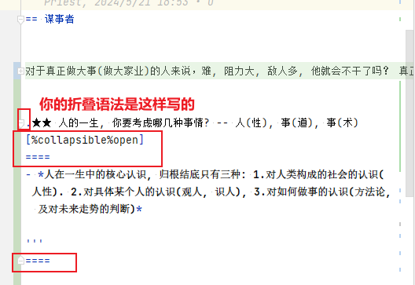
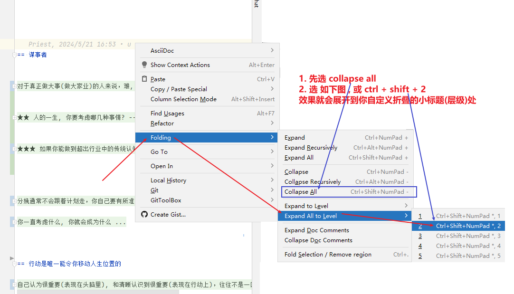

= asciidoc 折叠行
:toc: left
:toclevels: 3
:sectnums:
:stylesheet: myAdocCss.css

'''

== #多行折叠#

....
.折叠按钮处显示的名称
[%collapsible]
====
被折叠的内容放在这里

line 2

line 3
====
....

效果

.折叠按钮处显示的名称
[%collapsible]
====
被折叠的内容放在这里

line 2

line 3
====

---

下面的好! 可以在编辑预览中折叠,但在用 chrome 打印成 pdf时, 能自动展开里面的内容, 否则, pdf 是不会有自动展开里面内容的交互能力的. 你就只能手动一个个展开了, 这就太累了.

如果想让折叠处, 默认是展开状态, 就写成:

....
.名称写在这里
[%collapsible%open]
====
本处折叠内容, 默认会先展开

而非先折叠起来
====
....

效果

.名称写在这里
[%collapsible%open]
====
本处折叠内容, 默认会先展开

而非先折叠起来
====

该功能的 英文文档说明:
https://blog.mrhaki.com/2019/03/awesome-asciidoctor-collapsible-content.html

---

== #★★★ 展开到自定义折叠处#

''

== #单行折叠#

....
[example%collapsible]
单行内容 line content +
123 +
456
....

效果

[example%collapsible]
单行内容 line content +
123 +
456

'''

