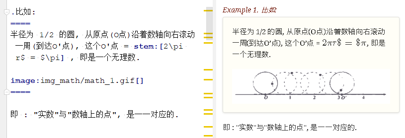

= asciidoc 插入 代码块
:toc: left
:toclevels: 3
:sectnums:
:stylesheet: myAdocCss.css

'''

== ★ 举例

....
.标题
====
例如：
====
....

效果:

.标题
====
例如：
====





---


== ★ 专业术语解释 -> 术语::

....
术语1::
概念解释... +
...
// 注意: 若有空行则失效
....


术语1::
概念解释... +
...

== 单词代码块
用两个 ` ` 包裹起来即可
```
i like `zzr`
```
效果 +
i like `zzr`


---

== 给"块"自定义标题

任何块可以在块上面定义标题。 块标题是一行以点号开头的文字。 点号后面不能有空白。

....
.你自定义的"块标题名"
====
内容..
====
....

效果

.你自定义的"块标题名"
====
内容..
====


---

== 案例文本块(里面支持字体加粗, 列表, 和分隔线!) (github中会丢失代码块的底色, 变成白色)
写在上下4个等号= 里面即可.

```
====
案例内容 +
line1 +
line2

- item1
- item2

--- //分隔线

_斜体_
*加粗*
====
```

效果: +

====
案例内容 +
line1 +
line2

- item1
- item2

--- //分隔线

_斜体_
*加粗*
====

---

==== 案例文本块里面, 还可以使用上代码块
....
.案例名字
====
zzr的代码是:
```
code zzr...
```

wyy的代码是:
```
code wyy...
```
====
....

效果 +

.案例名字
====
zzr的代码是:
```
code zzr...
```

wyy的代码是:
```
code wyy...
```
====


例子2:
....
[NOTE]
====
An admonition block may contain complex content.

.A list
- one
- two
- three

Another paragraph.
====
....

效果: +

[NOTE]
====
An admonition block may contain complex content.

.A list
- one
- two
- three

Another paragraph.
====

---

== 程序代码块(无色)
有两种方法: +
1. 写在两个 ```中 (不推荐使用!! 会有bug)  +
2. 写在两个(四点号) ....中 (推荐使用! 不会有问题)

效果:
....
arrP.sort((a: Itf_Person, b: Itf_Person) => { //海客谈瀛洲，烟涛微茫信难求；越人语天姥，云霞明灭或可睹。天姥连天向天横，势拔五岳掩赤城。天台四万八千丈，对此欲倒东南倾。(四万 一作：一万)我欲因之梦吴越，一夜飞度镜湖月。(度 通：渡)湖月照我影，送我至剡溪。谢公宿处今尚在，渌水荡漾清猿啼。
    let nameA = a.name.toLowerCase()
    let nameB = b.name.toLowerCase()
    if (nameA < nameB) {
        return -1
    }
    if (nameA > nameB) {
        return 1
    } else return 0
})
....

---


== #★★★ 程序代码块内, 加粗某行, 让它显眼.#

....
[,subs=+quotes]
----
你要*加粗*的内容   // 加粗的内容, 写在两个*里面; 或两个#里面, 可以高亮.
----
....

效果:
[,subs=+quotes]
----
interface OrderRepository extends CrudRepository<Order,Long> {

  *List<Order>* findByCategory(String category);

  Order findById(long id);
}
----


---

== 程序代码块(有色)

为了让代码块有颜色, 就要加上程序名字了.

```
[source, 程序名字(比如typescript)]
----
代码内容
----
```

效果

[source, javascript]
----
arrP.sort((a: Itf_Person, b: Itf_Person) => { //海客谈瀛洲，烟涛微茫信难求；越人语天姥，云霞明灭或可睹。天姥连天向天横，势拔五岳掩赤城。天台四万八千丈，对此欲倒东南倾。(四万 一作：一万)我欲因之梦吴越，一夜飞度镜湖月。(度 通：渡)湖月照我影，送我至剡溪。谢公宿处今尚在，渌水荡漾清猿啼。
    let nameA = a.name.toLowerCase()
    let nameB = b.name.toLowerCase()
    if (nameA < nameB) {
        return -1
    }
    if (nameA > nameB) {
        return 1
    } else return 0
})
----

---

== 代码块内不换行(github中天生就不换行)
要加上 #%nowrap# 属性. +
nowrap 会增加（css 样式 white-space:nowrap 和 word-wrap: normal）到 <PRE> 元素上。

```
[source%nowrap, javascript]
----
代码内容
----
```

效果: +

[source%nowrap, javascript]
----
arrP.sort((a: Itf_Person, b: Itf_Person) => { //海客谈瀛洲，烟涛微茫信难求；越人语天姥，云霞明灭或可睹。天姥连天向天横，势拔五岳掩赤城。天台四万八千丈，对此欲倒东南倾。(四万 一作：一万)我欲因之梦吴越，一夜飞度镜湖月。(度 通：渡)湖月照我影，送我至剡溪。谢公宿处今尚在，渌水荡漾清猿啼。
    let nameA = a.name.toLowerCase()
    let nameB = b.name.toLowerCase()
    if (nameA < nameB) {
        return -1
    }
    if (nameA > nameB) {
        return 1
    } else return 0
})
----

---

== 全局的代码块都不自动换行
在文档头部写上 #:prewrap!:# 属性
```
:prewrap!:

[source, java]
----
代码内容
----
```

---

== 给代码块加个自有的小标题(写在代码块外面)

```
.名字
----
代码内容
----
```

效果: +

.fn_getAllDoc_fromRealm.ts
----
code....
----

---

== ★★ 把代码块的小标题(写在代码块里面) (github中会丢失代码块的底色, 变成白色)
把代码块的四个横线-, 改成四个星号*即可.

```
.名字
****
代码内容
****
```

效果: +

.fn_getAllDoc_fromRealm.ts
****
code....
****

'''

还可写成 :

....
[sidebar]
.Related information
--
This is aside text.

**It is used to** present information related to the main content.
--
....

效果

[sidebar]
.Related information
--
This is aside text.

**It is used to** present information related to the main content.
--


---
