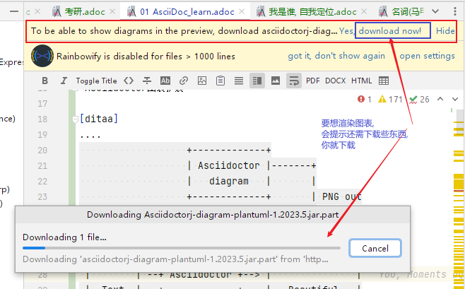

= asciidoc 插入 - 画图, 图表
:toc: left
:toclevels: 3
:sectnums:
:stylesheet: myAdocCss.css

'''

==== 画字符图

https://asciiflow.com/#/

'''

== "画图表"支持: asciidoctor-kroki

https://github.com/ggrossetie/asciidoctor-kroki

asciidoc diagram  和  kroki 有什么区别?

Asciidoctor Diagram是一组Asciidoctor扩展，它们允许你将使用纯文本描述的图表添加到AsciiDoc文档中。这些扩展支持多种图表语法，包括PlantUML，Graphviz，Ditaa和Shaape等。每个扩展都运行图表处理器以根据输入文本生成SVG、PNG或TXT文件。然后将生成的文件插入转换后的文档中。

Kroki是一个开源项目，它提供了一个Web API来将各种图表描述语言转换为图像。Kroki支持多种图表语言，包括PlantUML，Graphviz，Mermaid和Vega等。

总之，Asciidoctor Diagram和Kroki都可以用来在AsciiDoc文档中绘制图表。Asciidoctor Diagram是一组Asciidoctor扩展，它们在本地运行图表处理器来生成图像。而Kroki则提供了一个Web API来将图表描述语言转换为图像。

'''

== 让 asciidoc支持数据图 -> 安装  Asciidoctor图表扩展

Asciidoctor图表扩展, 官网 +
https://docs.asciidoctor.org/diagram-extension/latest/ +

https://intellij-asciidoc-plugin.ahus1.de/docs/users-guide/features/preview/diagrams.html +

安装方式: +
1.首先，你需要安装Ruby和RubyGems.

2.在 cmd中, 输入命令 `gem install asciidoctor-diagram` 来安装Asciidoctor图表扩展。

3. 输入下面的代码, 来做实验:
....
[ditaa]
....
                   +-------------+
                   | Asciidoctor |-------+
                   |   diagram   |       |
                   +-------------+       | PNG out
                       ^                 |
                       | ditaa in        |
                       |                 v
 +--------+   +--------+----+    /---------------\
 |        | --+ Asciidoctor +--> |               |
 |  Text  |   +-------------+    |   Beautiful   |
 |Document|   |   !magic!   |    |    Output     |
 |     {d}|   |             |    |               |
 +---+----+   +-------------+    \---------------/
     :                                   ^
     |          Lots of work             |
     +-----------------------------------+
....
....

渲染效果如下:

[ditaa]
....
                   +-------------+
                   | Asciidoctor |-------+
                   |   diagram   |       |
                   +-------------+       | PNG out
                       ^                 |
                       | ditaa in        |
                       |                 v
 +--------+   +--------+----+    /---------------\
 |        | --+ Asciidoctor +--> |               |
 |  Text  |   +-------------+    |   Beautiful   |
 |Document|   |   !magic!   |    |    Output     |
 |     {d}|   |             |    |               |
 +---+----+   +-------------+    \---------------/
     :                                   ^
     |          Lots of work             |
     +-----------------------------------+
....

如果提示还需下载什么文件才能支持渲染, 就下载它们.

其他的图表类型还有:

▼

[plantuml, target=diagram-classes, format=png]
....
class BlockProcessor
class DiagramBlock
class DitaaBlock
class PlantUmlBlock

BlockProcessor <|-- DiagramBlock
DiagramBlock <|-- DitaaBlock
DiagramBlock <|-- PlantUmlBlock
....

▼

'''

