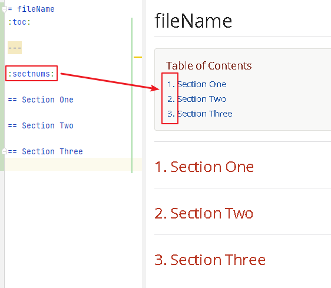
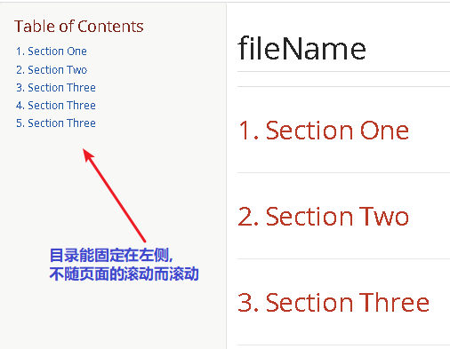

= asciidoc 效果样式 - 目录
:toc: left
:toclevels: 3
:sectnums:
:stylesheet: myAdocCss.css

'''


== 目录层级

亲测, 可以实现三级 level3 的变化
....
= Document Title (level 0) =
== Section title (level 1) ==
=== Section title (level 2) ===
==== Section title (level 3) ====
===== Section title (level 4) =====
....


---

== 文章中的目录
紧跟在第一级标题后的下一行, 写上 #:toc:# 属性. 注意, 该属性上面不能有空行!
```
= 一级标题(即本adoc的唯一文件大标题)
:toc:
```

<br> <--可见 html标签在adoc中无效!

---

==== toc层级 -> :toclevels: 4

官方文档
https://docs.asciidoctor.org/asciidoc/latest/toc/levels/

toc 默认只显示两层 level, 要显示多层目录, 就要用 :toclevels: 属性

By default, the TOC displays level 1 (==) and level 2 (===) section titles.  +
You can assign a different level depth with **the toclevels attribute**.

....
= 主标题
:toc:
:toclevels: 4
....


---

==== ★ 让目录自动加上编号 -> :sectnums:

....
:sectnums:

== Section One
== Section Two
== Section Three
....

效果 +


---

==== ★ 让目录同时显示在页面左侧固定 -> :toc: left

....
= fileName
:toc: left
....

效果 +


'''


==== #★ 夸目录调用css文件#

文件目录层级如下:

....
02_myself_ID_EGO
-> myAdocCss.css

11_programme_Learning
-> 201 comfyUI
-> -> adoc.adoc
....

即, -> 符号是用来表示目录层级.

*我想让 adoc.adoc 读取 02_myself_ID_EGO 目录下的 myAdocCss.css 这个css文件, 该怎么写地址?*

这样写: +
....
:stylesheet: ../../02_myself_ID_EGO/myAdocCss.css
....

image:/img/svg 001.svg[,%]

我们来分解一下这个相对路径是如何工作的：

- 当前文件位置：/11_programme_Learning/201 comfyUI/adoc.adoc
- #../#：从 201 comfyUI 目录向上退一级，到达 /11_programme_Learning/ 目录。
- #../#：再向上退一级，到达根目录（即 02_myself_ID_EGO 和 11_programme_Learning 的共同父目录）。
- 02_myself_ID_EGO：进入平级的 02_myself_ID_EGO 目录。
- /myAdocCss.css：找到目标 CSS 文件。

'''

== 画"目录结构图" -> 安装 mddir模块

方法:
....
npm install mddir -g  //先全局安装mddir模块
cd X:\mywork   //进入你的工程目录下
mddir  //直接运行mddir命令
....
打开你的工程根目录, 会看到一个名为 directoryList.md的文件，里面就是你项目的"目录结构图".

---
