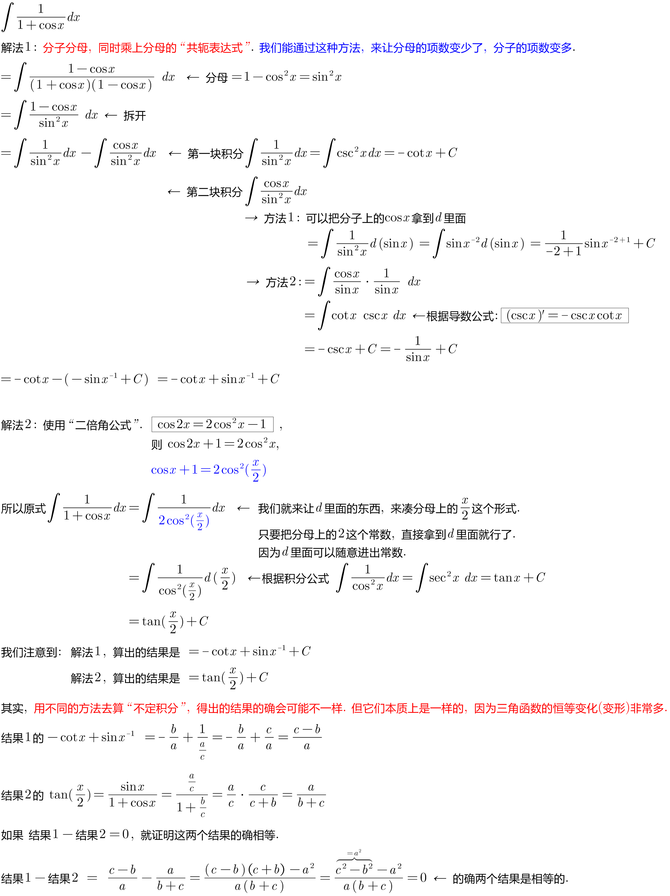

:toc: left
:toclevels: 3
:sectnums:

---

25.09 开始

==== stem:[\int \frac{1} {1+ cos x} dx ]
.标题
====
例如： +

====

==== stem:[\int \frac{sin x} {1+ sin x} dx ]
.标题
====
例如： +
image:img/t1002.png[,780]
====

https://www.bilibili.com/video/BV1MN411Z7EH/?spm_id_from=333.788&vd_source=52c6cb2c1143f8e222795afbab2ab1b5

37.20
