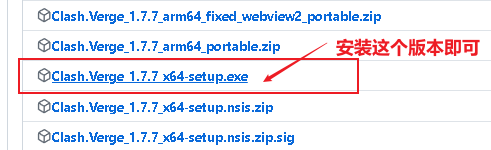
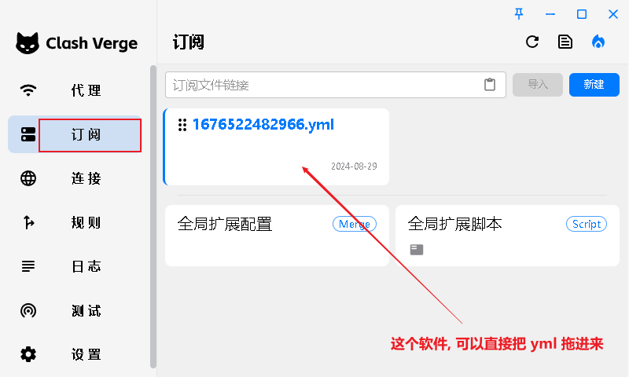
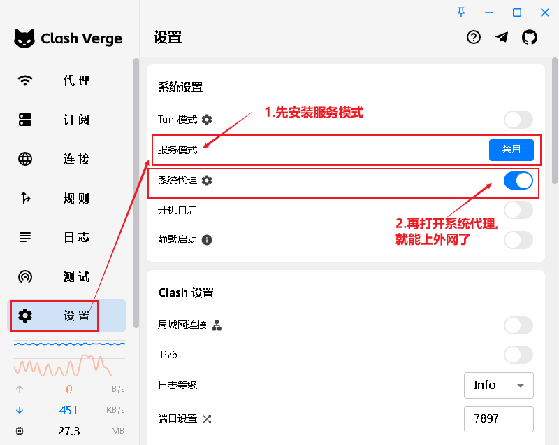
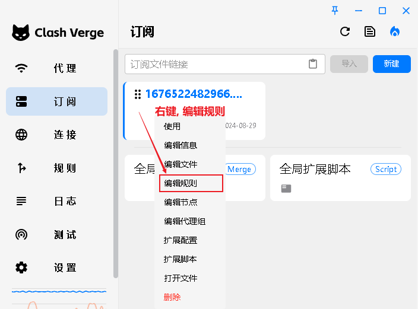
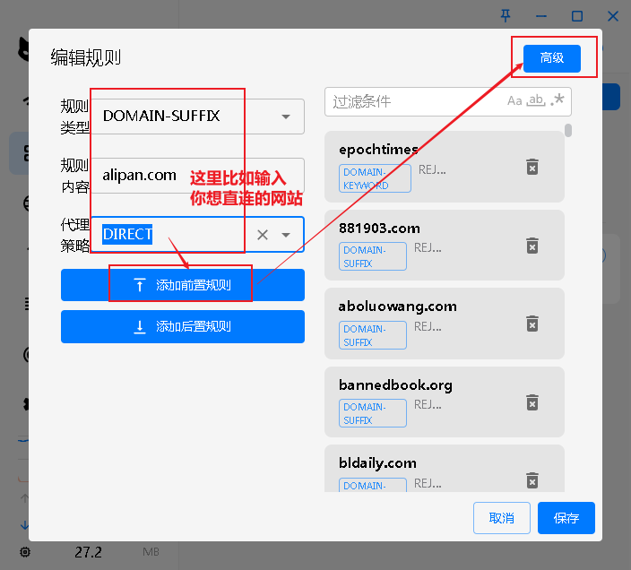
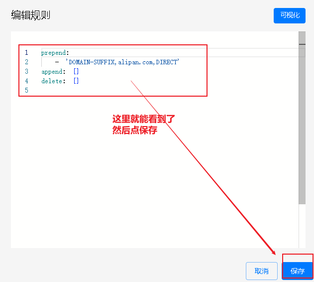
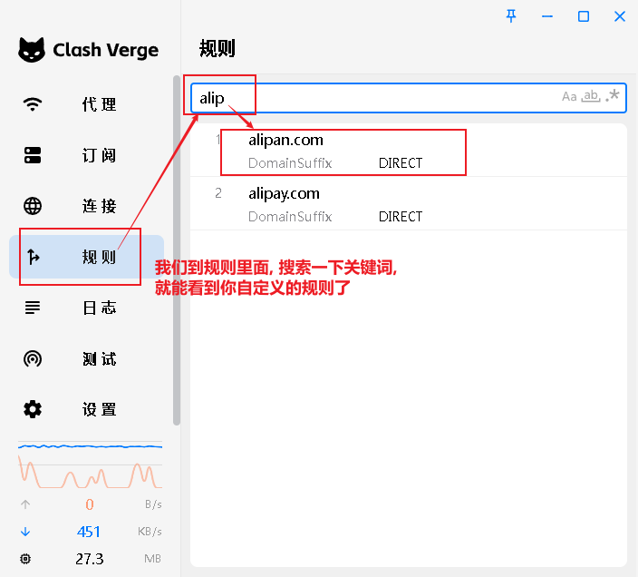

= clash verge rev
:toc: left
:toclevels: 3
:sectnums:
:stylesheet: myAdocCss.css

'''

== 第一课

官网安装地址 +
https://github.com/clash-verge-rev/clash-verge-rev

[.small]
[options="autowidth" cols="1a,1a"]
|===
|Header 1 |Header 2

|载入机场配置文件
|

|在"设置" -> 先启用"服务模式",  +
并打开"系统代理"即可.
|

注意: 启用"服务模式"后, 你再次关掉它, 似乎也不影响你上外网.

|===

'''

== 自定义规则

'''

