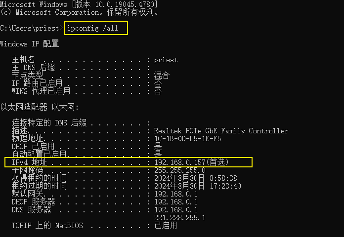

= clash verge rev
:toc: left
:toclevels: 3
:sectnums:
:stylesheet: myAdocCss.css

'''

== 第一课

官网安装地址 +
https://github.com/clash-verge-rev/clash-verge-rev

[.small]
[options="autowidth" cols="1a,1a"]
|===
|Header 1 |Header 2

|载入机场配置文件
|

|在"设置" -> 先启用"服务模式",  +
并打开"系统代理"即可. (只有在启用"系统代理"后，电脑浏览器才会开启代理，实现科学上网)
|

注意: 启用"服务模式"后, 你再次关掉它, 似乎也不影响你上外网.

|===

'''

== 自定义规则

'''

== 打开配置文件所在的目录

'''

== Clash DNS设置, 和DNS泄露解决方法

DNS, 其实是将"网址域名"和"IP地址"相互映射的一个分布式数据库. 然而，由于DNS请求通常是未加密的。

[.small]
[options="autowidth" cols="1a,1a"]
|===
|Header 1 |Header 2

|FakeIP 功能
|Clash 中提供了 FakeIP 功能, 在此模式下，Clash会为你每个请求生成一个假的、不存在的IP地址，然后在内部解析这个IP到正确的域名。这样，外部的网络监控者只能看到假的IP地址，而无法通过DNS请求来了解用户的网络活动。

|DNS泄露
|DNS泄露是指当您使用VPN、代理服务器或其他隐私服务时，您的DNS请求不是通过这些服务，而是直接发送到您的ISP（互联网服务提供商）。这会暴露您的网络行为，并可能导致您的隐私泄露。

怎么查看你是否发生了了DNS泄露?
Clash开启了代理后, 你用浏览器访问 https://ipleak.net ，查看是否显示有中国大陆的记录，如果有，则就是发生了DNS泄露。

当你使用 VPN 上网时，可以通过 #ipleak.net# 或 #ip8.com# 网站来测试 VPN 是否泄露了你的 IP 地址。**这些网站仅能显示你的公共 IP 地址，即你的网络连接所分配的 IP 地址。**如果你正在使用 VPN 服务，**这些网站将会显示你所连接的 VPN 服务器的 IP 地址，而不是你真实的 IP 地址。**这可以帮助你验证 VPN 是否成功隐藏了你的真实 IP 地址。

此时，*你也可以通过 ipconfig /all 命令行查询你的"真实 IP 地址". 如果这里查询的 IP 地址, 和通过 ipleak.net 查询的 IP 地址不一致，则表明你的 IP 地址确实被隐藏了。如果一致，则表明你的 IP 地址暴露了。*

*上图中，通过 ipconfig /all 查询本机真实 IP 地址为 192.168...，与上图所示的 123.58... 不一致，说明 IP 地址未泄露。*

|===

