= clash verge
:toc: left
:toclevels: 3
:sectnums:
:stylesheet: myAdocCss.css

'''

官网
https://clashverge.net/ +
https://github.com/zzzgydi/clash-verge

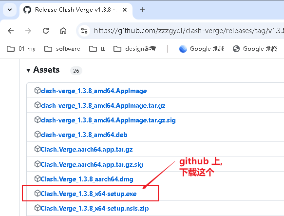

[.small]
[options="autowidth" cols="1a,1a"]
|===
|Header 1 |Header 2

|安装完后, 可以改成中文
|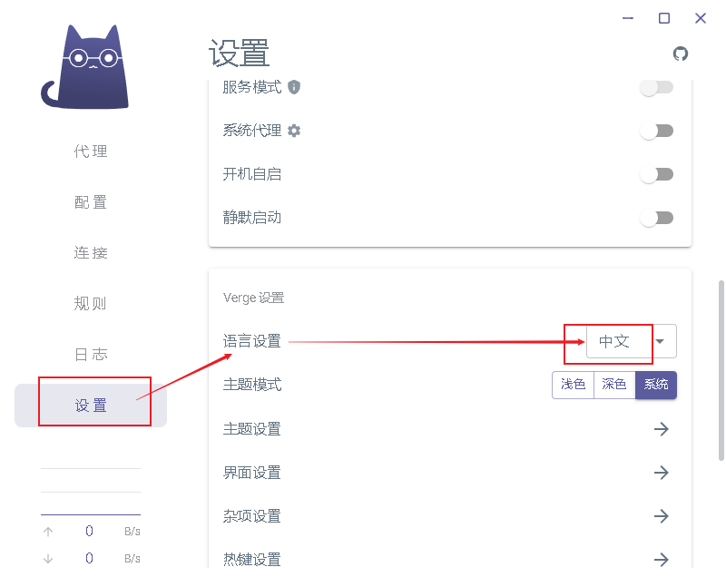

|更换内核成 meta
|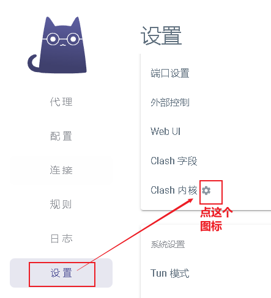

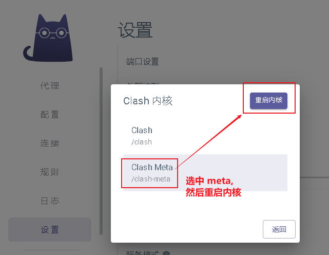

Clash Meta 是基于原 Clash 核心的重写项目，支持原 Clash Premium 核心的大部分功能。*由于原 Clash Premium 核心已经删库停更，现在还在继续更新的 Clash 客户端，几乎都采用 Clash Meta 内核*.  +
因此可以说, Clash Meta 挑起了「大梁」，是原 Clash 核心的继任者。

开发者自称 Clash Meta 为「虚空终端」，戏称为原神相关的项目，Github 页面更是命名为 Mihomo，可以说是幽默感拉满了。

|载入"机场的配置文件"
|目前, clash verge 还无法直接把 配置文件 yml 拖进来, 只能先新建一个配置文件, 然后把你yml的内容全部拷贝进新建的配置文件中.

说明可见
https://clashvergerev.com/guide.html

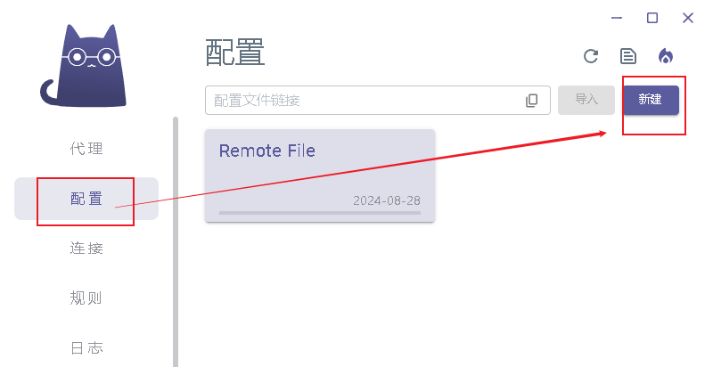

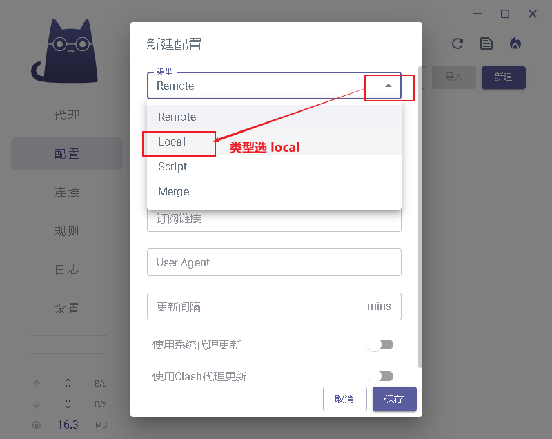

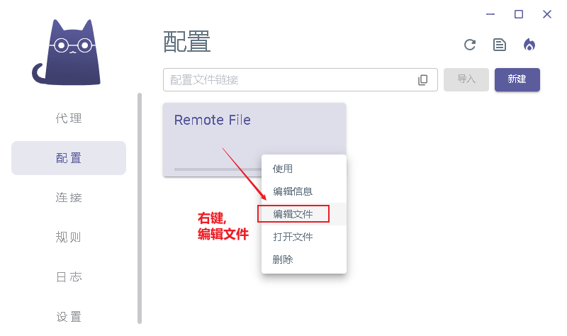

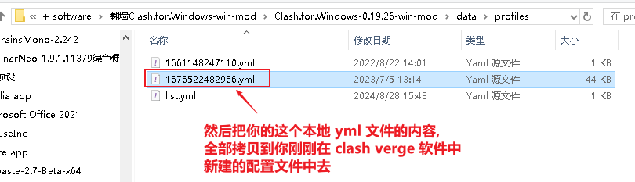

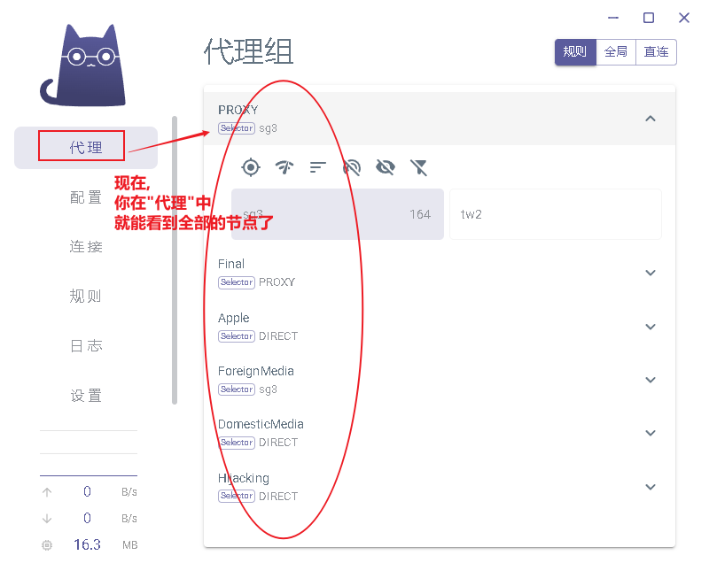

|在"设置"中, 到开"系统代理"开关, 才能上外网
|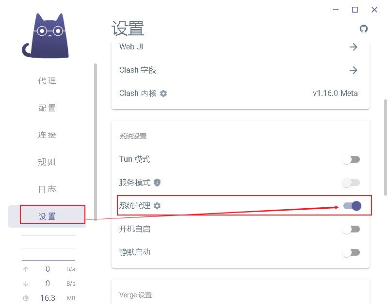

现在就可以上外网了.
|===

'''

== tun 模式

Tun模式开启，开启后会生成"虚拟网卡"，这样全部流量就会走代理了。

开启 TUN 模式以后，绝大多数安卓模拟器, 就可以使用软件设置的代理节点, 进行外网访问了。

打开 tun 模式的方法:
[.small]
[options="autowidth" cols="1a,1a"]
|===
|Header 1 |Header 2

|先安装"服务模式"
|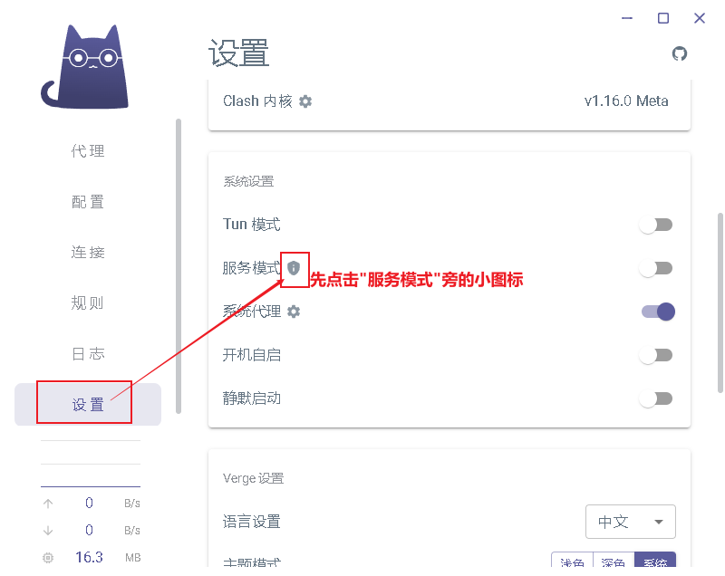

|再关掉 "系统代理模式", 打开"tun模式"和"服务模式"的开关
|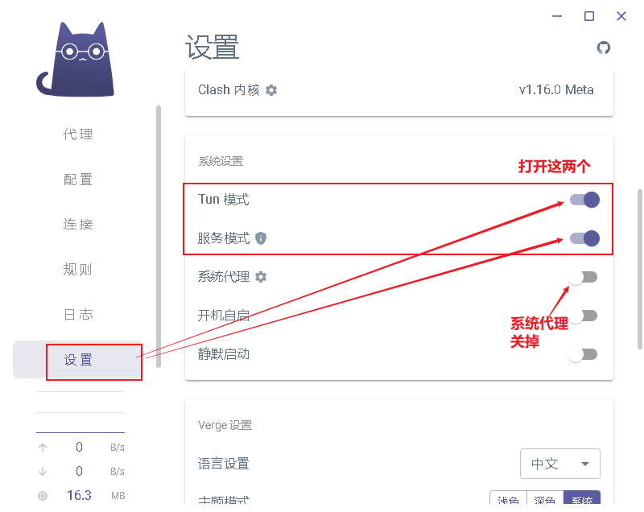

现在也能正常上外网了
|===

'''

