= clash for windows
:toc: left
:toclevels: 3
:sectnums:
:stylesheet: myAdocCss.css

'''

教程: +
https://clashyun.com/clash-advanced-skill/

'''

== 第一课

安装完软件后, 要做下面两步操作, 就能顺利上外网了:

[.small]
[options="autowidth" cols="1a,1a"]
|===
|Header 1 |Header 2

|1.打开 system proxy
|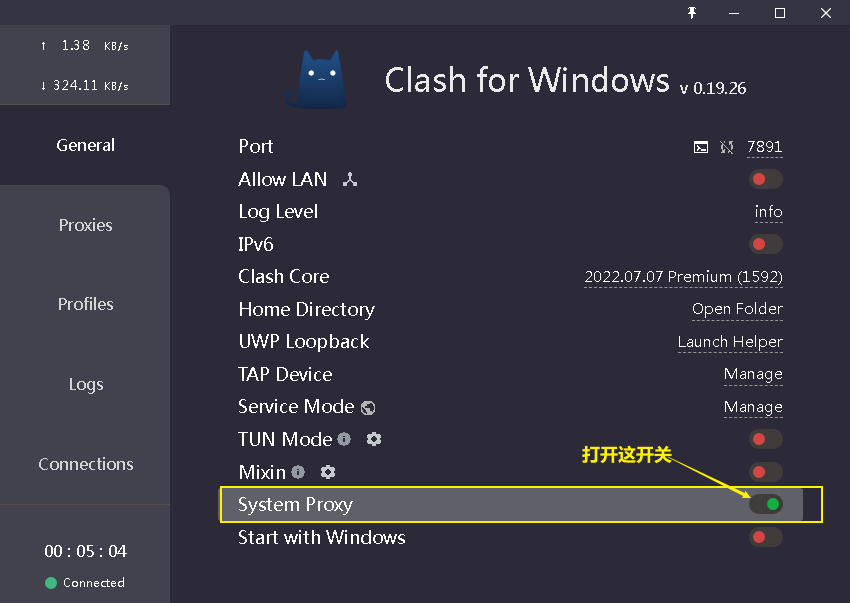

|2.导入配置文件
|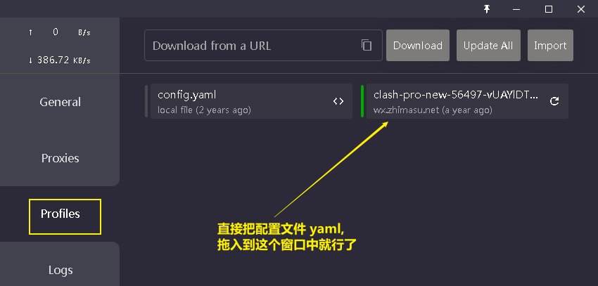
|===

'''

==  配置文件 : yaml文件

[.small]
[options="autowidth" cols="1a,1a"]
|===
|Header 1 |Header 2

|这个 yaml文件的作用, 主要包括以下几点：

- 为 Clash 代理服务, 提供基本设置，比如监听的端口、运行模式（如直连、全局代理、规则代理等）、日志级别等。
- *定义了一些特定的域名到 IP 的映射关系，这可以用来绕过 DNS 查询，直接将某些域名解析到指定的 IP。*
- 配置 DNS 解析的相关设置，包括是否启用，使用的 DNS 服务器等。
- *定义"代理服务器"的信息，包括服务器的地址、端口、类型（如 HTTP、SOCKS5、Shadowsocks 等）、加密方式、密码等。*
- 定义了一组"代理组"，**每个"代理组", 包含一组代理服务器，**可以根据需要选择不同的"代理组"进行访问。
- **制定了一组"代理规则"，**这些规则基于请求的特征（如域名、IP、地理位置等）, *来决定该请求应该由哪个"代理服务器"或"代理组"处理。*

通过这个 config.yaml文件，用户可以灵活地控制 Clash 代理服务的行为，实现对网络访问的细粒度控制。

|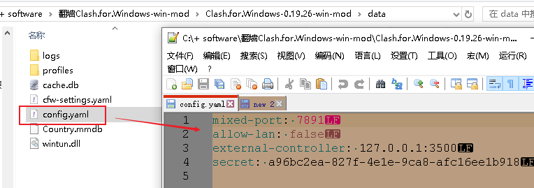

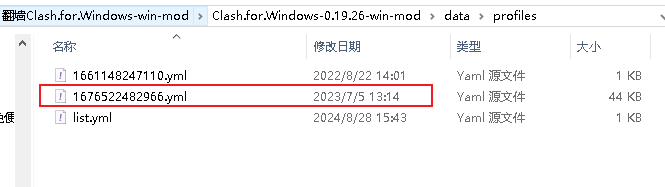
|===

通用部分配置:该部分定义了Clash的一些基本设置，例如端口号，日志级别等。

[.small]
[cols="1a,2a"]
|===
|Header 1 |Header 2
|- port 和 socks-port +
是本地http和socks代理端口

- allow-lan +
允许局域网连接

- mode +
定义了代理模式，可选Rule(按规则分流), Global

- log-level +
日志级别

- external-controller +
控制器地址，用于控制Clash的运行，实际是定义clash http API的访问地址
|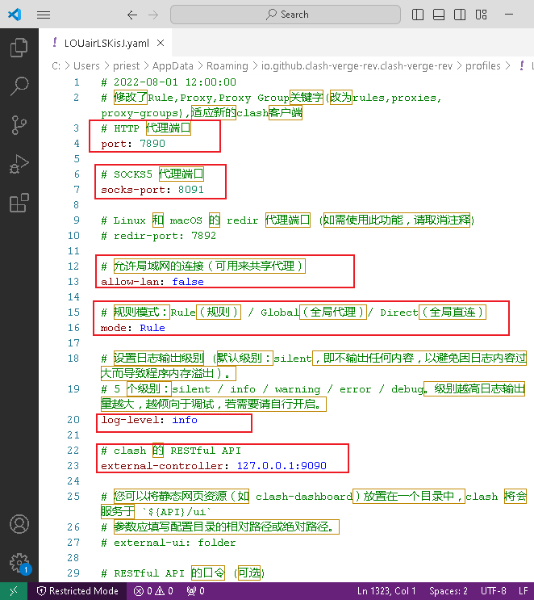

|- hosts +
主机设置：在hosts下，定义了一些**域名到 IP 的映射**。

- dns +
DNS设置：在dns下，定义了**DNS解析**的相关设置，包括启用DNS，使用hosts文件，DNS服务器的选择等。
|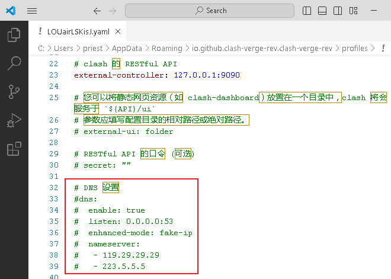

|- proxies +
代理设置: 在proxies下，定义了"一组##代理服务器##"的相关信息. 包括名称，服务器地址，端口，类型，密码等。*这部分是"机场"提供的主要"代理服务器"信息。*
|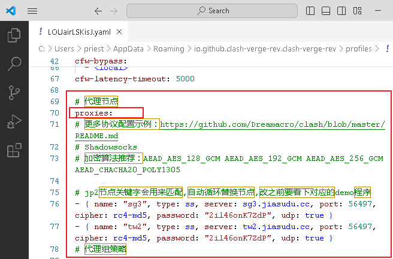

|- proxy-groups +
代理组设置: 在proxy-groups下，**定义了一组"#代理组#"，每个"代理组"都有一个名称，一个类型，和"一组代理服务器"。**当请求匹配到某个"代理组"的规则时，会根据"代理组"的类型, 选择一个"代理服务器"进行访问。
|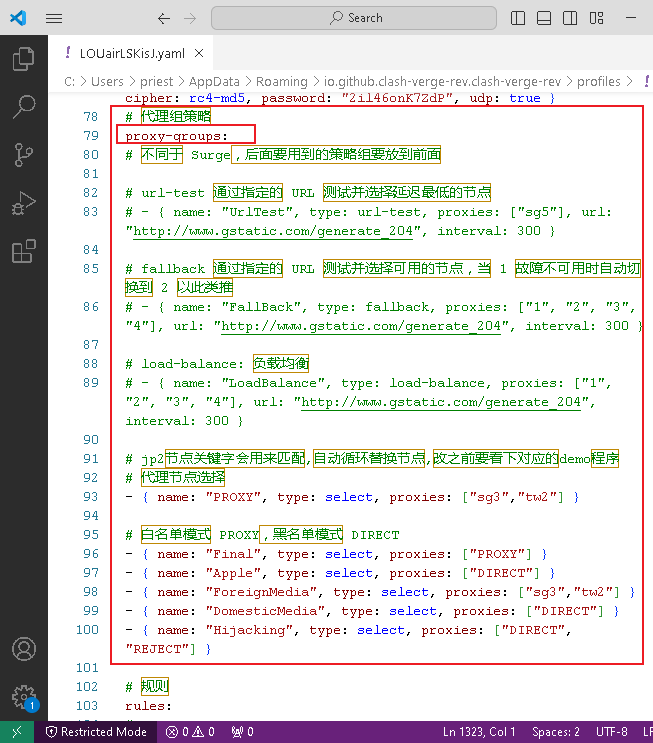

|- rules +
规则设置 : 在rules下，定义了一组规则，**每个规则都有一个类型，一个值，和一个"代理组"。**当请求匹配到某个规则时，会使用规则指定的"代理组"进行访问。
|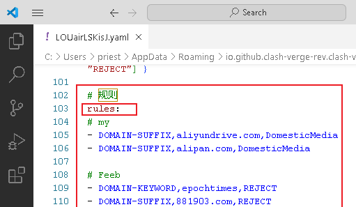
|===

'''

== yaml配置文件中的 rules 规则

以ClashForWindows为例，clash配置文件包含2种: +
[.small]
[options="autowidth" cols="1a,1a"]
|===
|Header 1 |Header 2

|一种是基础配置文件 config.yaml
|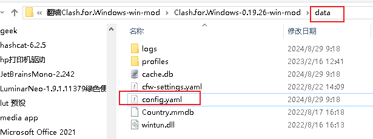

该部分定义了Clash的一些基本设置，例如代理端口号、日志级别、API等信息。

- port 和 socks-port 是本地http和socks代理端口
- allow-lan 允许局域网连接
- mode 定义了代理模式，这里是Rule，即按规则分流，可选Global、Rule
- log-level 日志级别
- external-controller 控制器地址，用于控制Clash的运行，实际是定义clash http API的访问地址

|另一种是订阅及分流规则的配置文件 yaml。
|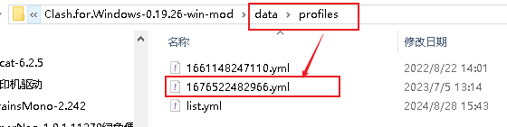

文件配置在配置文件夹下的”profiles”目录中，*一般有几个机场订阅，就会有多少个yml文件。*

该类型文件规则配置主要包含:通用设置、主机设置、DNS设置、代理设置、代理组设置、分流规则等信息。 +
*其中"通用设置"与"基础配置"一致，配置冲突时，以"基础配置文件"config.yaml文件为准。*

|===

[.small]
[options="autowidth" cols="1a,1a"]
|===
|关键字 |Header 2

|proxies
|**在proxies下，定义了一组代理服务器的相关信息，**包括: 名称，服务器地址，端口，类型，密码等。*这部分是机场提供的主要代理服务器信息。*

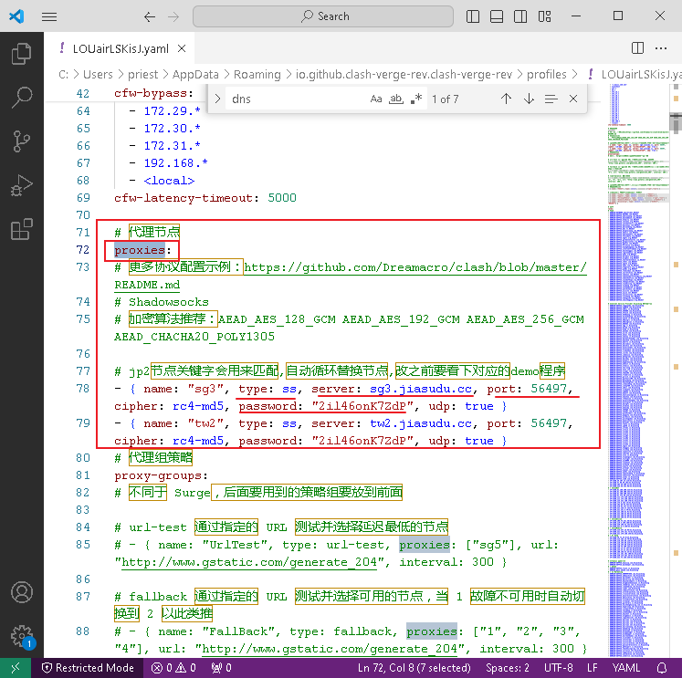

|proxy-groups
|在proxy-groups下，**定义了一组"代理组"，每个代理组都有一个名称，一个类型，和一组"代理服务器"。**当请求**匹配到某个代理组的规则时，会根据代理组的类型, 选择一个"代理服务器"进行访问。**

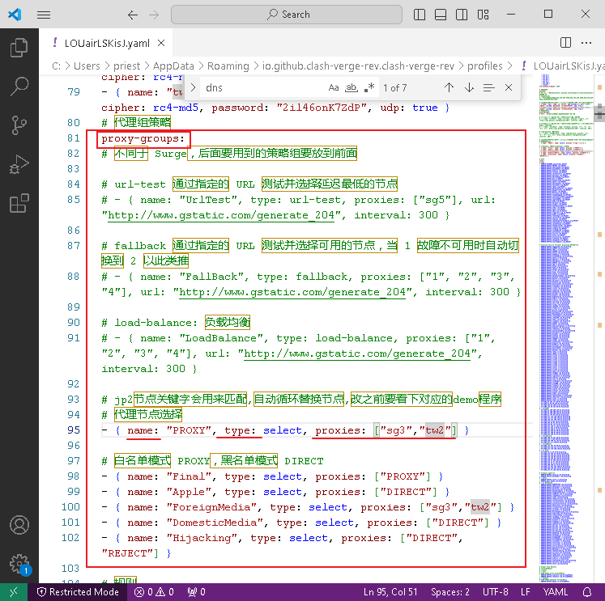

|rules
|**在rules下，定义了一组规则，每个规则都有一个类型，一个值，和一个"代理组"。**当请求**匹配到某个规则时，会使用规则指定的"代理组"进行访问。**

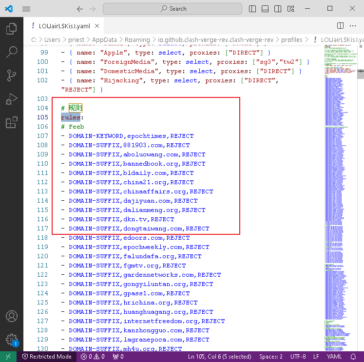

-> (1)  ##DOMAIN##匹配，表示请求的"#域名#"规则匹配:

....
DOMAIN,app.biliapi.net, 爱奇艺&哔哩哔哩
# 这个代码表示, 如果请求域名是 app.biliapi.net，则从“爱奇艺&哔哩哔哩”代理组, 选择代理服务器
....

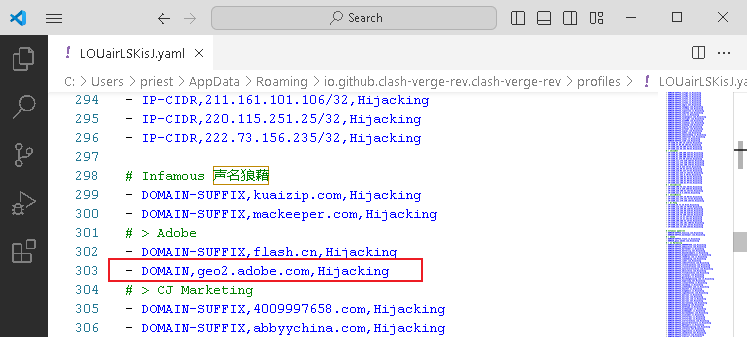

'''

-> (2)  ##DOMAIN-SUFFIX##匹配，表示请求的"#域名后缀#"规则匹配:

....
DOMAIN-SUFFIX,iq.com, 爱奇艺&哔哩哔哩
# 这个代码表示, 如果请求"域名后缀"是iq.com，则从“爱奇艺&哔哩哔哩”代理组,选择代理服务器
....

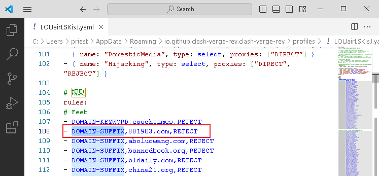

'''

-> (3)  ##DOMAIN-KEYWORD##匹配，表示请求的"#域名关键字#"规则匹配 :

....
DOMAIN-KEYWORD,q, 漏网之鱼
# 这个代码表示如果请求"域名关键字"包含q，则从“漏网之鱼”代理组,选择代理服务器。一般是放在整个rules规则最下方。
....

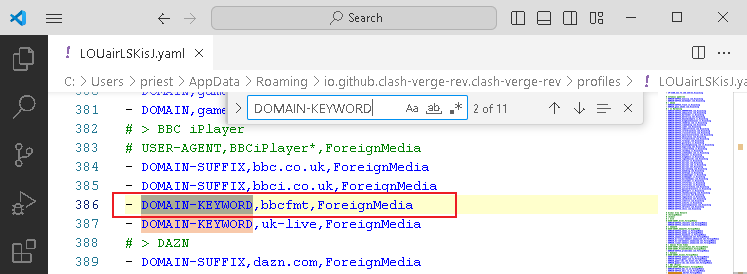

'''

-> (4) ##IP-CIDR##匹配，表示通过请求"#IP地址范围#"规则匹配:

....
IP-CIDR,172.16.0.0/12,DIRECT,no-resolve
# 这里的代码表示：对于 "IP 地址"在 172.16.0.0 到 172.31.255.255 范围内的请求，Clash 将直接连接，不会通过任何代理服务器，并且在处理这些请求时，不会进行 DNS 解析。这通常用于处理"本地或内网"的请求。
....

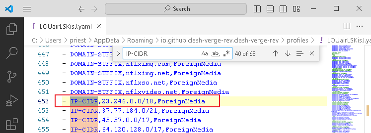

'''
-> (5) ##GEOIP##匹配，表示通过"#IP地区归属#"规则匹配:

....
GEOIP,CN, 国内网站
# 这里的代码表示：对于所有识别为来自中国的 IP 地址的请求，Clash 将通过 “国内网站” 代理组,进行处理。这可以用来实现对国内和国外网站的不同处理，例如，访问国内网站时,直接连接; 访问国外网站时,通过代理服务器。
....

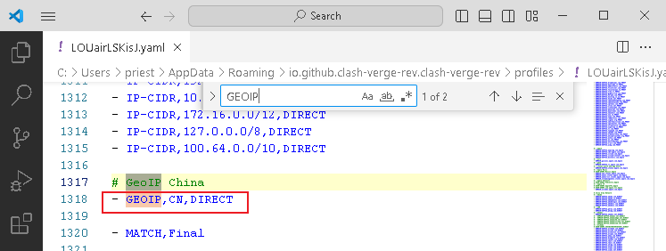

|no-resolve
|在Clash配置文件中，”no-resolve” 是一个选项，当它被设置为true时，Clash将不会对域名进行解析，而是直接将域名发送到"代理服务器"，由代理服务器进行"DNS解析"。

这可以一定程度上保护你的隐私，因为你的本地ISP无法看到你的DNS请求。 +
另一方面，如果代理服务器的DNS解析速度, 比本地的DNS解析速度快，那么使用”no-resolve”也可能会提高你的网络速度。

|===

'''

== 绕过大陆内的网站,来代理

“绕过大陆”, 意思是:  +
-> 如果你访问的是中国大陆内的服务器，那么就直接连接，不通过代理服务器.  +
-> 如果你访问的是外网的服务器, 就通过代理服务器连接。

方法是: +
在你的配置文件中，在Rule部分，添加如下规则:
....
- GEOIP,CN,DIRECT

# 意思是对于源IP地理位置为中国大陆的流量，直接连接，不走代理。
# GEOIP是什么？GEOIP是全球地区IP数据库，记录了IP地址和世界国家地区的映射关系。
....

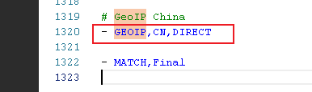

其实很多机场为了省流，一般会在订阅文件中, 自动加上这个配置，避免服务器过载。

'''

== 白名单模式, 和黑名单模式

https://clashyun.com/214.html

- 白名单模式：没有匹配到分流规则的流量，全部都走代理节点。这种情况代理节点会产生较高的流量. (#*白名单, 帮助你升天, 即不在我清单上的, 也全部走天堂通道(代理节点)*#)
- 黑名单模式：没有匹配到分流规则的流量，全部都走直连，不经过代理。(#*黑名单, 即不管你在地狱中, 即不在我清单上的, 全部把你留在墙内(直连).*#)

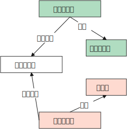

'''

==== "白名单模式"的配置方法 -> 没匹配到的, 全送到天堂(代理节点)

如
....
rules:
  - GEOIP,LAN,DIRECT
  - GEOIP,CN,DIRECT
  - MATCH,PROXY    # 这里的Match PROXY规则, 能设置其他未匹配到的域名IP, 均走"代理节点"。

# 以上代码表示, 只有IP是本地网络, 或者大陆境内IP，才进行"直连". 其他情况一律走"代理节点"。
....

使用以上代码，你需要先定义一个”PROXY”的代理组proxy-groups，将"代理节点"全部加到这个"组"中，以下是一段代码示例：

....
proxy-groups:
- name: Proxy
  type: select
  proxies:
    - v5-01|台湾|1x|v
    - v5-01|新加坡|1x|v
    - v5-01|日本|1x|v
    - v5-01|法国|1x|v
    - v5-01|美国|1x|v
....

也就是: +
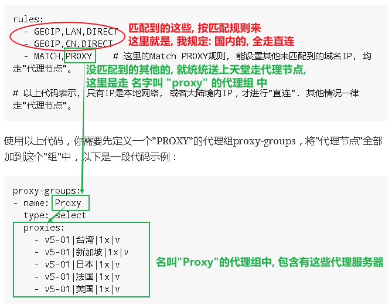

我自己的配置文件, 里面的内容是:

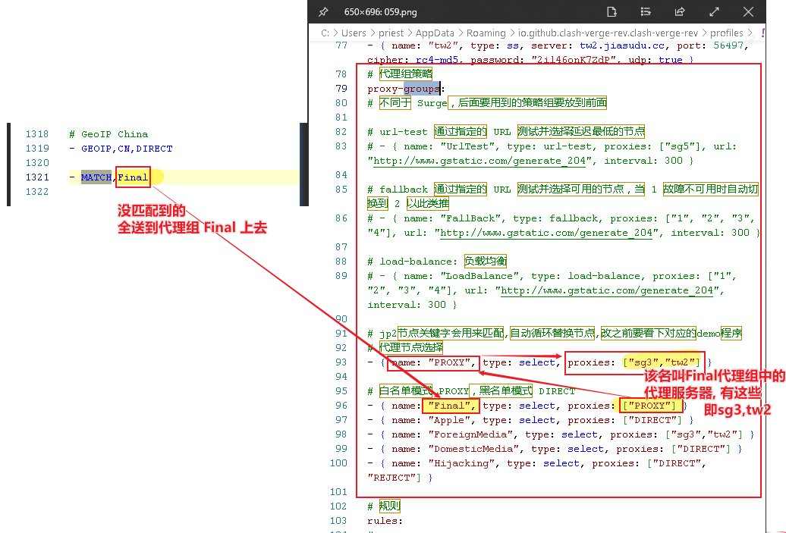

'''

==== "黑名单模式"的配置方法 -> 没匹配到的, 全送到地狱(直连)

以下是一段代码示例：

....
rules:
- DOMAIN-SUFFIX,netflix.com,PROXY
- DOMAIN-SUFFIX,netflix.net,PROXY
- MATCH,DIRECT

# 以上代码设置netflix网飞的域名全部都"代理"，其他情况全部送地狱"直连"。
....

和白名单类型，你同样需要先定义一个”PROXY”的代理组 proxy-groups，将"代理节点"全部加到这个"组"中。

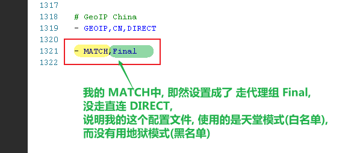

'''

==== GeoIP

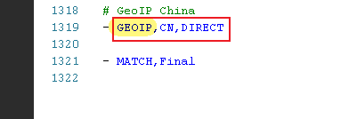

这里的 GeoIP是什么？ +
Geo是geographic的缩写，GeoIP即为IP地理位置数据库，可以根据IP获得地理位置信息。

GeoIP功能, 能通过查询一个内置或自定义的GeoIP数据库, 这个数据库包含了所有已知的IP地址及其对应的地理位置信息。这样, 你就能让来自中国大陆的网络请求,直接连接（直连）. 外网的, 走代理服务器。

因为其可以根据IP地址, 判断所属的国家，因此被广泛应用于各大代理软件例如 Surge /Shadowrocket /Quantumult(X) /Clash中，根据设置的规则,使用不同的节点服务器。

例如, 在Quantumult(X)中，设置以下规则：
....
GEOIP,US,USProxy
GEOIP,CN,Direct
....
这段规则的意思是，如果访问的IP在GeoIP数据库中的地理位置为美国(US)，则使用USProxy这个策略内的服务器节点, 进行访问；如果是中国(CN)，则使用Direct策略,直接连接访问。

此前，MaxMind 一直提供 GeoLite2 公开的访问下载地址，但从2019年12月30日开始，MaxMind不再提供GeoLite2公开的访问下载地址，需要用户注册一个MaxMind帐户并获取许可密钥，才能下载GeoLite2数据库。

MaxMind帐户注册地址：
https://www.maxmind.com/en/geolite2/signup +
直连访问，不要使用代理服务器，否则显示错误，无法注册

除了自己注册下载以外，还可以使用网络上公开的Geolite2数据库.

'''

== 怎么设置某个域名不走代理节点，"直连"到服务器？

可结合DOMAIN-SUFFIX域名后缀规则, 和DIRECT规则使用。

....
DOMAIN-SUFFIX,office.com,DIRECT
# 请将代码放置到rules靠前的位置。
....

'''

== 让Telegram也翻墙，一般需要开启Tun模式 +
(不过我自己尝试时, 似乎没开这个也可以? 只需在telegram中进行设置代理即可.)

[.small]
[options="autowidth" cols="1a,1a"]
|===
|Header 1 |Header 2

|方法是: +
1.安装服务模式Service Mode, 这是开启 Tun模式 的必要条件。 +
2.开启TUN模式

|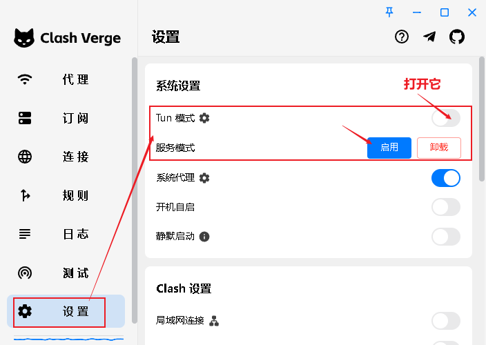

|TUN模式开启后, 会在系统自动创建一个名为“Clash内核名”的虚拟网卡。
|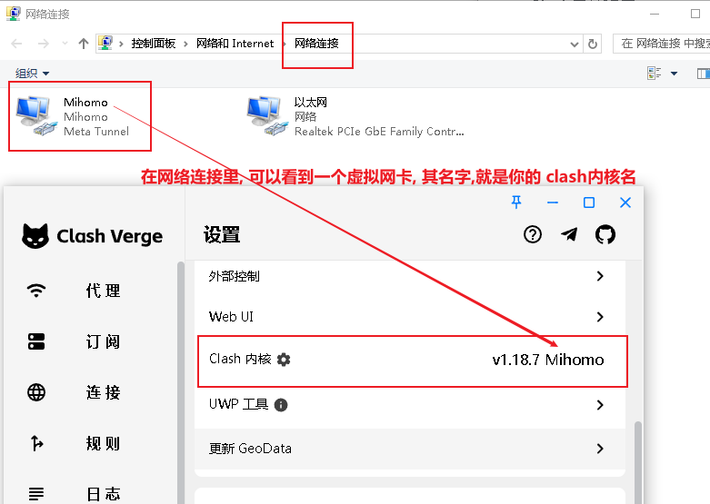

在**通常情况下，Clash只能代理系统中特定的进程或者端口的流量，但在TUN模式下，Clash可以代理系统中所有的网络流量。**这是因为**在TUN模式下，Clash会创建一个虚拟的网络设备，所有的网络流量,都会先经过这个虚拟设备，然后由Clash进行处理。**

这样一来，用户就可以轻松地实现全局代理，而无需对每一个单独的应用或者进程进行设置。这对于需要全局代理的用户来说是一个优势。

*假如我们希望电脑中安装的非浏览器(即chrome, edge)外的其他软件, 比如SSH连接工具Xshell、TG纸飞机、GIT工具等软件能够科学上网，这时候就必须通过Tun模式。*

|===

'''

== 你的信息安全问题

目前主流翻墙软件, 是基于Clash、V2ray内核的开源软件，*其大部分源代码是公开的，安全漏洞一般都能及时被发现，很少存在后门。* +
因此，使用开源翻墙软件例如ClashForWindows、ClashForAndroid、Clash Verge、ClashX、V2RayN、V2RayNG，是相对安全的。

由于目前绝大多数网站采用的是HTTPS加密，因此**您的登录账号密码、上传文件等信息, 是经过加密发送给目标网站的，**这个过程是安全的。*机场节点在此过程无法获得你的数据，仅能获取你的访问地址，但是无法获得登录账号密码、发布的内容信息。*

**机场节点日志只会查到用户的浏览网址，**无法查看具体的请求内容、提交的信息。

'''

==== 要使用开源客户端，而不要使用机场专属VPN客户端(可能有后门)

机场专属VPN客户端可能包含潜在后门，可能会安装私有证书，存在流量解密风险。由于机场VPN软件代码不开源，所以过程很难发现。 +
因此, 建议要使用开源客户端，比如Clash、V2Ray内核的开源客户端。 如, ClashForWindows是开源软件，其源代码可以公开查阅，这意味着任何人都可以查看其内部实现，从而确保没有隐藏的恶意代码。

'''

==== 你的信息是怎么被泄露的?

机场翻墙相对安全，那为什么会有人被喝茶呢？

[.small]
[options="autowidth" cols="1a,1a"]

|===
|Header 1 |Header 2

|输入法监听
|比如搜狗输入法、QQ输入法等会将我们输入的内容上传到服务器。因此建议使用安全性较高的输入法，比如微软默认的输入法、苹果手机默认输入法等。

|通讯软件监听
|QQ、微信、钉钉等自带安全性保护和敏感词处理机制，并上传到服务器中。因此建议科学上网时关闭这些即时通讯软件。

|短信验证码、邮件泄露
|日常接收TG电报、Google等平台验证码，会暴漏我们的使用行为。推荐使用香港手机卡、使用gmail邮箱。

|被篡改的软件监听
|比如使用非正规渠道下载的TG电报，会导致加密货币地址发送时被篡改，聊天内容被恶意窃听等问题。

|剪贴板监听
|常用国产软件可能会监听你的电脑剪切板，所以复制的内容可能会被上传到服务器中，造成泄露风险。
|===

