= clash for windows
:toc: left
:toclevels: 3
:sectnums:
:stylesheet: myAdocCss.css

'''

== 第一课

安装完软件后, 要做下面两步操作, 就能顺利上外网了:

[.small]
[options="autowidth" cols="1a,1a"]
|===
|Header 1 |Header 2

|1.打开 system proxy
|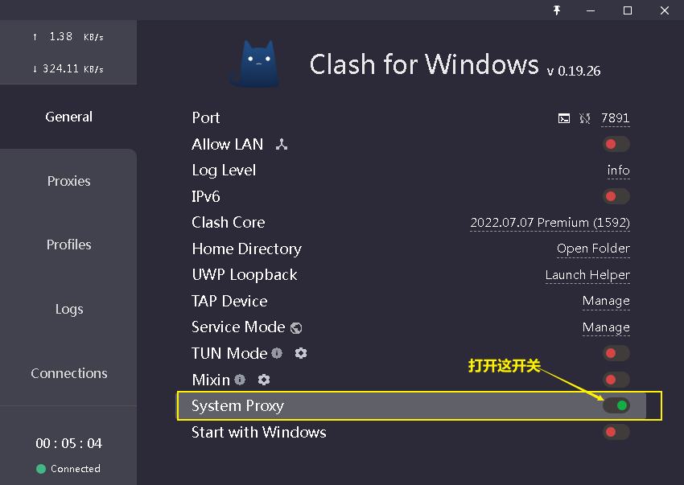

|2.导入配置文件
|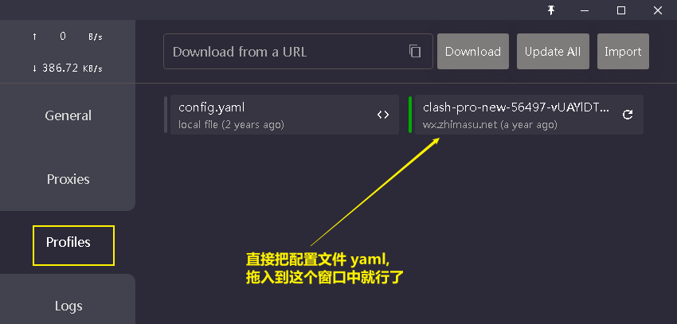
|===

'''

== clash 规则

教程: +
https://clashyun.com/clash-advanced-skill/

https://clashyun.com/183.html

以ClashForWindows为例，clash配置文件包含2种: +
[.small]
[options="autowidth" cols="1a,1a"]
|===
|Header 1 |Header 2

|一种是基础配置文件 config.yaml
|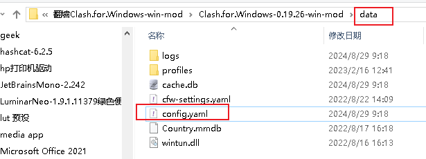

该部分定义了Clash的一些基本设置，例如代理端口号、日志级别、API等信息。

- port 和 socks-port 是本地http和socks代理端口
- allow-lan 允许局域网连接
- mode 定义了代理模式，这里是Rule，即按规则分流，可选Global、Rule
- log-level 日志级别
- external-controller 控制器地址，用于控制Clash的运行，实际是定义clash http API的访问地址

|另一种是订阅及分流规则的配置文件 yaml。
|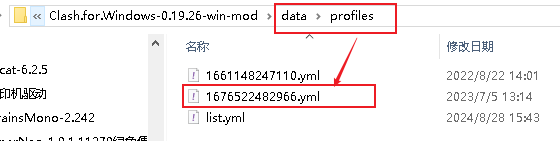

文件配置在配置文件夹下的”profiles”目录中，*一般有几个机场订阅，就会有多少个yml文件。*

该类型文件规则配置主要包含:通用设置、主机设置、DNS设置、代理设置、代理组设置、分流规则等信息。 +
*其中"通用设置"与"基础配置"一致，配置冲突时，以"基础配置文件"config.yaml文件为准。*

|===

[.small]
[options="autowidth" cols="1a,1a"]
|===
|关键字 |Header 2

|proxies
|**在proxies下，定义了一组代理服务器的相关信息，**包括: 名称，服务器地址，端口，类型，密码等。*这部分是机场提供的主要代理服务器信息。*

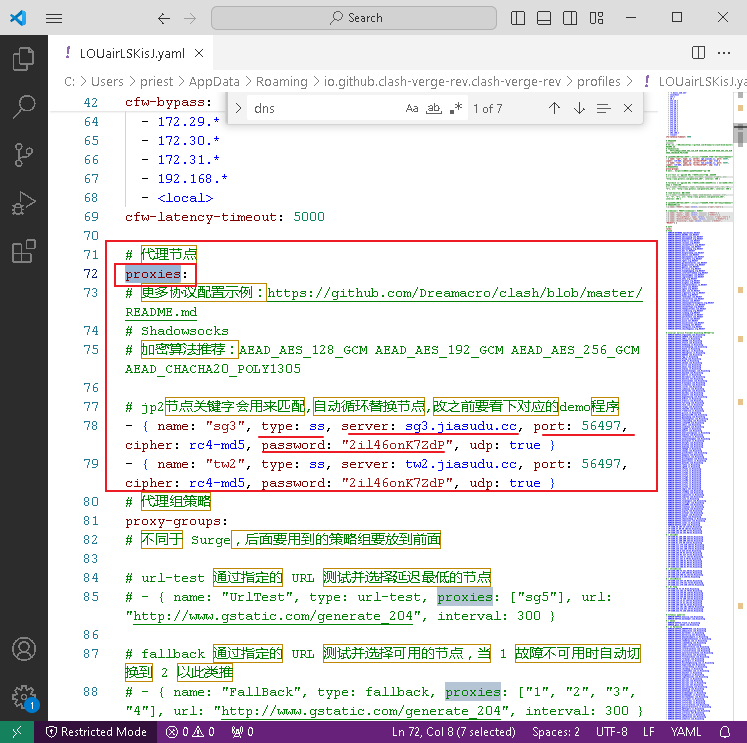

|proxy-groups
|在proxy-groups下，**定义了一组"代理组"，每个代理组都有一个名称，一个类型，和一组"代理服务器"。**当请求**匹配到某个代理组的规则时，会根据代理组的类型, 选择一个"代理服务器"进行访问。**

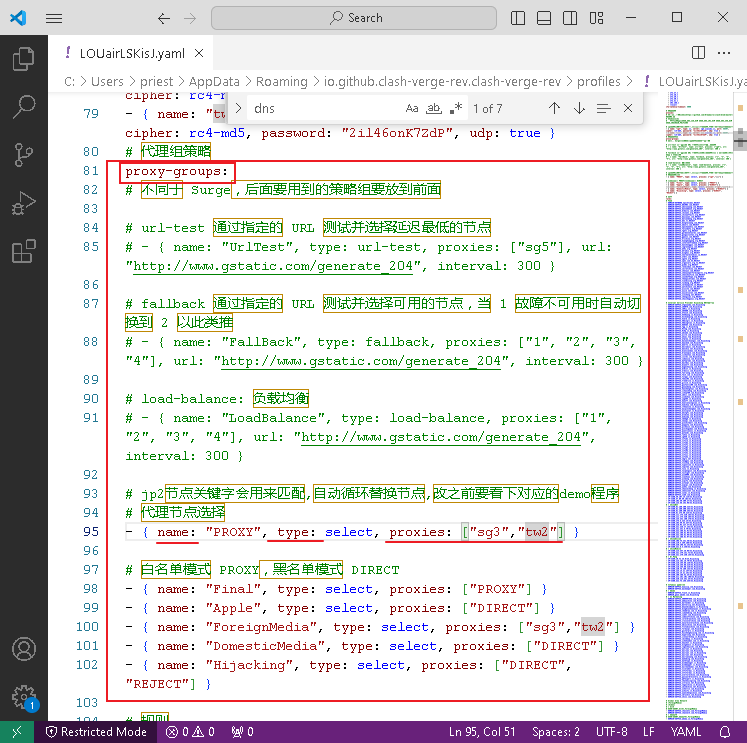

|rules
|**在rules下，定义了一组规则，每个规则都有一个类型，一个值，和一个"代理组"。**当请求**匹配到某个规则时，会使用规则指定的"代理组"进行访问。**

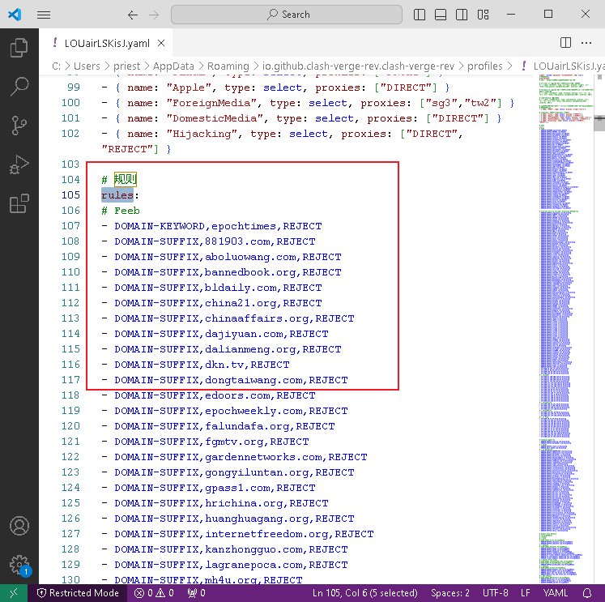

-> (1)  ##DOMAIN##匹配，表示请求的"#域名#"规则匹配:

....
DOMAIN,app.biliapi.net, 爱奇艺&哔哩哔哩
# 这个代码表示, 如果请求域名是 app.biliapi.net，则从“爱奇艺&哔哩哔哩”代理组, 选择代理服务器
....

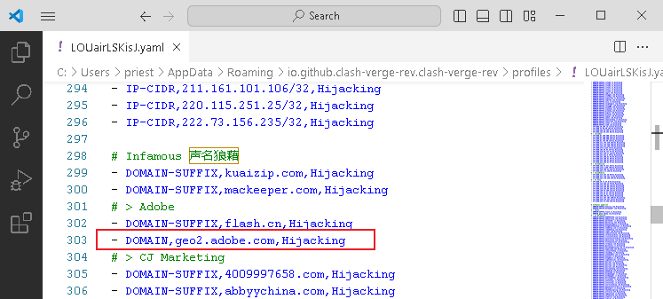

'''

-> (2)  ##DOMAIN-SUFFIX##匹配，表示请求的"#域名后缀#"规则匹配:

....
DOMAIN-SUFFIX,iq.com, 爱奇艺&哔哩哔哩
# 这个代码表示, 如果请求"域名后缀"是iq.com，则从“爱奇艺&哔哩哔哩”代理组,选择代理服务器
....

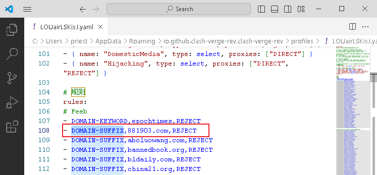

'''

-> (3)  ##DOMAIN-KEYWORD##匹配，表示请求的"#域名关键字#"规则匹配 :

....
DOMAIN-KEYWORD,q, 漏网之鱼
# 这个代码表示如果请求"域名关键字"包含q，则从“漏网之鱼”代理组,选择代理服务器。一般是放在整个rules规则最下方。
....

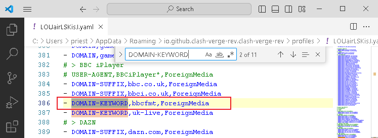

'''

-> (4) ##IP-CIDR##匹配，表示通过请求"#IP地址范围#"规则匹配:

....
IP-CIDR,172.16.0.0/12,DIRECT,no-resolve
# 这里的代码表示：对于 "IP 地址"在 172.16.0.0 到 172.31.255.255 范围内的请求，Clash 将直接连接，不会通过任何代理服务器，并且在处理这些请求时，不会进行 DNS 解析。这通常用于处理"本地或内网"的请求。
....

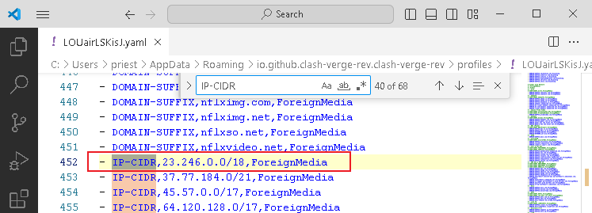

'''
-> (5) ##GEOIP##匹配，表示通过"#IP地区归属#"规则匹配:

....
GEOIP,CN, 国内网站
# 这里的代码表示：对于所有识别为来自中国的 IP 地址的请求，Clash 将通过 “国内网站” 代理组,进行处理。这可以用来实现对国内和国外网站的不同处理，例如，访问国内网站时,直接连接; 访问国外网站时,通过代理服务器。
....

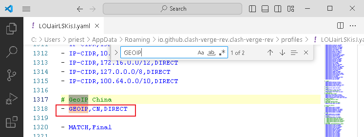

|no-resolve
|在Clash配置文件中，”no-resolve” 是一个选项，当它被设置为true时，Clash将不会对域名进行解析，而是直接将域名发送到"代理服务器"，由代理服务器进行"DNS解析"。

这可以一定程度上保护你的隐私，因为你的本地ISP无法看到你的DNS请求。 +
另一方面，如果代理服务器的DNS解析速度, 比本地的DNS解析速度快，那么使用”no-resolve”也可能会提高你的网络速度。

|===

'''

== 白名单模式, 和黑名单模式

https://clashyun.com/214.html

'''

== 怎么设置某个域名不走代理节点，"直连"到服务器？

可结合DOMAIN-SUFFIX域名后缀规则, 和DIRECT规则使用。

....
DOMAIN-SUFFIX,office.com,DIRECT
# 请将代码放置到rules靠前的位置。
....

'''

