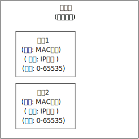
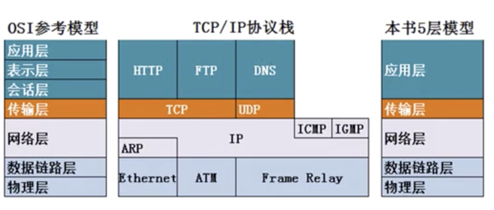
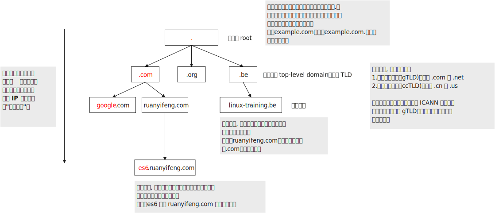
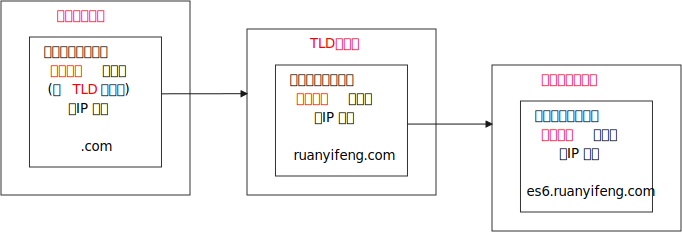
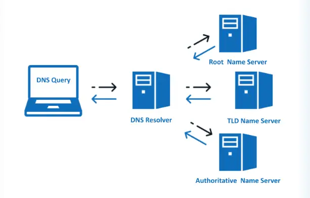

= 网络协议
:toc: left
:toclevels: 3
:sectnums:
:stylesheet: myAdocCss.css

'''

== 协议

互联网的核心是一系列协议，总称为"互联网协议"（Internet Protocol Suite）。**它们对电脑如何连接和组网，做出了详尽的规定。**理解了这些协议，就理解了互联网的原理。

**互联网的实现，分成好几层。每一层都有自己的功能，**就像建筑物一样，每一层都靠下一层支持。 +
用户接触到的，只是最上面的一层，根本没有感觉到下面的层。*要理解互联网，必须从最下层开始，自下而上理解每一层的功能。*

越下面的层，越靠近硬件；越上面的层，越靠近用户。 +

**每一层都是为了完成一种功能。为了实现这些功能，就需要大家都遵守共同的规则。大家都遵守的规则，就叫做"协议"（protocol）。#互联网的每一层，都定义了很多协议。#**这些协议的总称，就叫做"互联网协议"（Internet Protocol Suite）。

'''

==== 1.实体层 physical layer

==== 2.链接层 link layer

'''

==== 3.网络层 network layer

[.small]
[options="autowidth" cols="1a,1a"]
|===
|Header 1 |Header 2

|网卡: 其自身的地址, 就是 mac地址
|以太网规定，**##连入网络的所有设备，都必须具有"网卡"接口。##数据包必须是从一块网卡，传送到另一块网卡。** +
*##网卡的地址，##就是数据包的发送地址和接收地址，这##叫做"MAC地址"##。*

**每块网卡出厂的时候，都有一个全世界独一无二的"MAC地址"，**长度是48个二进制位，通常用12个十六进制数表示。 如: 00-BD-D0-86-BB-F7. +
前6个十六进制数是"厂商编号"，后6个是该厂商的"网卡流水号"。有了MAC地址，就可以定位网卡和数据包的路径了。

有了MAC地址，但系统怎样才能把数据包准确送到接收方？**以太网**采用了一种很"原始"的方式，*它向本网络内所有计算机发送，让每台计算机自己判断，是否为"接收方"。* +
比如, a电脑, 向b电脑发送一个数据包，同一个子网络中的所有电脑, 都会收到这个包。它们读取这个包的"标头"，找到接收方的MAC地址，然后与自身的MAC地址相比较，如果两者相同，就接受这个包，否则就丢弃这个包。*这种发送方式就叫做"广播"（broadcasting）。*

但是，这样做带来了网络的拥堵。而且, 互联网是由无数子网络共同组成的一个巨型网络，上海的电脑是不可能与纽约的电脑处在同一个子网络中的. *如果两台计算机不在同一个子网络，"广播"就传不过去了。*

*因此, 就必须找到一种方法，来区分哪些"MAC地址"属于同一个子网络，哪些不是。 即: #如果是处于同一个子网络，就采用"广播"方式发送，否则, 就采用"路由"方式发送。 （"路由"的意思，就是指如何向不同的"子网络"分发数据包.)#*

MAC地址有局限性，*如果两台电脑不在同一个"子网络"，就无法知道对方的"MAC地址"，必须通过"网关"（gateway）转发。*

image:img/046.jpg[,60%]

上图中，1号电脑, 要向4号电脑发送一个数据包。它先判断4号电脑是否在同一个子网络，结果发现不是，于是就把这个数据包发到"网关A"。"网关A"通过"路由协议"，发现4号电脑位于"子网络B"，又把数据包发给"网关B"，"网关B"再转发到4号电脑。 +
所以, 1号电脑把数据包发到网关A，必须知道网关A的MAC地址。

|ip地址
|这就导致了"网络层"的诞生。它的作用是**引进一套新的地址，使得我们能够区分不同的计算机, 是否属于同一个子网络。这套地址就叫做"网络地址"，简称"网址"。**

于是，*"网络层"出现以后，#每台计算机有了两种地址，一种是"MAC地址"，另一种是"网络地址"。两种地址之间没有任何联系，#"MAC地址"是绑定在"网卡"上的，"网络地址"则是管理员分配的.*

"网络地址"帮助我们确定计算机所在的"子网络"，"MAC地址"则将数据包送到该子网络中的目标网卡。因此，从逻辑上可以推断，必定是先处理"网络地址"，然后再处理"MAC地址"。

**规定"网络地址"的协议，叫做"IP协议"。**它所定义的地址，就被称为IP地址。

目前，广泛采用的是IP协议第四版，简称IPv4。这个版本规定，"网络地址"由32个二进制位组成。 +
惯上，我们用分成四段的十进制数, 表示IP地址，*从0.0.0.0一直到255.255.255.255。*

**互联网上的每一台计算机，都会分配到一个IP地址。**这个地址分成两个部分，**前一部分代表"网络"，后一部分代表"主机"。** +
比如，IP地址 172.16.254.1，这是一个32位的地址，假定它的网络部分是前24位（172.16.254），那么主机部分就是后8位（最后的那个1）。 +
**处于同一个子网络的电脑，它们IP地址的"网络部分"必定是相同的，**也就是说172.16.254.2应该与172.16.254.1处在同一个子网络。

但是，**单单从IP地址，我们无法判断"网络部分"的数字范围。**还是以172.16.254.1为例，*它的网络部分，到底是前24位，还是前16位，甚至前28位，从IP地址上是看不出来的。*

那么，怎样才能从IP地址，判断两台计算机是否属于同一个子网络呢？这就要用到另一个参数"子网掩码"（subnet mask）。

|子网掩码 subnet mask
|##*所谓"子网掩码"，就是表示"子网络"特征的一个参数。##它在形式上等同于IP地址，也是一个32位二进制数字，#它的"网络部分"全部为1，"主机部分"全部为0。#* +
比如，IP地址 172.16.254.1，如果已知网络部分是前24位，主机部分是后8位，那么子网络掩码就是11111111.11111111.11111111.00000000，写成十进制就是255.255.255.0。

**#知道"子网掩码"，我们就能判断，任意两个IP地址,是否处在同一个"子网络"中。#**方法是**将两个IP地址与子网掩码分别进行AND运算**（两个数位都为1，运算结果为1，否则为0），*然后比较结果是否相同. 如果结果相同的话，就表明它们在同一个子网络中，否则就不是。*

比如，已知IP地址 172.16.254.1 和 172.16.254.233 的"子网掩码"都是255.255.255.0，请问它们是否在同一个子网络？两者与子网掩码分别进行AND运算，结果都是172.16.254.0，因此它们在同一个子网络。

总结一下，IP协议的作用主要有两个:  +
1.为每一台计算机分配IP地址， +
2.确定哪些ip地址在同一个"子网络"中。

|IP数据包
|根据IP协议发送的数据，就叫做"IP数据包"。不难想象，其中必定包括"IP地址"信息。

|动态IP地址 : DHCP协议
|如果一台电脑的IP地址保持固定不变，其他电脑就不能使用这个地址，不够灵活。因此, 大多数用户使用的是**"动态IP地址上网" -- 就是计算机开机后，会自动分配到一个IP地址，**不用人为设定。*它使用的协议叫做"DHCP协议"。*

**这个协议规定，每一个"子网络"中，有一台计算机负责管理本网络的所有IP地址，它叫做"DHCP服务器"。**新的计算机加入网络，必须向"DHCP服务器"发送一个"DHCP请求"数据包，申请IP地址和相关的网络参数。

|===

'''

==== 4.传输层 transport layer

有了MAC地址和IP地址，就可以在互联网上任意两台主机上, 建立通信。 +
下面的问题是，同一台主机上有许多程序都需要用到网络，*#当一个数据包从互联网上发来的时候，到底由哪个软件接收？ 因此, 我们还需要一个参数，表示这个数据包到底供哪个程序（进程）使用。这个参数就叫做"端口"（port）.#* 它其实是"每一个使用网卡的程序"的编号。*每个数据包都发到主机的特定端口，所以不同的程序就能取到自己所需要的数据。*

**"端口"是0到65535之间的一个整数，**正好16个二进制位。其中, **0到1023的端口, 被系统占用，因此用户只能选用大于1023的端口。** +
不管是浏览网页, 还是在线聊天，*应用程序会随机选用一个端口，然后与服务器的相应端口联系。*

**"传输层"的功能，就是建立"端口到端口"的通信。**相比之下，"网络层"的功能是建立"主机到主机"的通信。*只要确定主机和端口，我们就能实现程序之间的交流。* +
因此，Unix系统就把**主机+端口，叫做"套接字"（socket）。**有了它，就可以进行网络应用程序开发了。

'''

==== 5.应用层 application layer

应用程序收到"传输层"的数据，接下来就要进行解读。由于互联网是开放架构，数据来源五花八门，必须事先规定好格式，否则根本无法解读。"应用层"的作用，就是规定应用程序的数据格式。

比如, 想要浏览"网页"这个文件格式,  用的就是HTTP协议.

'''

===== 总结

你买了一台新电脑，能够上网吗？ 你要知道下面四个参数，才能上网:

- (网卡) 本机的IP地址
- (子网络) 子网掩码
-  网关的IP地址
-  DNS的IP地址

假定，你设置好了自己的网络参数： +
本机的IP地址：192.168.1.100 +
子网掩码：255.255.255.0 +
网关的IP地址：192.168.1.1 +
DNS的IP地址：8.8.8.8 +

然后你想要访问Google. 就会经过以下流程:
[.small]
[options="autowidth" cols="1a,1a"]
|===
|Header 1 |Header 2

|*#如何知道对方网站的 真正ip地址? -- 方法: DNS协议#*
|发送数据包，必须要知道对方的IP地址。但是，现在，我们只知道网址www.google.com，不知道它的IP地址。 +
**DNS协议,可以**帮助我们，**将这个网址转换成IP地址。**  +

*已知DNS服务器为8.8.8.8，于是我们向这个地址发送一个DNS数据包（53端口）。* +
然后，**DNS服务器做出响应，告诉我们Google的IP地址是172.194.72.105。**于是，我们知道了对方的IP地址。

|接下来，*我们要##判断，这个IP地址是不是和自己电脑,处在同一个"子网络"中? 这就要用到"子网掩码"。##*
|已知子网掩码是255.255.255.0，本机用它对自己的IP地址192.168.1.100，做一个二进制的AND运算（两个数位都为1时，则结果为1，否则为0），计算结果为192.168.1.0； 然后对Google的IP地址172.194.72.105也做一个AND运算，计算结果为172.194.72.0。这两个结果不相等，所以**结论是，#Google与本机不在同一个子网络。#** +
**因此，我们要向Google发送数据包，##必须通过"网关"##192.168.1.1##转发##，也就是说，#接收方的"MAC地址", 将是"网关的MAC地址"。#**

接收方（Google）的HTTP端口默认是80. 而发送方（本机）的端口,是一个随机生成的1024-65535之间的整数，假定为51775。

|===

'''

== 告诉你网址对应的背后真正 IP地址的, 是 DNS 服务器

域名对应的 IP 地址，都保存在 DNS 服务器。 +
*我们输入域名，浏览器就会在后台，自动向 DNS 服务器发出请求，获取对应的 IP 地址。这就是 DNS 查询。* +
举例来说，我输入 es6.ruanyifeng.com 这个域名，浏览器就要向 DNS 服务器查询，它的 IP 地址是什么，然后向该 IP 发出访问请求。 +
网上有很多公用的 DNS 服务器.

'''

==== "域名"是一个"树状结构", 只有上级域名，才知道下一级域名的 IP 地址，所以需要"逐级查询"。

你可能会问，难道 DNS 服务器（比如 1.1.1.1）保存了世界上所有域名（包括二级域名、三级域名）的 IP 地址？ +
当然不是。*DNS 是一个"分布式系统"，比如 1.1.1.1 这个DNS服务器, 只是用户查询的入口，它还需要再向其他 DNS 服务器做进一步查询，才能获得最终的 IP 地址。*

要说清楚 DNS 完整的查询过程，就必须了解 "域名"是一个"树状结构". +
最顶层的域名是"根域名"（root），然后是"顶级域名"（#top-level domain，简写 TLD#），再是一级域名、二级域名、三级域名。

*这种树状结构的意义在于，#只有上级域名，才知道下一级域名的 IP 地址，需要逐级查询。(即相当于: 国家只知道自己省的情况, 省只知道自己市的情况, 市只知道自己县的情况. 而国家是无法跨层级的知道下级的下级情况的.)#* +
*每一级域名都有自己的 DNS 服务器，存放下级域名的 IP 地址。*

所以，比如要查询二级域名 es6.ruanyifeng.com 的 IP 地址，需要三个步骤: +
第一步，查询"根域名"服务器，获得"顶级域名"服务器.com（又称 "TLD 服务器"）的 IP 地址。 +
第二步，查询 "TLD 服务器" .com，获得"一级域名"服务器 ruanyifeng.com 的 IP 地址。 +
第三步，查询"一级域名"服务器 ruanyifeng.com，获得"二级域名" es6 的 IP 地址。

总结一下，上面一共提到了四种服务器: +
1.1.1.1 +
根域名服务器 +
TLD 服务器 +
一级域名服务器 +

它们都属于 DNS 服务器，都用来接受 DNS 查询。但是作用不一样，属于不同的类别。

**后三种服务器, 只用来查询下一级域名的 IP 地址，**而 1.1.1.1 则把分步骤的查询过程自动化，方便用户一次性得到结果，所以它称为"递归 DNS 服务器"（recursive DNS server），即可以自动递归查询。 +

DNS递归服务器, 是一种DNS服务器，它负责查询并返回用户所需的DNS解析结果。当用户在浏览器中输入一个域名时，比如http://www.example.com，浏览器会向本地DNS服务器发送一个查询请求，*本地DNS服务器将检查自己的缓存，如果缓存中有对应的解析结果，就直接返回给用户；如果没有，则会从根域名服务器开始，逐级向下进行查询，直到找到对应的解析结果，然后将结果返回给用户。*

在这个查询过程中，"DNS递归服务器"起到了重要的作用。它会负责向"根域名"服务器发送查询请求，并根据返回的结果找到"顶级域名"服务器的地址，然后再次发送查询请求。这个过程会一直进行下去，直到找到最终的解析结果。

**我们平常说的 DNS 服务器，一般都是指"递归 DNS 服务器"。它把 DNS 查询自动化了，**只要向它查询就可以了。 +
它内部有缓存，可以保存以前查询的结果，下次再有人查询，就直接返回缓存里面的结果。所以它能加快查询，减轻源头 DNS 服务器的负担。

它们的关系如下图:

'''

==== 最顶层的"根域名 root domain"服务器

根域名服务器, 最早是IPV4，全球只有13台. +
现在, 有了IPv6根服务器, 共25台.  事实上形成了13台原有根 + 25台IPv6根的新格局. 中国部署了其中的4台，由1台主根服务器, 和3台辅根服务器组成. (所以中国就可以进行dns污染了)

根域名服务器的 IP 地址是不变的，集成在操作系统里面。 +
*操作系统会选其中一台，查询 "TLD（Top-Level Domain） 服务器"的 IP 地址。*

全世界域名的最高管理机构，是一个叫做 ICANN （Internet Corporation for Assigned Names and Numbers）的组织。它的总部在美国加州。它的一项主要工作，就是规定"顶级域名"（top level domain，简写为 TLD）。

'''

==== 顶级域名 TLD : Top-Level Domain

所谓顶级域名（TLD），就是最高层级的域名。简单说，就是网址的最后一个部分。比如，网址www.example.com 的"顶级域名"就是.com。 +
美国ICANN机构,  就负责规定，哪些字符串可以当作顶级域名。

它们可以分成两类:
[.small]
[options="autowidth" cols="1a,1a"]
|===
|Header 1 |Header 2

|一般性顶级域名（gTLD）
|如.com、.net、.edu、.org、.xxx等

|国别顶级域名（ccTLD）
|代表不同的国家和地区，比如.cn（中国）、.io（英属印度洋领地）、.cc（ 科科斯群岛）、.tv（图瓦卢）等
|===

**ICANN机构 自己不会去管理这些顶级域名，因为根本管不过来。ICANN 的政策是，每个"顶级域名"都找一个托管商，该域名的所有事项, 都由托管商负责。ICANN 只与托管商联系，这样管理起来就容易多了。**举例来说，.cn域名的托管商, 就是中国互联网络信息中心（CNNIC），它决定了.cn域名的各种政策。

理论上，所有域名查询都必须先查询根域名，因为只有根域名才能告诉你，某个顶级域名由哪台服务器管理。事实上也确实如此，*ICANN机构 维护着一张列表，里面记载着"顶级域名"和对应的"托管商"。*

- 比如，我要访问www.example.com，就必须先询问 ICANN 的"根域名"列表，它会告诉我.com域名由 Verisign 托管，我必须去找 Verisign，它会告诉我example.com服务器在哪里。
- 再比如，我要访问abc.xyz，也必须先去询问"根域名"列表，它会告诉我.xyz域名由 CentralNic 公司托管。根域名列表还记载，.google由谷歌公司托管，.apple由苹果公司托管等等。

*由于"根域名"列表很少变化，大多数 DNS 服务商都会提供它的缓存，所以根域名的查询事实上不是那么频繁。*

'''

