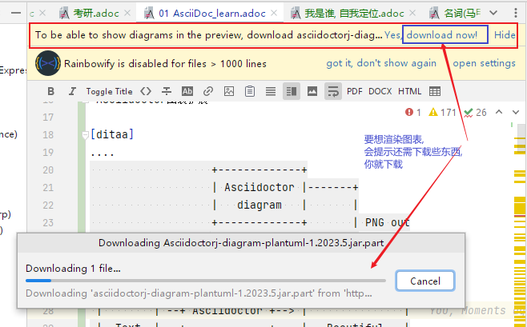
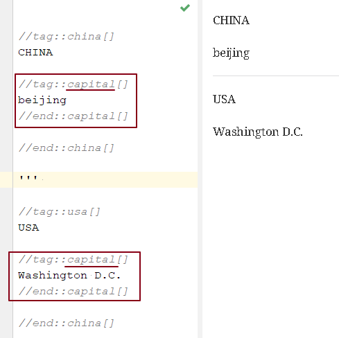
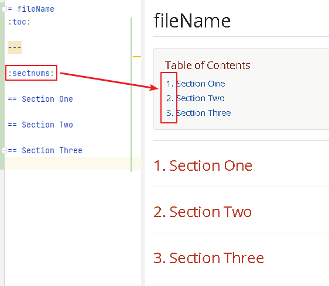
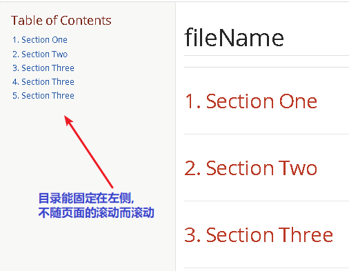
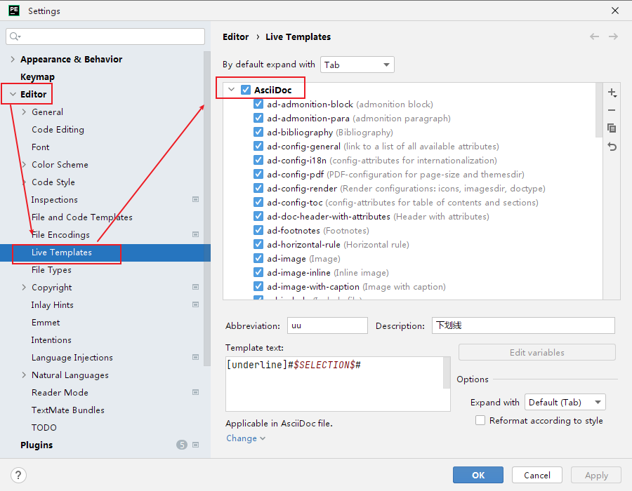
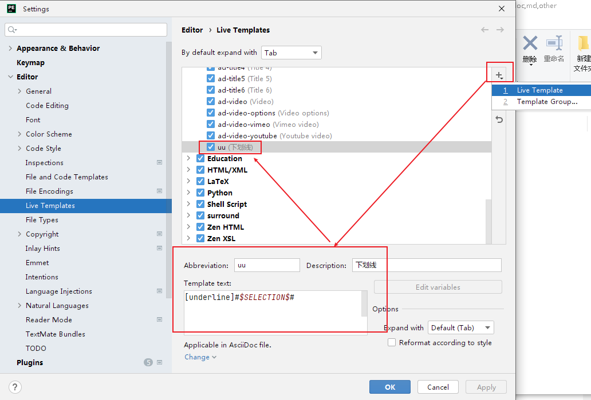
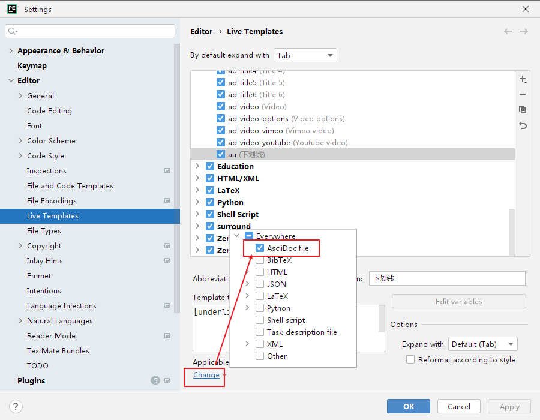
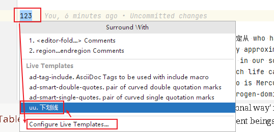
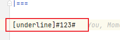
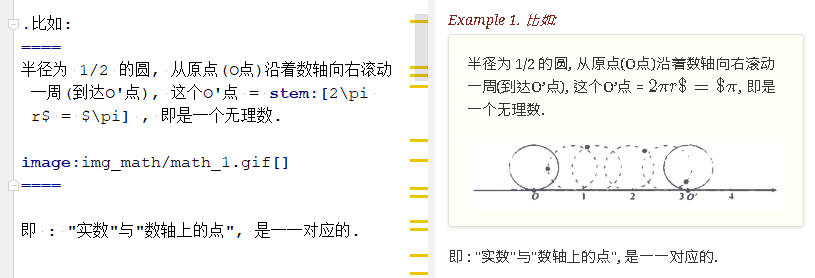

= AsciiDoc格式, 扩展名是 .adoc
:toc: left
:sectnums:
---


== 让 asciidoc支持数据图 -> 安装  Asciidoctor图表扩展

Asciidoctor图表扩展, 官网 +
https://docs.asciidoctor.org/diagram-extension/latest/ +

https://intellij-asciidoc-plugin.ahus1.de/docs/users-guide/features/preview/diagrams.html +

安装方式: +
1.首先，你需要安装Ruby和RubyGems.

2.在 cmd中, 输入命令 `gem install asciidoctor-diagram` 来安装Asciidoctor图表扩展。

3. 输入下面的代码, 来做实验:
....
[ditaa]
....
                   +-------------+
                   | Asciidoctor |-------+
                   |   diagram   |       |
                   +-------------+       | PNG out
                       ^                 |
                       | ditaa in        |
                       |                 v
 +--------+   +--------+----+    /---------------\
 |        | --+ Asciidoctor +--> |               |
 |  Text  |   +-------------+    |   Beautiful   |
 |Document|   |   !magic!   |    |    Output     |
 |     {d}|   |             |    |               |
 +---+----+   +-------------+    \---------------/
     :                                   ^
     |          Lots of work             |
     +-----------------------------------+
....
....

渲染效果如下:

[ditaa]
....
                   +-------------+
                   | Asciidoctor |-------+
                   |   diagram   |       |
                   +-------------+       | PNG out
                       ^                 |
                       | ditaa in        |
                       |                 v
 +--------+   +--------+----+    /---------------\
 |        | --+ Asciidoctor +--> |               |
 |  Text  |   +-------------+    |   Beautiful   |
 |Document|   |   !magic!   |    |    Output     |
 |     {d}|   |             |    |               |
 +---+----+   +-------------+    \---------------/
     :                                   ^
     |          Lots of work             |
     +-----------------------------------+
....


如果提示还需下载什么文件才能支持渲染, 就下载它们.




其他的图表类型还有:

▼

[plantuml, target=diagram-classes, format=png]
....
class BlockProcessor
class DiagramBlock
class DitaaBlock
class PlantUmlBlock

BlockProcessor <|-- DiagramBlock
DiagramBlock <|-- DitaaBlock
DiagramBlock <|-- PlantUmlBlock
....

▼


== "画图表"支持: asciidoctor-kroki


https://github.com/ggrossetie/asciidoctor-kroki

asciidoc diagram  和  kroki 有什么区别?


Asciidoctor Diagram是一组Asciidoctor扩展，它们允许你将使用纯文本描述的图表添加到AsciiDoc文档中。这些扩展支持多种图表语法，包括PlantUML，Graphviz，Ditaa和Shaape等。每个扩展都运行图表处理器以根据输入文本生成SVG、PNG或TXT文件。然后将生成的文件插入转换后的文档中。

Kroki是一个开源项目，它提供了一个Web API来将各种图表描述语言转换为图像。Kroki支持多种图表语言，包括PlantUML，Graphviz，Mermaid和Vega等。

总之，Asciidoctor Diagram和Kroki都可以用来在AsciiDoc文档中绘制图表。Asciidoctor Diagram是一组Asciidoctor扩展，它们在本地运行图表处理器来生成图像。而Kroki则提供了一个Web API来将图表描述语言转换为图像。


'''

== AsciidocFX 编辑器

https://asciidocfx.com/#install-on-windows

'''

== 官方文档

https://www.ahamojo.com/global-dev/developer/page/ahamojo/ahamojoIntroduction/asciidoc.adoc#_%E6%95%B0%E5%AD%A6%E5%85%AC%E5%BC%8F

https://docs.asciidoctor.org/asciidoc/latest/

https://asciidoctor.org/docs/user-manual/#cols-format


各种块的写法, 可见下面
https://asciidoctor.cn/docs/asciidoc-syntax-quick-reference/index.html#block-id-role-and-options

及 ★ +
http://www.seinan-gu.ac.jp/~shito/asciidoctor/html_chunk/chap16.html#links

快速教程

https://powerman.name/doc/asciidoc


'''
== #自定义css, 来取代 asciidoc 默认的样式#

官方教程: https://docs.asciidoctor.org/asciidoctor/latest/html-backend/custom-stylesheet/

(1).在和你的 asciidoc文件的 同目录中, 创建css文件, 比如起名叫 my-stylesheet.css

css内容比如如下:
....
body {
  color: #ff0000;
}
....


(2).将 `:stylesheet: my-stylesheet.css` 这句话, 添加到你的asciidoc文档标题中.

....
= 方法论
:stylesheet: my-stylesheet.css   ← 写在这里
:toc: left
:toclevels: 3
:sectnums:
....


'''


== 修改asciidoc自带的默认css样式

官方教程: https://docs.asciidoctor.org/asciidoctor/latest/html-backend/default-stylesheet/#customize-extend


''''

== ★ 插入 latex 代码


官方文档

https://docs.asciidoctor.org/asciidoc/latest/stem/


https://webcache.googleusercontent.com/search?q=cache:aB1APK9SnygJ:https://docs.asciidoctor.org/asciidoc/latest/stem/stem/+&cd=1&hl=en&ct=clnk&gl=sg

==== 单行用 stem:[] 包围 LaTex 语法, 多行则包在 "反斜杠(\)begin{align*} 和 "\end{align*}" 里面.


单行公式, 有两种写法:

....
stem:[latex公式]

latexmath:[latex公式]
....

多行公式, 也有两种写法:

....
\begin{align*}
latex多行公式
\end{align*}
....

....
[asciimath]
++++
sqrt(4) = 2
++++
....


asciidoctor 通过 mathjax 实现 LaTex 字体的显示，方法和 markdown 差不多，区别是:

- markdown（不同差距实现方法不同）使用 $$ 或者 $``$ 包围 LaTex 语法，
- asciidoctor 使用 stem:[] 包围 LaTex 语法。
- 多行的话, 包在  反斜杠(\)begin{align*} 和 \end{align*} 里面
....
\begin{align*}
latex多行公式
...
\end{align*}
....

如:

[cols="1a,1a"]
|===
|源码 |渲染后

|
....
stem:[E = mc^2]
....
|stem:[E = mc^2]

|....
stem:[c = \sqrt{a^{2}+b_{xy}^{2}+e^{x}}]
....
|stem:[c = \sqrt{a^{2}+b_{xy}^{2}+e^{x}}]

|
....
\begin{cases}
x+y = 22 \\
1200x : 2000y = 1:2
\end{cases}

\begin{cases}
x = 22-y \\
\frac{1200x}{2000y} = \frac{1}{2}
\end{cases}
....
|\begin{cases}
x+y = 22 \\
1200x : 2000y = 1:2
\end{cases}

\begin{cases}
x = 22-y \\
\frac{1200x}{2000y} = \frac{1}{2}
\end{cases}

|
....
\begin{align*}
& 2*1200x = 2000y \\
& 2*1200(22-y) = 2000y \\
& y = 12 \\
& ∵ x + y = 22 \\
& x +12 =22 \\
& x =10
\end{align*}
....
|\begin{align*}
& 2*1200x = 2000y \\
& 2*1200(22-y) = 2000y \\
& y = 12 \\
& ∵ x + y = 22 \\
& x +12 =22 \\
& x =10
\end{align*}
|===

==== #行内写矩阵, 或行列式的写法#

官方文档  +
https://www.ahamojo.com/global-dev/developer/page/ahamojo/ahamojoIntroduction/asciidoc.adoc#_%E6%95%B0%E5%AD%A6%E5%85%AC%E5%BC%8F


....
//方法1:
stem:[[[a,b\],[c,d\]\]((n),(k))]

//方法2: 推荐
latexmath:[\left| \begin{matrix}
	a_x&		b_x\\
	a_y&		b_y\\
\end{matrix} \right|]
....

效果: +
stem:[[[a,b\],[c,d\]\]((n),(k))]

latexmath:[\left| \begin{matrix}
	a_x&		b_x\\
	a_y&		b_y\\
\end{matrix} \right|]

'''


== ★★★ 注意 adoc文件中latex的空格问题!!

adoc中用latex时 : 注意空格和空行的问题

[options="autowidth"]
|===
|□ |Header 2

|□+-×÷□
|+-×÷符号的前后, 最好要有空格(下面用□来表示空格), 否则可能会渲染出错!

|(a^m□ )^n
|指数的指数次方, 内外两个指数之间也要用空格隔开, 要写成 (a^m□ )^n , 否则可能渲染出错!

|a^3□ b^2
|多个变量相乘, 中间要有空格隔开! 必须写成比如: 12 a^3□ b^2 , 而不能连在一起写! 否则肯定渲染出错.

|\frac{}□{}
|分式 \frac{}□{} 的两个花括号, 中间要有空格! 否则可能会渲染出错.

|\frac{c^2□ } {4a^2}
|分式中, 如果第一个花括号, 即分子是个指数, 指数和}之间必须要有空格! 否则渲染肯定出错. 即要写成
\frac{c^2□ } {4a^2}

|方程组间不能有空行!
|如果你在 \begin{align} 中使用\begin{cases}, 当你要书写多个方程组时, 方程组与方程组之间, 不能有空行! 否则会渲染出错

|公式的每一行间不能有空行
|latex公式中的每一行之间, 不能有空行! 否则肯定渲染出错

|\stem:[  ]所在的行前面, 不能有空格!
|如果你在行内用了 stem:[], 却发现它没有被渲染成公式, 就检查一下该行的最开头是否误打了一个空格?

|===


---

== ----- -----

---

== #多行折叠#

....
.折叠按钮处显示的名称
[%collapsible]
====
被折叠的内容放在这里

line 2

line 3
====
....


效果

.折叠按钮处显示的名称
[%collapsible]
====
被折叠的内容放在这里

line 2

line 3
====

---

如果想让折叠处, 默认是展开状态, 就写成:

....
.名称写在这里
[%collapsible%open]
====
本处折叠内容, 默认会先展开

而非先折叠起来
====
....

效果

.名称写在这里
[%collapsible%open]
====
本处折叠内容, 默认会先展开

而非先折叠起来
====


该功能的 英文文档说明:
https://blog.mrhaki.com/2019/03/awesome-asciidoctor-collapsible-content.html

---

== #单行折叠#

....
[example%collapsible]
单行内容 line content +
123 +
456
....

效果

[example%collapsible]
单行内容 line content +
123 +
456

---

== ★ 自定义代换 -> :<name>: <value>

官方文档介绍 : https://asciidoc.org/asciidoc.css-embedded.html#X18


==== 用法及效果展示
....
:刘备: 蜀国皇帝刘玄德, +
建立了蜀汉政权
//相当于kv键值对, 这行内容渲染后不可见.
//注意: 第二个冒号后, 即value前, 必须要有一个空格!

我是{刘备}  //会替换{}中的内容(即key), 为上面定义的value值
....

效果:

:刘备: 蜀国皇帝刘玄德, +
建立了蜀汉政权

我是{刘备}

====  如果要暂时令替换功能失效, 可以写成 -> :<name>!:

....
:刘备!: 蜀国皇帝刘玄德
//将感叹号!写在冒号内, 则该 key 不会被后面的value值替换

我是{刘备}
....

效果:

:刘备!: 蜀国皇帝刘玄德

我是{刘备}

---

== ★ #引用并嵌入另一个adoc文章中的内容 -> include::example.adoc[]#

比如, 你在你当前编辑文件的同一目录下,有一个 example.adoc, 里面的内容如下:

....
[#sec-a]
== Section A

content

[#sec-b]
== Section B

content

[#sec-c]
== Section C

content
....

现在, 你要在当前编辑的文档中, 嵌入example.adoc 中的内容. 就可以写成:

(注意, 下面include前没有反斜杠, 这里写反斜杠是为了在adoc渲染中进行转义. 不然渲染不出来.)
....
\include::example.adoc[]
// 嵌入 example.adoc 的所有内容进来


\include::example.adoc[lines=5..10]
//嵌入 example.adoc 中的第5到10行的内容进来


....

---

==== include 完整的命令

完整的命令和参数是: +
(注意, 下面include前没有反斜杠, 这里写反斜杠是为了在adoc渲染中进行转义.)
....
\include::path[leveloffset=offset,lines=ranges,tag(s)=name(s),indent=depth,opts=optional]
....

---

== ★★★ 块嵌入 : 引用并嵌入另一个文件中的某个tag 的内容 -> ① 定义tag, 要写成 tag::yourTagName[], end::yourTagName[] ->  ② 调用tag时, 要写成 include::被调用的文件名.adoc[tag=yourTagName]

官方文档  +
https://webcache.googleusercontent.com/search?q=cache:q1_Su5T1mZ4J:https://docs.asciidoctor.org/asciidoc/latest/directives/include-tagged-regions/+&cd=1&hl=en&ct=clnk&gl=sg


比如, 你当前文件是 asciiDoc_1.adoc, 你想嵌入 asciiDoc_2.adoc 中某一部分的内容. 就在 该部分, 用 `tag::tag名[]` 和 `end::tag名[]` 包围起来.

比如下面, 你对某block 定义了一个tag, 起名叫 yourTagName.
....
// asciiDoc_2.adoc 中的内容

tag::yourTagName[]

block content ....

end::yourTagName[]
....

注意 : 上面的写法, 默认会把tag那两行也渲染出来. 为了隐藏它们(毕竟它们只是我们自定义的标记而已) ,可以在前面 用 // 来注释掉它们, 就不会渲染出来了, 同时, 它们tag的功能依然生效的!

即写成:

....
// asciiDoc_2.adoc 中的内容

// tag::yourTagName[]

block content ....

// end::yourTagName[]
....

注意: "//" 是adoc文件中的注释, 如果你引用的是其他编程文件中的某块内容, 就要用该编程语言中的注释符号来注释掉, 比如:
....
ruby编程语言是用 # 来注释的.
....

....
XML 文件中要用
<!-- tag::name[] -->
和
<!-- end::name[] -->
来注释
....

现在, 你要在 asciiDoc_1.adoc 中来引用并嵌入 asciiDoc_2.adoc 中的 tag 部分, 就写成:

....
// asciiDoc_1.adoc 中的内容

\include::asciiDoc_2.adoc[tag=yourTagName]
//注意: include前不需要带反斜杠!

//也可以一次性调用多个tag, 就写成复数形式 tags= A;B;C;...

\include::asciiDoc_2.adoc[tags=tagName1;tagName2]

// 注意: 一次性调用多个tag时, tag名的顺序不改变渲染结果, 即渲染顺序不会改变, 永远是从头向下找tag.


....

又例:

....
// asciiDoc_2.adoc 中的内容
//tag::china[]
CHINA

//tag::capital[]
beijing
//end::capital[]

//end::china[]

---

//tag::usa[]
USA

//tag::capital[]
Washington D.C.
//end::capital[]

//end::china[]
....

现在, 我们在 asciiDoc_1.adoc 中来调用 asciiDoc_2.adoc 中所有tag名是"capital"的部分:

....
// asciiDoc_1.adoc 中的内容

\include::asciiDoc_2.adoc[tag=capital]
....

asciiDoc_1.adoc 会渲染出:
....
beijing Washington D.C.
....




---

== ----- -----

---

== 目录层级

亲测, 可以实现三级 level3 的变化
....
= Document Title (level 0) =
== Section title (level 1) ==
=== Section title (level 2) ===
==== Section title (level 3) ====
===== Section title (level 4) =====
....


---

== 文章中的目录
紧跟在第一级标题后的下一行, 写上 #:toc:# 属性. 注意, 该属性上面不能有空行!
```
= 一级标题(即本adoc的唯一文件大标题)
:toc:
```

<br> <--可见 html标签在adoc中无效!

---

==== toc层级 -> :toclevels: 4

官方文档
https://docs.asciidoctor.org/asciidoc/latest/toc/levels/

toc 默认只显示两层 level, 要显示多层目录, 就要用 :toclevels: 属性

By default, the TOC displays level 1 (==) and level 2 (===) section titles.  +
You can assign a different level depth with **the toclevels attribute**.

....
= 主标题
:toc:
:toclevels: 4
....


---

==== ★ 让目录自动加上编号 -> :sectnums:

....
:sectnums:

== Section One
== Section Two
== Section Three
....

效果 +


---

==== ★ 让目录同时显示在页面左侧固定 -> :toc: left

....
= fileName
:toc: left
....

效果 +


---

== 画"目录结构图" -> 安装 mddir模块

方法:
....
npm install mddir -g  //先全局安装mddir模块
cd X:\mywork   //进入你的工程目录下
mddir  //直接运行mddir命令
....
打开你的工程根目录, 会看到一个名为 directoryList.md的文件，里面就是你项目的"目录结构图".

---

== 插入图片
#image::# 图片地址 #[]# +
注意:
- 双冒号::后, 和中括号[]前, 不能有空格! 必须紧密连着图片地址写!
- 中括号[]中, 可以设置图片的显示宽高值

```
image::01 程序学习 (前端, ui)/03-2 JavaScript/01 javaScript_learn/img_javaScript/arr_copyWithin.svg[20,20]
```

=== 图片占页面宽度的比例

注意: 以下代码, 是图片占页面宽度的比例, 而不是说图片相对于本身原尺寸的缩放比例.
....
image:img/0001.png[width=25%]
....


---

== #图片以自身尺寸为比例缩放#

asciidoc 图片尺寸设置中, 有这个参数: iw
....
vw
Percentage of the page width (edge to edge)

iw
Percentage of the intrinsic width of the image 图像固有宽度的百分比
....


---

== #用相对路径, 链接到本机的另一个adoc文件#

....
link:相对路径/file.adoc[本链接在页面上显示时, 可自定义的文字]
....

注意:

1. file文件名中, 不能有空格! 也不能有英文的单引号和双引号， 只能用中文的双引号.
2. [] 中括号里面, 可以写上你自定义的, 该链接的展示文字

效果:

link:相对路径/file.adoc[本链接在页面上显示时, 可自定义的文字]


---

== ★ 页面内链接(锚点)

```
锚点：[[本锚点名字]]
链接：<<本锚点名字, 点我跳转>>
```

例如,

....
[#sec_a]  // 设置锚点
== Section A

content A


---

[id="sec_b"] // 设置锚点
== Section B

content B


---

[[sec_c]] // 设置锚点
== Section C

content C
---


<<sec_a, 点我跳转到sec_a处>>  // 跳转到锚点处

....

官方文档 https://asciidoc-py.github.io/userguide.html, 搜索关键词 "13. BlockId Element"

---

==== ★ 设置 id (可作为锚点用) -> 有三种写法: ① #idName, ② id=idName, ③ \[[idName]]

[options="autowidth"]
|===
|设置id的写法 |Header 2

|#
|

|id=
|

|[[]]
|
|===

id必须写在第一行前面! +
例如:
....
[#goals]
* Goal 1
* Goal 2
....

....
[id=goals]
* Goal 1
* Goal 2
....

....
[[goals]]
* Goal 1
* Goal 2
....

....
[#free_the_world]*free the world*
....


---

== ★ 链接到另一个文件中的某锚点处

比如, 你在当前文件(比如 asciiDoc_1.adoc), 要链接到 asciiDoc_2.adoc中的锚点sec_b 处, 就写成:

....
asciiDoc_1.adoc 中的内容:

<<asciiDoc_2.adoc#sec_b>>

<<asciiDoc_2.adoc#abc, 点我链接到2文件的abc锚点处>>

....

'''

== #在 pycharm 中 配置 asciidoc 的下划线快捷键#

先设置 pycharm的 :







即, 输入代码
....
[underline]#$SELECTION$#
....

并指定给 asciidoc 文档编辑.

然后, 在 asciidoc页面中, 就能选中你的某个文本, 按 ctrl + alt + T, 然后点击 你刚才起名的下划线功能. 就能包围住该文本了.







'''

== 下划线 -> [underline]后跟两个#号, 把要下划线的内容, 放在这两个#号中间

....
[underline]#本内容有下划线#
....

[underline]#本内容有下划线#

---


== #下划线#: pass:[<u>文本装在这里</u>]

官方文档 https://docs.asciidoctor.org/asciidoc/latest/syntax-quick-reference/

....
pass:[<u>underline me</u>] is also underlined.
....

效果: +
pass:[<u>underline me</u>] is also underlined.

== 下划线:
...
+++<u>underline me</u>+++ is underlined.
...

效果 +
+++<u>underline me</u>+++ is underlined.


== 高亮(黄色底) (github中无效, 但hexo博客中有效!)
高亮部分用 ### 号包围即可
```
i am #zzr高亮了# hello
```
效果: +
i am #zzr高亮了# hello

---

== 高亮再试验 -> 10.1.1. Quoted text attributes

官网见 http://asciidoc.org/userguide.html

....
[red]#Obvious# and [big red yellow-background]*very obvious*.
[underline]#Underline text#, [overline]#overline text# and
[blue line-through]*bold blue and line-through*.
....

效果

[red]#Obvious# and [big red yellow-background]*very obvious*.
[underline]#Underline text#, [overline]#overline text# and
[blue line-through]*bold blue and line-through*.

---

== #修改字体颜色#

官方文档 https://asciidoc-py.github.io/userguide.html

把要改变颜色的文字, 写在下面的代码中:
....
[red]#*变色文字*#

....

效果:
[red]#*变色文字*#


其他可实现的效果
....
[red]#Obvious# and [big red yellow-background]*very obvious*.
[underline]#Underline text#, [overline]#overline text# and
[blue line-through]*bold blue and line-through*.
....

[red]#Obvious# and [big red yellow-background]*very obvious*.
[underline]#Underline text#, [overline]#overline text# and
[blue line-through]*bold blue and line-through*.


代码说明:
[options="autowidth"]
|===
|[]** 的中括号中的参数 |Header 2

|color
|text foreground color. 文字前景色, 即字体本身的颜色. +

Where <color> can be any of the sixteen HTML color names. +
https://en.wikipedia.org/wiki/Web_colors#HTML_color_names

|<color>-background
|text background color. 文字背景色

|big / small
|text size 文字大小

|underline / overline /line-through (strike through)
|text decorators.
|===


---

== #改变文字的背景色#

....
[white green-background]*带背景色文字*.
....

效果:
[white green-background]*带背景色文字*.


---

== 嵌入html
把html代码, 用两个\++++包裹起来即可. 例如:

....
++++
<p>
朝辞<b>白帝</b>彩云间，<u style="background-color:rgb(255,255,0)">千里江陵一日还</u>。<u>下划线</u>
两岸猿声啼不住，<span style="font-weight: bolder;">轻舟已过万重山</span>。
</p>
++++
....

==== 下划线u, 换行br, 样式css -> 有效;  加粗b -> 无效

上面例子的显示效果:

++++
<p>
朝辞<b>白帝</b>彩云间，<u style="background-color:rgb(255,255,0)">千里江陵一日还</u>。 <u>下划线</u>
两岸猿声啼不住，<span style="font-weight: bolder;">轻舟已过万重山</span>。
</p>
++++

[options="autowidth"]
|===
|是否有效 |tag

|有效的
|下划线<u>, 换行<br/> +
css背景色样式 <tag style="background-color:rgb(255,255,0)">

|无效的
|加粗<b>, 即使用css样式来加粗,也无效
|===


---

==== pre代码块 -> 有效

pre代码块有效, 但是代码里如果出现"<"或">"符号时, 需要对它们进行转义! 否则<pre>会错乱.

写法:
....
++++
<pre>
for (var i=0;i&lt;cars.length;i++){
    console.log(123)
}
</pre>
++++
....

效果:

++++
<pre>
for (var i=0;i&lt;cars.length;i++){
    console.log(123)
}
</pre>
++++


常用的转义:

[options="autowidth"]
|===
|特殊符号 |必须被转义成符号实体

|<
|\&lt;

|>
|\&gt;

|&
|\&amp;

|"
|\&quot;

|'
|\&apos;
|===

完整的实体符号, 见: http://www.w3school.com.cn/tags/html_ref_entities.html


---


==== img图像 -> 有效

写法:
....
++++

++++
....

效果
++++

++++

---

==== form表格 -> 有效

写法:
....
++++
<table border="1">
    <tr>
        <td>row 1, cell 1</td>
        <td>row 1, cell 2</td>
    </tr>
    <tr>
        <td>row 2, cell 1</td>
        <td>row 2, cell 2</td>
    </tr>
</table>
++++
....

效果
++++
<table border="1">
    <tr>
        <td>row 1, cell 1</td>
        <td>row 1, cell 2</td>
    </tr>
    <tr>
        <td>row 2, cell 1</td>
        <td>row 2, cell 2</td>
    </tr>
</table>
++++


---

==== form表单 -> 有效

写法:
....
++++
<form action="form_action.asp" method="get">
  First name: <input type="text" name="fname"/> <br/>
  Last name: <input type="text" name="lname"/> <br/>
  <textarea rows="3" cols="20"></textarea> <br/>
  <input type="submit" value="Submit" />
</form>
++++
....

效果
++++
<form action="form_action.asp" method="get">
  First name: <input type="text" name="fname"/> <br/>
  Last name: <input type="text" name="lname"/> <br/>
  <textarea rows="3" cols="20"></textarea> <br/>
  <input type="submit" value="Submit" />
</form>
++++

---


==== ul列表 -> 有效

写法:
....
++++
<ul>
<li>Coffee</li>
<li>Milk</li>
</ul>
++++
....

效果:

++++
<ul>
<li>Coffee</li>
<li>Milk</li>
</ul>
++++

---

==== css背景色 -> 有效. 但github中无效

....
++++
<pre>
function fn() {
    let arr = []
    for(let i =0;i&lt;10;i++) {
     <span style="background:#900000; color:#FFF">arr.push(parseInt(Math.random()*100));</span>
    }
    return arr
}
</pre>
++++
....

效果
++++
<pre>
function fn() {
    let arr = []
    for(let i =0;i&lt;10;i++) {
     <span style="background:#900000; color:#FFF">arr.push(parseInt(Math.random()*100));</span>
    }
    return arr
}
</pre>
++++

---

== ----- -----

---

== ★ 举例

....
.标题
====
例如：
====
....

效果:

.标题
====
例如：
====





---


== ★ 专业术语解释 -> 术语::

....
术语1::
概念解释... +
...
// 注意: 若有空行则失效
....


术语1::
概念解释... +
...

== 单词代码块
用两个 ` ` 包裹起来即可
```
i like `zzr`
```
效果 +
i like `zzr`


---

== 给"块"自定义标题

任何块可以在块上面定义标题。 块标题是一行以点号开头的文字。 点号后面不能有空白。

....
.你自定义的"块标题名"
====
内容..
====
....

效果

.你自定义的"块标题名"
====
内容..
====


---

== 程序代码块(无色)
有两种方法: +
1. 写在两个 ```中 (不推荐使用!! 会有bug)  +
2. 写在两个(四点号) ....中 (推荐使用! 不会有问题)

效果:
....
arrP.sort((a: Itf_Person, b: Itf_Person) => { //海客谈瀛洲，烟涛微茫信难求；越人语天姥，云霞明灭或可睹。天姥连天向天横，势拔五岳掩赤城。天台四万八千丈，对此欲倒东南倾。(四万 一作：一万)我欲因之梦吴越，一夜飞度镜湖月。(度 通：渡)湖月照我影，送我至剡溪。谢公宿处今尚在，渌水荡漾清猿啼。
    let nameA = a.name.toLowerCase()
    let nameB = b.name.toLowerCase()
    if (nameA < nameB) {
        return -1
    }
    if (nameA > nameB) {
        return 1
    } else return 0
})
....

---


==== #★★★ 程序代码块内, 加粗某行, 让它显眼.#

....
[,subs=+quotes]
----
你要*加粗*的内容   // 加粗的内容, 写在两个*里面; 或两个#里面, 可以高亮.
----
....

效果:
[,subs=+quotes]
----
interface OrderRepository extends CrudRepository<Order,Long> {

  *List<Order>* findByCategory(String category);

  Order findById(long id);
}
----


---

==== 程序代码块(有色)

为了让代码块有颜色, 就要加上程序名字了.

```
[source, 程序名字(比如typescript)]
----
代码内容
----
```

效果

[source, javascript]
----
arrP.sort((a: Itf_Person, b: Itf_Person) => { //海客谈瀛洲，烟涛微茫信难求；越人语天姥，云霞明灭或可睹。天姥连天向天横，势拔五岳掩赤城。天台四万八千丈，对此欲倒东南倾。(四万 一作：一万)我欲因之梦吴越，一夜飞度镜湖月。(度 通：渡)湖月照我影，送我至剡溪。谢公宿处今尚在，渌水荡漾清猿啼。
    let nameA = a.name.toLowerCase()
    let nameB = b.name.toLowerCase()
    if (nameA < nameB) {
        return -1
    }
    if (nameA > nameB) {
        return 1
    } else return 0
})
----

---

==== 代码块内不换行(github中天生就不换行)
要加上 #%nowrap# 属性. +
nowrap 会增加（css 样式 white-space:nowrap 和 word-wrap: normal）到 <PRE> 元素上。

```
[source%nowrap, javascript]
----
代码内容
----
```

效果: +

[source%nowrap, javascript]
----
arrP.sort((a: Itf_Person, b: Itf_Person) => { //海客谈瀛洲，烟涛微茫信难求；越人语天姥，云霞明灭或可睹。天姥连天向天横，势拔五岳掩赤城。天台四万八千丈，对此欲倒东南倾。(四万 一作：一万)我欲因之梦吴越，一夜飞度镜湖月。(度 通：渡)湖月照我影，送我至剡溪。谢公宿处今尚在，渌水荡漾清猿啼。
    let nameA = a.name.toLowerCase()
    let nameB = b.name.toLowerCase()
    if (nameA < nameB) {
        return -1
    }
    if (nameA > nameB) {
        return 1
    } else return 0
})
----

---

==== 全局的代码块都不自动换行
在文档头部写上 #:prewrap!:# 属性
```
:prewrap!:

[source, java]
----
代码内容
----
```

---

==== 给代码块加个自有的小标题(写在代码块外面)

```
.名字
----
代码内容
----
```

效果: +

.fn_getAllDoc_fromRealm.ts
----
code....
----

---

==== ★★ 把代码块的小标题(写在代码块里面) (github中会丢失代码块的底色, 变成白色)
把代码块的四个横线-, 改成四个星号*即可.

```
.名字
****
代码内容
****
```

效果: +

.fn_getAllDoc_fromRealm.ts
****
code....
****

---

还可写成 :

....
[sidebar]
.Related information
--
This is aside text.

**It is used to** present information related to the main content.
--
....

效果

[sidebar]
.Related information
--
This is aside text.

**It is used to** present information related to the main content.
--


---

== 案例文本块(里面支持字体加粗, 列表, 和分隔线!) (github中会丢失代码块的底色, 变成白色)
写在上下4个等号= 里面即可.

```
====
案例内容 +
line1 +
line2

- item1
- item2

--- //分隔线

_斜体_
*加粗*
====
```

效果: +

====
案例内容 +
line1 +
line2

- item1
- item2

--- //分隔线

_斜体_
*加粗*
====

---

==== 案例文本块里面, 还可以使用上代码块
....
.案例名字
====
zzr的代码是:
```
code zzr...
```

wyy的代码是:
```
code wyy...
```
====
....

效果 +

.案例名字
====
zzr的代码是:
```
code zzr...
```

wyy的代码是:
```
code wyy...
```
====


例子2:
....
[NOTE]
====
An admonition block may contain complex content.

.A list
- one
- two
- three

Another paragraph.
====
....

效果: +

[NOTE]
====
An admonition block may contain complex content.

.A list
- one
- two
- three

Another paragraph.
====

---

== ----- -----

---

== 表格

```
[options="autowidth"]
|===
|Header 1 |Header 2 |Header 3

|Column 1, row 1
|Column 2, row 1
|Column 3, row 1

|Column 1, row 2
|Column 2, row 2
|Column 3, row 2

|Column 1, row 3
|Column 2, row 3
|Column 3, row 3
|===
```

效果 +

[options="autowidth"]
|===
|Header 1 |Header 2 |Header 3

|Column 1, row 1
|Column 2, row 1
|Column 3, row 1

|Column 1, row 2
|Column 2, row 2
|Column 3, row 2

|Column 1, row 3
|Column 2, row 3
|Column 3, row 3
|===


---

==== 整张表格宽度 => 设置整张表占页面的宽度 -> width属性

使用 width参数, 就能设置整张表, 占页面总宽的宽度百分比, 是多少.  +
比如设成 width="40%", 意思就是 整张表的宽度, 就设成是页面宽度的40%.
```
[width="40%"]
|===
...
|===
```

[width="40%"]
|===
|Column 1 |Column 2
|1        |Item 1
|2        |Item 2
|3        |Item 3
|===

---

==== 合并列 ->  2+|

该内容的官方文档 https://docs.asciidoctor.org/asciidoc/latest/tables/span-cells/

原本的单元格, 是先写 "|",再在后面写单元格中的文字内容的. +
为了让某行的某两列合并, 就在第一列的"|"前面, 写上比如 "2+" ,意思是将2列合并. 同理, 如果是想合并3列, 就写成"3+".

....
[options="autowidth"]
|===
|Header 1 |Header 2 |Header 3

|Column 1, row 2
|Column 2, row 2
|Column 3, row 2

2+|注意, 本行这两列合并了  //注意这里!
|Column 3, row 1

|Column 1, row 3
|Column 2, row 3
|Column 3, row 3
|===
....

[options="autowidth"]
|===
|Header 1 |Header 2 |Header 3

|Column 1, row 2
|Column 2, row 2
|Column 3, row 2

2+|注意, 本行这两列合并了
|Column 3, row 1

|Column 1, row 3
|Column 2, row 3
|Column 3, row 3
|===

现在, 我们来合并3列:

....
[options="autowidth"]
|===
|Header 1 |Header 2 |Header 3 |Header 4

|Column 1, row 1
|Column 2, row 1
|Column 3, row 1
|Column 4, row 1

|Column 1, row 2
|Column 2, row 2
|Column 3, row 2
|Column 4, row 2

|Column 1, row 3
3+| 本3列合并了

|Column 1, row 4
|Column 2, row 4
|Column 3, row 4
|Column 4, row 4
|===
....

[options="autowidth"]
|===
|Header 1 |Header 2 |Header 3 |Header 4

|Column 1, row 1
|Column 2, row 1
|Column 3, row 1
|Column 4, row 1

|Column 1, row 2
|Column 2, row 2
|Column 3, row 2
|Column 4, row 2

|Column 1, row 3
3+| 本3列合并了

|Column 1, row 4
|Column 2, row 4
|Column 3, row 4
|Column 4, row 4
|===

---

==== 合并行 -> .2+|

在要合并n行的的第一行单元格处, 写 ".n+", 后面保留"|"

....
[options="autowidth"]
|===
|Header 1 |Header 2 |Header 3

|Column 1, row 1
|Column 2, row 1
|Column 3, row 1

.2+| 注意: 本2行合并了   // 注意这里
|Column 2, row 2
|Column 3, row 2


|Column 2, row 3
|Column 3, row 3
|===
....

[options="autowidth"]
|===
|Header 1 |Header 2 |Header 3

|Column 1, row 1
|Column 2, row 1
|Column 3, row 1

.2+| 注意: 本2行合并了
|Column 2, row 2
|Column 3, row 2


|Column 2, row 3
|Column 3, row 3
|===

下面, 我们来合并3行:

....
[options="autowidth"]
|===
|Header 1 |Header 2 |Header 3 |Header 4

|Column 1, row 1
|Column 2, row 1
|Column 3, row 1
|Column 4, row 1

|Column 1, row 2
|Column 2, row 2
|Column 3, row 2
.3+| 注意: 本3行合并了

|Column 1, row 3
|Column 2, row 3
|Column 3, row 3


|Column 1, row 4
|Column 2, row 4
|Column 3, row 4

|===
....

[options="autowidth"]
|===
|Header 1 |Header 2 |Header 3 |Header 4

|Column 1, row 1
|Column 2, row 1
|Column 3, row 1
|Column 4, row 1

|Column 1, row 2
|Column 2, row 2
|Column 3, row 2
.3+| 注意: 本3行合并了

|Column 1, row 3
|Column 2, row 3
|Column 3, row 3


|Column 1, row 4
|Column 2, row 4
|Column 3, row 4

|===

---

==== 同时合并n列和m行 -> n.m+

同时合并n列和m行, 就是把这些单元格合并成一个大矩形, 那就在该矩形左上角第一个单元格处, 写 "n.m+|"

如, 我们了合并 2列3行:

....

|===
|Header 1 |Header 2 |Header 3 |Header 4

|Column 1, row 1
|Column 2, row 1
|Column 3, row 1
|Column 4, row 1

|Column 1, row 2
2.3+| 注意: 2列3行的单元格, 已经合并
|Column 4, row 2

|Column 1, row 3
|Column 4, row 3

|Column 1, row 4
|Column 4, row 4
|===
....


|===
|Header 1 |Header 2 |Header 3 |Header 4

|Column 1, row 1
|Column 2, row 1
|Column 3, row 1
|Column 4, row 1

|Column 1, row 2
2.3+| 注意: 2列3行的单元格, 已经合并
|Column 4, row 2

|Column 1, row 3
|Column 4, row 3

|Column 1, row 4
|Column 4, row 4
|===


---

==== 边框线 => 表格边框线的显示或隐藏 -> [frame="all/ends/none/sides"]

....
[frame="ends"] //让表格的左右 不显示边框线
↓
....

[frame="ends", options="autowidth"]
|===
|Header 1 |Header 2

|Column 1, row 1
|Column 2, row 1

|Column 1, row 2
|Column 2, row 2

|Column 1, row 3
|Column 2, row 3
|===

....
[frame="sides"] //让表格的上下 不显示边框线
↓
....

[frame="sides", options="autowidth"]
|===
|Header 1 |Header 2

|Column 1, row 1
|Column 2, row 1

|Column 1, row 2
|Column 2, row 2

|Column 1, row 3
|Column 2, row 3
|===


....
[frame="none"] //让表格的四周 都不显示边框线
↓
....

[frame="none", options="autowidth"]
|===
|Header 1 |Header 2

|Column 1, row 1
|Column 2, row 1

|Column 1, row 2
|Column 2, row 2

|Column 1, row 3
|Column 2, row 3
|===


---


==== 行间隔颜色 => 让行有间隔颜色 -> [stripes="even/odd/all/hover"]

在表格上面加如下代码
....
[stripes="even/odd/all/hover"]
// hover值,表示 : 只在鼠标移到目标行的上方时, 改行才显示背景色
// all值 : 则所有行全部有默认背景色(灰色).
....

[stripes="even", options="autowidth"]
|===
|Header 1 |Header 2

|Column 1, row 1
|Column 2, row 1

|Column 1, row 2
|Column 2, row 2

|Column 1, row 3
|Column 2, row 3

|Column 1, row 4
|Column 2, row 4

|Column 1, row 5
|Column 2, row 5

|Column 1, row 6
|Column 2, row 6
|===


---

==== #子表格, 表格嵌套# => 表格单元格中, 再插入一个表格 <- 将子表格的列的间隔符, 用"!"表示即可.

....
[cols="1,2a"]
|===
| Col 1 | Col 2

| Cell 1.1
| Cell 1.2

| Cell 2.1
| Cell 2.2

[cols="2,1"]
!===
! Col1 ! Col2

! C11
! C12

!===

|===
....


[cols="1,2a"]
|===
| Col 1 | Col 2

| Cell 1.1
| Cell 1.2

| Cell 2.1
| Cell 2.2

[cols="2,1"]
!===
! Col1 ! Col2

! C11
! C12

!===

|===


---


==== 列宽 => 控制表格的列宽 -> cols 属性

可以用 cols 属性, 它有两个功能：1.设置表格的列数, 及 2. 设置"列"之间相对的宽度。

如下例,

- 将列数(cols)设为3列, 每列宽度占比分别是 1:1:2, +
- options="header" 属性, 用来将第一行(即[cols...]下面的一行)的文字, 作为表的标题(即深红色的字)来用. (注意: 标题文字前, 必须加个"."号)。
```
[cols="1,1,2", options="header"]
.我是表的标题
|===
|Name|Category|Description
...
|===
```


[cols="1,1,2", options="header"]
.我是表的标题
|===
|Name
|Category
|Description

|Firefox
|Browser
|Mozilla Firefox is an open-source web browser.
It's designed for standards compliance,
performance, portability.

|Arquillian
|Testing
|An innovative and highly extensible testing platform.
Empowers developers to easily create real, automated tests.
|===

也可以使用百分比, 来设成列宽.

```
[cols="50,20,30"]
```

[cols="50,20,30"]
|===
|Cell in column 1, row 1
|Cell in column 2, row 1
|Cell in column 3, row 1

|Cell in column 1, row 2
|Cell in column 2, row 2
|Cell in column 3, row 2
|===

---

==== 列宽 => 让表格的列, 根据里面文字内容的长度, 来设成自动列宽 -> [options="autowidth"]

加上下面的参数即可
```
[options="autowidth"]
```

[cols = "3", options="autowidth"]
|===
|111
|123456789123456789
|112233

|1
|2
|3
|===


---

==== 自动序号 => 在表格中, 再使用列表序号

在cols属性中, 在想使用"列表"的单元格位置处, 在数字后面再填个"a"即可.
```
[cols="2,2,5a"]
```

[cols="2,2,5a"]
|===
|Firefox
|Browser
|Mozilla Firefox is an open-source web browser.

It's designed for:

* standards compliance
* performance
* portability

http://getfirefox.com[Get Firefox]!
|===


---


==== 内容对齐 => 单元格中内容的对齐(左对齐, 居中, 右对齐) -> [cols="<,^,>"]

在cols属性的值中, "<"代表左对齐, "^"代表居中对齐, ">"代表右对齐

比如, 下面的表格, 即列1 左对齐, 列2 居中对齐, 列3 右对齐.
```
[cols="<,^,>"]
|===
...
|===
```


[cols="<,^,>"]
|===
|Cell in column 1, row 1
|Cell in column 2,  +
row 1
|Cell in column 3, row 1

|Cell in column 1, row 2
|Cell in column 2, row 2
|Cell in column 3, row 2
|===

还可以在设置对齐的同时, 设置每个列宽. +
比如下标, 即三列的宽度比例, 分别是 1:2:3

```
[cols="<1,^2,>3"]
```


[cols="<1,^2,>3"]
|===
|Cell in column 1, row 1
|Cell in column 2, row 1
|Cell in column 3, row 1

|Cell in column 1, row 2
|Cell in column 2, row 2
|Cell in column 3, row 2
|===

---

== ----- -----

---

== 特殊段落 (github中效果如同单行两列的表格)
主要是为了引起读者注意.

有5种特殊段落的标签(注意点: 1.标签必须大写, 2.标签后面必须跟着冒号, *冒号后还必须有一个空格* , 才会生效!):

- NOTE 注释
- TIP 提示
- WARNING 警告
- IMPORTANT 重要
- CAUTION 注意

```
NOTE: 这是注释... +
朝辞白帝彩云间 +
千里江陵一日还 +

TIP: 这是提示...

WARNING: 警告内容如下...

IMPORTANT: 重要公告! ...

CAUTION: 注意!! ...

```
效果: +

NOTE: 这是注释... +
朝辞白帝彩云间 +
千里江陵一日还 +

TIP: 这是提示...

WARNING: 警告内容如下...

IMPORTANT: 重要公告! ...

CAUTION: 注意!! ...

---

==== ★ 使用 caption 参数, 可以定义这些特殊段落的标题
```
[caption ='杜甫的诗']
NOTE: 安得广厦千万间，大庇天下寒士俱欢颜，风雨不动安如山。 +
呜呼！何时眼前突兀见此屋，吾庐独破受冻死亦足！
```
效果: +
[caption ='杜甫的诗']
NOTE: 安得广厦千万间，大庇天下寒士俱欢颜，风雨不动安如山。 +
呜呼！何时眼前突兀见此屋，吾庐独破受冻死亦足！

---

== 列表
```
- item1
- item2 //一级列表和二级列表, 使用不同的符号即可!
* item2-1
* item2-2
- item3
```
效果: +

- item1
- item2
* item2-1
* item2-2
- item3

---

==== 列表中, 如何支持空行?

默认, 列表中不支持空行

- item1

something... //会变成这样, 缩进丢了

- item 2

如果你想支持空行, 就用 + 号, 来对空行换行

```
- item1
+
something... //上面用 + 号来对空行换行后, 缩进就能保持了!

- item 2
```

效果如下:

- item1
+
something... //item1 和 something 之间, 有一个空行(由+号来换行). 缩进就能保持了!

- item 2

---

==== 从2级列表往下, 可以叠加*号表示
```
- 1
* 1-1
** 1-1-1
*** 1-1-1-1
**** 1-1-1-1-1
```
效果: +

- 1
* 1-1
** 1-1-1
*** 1-1-1-1
**** 1-1-1-1-1

---

==== 数字列表
```
1. zzr
2. wyy
3. mwq
```
效果: +

1. zzr
2. wyy
3. mwq

---

==== 给列表加上自有的小标题
在列表小标题后加上两个冒号 #::# 即可
```
列表小标题list name::
- item1
- item2
```

列表小标题list name::
- item1
- item2

---

== 换行(硬回车)
方法1: 敲两个回车
```
行1

行2
```

方法2: 输入加号（+）后再换行. 注意: +号前必须有一个空格!
```
行1 +
行2
```

方法3: 在第一行添加 #[%hardbreaks]# 属性, 该属性下面的每一行, 都会自动添加一个换行标记(比如<br>)
```
[%hardbreaks]
行1
行2
```

---

== 在整篇文章中, 都保留换行
将 #:hardbreaks:# 属性添加到文档头部即可
```
:hardbreaks:
第一行
第二行

第三行
...
```

---

== 水平线
有5种方法:
```
'''
---
- - -
***
* * *
```


---

== 标题

```
= 文档标题 (0级) =
== 段落标题 (1级) ==
=== 段落标题 (2级) ===
==== 段落标题 (3级) ====
===== 段落标题 (4级) =====
```

---


== ★ 在内文年段落中的小标题 -> 前面加个点.即可

....
.Optional Title

Usual
paragraph.
....

.Optional Title

Usual
paragraph.

又例: ---------- ----------

....
.Optional Title

 Literal paragraph.
  Must be indented.
....

.Optional Title

 Literal paragraph.
  Must be indented.

又例: ---------- ----------

....
.Optional Title
NOTE: This is an example
      single-paragraph note.
....

.Optional Title
NOTE: This is an example
      single-paragraph note.

又例: ---------- ----------


....
.Optional Title
[NOTE]
This is an example
single-paragraph note.
....


.Optional Title
[NOTE]
This is an example
single-paragraph note.

又例: ---------- ----------

....
.Optional Title
****
*Sidebar* Block

Use: sidebar notes :)
****
....


.Optional Title
****
*Sidebar* Block

Use: sidebar notes :)
****

又例: ---------- ----------

....
.Optional Title
====
*Example* Block

aa

 [caption="Custom: "]

bbb
====
....

.Optional Title
====
*Example* Block

aa

 [caption="Custom: "]

bbb
====

又例: ---------- ----------


---

== 粗体字
用*号包围即可
```
*粗体内容*
```

---

== 斜体 (github中有效)

对文字两边都用一个下划线_包围即可

```
_斜体效果_
```

---

== 大号字体

....
[big]#大号#
....

效果: +
[big]#大号#

---

== ★ 有色字体
....
[red]#有色字体#
....

效果 +
[red]#有色字体#

---


== 上标 -> \^上标文字^

....
正常文字^上标文字^
....

正常文字^上标文字^

---

== 下标 ->  \~下标文字~

....
正常文字~下标文字~
....

正常文字~下标文字~


---

== 删除线 (github中无效)
在 #[.line-through]# 后, 用两个 ### 号包裹住要被删除的文本内容
```
[.line-through]#被删除文本#


白日依山尽,[.line-through]#被删除文本,# 黄河入海流
```
效果: +
白日依山尽,[.line-through]#被删除文本,# 黄河入海流

---

== ★ 单独下划线 -> 放在两个+号里面

....
+t______e______st+
....

+t______e______st+


---

== 箭头
```
->
=>
<-
<=
```
效果: +
-> +
=> +
<- +
<=

---

== 注释 -> //
犹如程序一样, 被注释的内容, 不会渲染在页面上.
```
// 单行注释
```

```
////
块注释
////
```

---
== ----- -----

---

== 其他资源

==== AsciidocFX 软件

下载地址 +
https://github.com/asciidocfx/AsciidocFX/releases

---

==== 用思维导图(xMind)导出 svg,  是无损矢量的

你想插入思维导图图片, 就用 xMind 软件, 导出svg 即可. asciidoc 支持插入 svg 无损格式图片.

---

==== 画字符图

https://asciiflow.com/#/


---

