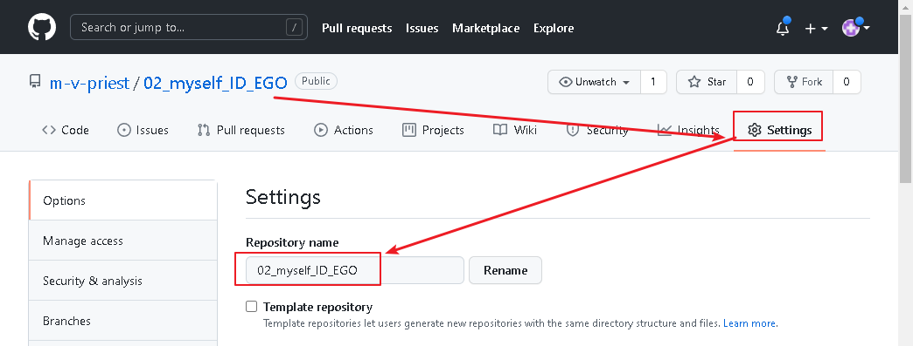
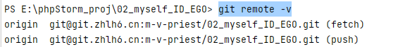
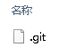
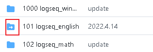
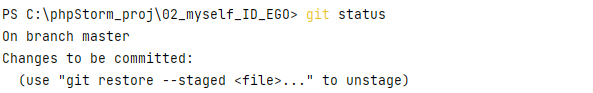
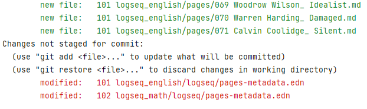

= github
:toc:
---

== 下载时, 如何把远程库强制覆盖掉本地库中的内容?

用 git pull origin master 拉去远程库的文件到本地时, 有时会报错:
....
Please commit your changes or stash them before you merge.
....

解决办法是: 直接将本地的状态恢复到上一个commit id, 然后用远程的代码直接覆盖本地就好了。
....
git reset --hard
git pull origin master
....

---

== 上传到github时, 如何排除 node_modules目录? -> 创建 .gitignore文件

在项目根目录, 新建一个 .gitignore 文件, 内容如下:
....
node_modules
....

注意: .gitignore只能忽略那些原来没有被track的文件，如果某些文件已经被纳入了版本管理中，则修改.gitignore是无效的。

解决方法就是先把本地缓存删除（改变成未track状态），然后再提交:

[source, Shell]
....
git rm -r --cached .
git add .
git commit -m '本次提交的说明信息'
git push origin master
....

---

== ★ 将本地项目, 上传到github上

比如, 你要把本地的oldProjs项目, 上传到github上的newProj文件夹中.

1.进入Github首页，点击右上角的+号, 按 New repository新建一个项目(假设叫newProj).

2.进入newProj项目, 点击右上方的绿色按钮 Clone or dowload, 会出现一个地址(即newProj在github上的url地址)，copy这个地址下来, 我们下面有用. +
该地址形如:

[source, Shell]
....
git@github.com:m-v-priest/newProj.git
....

3.在你的电脑中, 进入某一个目录, 你会把网上的newProj项目, 下载到这里.

4.右键鼠标, 选择 Git Bash Here

5.把github上面的仓库, 克隆到本地, 方法是 -> git clone newProj的项目地址
代码如下:

[source, Shell]
....
git clone git@github.com:m-v-priest/newProj.git
....

现在, 你电脑上就会多出一个newProj目录, 该目录名即为你github上面的项目名.

6.现在就能上传了, 先把oldProj项目里面的所有内容(文件与子目录), 都拷贝到newProj目录中. 然后进入newProj目录.

7.进行上传, 输入下面三条命令:

[source, Shell]
....
git add .
git commit  -m  "提交信息"
git push origin master
....

---

== 上传时, 报提示 warning: LF will be replaced by CRLF in ... 的问题

主要源于不同操作系统, 所使用的"换行符"不一样:

[options="autowidth"]
|===
|系统 |采用的换行符

|Uinx/Linux
|LF (LineFeed) (换行)

|Dos/Windows
|CRLF (CarriageReturn LineFeed)(回车+换行)

|Mac OS
|CR (CarriageReturn) (回车)
|===

在Git中，可以通过以下命令(git config core.autocrlf), 来显示当前你的Git中, 采取的是哪种对待换行符的方式: +
比如, 在我的win10上

[source, Shell]
....
$ git config core.autocrlf //<--输入此命令
true  //<--输出的结果
....

此命令会有三个输出值: “true”，“false” 或者“input”

[options="autowidth"]
|===
|输出值 |说明

|为true时
|add时, 会进行这个转换: CRLF(win) -> LF(linux), +
checkout时, 再进行这个转换: LF(linux) -> CRLF(win)

|为false时
|line endings(行尾换行符)不做任何改变，文本文件保持其原来的样子。

|为input时
|add时, 会进行这个转换: CRLF(win) -> LF(linux), +
 checkout时, 不做转换, 保持这个换行符换: LF(linux) ，所以Windows操作系统不建议设置此值。
|===

---

== ★ 修改远程仓库的名字, 同时对本地仓库也同步更新

步骤

[options="autowidth"]
|===
|Header 1 |Header 2

|1. 先修改远程仓库名字
|进入你要改名字的仓库, 选 settings -> 改名 +

|2.在你本地仓库下, 输入命令: +
git remote -v
|可以看到你本地这个仓库, 所连接到的远程仓库的对应地址  +

|3. 继续输入命令 +
git remote rm origin
|意思即: 断开链接, 删除远程仓库的连接地址. 即 删除origin这个远端的仓库和你本地的映射

删除后, 在用 git remote -v 来查看, 就看不到任何东西了..

|4. 重新链接到远程仓库（修改过名字后的远程仓库） +
git remote add origin git@git.zhlh6.cn:m-v-priest/02_myself_ID_EGO.git
|

|5. 进行同步
|git pull origin master
|===

---

== ★ (亲测成功) github上传时, 发现有文件遗漏, 没有全部 push 上去 -> 原因: 你在本地的该目录上, 看到后面有个 "master"字样

[options="autowidth" cols="1a,1a"]
|===
|Header 1 |Header 2

|1.
|为什么某个目录(比如目录名字是"101 logseq_english"), 没有上传上去? 因为你看到, 在pycharm中, 该本地目录前, 有个"master"字样. 类似如下图:

|2.
|你进入该"101 logseq_english"目录, #里面有个 .git文件, 删除它.# 这样, 该目录后面就不会带有 "master" 字样了.

|3.
|但是, 你现在依然无法上传"101 logseq_english"目录. 你打开github网站, 发现该目录的图标上, 多出一个箭头来了, 并且你无法点击进入该目录. 相当于被冻结了一样.

|4.
|你在本机上这样解决:  在pycharm 的 terminal终端中,  退回上一层目录("02_myself_ID_EGO"), 依次执行以下命令:

....
git rm --cached "101 logseq_english"  //文件名中若带有空格的, 就要在文件名两端加上双引号即可.
git add .
git commit -m "commit messge"  //双引号中的是你本次上传的说明性信息
git push origin master  //即 git push origin [branch_name]
....

|===

---

== 其他

[options="autowidth"]
|===
|Header 1 |Header 2

|git status
|首先, 用 git status 命令, 用于查看在你上次提交之后, 是否有对文件进行再次修改。可以发现被遗漏的文件(即未被git 跟踪的文件)

|git add -A
|添加所有变化

|git add -u
|添加被修改(modified)和被删除(deleted)文件，不包括新文件(new)

|git add .
|添加新文件(new)和被修改(modified)文件，不包括被删除(deleted)文件

|git restore --staged
|我们通过 git add 命令, 将文件提交到暂存区之后，发现文件提交错了，就可以通过git restore --staged 撤销在暂存区提交的文件。

|git ls-files
|git ls-files 命令, 可以查看暂存区的文件
|===

