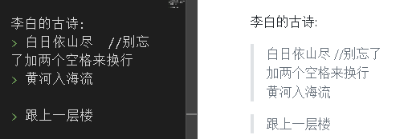

= markdown 教程
:toc:

---

在jetBrain系列软件中, 写markdown文件

---

== vscode 的 markdown必装插件

[options="autowidth"]
|===
|vscode插件 |功能

|Markdown Preview Enhanced
|能给vscode增加markdown窗口预览功能, 但默认不会自动打开. 可以用下面的Auto-Open Markdown Preview插件来自动帮你打开预览窗口.

|Auto-Open Markdown Preview
|能自动帮你打开md预览窗口

|Markdown Shortcuts (推荐)
|提供快捷键支持

|Markdown Extended (不太推荐)
|提供快捷键支持. 比如: +
加粗: ctrl + b +
下划线: ctrl + u  //在mobi和epub中无效 +
黄色背景高亮: ctrl + m //在mobi和epub中无效 +
灰色背景高亮 : Alt+` +
引用块 : Ctrl+Shift+Q +


|===

---


==== 修改 所安装插件 的参数

比如, 你要修改 markdown preview 插件的显示字号: +
"查看" -> "命令面板"(ctrl + shift + A) ->  搜索 "settings.json" -> 打开它 -> 搜索 关键词"preview", 就能设置字号了 :


---

== 最常用

==== 插入 latex 公式 -> 把公式放在 "\$...$"(行内)(注意: 不需要写前面的反斜杠) 或 "\$$...$$" 中(独立行间)

---

==== 同时修改多列 -> Alt+Shift 竖列选择


---

==== #折叠 -> <details>#

....
<details>
    <summary>折叠小三角处的文字</summary>
    本处内容会被折叠!
</details>
....


---

==== 标题 ->  n个#

....
# 一级标题
## 二级标题
### 三级标题
#### 四级标题
##### 五级标题
###### 六级标题
....
注意:  # 与文字之间要有一个空格隔开.

---

==== + 自动根据标题, 生成目录

在标题上一行, 输入 [TOC] 即可, 如
....
[toc]
## 标题
....

不过 在hexo的md中, 即使不加 [TOC], 也会直接根据标题来生成目录.

---

==== 段落 -> 两个空格

有两种方法可以分段:
1.使用两个以上空格, 再加上回车. +
2.也可以在段落后面使用一个空行, 来表示重新开始一个段落。

---

==== 粗体字 -> 两个* , 或<b>

....
**粗体文本**
__粗体文本__

....

---


==== 分隔线 -> 三个-

....
***
* * *
---
- - -
....

---

==== 下划线 -> _ 或 <u>  //注意, _ 方法在epub和mobi中无效

下划线可以有2种方法实现 : +
(1) 将内容用两个_包围起来.  -> \_内容_ +

*不过, 这种方法在苹果的epub app里面, 不支持!(反而会变成字体倾斜效果) 只能使用<u>标签来实现下划线效果.  +
在kindle里面, 也不支持, 会没有任何效果. kindle里面也只能用<u>来实现下划线效果.*

(2)通过 HTML 的 <u> 标签来实现：
vscode能跨行 , 但jetbrain只对一行起作用

....
<u>
hello

kotlin
</u>
....


---

==== 背景色(灰色高亮)

把高亮的部分, 放在两个反引号`中间
....
朝辞`白帝`彩云间
....


---

==== 背景色(可自定义高亮颜色) -> <span style="background:yellow">

用html原生css实现 背景色

....
朝辞<span style="background:yellow">白帝</span>彩云间
....


还有一种方法能实现高亮: 两边用两个等号= 来包围住文字. 但是, 这种方法在epub 和 mobi中无效. 只在vscode中有效.
....
== xxx ==
....

---

==== 有序列表 -> 数字加点号.加空格

有序列表使用数字并加上 . 号来表示. 点号后要空一格!

....
1. one
2. two
3. new number //你在中间插入任何内容, 有序列表的编号会自动更正
4. three
....

---

==== 无序列表 -> -加一个空格

无序列表使用星号(*)、加号(+)或是减号(-)作为列表标记

....
- one
- two
- three

* one
* two

+ one
+ two
....

---

==== 列表嵌套 -> 四个空格

列表嵌套, 只需在子列表项前, 添加四个空格即可：

....
1. father1
    - son1
    - son2
2. father2
   - son3
   - son4
....


---

==== 区块引用 -> >加一个空格

区块引用是在段落开头, 使用 > 符号 ，然后后面紧跟两个空格符号(似乎只加一个空格也行)：

....
李白的古诗:
> 白日依山尽  //别忘了加两个空格来换行
> 黄河入海流

> 跟上一层楼
....




---

==== 无色代码块 -> 3个反引号```

用3个反引号```把它包起来即可.

....
```
const promise = new Promise(function(resolve, reject) {
  // ... some code

  if (/* 异步操作成功 */){
    resolve(value);
  } else {
    reject(error);
  }
});
```
....


---

==== 有色代码块

同样是三个反引号```, 后加上程序名

....
```python
try:
    fh = open("testfile", "w")
    fh.write("这是一个测试文件，用于测试异常!!")
finally:
    print "Error: 没有找到文件或读取文件失败"
```
....


---

==== 超链接 -> <a>

有三种方法实现超链接:

1. [链接名称](链接地址)
2. <链接地址>
3. 用html原生的<a>标签

....
[zzr网站](https://www.zzr.us)

<https://www.zzr.us>
....


可以用一个变量, 来存储超链接地址. 然后在你的网站名字后,引用这个变量即可.

格式是:
....
//1.定义变量
[url变量]: url地址

//2.使用变量
[网站名][url变量]
....

....
[zzr网站在此][var_zzr网址变量]

[var_zzr网址变量]:https://www.zzr.us
....

image:./img_adoc,md,other/md_08.png[]

---

==== 插入本地图片

假设图片目录(img_math),就在当前所编辑文件, 同一个父目录下, 则, 用下面的方式即可引入图片. 注意, 中括号[] 不能省略!


---

==== 图片

图片语法格式如下：
....


....

- 开头一个感叹号 !
- 接着一个方括号，里面放上图片的替代文字
- 接着一个小括号，里面放上图片的网址，最后还可以用引号包住并加上选择性的 'title' 属性的文字。

....


....


Markdown 还没有办法指定图片的高度与宽度，如果你需要的话，你可以使用html原生的  标签 和width属性。

....

....


---

==== 表格

用 | 来分隔不同的单元格， +
使用 - 来分隔表头和其他行。

....
|  表头   | 表头  |
|  ----  | ----  |
| 单元格  | 单元格 |
| 单元格  | 单元格 |
....


====  ---- 表格的对齐方式

对表格的第二行进行设置:

[options="autowidth"]
|===
|对齐方式 |将第二行写为

|左对齐
|:-

|右对齐
|-:

|居中对齐
|:-:
|===


==== ---- 表格的单元格内进行换行 -> <br/>

只能用 html代码来进行换行 <br/>


---


==== 转义 -> 用反斜杠\来转义

....
\*
\\
\\\
....


Markdown 支持以下这些符号前面加上反斜杠来帮助插入普通的符号：
....
\   反斜线
`   反引号
*   星号
_   下划线
{}  花括号
[]  方括号
()  小括号
#   井字号
+   加号
-   减号
.   英文句点
!   感叹号
....

---


== 不常用的

==== 居中 -> <center>

由于markdown 定义全支持html标记，所以你可以直接在markdown里面写html语法。
....
<center>文本居中</center>
....

vscode没问题, 但jetbrain中无效果?


---


==== 斜体字 -> 一个*

....
*斜体文本*
_斜体文本_
....

---

==== 粗体和斜体共同起作用 -> 三个*

用三个*或三个_ 来前后包裹住文字

---

==== 删除线 -> ~~包围

在文字的两端加上两个波浪线 ~~ 即可
....
被~~删除~~的文字
....

---

==== 区块可以嵌套 -> n个>

区块是可以嵌套的，一个 > 符号是最外层，两个 > 符号是第一层嵌套，以此类推退：

....
father
父亲
> son  //加两空格换行
> 儿子
>> grandson
>> 孙子
>>> great grandson
>>> 重孙
>>>> 曾孙
....


---

==== 在区块中使用列表

....
father
> - son1
> - son2
> 1. son3
> 1. son4
> 1. son5
....


---

==== 列表中使用区块

如果要在列表项目内, 放进区块，那么只需在 > 前, 添加四个空格(2个空格似乎也行)的缩进：

....
- one
  > son1
  > son2

- two
  > - son3
  > - son4
....


---


== github的markdown版本

==== GFM版本

GitHub对markdown进行了自定义, 变成了版本: Flavored Markdown (GFM)

官方说明 +
https://help.github.com/en/github/writing-on-github

---

==== 让代码块中的文本加粗显示 -> <pre>

只能把代码写在 html的 <pre>标签中. 然后在<pre>里面, 可以对你想要加粗的某行代码, 加上<b>标签来加粗.

注意, github中的markdown只支持<b>加粗, 而不支持用<font>标签来给文字加上颜色.  jetbrain和vscode中的markdown是支持颜色的.

....
<pre>
const fs = require('fs')
const path = require('path')

//下面使用<b>来加粗
<b><font color='#b0120a'>fs.promises.readdir</font>(path.join(__dirname, 'dirGrandfather'))</b>
    .then((arrFileName: string[]) => {
        console.log(arrFileName); //这个数组,只包括dirGrandfather目录中的文件名和子目录名, 而不包括该子目录中的内容.
    })
    .catch((err: object) => {
        console.log(err);
    })
</pre>

....

效果如下, 可见github中, 颜色设置无效. 加粗有效.

++++
<pre>
const fs = require('fs')
const path = require('path')

<b><font color='#b0120a'>fs.promises.readdir</font>(path.join(__dirname, 'dirGrandfather'))</b>
    .then((arrFileName: string[]) => {
        console.log(arrFileName); //这个数组,只包括dirGrandfather目录中的文件名和子目录名, 而不包括该子目录中的内容.
    })
    .catch((err: object) => {
        console.log(err);
    })
</pre>
++++


---


