= obsidian
:toc:

---

== 官方教程

https://publish.obsidian.md/help-zh/%E7%94%B1%E6%AD%A4%E5%BC%80%E5%A7%8B

---

==== 数学公式 -> 放在 两个$$中 , 即 LaTeX 语法.

LaTeX 官网 : +
https://www.latex-project.org/


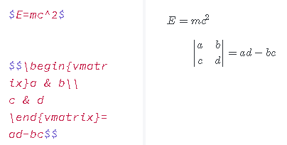

---

==== 画流程图 -> Mermaid 脚本非语言

画流程图功能, 是通过 Mermaid 来实现的. 官方文档: +
https://mermaid-js.github.io/mermaid/#/

用多行代码块来实现, 声明编程语言是 mermaid :
....
```mermaid
sequenceDiagram
    Alice->>+John: 嗨，John，最近怎样？
    Alice->>+John: John，听得到我说话吗？
    John-->>-Alice: 嗨，Alice，我能听到！
    John-->>-Alice: 最近不错！
```
....

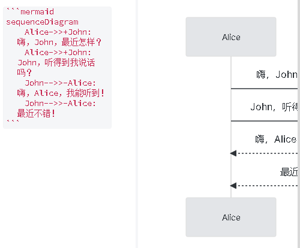

---

==== %%注释%% <- 不会被渲染出来

注释，指只在编辑模式中显示，但不会渲染出来的内容。 就像 python中的 # 一样.

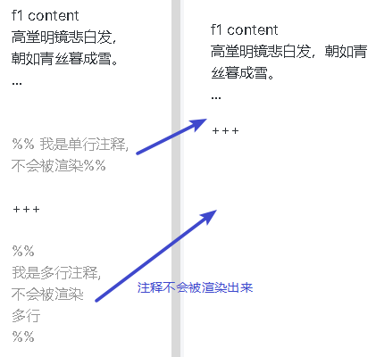

---


==== 双向链接 -> [[file_name 路径]]

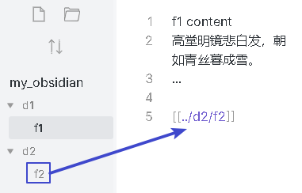


---

==== 双向链接时, 直接显示所链接的另一个页面中的内容 -> ![[file_name 路径]]

即前面加感叹号 !

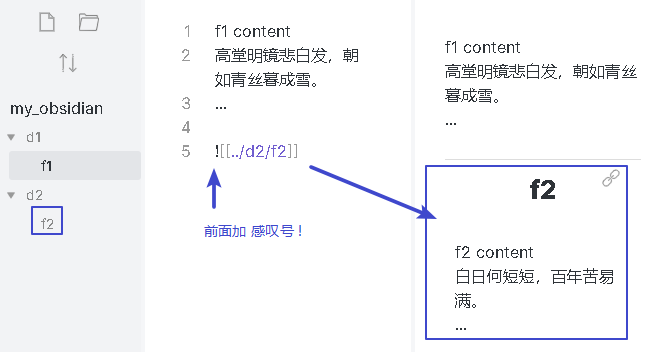

---

==== 双向链接时, 给所链接的另一个文件, 起个别名, 显示在本页面中 -> [[file_name 路径 | 重命名]]

如果你不想在页面中, 只显示另一个链接文件的路径, 可以重新起个名字, 来显示在本页面中.

注意, 竖线"|"左右要加空格

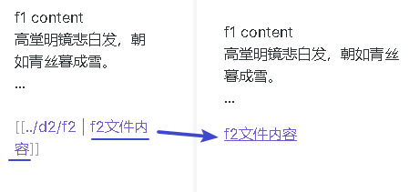


---

==== 双向链接时, 显示另一个页面中的其中某个子标题的内容 -> ![[file_name路径#某标题]]

注意: #号前面不能有空格! 必须连着前面的文件路径写

比如, 现在, f2页面的内容如下:

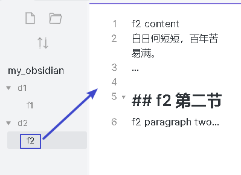

我们来在f1文件中, 应用f2文件中的第二小节

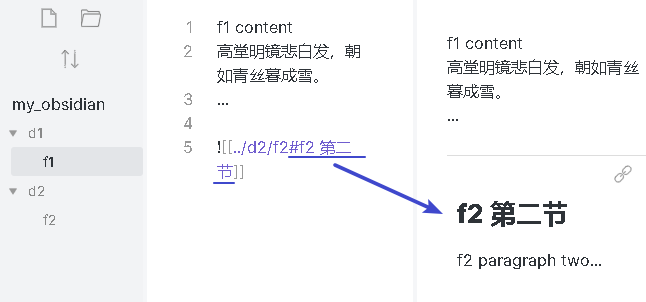


---

==== 双向链接时, 引用另一个页面中的"块" -> ![[file_name路径#^id名]]

将某段文字(即块), 添加上id, 以方便另一个页面来引用它, 只需在它后面加上 "^你的-id" 即可.

注意 :

- ID名 和块最后一个字符（即段落最后一个字符）间, 需要有一个空格.
- id名不支持下划线, 但可以用"-"号.
- 块链接"[[filename#^id名]]" 和块引用 "![[filename#^id名]]" 并非 Markdown 的标准语法，而是Obsidian自己特有的 Markdown 语法。

如, f2文件内容如下, 其中我们给三段文字, 添上了各自的 id

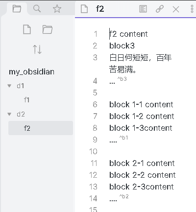

现在, 我们在f1文件中, 来引用f2文件的 block2 和 block3 这两块

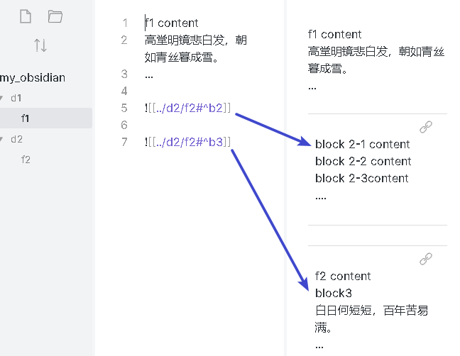


如果是要引用表格的话, 对表格添加id, 需要确保ID名 前后都是空行。 如下:

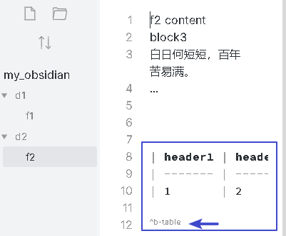

然后在另一个文件中, 引用该表格

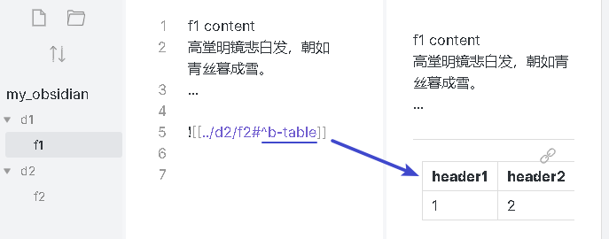


---

==== ----- -----

---

==== 插入图片 -> (1)直接双向链接要插入的图片路径即可, (2) 

直接把图片拖到页面中即可. +
下面几种写法都行.

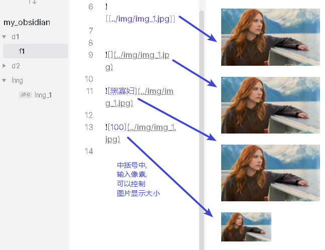


markdown 插入图片的写法为:
....


其中:
- Alt text：图片的Alt标签，用来描述图片的关键词，可以不写。当图片因某种原因不能被显示时, 可作为替代文字出现.
- 图片地址：可以是图片的本地地址或者是网址。
- "optional title"：鼠标悬置于图片上会出现的标题文字，可以不写。
....

[cols="1a,3a"]
|===
|Header 1 |Header 2

|插入本地图片 (不支持webp):
|填入图片的位置路径即可，支持绝对路径和相对路径。 如: +


|插入网络图片 (支持webp)
|填入图片的网络链接即可. 如: +


|用base64转码工具, 把图片转成一段字符串
|然后把字符串, 填到基础格式中链接的那个位置。 如: +


但字符串太长, 可以把这大段的base64字符串放在另一个文件中, 然后在本页面中用双向链接, 来调用那个文件的字符串.

|===

插入网络图片时, 要控制图片显示大小, 在中括号中, 像素前面要加个竖线 :

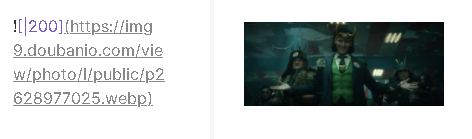


---

==== 粗体 -> (1)左右各两个*号, (2)左右两个_ ,   (3) ctrl + B

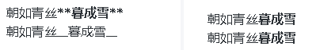


---


==== ==高亮文字==

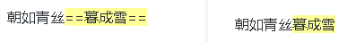

---

==== 表格

....
| 标题1 | 标题2|
| - | - |
| 单元格11的内容 | 单元格12的内容 |
| 单元格21的内容 | 单元格22的内容 |
....


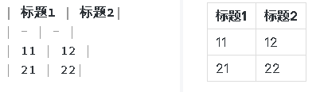

---

==== 单行代码块 -> 放在两个反引号`中


---

==== 多行代码块 -> 放在 两个```里面, 或放tab后


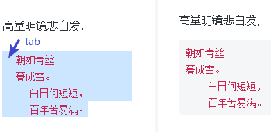

多行代码块中, 支持语法高亮. 在第一行(即```)后面声明编程语言名字即可. 比如, 下面声明是 JavaScript语言.

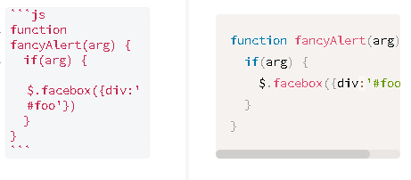

更多编程语言的如何声明, 见 prismjs 官方网站: +
https://prismjs.com/#supported-languages


---

==== 内容块 -> 内容放在 "> 后面

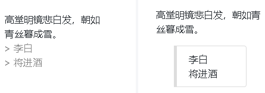


---

==== 插入链接 -> ctrl + K


---

==== 小标题 -> 用 #号, 共6级(6个#号)

---

==== 页面插入标签 -> #标签名

注意:

- #号和标签名中间不能有空格! 必须紧连着.
- 标签名命名规则, 同编程程序变量名完全一致, 可以使用下划线.
- 标签名不能完全由数字组成。如，#1984 就是错的.


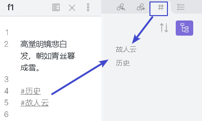


---

==== 嵌套标签 -> #标签名/子标签名

#maintag/subtag

嵌套标签的好处是:

- 你可以搜索 maintag 这个主标签，从而找到包含任意一个子标签的笔记。
- 或, 你也可以单独搜索每一个含有子标签的页面.

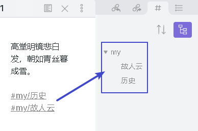


---

== ----- -----

---

== obsidian 快捷键

==== 前进后退页面 -> ctrl + alt + 左右键

==== markdown效果预览 →  (ctrl + e) 或 (ctrl + 预览按钮)

==== 新建文件 ->  ctrl + n

==== 打开命令面板 -> ctrl + p


