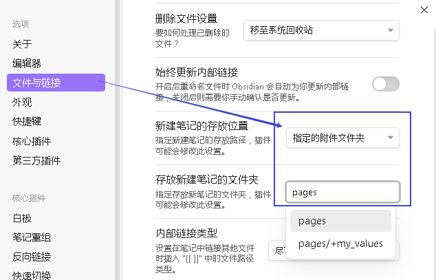
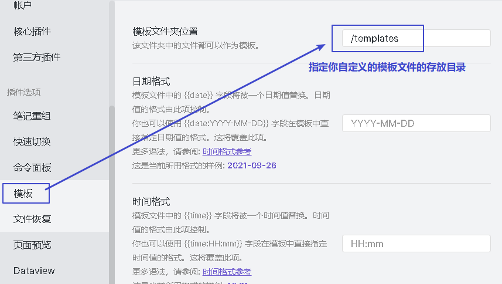

= obsidian
:toc: left
:toclevels: 3
:sectnums:

'''

== 设置


==== 自定义你新建页面的存储目录, 和图片目录

现在你的项目目录下, 新建两个文件, 会用来分别存放你的markdown页面文件和图片


然后在"设置"中, 更改下面两个内容:




'''

==== 自定义快捷键


'''

==== #自定义css#

官方文档说明
https://publish.obsidian.md/help-zh/%E9%AB%98%E7%BA%A7%E7%94%A8%E6%B3%95/%E8%87%AA%E5%AE%9A%E4%B9%89+CSS

https://forum.obsidian.md/t/getting-comfortable-with-obsidian-css/133

在 obsidian 的页面中, 按  CTRL-SHIFT-I , 就能在 ob中自动打开 chrome开发者窗口, 就能查看你要改变的那个元素的html标签了


然后, 在ob的设置中, appearance里,  打开 css Snippet 的文件夹.


然后, 在你的 css文件中, 写下面的内容:

....

li, p {
	margin-top: 0.5em;

}

li {
	border-bottom: 1px dotted #00000059;
}

br {
	display: block;
	content: "";
	margin: 0.5em;
	/* border-top: 1px solid #000; */
}
....

就可以将 obsidian默认css中的 list 和 p 元素, 增加上下边距. 因为默认的css 它们间隔太紧了,

'''

====  #如何让 你自定义的css, 在iphone 上 也生效?#

国外讨论教程 +
https://forum.obsidian.md/t/mobile-ios-app-to-work-with-hidden-folder/25741/2

icloud 虽然能同步你的css文件, 但因为该css是存储在一个隐藏文件 .obsidian中的, 导致 iphone上无法读取它, 也无法访问该隐藏的css文件来重新编辑它. 所以, 你要安装可以访问 ios上隐藏文件的 第三方app, 才能操作.


[.small]
[options="autowidth" cols="1a,1a"]
|===
|Header 1 |Header 2

|方法1: 安装 ish Shell  软件
|


然后输入下面的几行命令, 中间会让你选择你的obsidian的位置.


a-shell 上的编辑是通过 vim 进行的……所以，你需要了解 vim。

|方法2: Textastic 软件
|可以直接访问隐藏文件. 但这个软件需要收费


|方法3:
|Taio 软件 +


image:img_adoc,md,other/img_obsidian/obsidian 64.png[,20%]


因为 Taio 如果要编辑 css的话, 会收费, 但编辑txt则不用收费, 所以我们可以把 这个css文件, 重命名扩展名为txt, 来改就行了.

不过, 既然能访问到 iphone上面的 css文件, 并且里面的确是有内容的, 就说明 icloud的同步没有任何问题, 是 obsidian 手机版本身无法访问到 css文件.


|===


'''

== 插件

==== 手动安装插件

[cols="1a,4a"]
|===
|步骤 |Header 2

|1.
|进入 git 官网, 搜索插件. 用关键词 "obsidian 插件名"来搜索

https://github.com/search?q=obsidian+plugin

|2.
|进入插件页面后, 点击右侧的 Releases


|3.
|obsidian的插件主要有 *3类文件*，分别命名为 :

- `main.js`
- `manifest.json`
- `styles.css`

也有些插件可能没有其中的某个文件。将上述3个文件下载到本地即可.


|4.
|把这三个文件, 拷入一个新的文件夹中, 该文件夹起名为你的插件名. +
然后, 把该文件夹, 拷贝入你的 <vault>/.obsidian/plugins/ 中. +
如果 .obsidian 目录下不存在 plugins 目录, 就手动新建一个.

即, 路径比如:
....
C:\Users\mvpri\iCloudDrive\iCloud~md~obsidian\my value\.obsidian\plugins\obsidian-kanban
....

|5.
|重启Obsidian, 插件就能生效

|===


---

==== toc动态目录 -> obsidian-plugin-dynamic-toc

[options="autowidth"]
|===
|Dynamic Table of Contents |Header 2

|功能
|为页面增加 toc目录

|官网
|https://github.com/Aidurber/obsidian-plugin-dynamic-toc

|用法
|见下文
|===

- 直接输入下面代码即可, 注意, 它会用列表符号作为前标.  +
并且, 它默认是从二级目录开始的, 而不包括一级目录. 因为一级目录是作为整个文章的标题的, 而不是作为目录中的一部分.

....
```toc

```
....

- 如果你想用数字来作为前标, 就用
....
```toc
 style: number
```
....

- 该插件的默认参数其实如下:
....
```toc
	style: bullet | number (default: bullet)
	min_depth: number (default: 2)
	max_depth: number (default: 6)
```
....

说明, style参数的默认值是 bullet +
从二级目录开始, 到六级目录结束. +
你可以自己来修改这些参数的参数值.


- 如果你想让一级标题, 也显示在目录中, 就要把 min_depth 参数, 设置值为1. 如下:
....
```toc
	style: number
	min_depth: 1
	max_depth: 6
```
....


'''


==== 对tag标签, 批量修改 -> Tag wrangler

[options="autowidth"]
|===
|Tag wrangler |Header 2

|功能
|当你重命名某个标签时，全库内的所有同名标签都会被自动更改.

|官网
|https://github.com/pjeby/tag-wrangler

|用法
|


|===

---

==== 最近打开的文件 -> Recent Files

[options="autowidth"]
|===
|Recent Files |Header 2

|功能
|显示最近编辑过的文件

|官网
|https://github.com/tgrosinger/recent-files-obsidian

|用法
|

|===

---

==== 快速折叠/展开所有文件夹层  -> obsidian-collapse-all

[options="autowidth"]
|===
|Header 1 |Header 2

|功能
|一键展开, 或折叠 所有文件夹层次

|官网
|https://github.com/OfficerHalf/obsidian-collapse-all

|用法
|
|===

---

==== 清理未链接的图片文件 -> Clear Unused Images

[options="autowidth" cols="1a,1a"]

|===
|Header 1 |Header 2

|功能
|似乎只能识别png, 而不支持webp格式

|官网
|https://github.com/ozntel/oz-clear-unused-images-obsidian

|用法
|- 先对插件新进设置


- 或者, 用命令来删除:

按 ctrl + p, 找到 "Clear Unused Images" 命令

|===


---

==== 拆分文件 -> note-refactor-obsidian


[options="autowidth"]
|===
|Header 1 |Header 2

|Column 1, row 1
|Column 2, row 1

|官网
|https://github.com/lynchjames/note-refactor-obsidian

|用法
|ctrlt+p打开【命令面板】，输入【note refactor】，可见note refactor的标题拆分用法，比如将一篇文章按标题1，标题2，标题3拆分为不同的片段。 +
按标题拆分是将标题作为文件名称，并在原文件里设置链接。
|===

改造:
由于本插件默认只带有对1-3级别标题的拆分, 所以你可以自己添加上对 4-6级标题进行拆分的功能:

打开 main.js 文件, 搜索"H3", 然后再它的代码块下面添加上:


[source, javascript]
----

						this.addCommand({
                            id: 'app:split-note-by-heading-h4',
                            name: 'Split note by headings - H4',
                            callback: function () { return _this.editModeGuard(function () { return _this.splitOnHeading(4); }); },
                        });
						this.addCommand({
                            id: 'app:split-note-by-heading-h5',
                            name: 'Split note by headings - H5',
                            callback: function () { return _this.editModeGuard(function () { return _this.splitOnHeading(5); }); },
                        });
						this.addCommand({
                            id: 'app:split-note-by-heading-h6',
                            name: 'Split note by headings - H6',
                            callback: function () { return _this.editModeGuard(function () { return _this.splitOnHeading(6); }); },
                        });
----


在插件设置中, 还可以进行下面两个设置


---


==== ★ 聚合(查询)文件 -> 推荐:  Dataview

官网  +
https://github.com/blacksmithgu/obsidian-dataview

用法:

现在每个文件的头部, 写上"元信息" :

....
---
name : 文件名
tag: 标签名
---
....


然后, 在一个新的空白页面, 写上下面的代码, 用来做查询.

....
```dataview
table tag  //若想要多个列表头, 之间可以用逗号隔开
from #11myOwn
```
....

上面的代码, 意思是: 建一个表格, 表格里有两列, 一列是默认的文件名, 另一列是我们制定的 tag标签名. 并限制只要查找 #11myOwn 标签即可.

然后点击渲染预览, 结果就会有:


更多用法见: +
https://zhuanlan.zhihu.com/p/373623264


---


==== 聚合(查询)文件 -> 不推荐这个:  obsidian-text-expand <- 速度太慢了, 而且容易修改原始文件中的数据, 导致崩溃!


[options="autowidth"]
|===
|Header 1 |Header 2

|功能
|可以用查询命令, 但搜索结果渲染在页面上

|官网
|https://github.com/mrjackphil/obsidian-text-expand
|===

用法: 最简单的, 输入下面的代码, 然后按 ctrl+p, 执行"Text expand: expand command" 命令:
....
```expander
tag: #★看穿/人活世上
[[$filename]] <- 注意, 这里的[[]]不是参数的一部分, 只是双向应用功能而已
```
....

image:img_adoc,md,other/img_obsidian/obsidian 35.png[]


又例如:

....
```expander
tag: #★看穿/人活世上
$lines <-该命令, 直接读取每个符合本tag的卡片文件的全部文本内容

---

```
....


即: 查询命令的模板是:
....
```expander
检索式
模板参数
```
....

[options="autowidth" cols="1a,1a"]
|===
|Header 1 |Header 2

|expander
|是该插件默认的代码块头，这句话必须要写! 插件的查询操作才能执行

|检索式
|就是我们在 Obsidian 的检索窗口中使用的检索式，你用检索式检索到的任何内容.

|模板参数
|是让你可以用上述的检索式所能获取的文件名、文件内容来进行操作替换，且生成对应的一系列内容的操作。

 Text{{expand}} 插件支持的参数有:

- $filename —— 返回搜索结果对应的"文件名"

- $lines —— 返回搜索结果对应的文件的"文件全部内容"
- $lines:10 —— 返回搜索结果对应的文件的文件"前十行内容"（当10设置为其它数值时，对应性变化）

- $parent —— 返回搜索结果对应的"文件的所在目录名"
- $path —— 返回搜索结果对应的"文件的路径"

- $frontmatter:NAME —— 返回搜索结果对应的 文件的 YAML 的任一项结果（例如 - $frontmatter:Stars 返回 Stars 的值）
- $header:## —— 返回搜索结果对应的文件的"所有二级标题"
- $header:### HEADER —— 返回搜索结果对应的文件的所有匹配 HEADER 的"三级标题"
- $blocks —— 返回搜索结果对应的文件的"所有块"（不包括隐藏块）
- $match —— 返回搜索结果对应的文件的"所有匹配行"

- $ext —— 返回搜索结果对应的文件的"后缀名"
- $created —— 返回搜索结果对应的文件的"创建时间"
- $size —— 返回搜索结果对应的文件的"大小"
|===


---


== ----- -----

---

== 官方教程

https://publish.obsidian.md/help-zh/%E7%94%B1%E6%AD%A4%E5%BC%80%E5%A7%8B

---

==== 图片目录的设置

在设置 -> 文件与链接 -> 新附件的默认位置, 改成"下方指定的目录" -> 下面就能看到"附件文件夹路径"了


---

==== 模板的使用

1.先在核心插件中, 打开模板功能

2. 在设置 -> 模板中, 指定你之后要"自定义模板文件"的存放目录



3.进入你的模板目录, 新建一个md文件, 写入你的预设内容.

注意, 下图中写错了,  日期和时间要写成这样:
....
---
name : //注意, 模板里不能写单引号', 否则报错.
tag :
date: {{date}}
time: {{time}}
---
....


4.现在, 在任何你想插入模板内容的空白页面中, ctrl + p, 找到命令"插入模板"即可.


可以在设置中, 给"插入模板"命令指定一个快捷键, 比如设为 ctrl + t


---


==== 数学公式 -> 放在 两个$$中 , 即 LaTeX 语法.

LaTeX 官网 : +
https://www.latex-project.org/


image:img_adoc,md,other/img_obsidian/obsidian 21.png[]

---

==== 画流程图 -> Mermaid 脚本非语言

画流程图功能, 是通过 Mermaid 来实现的. 官方文档: +
https://mermaid-js.github.io/mermaid/#/

用多行代码块来实现, 声明编程语言是 mermaid :
....
```mermaid
sequenceDiagram
    Alice->>+John: 嗨，John，最近怎样？
    Alice->>+John: John，听得到我说话吗？
    John-->>-Alice: 嗨，Alice，我能听到！
    John-->>-Alice: 最近不错！
```
....


---

==== %%注释%% <- 不会被渲染出来

注释，指只在编辑模式中显示，但不会渲染出来的内容。 就像 python中的 # 一样.


---


==== 双向链接 -> [[file_name 路径]]


---

==== 双向链接时, 直接显示所链接的另一个页面中的内容 -> ![[file_name 路径]]

即前面加感叹号 !


---

==== 双向链接时, 给所链接的另一个文件, 起个别名, 显示在本页面中 -> [[file_name 路径 | 重命名]]

如果你不想在页面中, 只显示另一个链接文件的路径, 可以重新起个名字, 来显示在本页面中.

注意, 竖线"|"左右要加空格


---

==== 双向链接时, 显示另一个页面中的其中某个子标题的内容 -> ![[file_name路径#某标题]]

注意: #号前面不能有空格! 必须连着前面的文件路径写

比如, 现在, f2页面的内容如下:


我们来在f1文件中, 应用f2文件中的第二小节


---

==== #★★# 双向链接时, 引用另一个页面中的"块" -> ![[file_name路径#^id名]]

将某段文字(即块), 添加上id, 以方便另一个页面来引用它, 只需在它后面加上 "^你的-id" 即可.


image:img_adoc,md,other/img_obsidian/obsidian 48.png[]


注意 :

- ID名 和块最后一个字符（即段落最后一个字符）间, 需要有一个空格.
- id名不支持下划线, 但可以用"-"号.
- 块链接"[[filename#^id名]]" 和块引用 "![[filename#^id名]]" 并非 Markdown 的标准语法，而是Obsidian自己特有的 Markdown 语法。

如, f2文件内容如下, 其中我们给三段文字, 添上了各自的 id


现在, 我们在f1文件中, 来引用f2文件的 block2 和 block3 这两块


如果是要引用表格的话, 对表格添加id, 需要确保ID名 前后都是空行。 如下:


然后在另一个文件中, 引用该表格


'''

==== #让链接的内容, 直接显示里面的具体内容, 而不是超链接形式#


---

==== ----- -----

---

==== 插入图片 -> (1)直接双向链接要插入的图片路径即可, (2) 

直接把图片拖到页面中即可. +
下面几种写法都行.


markdown 插入图片的写法为:
....


其中:
- Alt text：图片的Alt标签，用来描述图片的关键词，可以不写。当图片因某种原因不能被显示时, 可作为替代文字出现.
- 图片地址：可以是图片的本地地址或者是网址。
- "optional title"：鼠标悬置于图片上会出现的标题文字，可以不写。
....

[cols="1a,3a"]
|===
|Header 1 |Header 2

|插入本地图片 (不支持webp):
|填入图片的位置路径即可，支持绝对路径和相对路径。 如: +


|插入网络图片 (支持webp)
|填入图片的网络链接即可. 如: +


|用base64转码工具, 把图片转成一段字符串
|然后把字符串, 填到基础格式中链接的那个位置。 如: +


但字符串太长, 可以把这大段的base64字符串放在另一个文件中, 然后在本页面中用双向链接, 来调用那个文件的字符串.

|===

插入网络图片时, 要控制图片显示大小, 在中括号中, 像素前面要加个竖线 :


---

==== 粗体 -> (1)左右各两个*号, (2)左右两个_ ,   (3) ctrl + B


---


==== ==高亮文字==


---

==== 表格

....
| 标题1 | 标题2|
| - | - |
| 单元格11的内容 | 单元格12的内容 |
| 单元格21的内容 | 单元格22的内容 |
....


---

==== 单行代码块 -> 放在两个反引号`中


---

==== 多行代码块 -> 放在 两个```里面, 或放tab后


多行代码块中, 支持语法高亮. 在第一行(即```)后面声明编程语言名字即可. 比如, 下面声明是 JavaScript语言.


更多编程语言的如何声明, 见 prismjs 官方网站: +
https://prismjs.com/#supported-languages


---

==== 内容块 -> 内容放在 "> 后面


---

==== 插入链接 -> ctrl + K


---

==== 小标题 -> 用 #号, 共6级(6个#号)

---

==== 页面插入标签 -> #标签名

注意:

- #号和标签名中间不能有空格! 必须紧连着.
- 标签名命名规则, 同编程程序变量名完全一致, 可以使用下划线.
- 标签名不能完全由数字组成。如，#1984 就是错的.


---

==== 嵌套标签 -> #标签名/子标签名

#maintag/subtag

嵌套标签的好处是:

- 你可以搜索 maintag 这个主标签，从而找到包含任意一个子标签的笔记。
- 或, 你也可以单独搜索每一个含有子标签的页面.


---

== ----- -----

---

== obsidian 快捷键

==== 前进后退页面 -> ctrl + alt + 左右键

==== markdown效果预览 →  (ctrl + e) 或 (ctrl + 预览按钮)

==== 新建文件 ->  ctrl + n

==== 打开命令面板 -> ctrl + p


