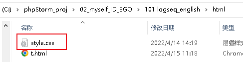
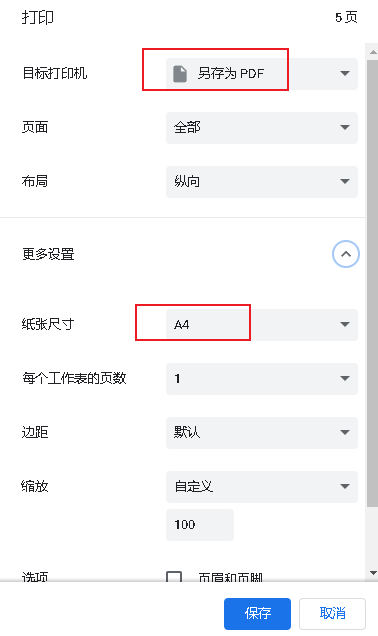
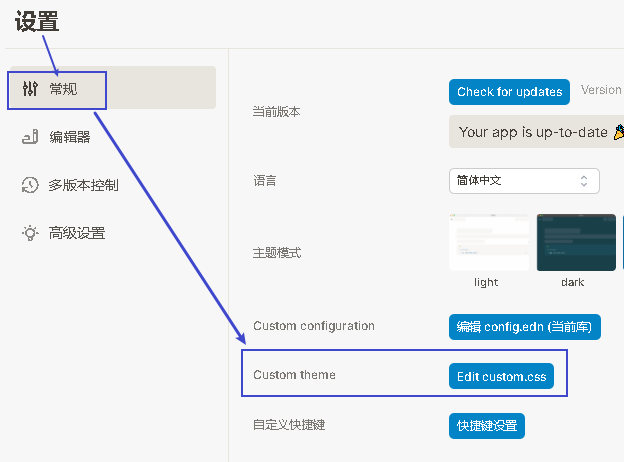
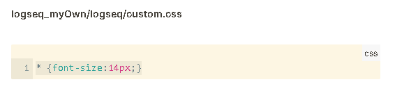
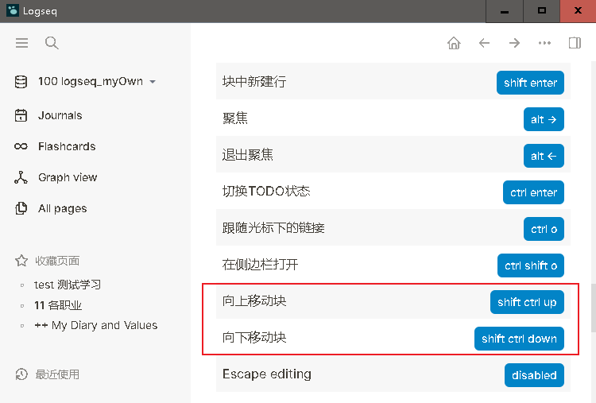

= logseq 教程
:toc:
:sectnums:

---

== 教训

==== #不要直接在页面上的[[]]中更改文件名! 会创建出一个改名后的新的空白文件的!#

你要对文件改名, 必须要点到这个文件里面, 再去改名, 然后 logseq才会真正帮你改名.

而如果你直接在 [[]] 中来改文件名, 只会创造出一个新的空白文件, 并链接到这个空白文件上, 你原来的有内容的老文件就将失联(不再被链接到)了!

==== #★ 导出 pdf#

logseq无法直接导出pdf, 可以先导出 html, 然后在 pycharm中, 编辑该html (如把太大的图片, 尺寸设为自适应到浏览器显示宽度的100%), 并外链css. 然后在 chrome中 打印出 pdf 即可. 亲测可行.

[options="autowidth" cols="1a,1a"]
|===
|Header 1 |Header 2

| 在HTML中, 外链 css
|在HTML中的 <head> 标签中, 加上这句代码:

....
<link rel="stylesheet" type="text/css" href="style.css">
....

然后把 css文件, 放到和 HTML文件 相同的目录中.



|css文件中的内容如下:
|
[source, css]
----
li {
line-height: 1.4em;
padding: 0.2em
}

blockquote {
  background: #eeeeee;
  line-height: 1.4em;
  border-left: 3px solid #ccc; /*应用块前竖线的粗细*/
  margin: 0.1em; /*上－右－下－左*/
  padding: 0.5em 10px;
}
blockquote:before {
  color: #ccc;
  /*content: open-quote;*/
  /*font-size: 4em;*/
  line-height: 0.1em;
  margin-right: 0.25em;
  vertical-align: -0.4em;
}

blockquote p {
  display: inline;
}
----

|将图片, 宽度自适应到浏览器显示的宽度.
| 在 img 标签中, 加上 "width="100%" 即可.

....

....

|在chrome 中, 导出成 pdf
|按 ctrl + p, 另存为pdf即可


|===

---


== 下载与教程

==== logseq 官方下载地址

https://logseq.com/

https://github.com/logseq

==== 官方文档

https://logseq.github.io/#/page/Contents

英文问答社区 https://discuss.logseq.com/

中文社区 https://cn.logseq.com/


---

==== 自定义 logseq 的快捷键 -> 设置 -> 常规 -> 自定义快捷键

image:img_adoc,md,other/logseq_02.png[]

---

==== 自定义 logseq 默认主题css 的字号大小

默认主题的字号太大了, 可以这样修改缩小: 在设置里面, 修改css.  +
它的优点是: 它能对所有安装的第三方主题的字号大小, 同样覆盖生效. 这就很不错.



然后输入
....
* {font-size:14px;}
....



*其实, 这个css文件, 名叫 custom.css, 路径就在* C:\phpStorm_proj\02_myself_ID_EGO\100 logseq_myOwn\logseq 里面,  +
你可以手动打开它直接修改, 而不需要在 logseq里面那么麻烦地修改了.

---


==== 修改默认表格的css样式

如上操作, 在 custom.css中, 加入代码:

....
table {
  border-collapse: collapse;
}

table, th, td {
  border: 1px solid hsl(0, 0%, 40%);
}

/* tr:hover {background-color: #f3e2e2;} */
/* 在 <tr> 元素上使用 :hover 选择器，可以让鼠标在悬停时, 下面的表格行变色 */
....


---

==== 插件 和 主题

主题: 装 atlas theme : Light, 文字小, 精致, 很好看


---


==== 插入图片, 设置图片尺寸

logseq支持svg图片, 但需要设置尺寸, 才能看到图片.

在插入图片的代码后面, 设置尺寸 {:height 300, :width 300}

如:
....
{:height 300, :width 300}
....


---

==== 插入音频

....
[:audio {:controls true :src "../assets/recording.mp3"}]

[:audio {:controls true :src "https://...xxx.mp3"}]

....

== ----- -----

---

== 选中, 定位

==== #全选block ->  ctrl shift a#
==== 进入某block, 聚焦 -> alt + →
==== #退出聚焦 -> alt + ←#
==== #打开和折叠 本block -> ctrl + Up/Down#
==== 向上或下连续多选 block -> shift + down/up (向上可以跨级选, 向下只能选同一层级)


---

== ----- -----

---

== 增

==== 新建链接页面 -> [[]]

方法1 : 直接把连接页面的文件名, 放在[[ ]]中. +
方法2 : 先输完文件名, 选中它, 再按[ 键2次.

每个[[ ]]中的文字都是一个链接，也都是一个新的笔记页面。

---

== ----- -----

---

== 删

==== #清空本 block容器中的内容(注意不是删除本block块) -> alt + L#

---

== ----- -----

---

== 改, 移动

==== #上下移动 block -> 默认为Shift +alt +Up/down, 但可以通过自定义快捷键, 改成与 jetbrains 完全一致的 ctrl + shift + up/down#



注意, 该快捷键只对同一层级的 block有效, Subsequent blocks will be highlighted but not moved.

---

== ----- -----

---

== 查

==== 全文搜索 -> ctrl + k
==== 在当前页面搜索 -> ctrl shift k
==== 不跳转链接, 而是在右侧边栏打开该链接页面 -> 按住SHIFT+单击[[ ]]中的文字

---

== ----- -----

---

== latex 公式

==== #输入 latex 数学公式 -> 输入 "< latex"#
==== 输入 latex 数学公式 -> 首尾用单个$包裹起来 : $数学公式$

==== 居中显示 latex 数学公式 -> 首尾用连续两个$$ 包裹起来

....
$$ a^2+b^2=c^2 $$
....

---

== ----- -----

---

== 基本操作


==== #下划线 -> <ins>Underline</ins>#

==== #高亮 -> 1.首尾各用两个^^包裹在里面; 或 2. 选中要高亮的文本后, 按 ctrl+ shift+ h#

....
^^Highlight^^
....

---

==== 打上"重要"(红色感叹号)小图标标签 -> 先输入<, 再找到 important

....
#+BEGIN_IMPORTANT
你重要的内容block
#+END_IMPORTANT
....

---

==== 打上"警告"(橙色感叹号)小图标标签 -> 先输入<, 再找到 WARNING

==== 输入表格

....
|列1|列1|
|1|2|
|a|b|
....

Tables do not support line breaks or lists.  +
markdwon表格中不支持换行, 与列表.

如果硬要在单元格内换行,就只能在同一行中输入 [:br].

---

==== 代码块 -> 包裹在首尾两个```里面

....
```
代码
```
....

---

== ----- -----


---


== logseq 的 properties

官方文档说明
https://docs.logseq.com/#/page/term%2Fproperties


---

== ----- -----


---

== 完整的默认快捷键

==== 触发

[options="autowidth" cols="1a,1a"]
|===
|触发|快捷键

|Slash 自动提示|/
|块内容 (Src, Quote, Query 等) 自动完成|<
|页面引用自动补全|[[]]
|块引用|(())
|在侧边栏打开|shift+click
|右键菜单|right click
|===

---

==== 基础操作

[options="autowidth" cols="1a,1a"]
|===
|基础操作|快捷键

|创建块|enter
|块中新建行|shift enter
|缩进块标签|tab
|取消缩进块|shift tab
|选择所有块|ctrl shift a
|全文搜索|ctrl k
|在当前页面搜索|ctrl shift k
|撤销|ctrl z
|重做|shift ctrl z | ctrl y
|复制|ctrl c
|剪切|ctrl x

|===

---

==== 移动

[options="autowidth" cols="1a,1a"]
|===
|移动|快捷键

|向上移动光标 / 向上选择|up
|向下移动光标 / 向下选择|down
|向左移动光标 / 向左选择|←
|向右移动光标 / 向右选择|→
|聚焦|alt →
|退出聚焦|alt ←
|折叠|ctrl up
|展开|ctrl down
|切换折叠/展开所有块（非编辑状态）|t o
|回退|ctrl [
|前进|ctrl ]
|Go to home|g h
|跳转到日记|g j
|Go to all pages|g a
|Go to graph view|g g
|Toggle flashcards|g f
|Go to tomorrow|g t
|Go to next journal|g n
|Go to previous journal|g p
|Go to keyboard shortcuts|g s
|Open another window|ctrl n
|===

---

==== 块编辑基本

[options="autowidth" cols="1a,1a"]
|===
|块编辑基本|快捷键

|向左删除|backspace
|向右删除|delete
|缩进块标签|tab
|取消缩进块|shift tab
|创建块|enter
|块中新建行|shift enter
|聚焦|alt →
|退出聚焦|alt ←
|切换TODO状态|ctrl enter
|跟随光标下的链接|ctrl o
|在侧边栏打开|ctrl shift o
|向上移动块|alt shift up
|向下移动块|alt shift down
|Escape editing|disabled
|===

---

==== 块编辑文本操作

[options="autowidth" cols="1a,1a"]
|===
|块编辑文本操作|快捷键

|向左删除|backspace
|清除块内容|alt l
|删除光标右侧行|alt u
|删除光标左侧行|alt k
|移动光标到块开始位置|alt a
|移动光标到块末尾|alt e
|光标向后移动一个单词|alt f
|光标向前移动一个单词|alt b
|向后删除一个单词|alt d
|向前删除一个单词|alt w
|Replace block reference with its content at point|ctrl shift r
|Paste text into one block at point|ctrl shift v
|===

---

==== 块选择操作

[options="autowidth" cols="1a,1a"]
|===
|块选择操作|快捷键

|编辑选中块|enter
|选择所有块|ctrl shift a
|选择上方的块|shift up
|选择下方的块|shift down
|删除选中块|backspace | delete
|===

---

==== 格式化

[options="autowidth" cols="1a,1a"]
|===
|格式化|快捷键

|粗体|ctrl b
|Html 链接|ctrl l
|斜体|ctrl i
|高亮|ctrl shift h
|===

---

==== 切换

[options="autowidth" cols="1a,1a"]
|===
|切换|快捷键

|显示/关闭帮助|?
|切换折叠/展开所有块（非编辑状态）|t o
|切换宽屏模式|t w
|Toggle cards|t c
|切换文档模式|t d
|切换是否显示括号|ctrl c ctrl b
|在暗色/亮色主题之间切换|t t
|Toggle left sidebar|t l
|启用/关闭右侧栏|t r
|显示/关闭设置|t s \| ctrl ,
|打开/关闭目录|ctrl shift c
|===

---

==== 其他

[options="autowidth" cols="1a,1a"]
|===
|其他|快捷键

|Previous page of current pdf doc|alt p
|Next page of current pdf doc|alt n
|Run git command|ctrl shift 1
|Toggle command palette|ctrl shift p
|Clear all in the right sidebar|ctrl c ctrl c
|Open today's page in the right sidebar|alt shift j
|重新建立搜索索引|ctrl c ctrl s
|Insert youtube timestamp|ctrl shift y
|Auto-complete: Select previous item|up
|Auto-complete: Select next item|down
|Auto-complete: Choose selected item|enter
|Auto-complete: Open selected item in sidebar|shift enter
|Date picker: Select previous day|←
|Date picker: Select next day|→
|Date picker: Select previous week|up
|Date picker: Select next week|down
|Date picker: Choose selected day|enter
|===

---
