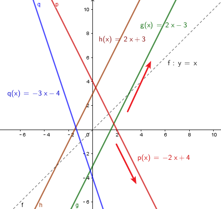
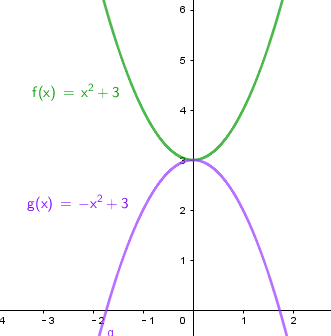
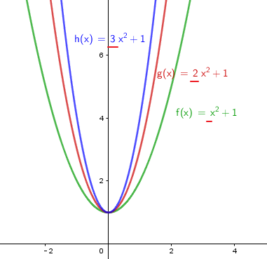
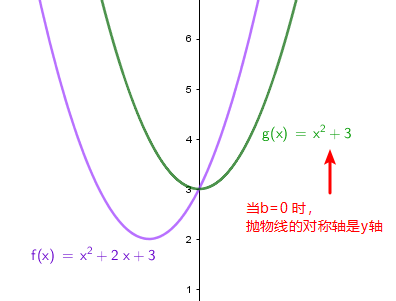
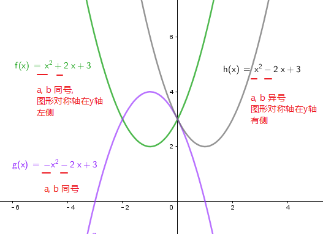
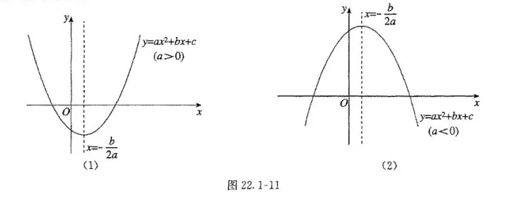

= 基础公式与参数
:toc:
---

== 一次函数_性质 -> f(x)=kx+b（k，b是常数，k≠0）

[options="autowidth" cols="1a,1a"]
|===
|Linear function 一次函数|  f(x)=kx+b（k，b是常数，k≠0）

|斜率 k
|
- k>0 时，直线过一、三象限. y随x的增大, 而增大
- k<0 时，直线过二、四象限. y随x的增大, 而减小

|图形与y轴的截距 b
|
- 当x=0时，b为函数在y轴上的交点
- b=0时，直线过原点O（0，0）. 是正比例函数的图象
|===

---

== 抛物线 -> stem:[y=a(x - horizontal)^2 + vertical ]

//tag::抛物线_性质[]

\begin{align}
\boxed{
 y=a(x - horizontal)^2 + vertical
}
\end{align}

- 当 a > 0 , 图像开口向上; a<0 时, 开口向下.
- *对称轴是 x = horizontal*
- *顶点是 (horizontal, vertical)*

//end::抛物线_性质[]

---

== 一元二次函数的"配方法"

//tag::一元二次_配方法[]

对一元二次函数, 做配方法:

\begin{align}
y = ax^2 + bx + c \\
= a(x^2 + \frac{b}{a} x) + c \\
= a[x^2 + \frac{b}{a} x + (\frac{b}{2a})^2] - a (\frac{b}{2a})^2 + c \\
上一步即加上"一次项系数"一半的平方 \\
=a (x + \frac{b}{2a})^2 - \frac{a b^2} {4a^2} + \frac{4ac}{4a} \\
=a (x + \frac{b}{2a})^2 + \frac{4ac - b^2} {4a}
\end{align}

所以,
\begin{align}
\boxed{
    y = ax^2 + bx + c \\
    =a (x + \frac{b}{2a})^2 + \frac{4ac - b^2} {4a}
}
\end{align}

//end::一元二次_配方法[]

---

== 一元二次函数_性质

//tag::一元二次_性质[]

[cols="1a,1a" options="autowidth"]
|===
|Quadratic function 一元二次函数|stem:[ y = ax^2 + bx + c ] （a≠0; a, b, c为常数)

|对称轴
|stem:[ x = -\frac{b}{2a} ]

|顶点
|stem:[ (-\frac{b}{2a},  \frac{4ac - b^2} {4a} ) ]

|抛物线的开口方向和大小
|二次项系数a, 决定抛物线的开口方向和大小。

- 当 a>0时，抛物线开口向上；此时函数图形有"最小值", 最小值处的坐标, 就是顶点坐标 stem:[ (-\frac{b}{2a},  \frac{4ac - b^2} {4a} ) ].
- 当 a<0时，抛物线开口向下；此时函数图形有"最大值", 最大值处的坐标, 就是顶点坐标.

- \|a\|越小，则抛物线的开口越大；
- \|a\|越大，则抛物线的开口越小

|对称轴在y轴上
|当 b=0 时，抛物线的对称轴是y轴

|对称轴的位置
|一次项系数b, 和二次项系数a, 共同决定"对称轴"的位置:

- 当a与b 同号时（即ab>0），对称轴在y轴"左侧"
- 当a与b 异号时（即ab<0），对称轴在y轴"右侧"
- （可巧记为：左同右异）

|抛物线与y轴交点
|常数项c, 决定抛物线与y轴交点。抛物线与y轴交于(0, c）

|抛物线与x轴交点的个数, 由stem:[ \Delta ]来判定
|stem:[ \Delta = b^2 - 4ac]

- 当 stem:[ \Delta>0 ]时，抛物线与x轴有 2个交点。
- 当 stem:[ \Delta =0 ]时，抛物线与x轴有 1个交点。
- 当 stem:[ \Delta<0 ]时，抛物线与x轴 没有交点。

|===

[options="autowidth" cols="1a,1a"]
|===
|Header 1 |Header 2

|一般式:  stem:[ y = ax^2 + bx + c ]
|Column 2, row 1

|顶点式: stem:[y=a(x-h)^2 +k ]
|此时顶点为（h, k)

- stem:[ h = -
frac{b}{2a}]
- stem:[ k =
frac{4ac - b^2}{4a}]

|交点式 : stem:[ y=a(x - x_1)(x- x_2)]
|函数图像与x轴, 相交于stem:[(x_1, 0) ] 和stem:[(x_2, 0) ]  两点。
|===

//end::一元二次_性质[]

---

== 一元二次_根

一元二次方程的根:

判别式 stem:[ \Delta] 能决定"根"是怎样的.

\begin{align}
\boxed{\Delta = b^2-4ac}
\end{align}

[options="autowidth"]
|===
|stem:[ \Delta = b^2-4ac ] |方程 stem:[ax^2+bx+c=0 \quad (a ≠ 0)] 根的情况

|stem:[ \Delta>0 ]
|有两个不等的实数根 : +
stem:[ x_1 = \frac{-b+\sqrt{b^2-4ac}}{2a}] +
stem:[ x_2= \frac{-b-\sqrt{b^2-4ac}}{2a} ]

|stem:[ \Delta=0 ]
|有两个相等的实数根 : +
stem:[ x_1= x_2 = -\frac{b}{2a} ]

|stem:[ \Delta<0 ]
|无实数根

|===

