= 基本概念_函数
:toc:
---

== 函数的表示方法

\begin{align}
F = \{(x,y) \mid y=f(x), x \in A \}
\end{align}

即:

- #F 是一个集合.# 它里面的元素, 满足"点(x,y)".
- 每一个点(x,y), 都满足函数关系 y=f(x)

== 函数的单调性 monotonicity -> 在某段x定义域区间上, y单调递增, 或y单调递减

也就是函数在定义域x的某段区间上, y是增函数还是减函数.

---

== 函数的平均变化率 : 斜率 stem:[ \frac{\Delta y} {\Delta x} ] -> 能决定函数图像是"增函数"还是"减函数"

斜率就是 : stem:[ \frac{\Delta y} {\Delta x} ], 即看 随着x的增长, y的变化程度(同方向, 反方向)

|===
|"函数递增"的充要条件是 |"函数递减"的充要条件是

|图像上任意两点连线的"斜率", 都 >0.

即: 任意一点的 stem:[ \frac{\Delta y} {\Delta x} >0]

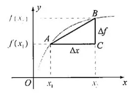

|图像上任意两点连线的"斜率", 都 <0.  即 随着 x值增加, y值反而下降(是负数)

即: 任意一点的 stem:[ \frac{\Delta y} {\Delta x} <0]

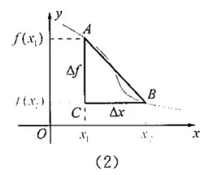
|===

一般地, 当 stem:[ x_1 \ne x_2 ]时, 称
\begin{align}
\boxed{
\frac{\Delta f} {\Delta x} = \frac{f(x_2) - f(x_1)} {x_2 - x_1}
}
\end{align}

就是函数 y=f(x) 在区间
\begin{align}
[x_1, x_2] (x_1 < x_2 时) 或 [x_2, x_1] (x_1 > x_2 时)
\end{align}
上的"平均变化率".

物理中的变化率

[cols="1a,3a"]
|===
|Header 1 |Header 2

|"速度"是用来衡量"物体运动快慢"的
|\begin{align}
速度 velocity = \frac{位移的变化量 \quad \Delta x } {发生这一变化所用的时间 \quad \Delta time }
\end{align}

|"加速度"是用来衡量"速度变化快慢"的
|\begin{align}
加速度 accelerated Velocity = \frac{速度的变化量 \quad \Delta Velocity } {发生这一变化所用的时间 \quad \Delta time }
\end{align}
|===

.标题
====
例如：求证: 函数 y=1/x 在区间 stem:[(-\infty, 0) 和 (0, +\infty)] 上, 都是减函数.

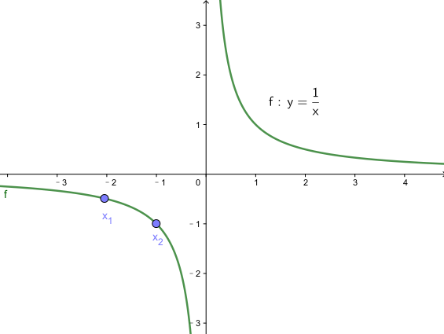

思考: 只要我们来看看这个函数的斜率, 是>0 还是<0, 就能知道它到底是增函数还是减函数了.

#我们来取两个点: x1, x2, 且stem:[ x_1 \ne x_2], 我们来看在这两个点x区间上的 函数图像的斜率#:
\begin{align}
\frac{\Delta y} {\Delta x} = \frac{\dfrac{1} {x_2} - \dfrac{1} {x_1}} {x_2 - x_1} = - \frac{1} {x_1 x_2}
\end{align}

在 stem:[x_1, x_2 \in (-\infty,0) ]定义域区间段上, stem:[ x_1 和 x_2] 都是负数, 所以 stem:[ x_1 * x_2 > 0], 所以stem:[\frac{\Delta y} {\Delta x} = - \frac{1} {x_1 x_2} <0 ], 所以函数在 stem:[ (-\infty, 0)] 上是减函数. +
同理, 函数在stem:[(0, +\infty)] 上也是减函数.
====

.标题
====
例如：判断一次函数 stem:[ y=kx+b (k \ne b) ]的单调性.

同样取两个点 stem:[ x_1 \ne x_2], 那么, 该函数的斜率就是:

\begin{align}
\frac{\Delta y} {\Delta x}
= \frac{kx_2+b - (kx_1+b)} {x_2 - x_1}
= k
\end{align}

因此, 一次函数的单调性, 取决于k 的正负号:

- 当 k>0 时, 一次函数在 R 上是增函数
- 当 k<0 时, 一次函数在 R 上是减函数

另外, 此时, 从 stem:[ \frac{\Delta y} {\Delta x}  = k ] 还可以看出: stem:[\Delta y = k \Delta x ],  +
这就意味着: 在一次函数中, stem:[ \Delta y] 与 stem:[ \Delta x] 成正比, 且比例系数为k.
特别的, 当自变量每增大一个单位时, 因变量会增大k个单位.
====

---

== 函数的奇偶性 -> ①偶函数: 关于y轴对称; ②奇函数:关于原点对称

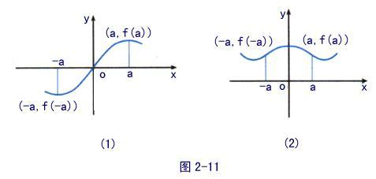

[cols="1a,1a"]
|===
|奇函数 odd function |偶函数 Even Function

|函数 y = f(x) 上, 我们来取x值相反的两个点: P(x, f(x)) 和 Q(-x, f(x)),  +
如果 P点的y值 和 Q点的y值, 正负号符号也相反, 那么该函数就是奇函数.  +

即, 比如P点是(2,5), Q点是(-2,-5).

|设 y = f(x)这个函数, 其定义域是 D.  +
如果对D内任意一个x, 都有 -x 也在定义域D内, 即stem:[-x \in D] , +
并且满足 stem:[f(-x) = f(x) ],

则称: y = f(x)这个函数, 是"偶函数".

即, 比如函数身上有两个点存在 : (3,4) 和(-3,4)

|奇函数图像的特点是:

- 图像关于"原点"对称
- 当n是正整数时, stem:[f(x)=x^{2n-1} ] 是奇函数.  +
即, x的指数是奇数时, 函数就是奇函数.

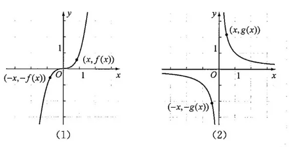

|偶函数图像的特点是:

- 图像关于"y轴"对称
- 当n是正整数时, stem:[f(x)=x^{2n} ] 是偶函数.  +
即, x的指数是偶数时, 函数就是偶函数.

image:img_math/math_64.png[]

|===

.标题
====
例如：判断 stem:[ f(x) = x + x^3 + x^5 ] 的奇偶性

思考: #要判断一个函数的奇偶性, 我们只需取它身上 x值相反的两个点, 看这两个点的y值, 正负号是同号, 还是异号?#

-  如果两个y 是同号, 即这两个点的坐标就是(x, y), (-x, y), -> 则该函数的图像就是关于y轴对称的, 那就是偶函数.
-  如果两个y 是异号, 即这两个点的坐标就是(x, y), (-x, -y), 则该函数的图像就是关于原点对称的, 那就是奇函数.

\begin{align}
& f(x) = x + x^3 + x^5 \\
& 现在我们来看它横坐标是-x 处的点, 其y值的正负符号是什么? \\
& 即把 -x 代进去, 来看y值: \\
& f(-x) = -x -x^3 - x^5 \\
& f(-x) = -(x + x^3 + x^5) = -f(x)
\end{align}

所以 -x处的点, 改点的y值, 和原来的函数的y值是"异号", 即这两个点的坐标分别是(x, y), (-x, -y) . 所以该函数就是关于"原点"对称, 是奇函数.

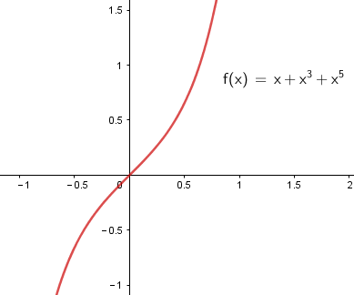
====

.标题
====
例如：判断 stem:[f(x) = x+ 1]的奇偶性

思考: 同样, 我们来看它身上任意一个x点的横坐标镜像点 -x, 看它们的y值 是否"同号"还是"异号"?

\begin{align}
f(-x) = -x +1
\end{align}
发现这个y值, 与原函数的y值即非"同号", 也非"负号"关系, 因为连抛开正负号后的y值本身都变了! 即 :
\begin{align}
f(-1) \ne f(1) \\
也 f(-1) \ne -f(1)
\end{align}

所以, 该函数  stem:[f(x) = x+ 1] 既不是奇函数, 也不是偶函数.

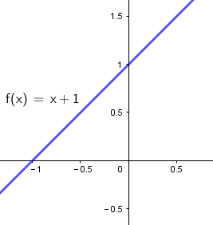
====

---

因为函数的奇偶性, 描述了函数图像具有的对称性, 所以, 利用函数的奇偶性, 就帮我们简化函数性质的研究.

即: 如果我们知道了一个函数是奇函数或偶函数, 那么其定义域, 就能分成关于"原点"对称的两部分, 我们只要得出其中一部分上的性质和图像后, 就能知道它另一部分的性质和图像.

.标题
====
例如：研究 stem:[ y = \frac{1} {x^2}] 的性质.

思考: 我们可以分先后几步走:

1. 判断它的定义域范围
2. 判断它是奇函数(图像关于原点对称), 还是偶函数(图像关于y轴对称)?
3. 如果它是偶函数, 那么它是开口向上(增函数), 还是开口向下(减函数)?
4. 如果它是减函数, 那么它是在哪个象限里的?

即

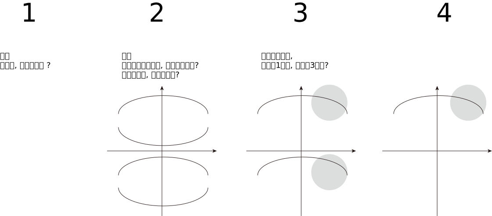

'''

第1步: 判断它的定义域范围

\begin{align}
y = \frac{1} {x^2} \\
x \ne 0
\end{align}

'''

第2步: 判断它的奇偶性 (决定着图像的对称形状)

\begin{align}
& f(x) = \frac{1} {x^2}  \\
& 代入 -x 进去, 看它的 y值情况: \\
& f(-x) = \frac{1} {(-x)^2}
= f(x)
\end{align}
即 : 两个点(x, y), (-x, y), x值符号相反, y值符号相同, 所以它是"偶函数", 图像关于y轴对称.

'''

第3步: 判断该偶函数的图像开口, 是向上, 还是向下? +
由于其对称性, 我们只需研究其定义域上的一半, 其图像是增函数还是减函数即可. 就来研究定义域区间在 stem:[ (0, +\infty) ]上的吧:

\begin{align}
& 当 x_1, x_2 \in (0, +\infty)时, 有 \\
& 斜率 \frac{\Delta x} {\Delta y} = \frac{\dfrac{1} {(x_2)^2} - \dfrac{1} {(x_1)^2}} {x_2 - x_1}
= - \frac{x_1 + x_2} {x_1^2 x_2^2} <0
\end{align}

斜率是负的, 所以
\begin{align}
y = \frac{1} {x^2} 在 (0, +\infty) 上是减函数
\end{align}

'''

第4步: 那么减函数, 它是在哪个象限上"减"的呢?  +
那就看函数上点的y值, 是>0 (点就在1,2象限), 还是<0 (点就在3,4象限).

\begin{align}
& 当 x \in (0, +\infty) 时, \\
& y = \frac{1} {x^2} > 0
\end{align}

所以, 图像在第1,2 象限上.

最终就是: 它是 1.偶函数, 2.在 stem:[(0, +\infty)] 上是减函数, 3.在第一象限上是减函数

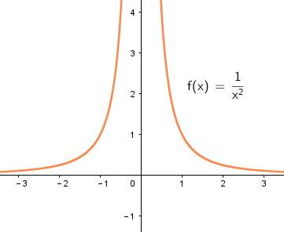

即 : 该函数:

- 定义域是 stem:[ {x \in R | x \ne 0} ]
- 该函数是偶函数, 在 stem:[(-\infty,0)]上是单调递增, 在 stem:[(0, +\infty)]上是单调递减
- 该函数的值域是 stem:[(0, +\infty)]

====

.标题
====
例如：求证: 二次函数 stem:[f(x) = x^2 + 4x+6 ]的图像, 关于 x = -2 对称

思考: 我们可以先来考虑图像关于 x=0 (即y轴) 对称的情况. 即, 它是一个偶函数. 会有 (x, y), (-x,y) 两个点存在. 即 x值异号, y值同号.

那么, 图像关于 stem:[x=-2] 对称, 即, -2 左右的两个对称的点, 它们的x坐标会是什么呢? 比如下图中, A, B 两点就是关于 -2 对称, 那么 B点的值是什么? 就是 -2-h 了

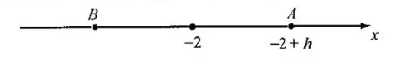

所以, 只要我们把 A点和B点的x坐标, 代入 stem:[f(x) = x^2 + 4x+6 ] 中, 只要得出它们的y值完全一样, 同号, 就能证明, 该函数是偶函数, 并且关于 x=-2 对称.

\begin{align}
& f(x) = x^2 + 4x+6 \\
\\
& 任取 h \in R \\
& 代入A点的x坐标 (-2+h)到函数中, 看其 y值: \\
& f(-2+h) = (-2+h)^2 + x(-2+h)+6
= h^2 + 2 \\
\\
& 代入B点的x坐标 (-2-h)到函数中, 看其 y值: \\
& f(-2-h) = (-2-h)^2 + x(-2-h)+6
= h^2 + 2
\end{align}

可以看出, 把两个对称点的x值, 代入进函数后, y值相等,且同号! 所以就证明了该函数, 的确是偶函数, 且关于 x=-2 对称.

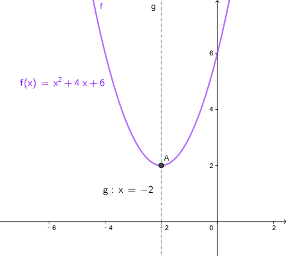

====

---

== f(x)= 0点的存在性, 及其"近似值"的求法

一元一次方程, 一元二次方程的实数解, 都有求根公式.

但是对于次数 大于或等于3 的多项式函数 (比如 stem:[ f(x) = ax^3 + bx^2 + cx + d], 其中 stem:[a \ne 0 ]), 以及其他表达式更复杂的函数来说, 判断零点是否存在, 以及求零点, 就都不是容易的事了.

#事实上, 数学家已经证明 : 次数大于4 的多项式方程, 不存在通用的求根公式.#

因此, 我们有必要探讨, 什么情况下一个函数一定存在零点.

.标题
====
如下图: 如果 A, B 都是函数 y=f(x) 图像上的点, 并且函数图像是连接A, B 两点的连续不断的线, +
则: 函数f(x) 在区间(a,b)中, 一定存在零点.  +

这是显而易见的. 函数曲线要经过A,B两点, 它一定是要穿越 x轴的, 只要穿越x轴, 交叉处就是 y=0 的点.

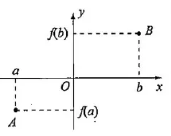
====

函数零点存在定理:: 如果函数 y=f(x) 在区间 [a,b] 上的图像是连续不断的, 并且 stem:[f(a)*f(b) <0] (即在区间两个端点处的y值, 异号, 即一个在x轴上方, 一个在x轴下方), 则函数 y=f(x) 在区间(a,b)中, 至少有一个零点(也就是该函数曲线会穿越x轴), 即 :
\begin{align}
\exists x_0 \in (a,b), f(x_0) = 0
\end{align}
即: 在定义域(a,b)区间上存在一个stem:[  x_0]点, 该点的y坐标值为 0.

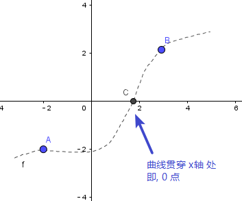

.标题
====
例如：求证 :函数 stem:[ y(x) = x^3 - 2x + 2 ] 至少有一个零点.

思考: 只要该函数在x轴的上下方, 都有一个点存在, 那它一定贯穿x轴, 即有y=0 处的 0点存在. +
所以我们只要找这两个点 (比如从该函数曲线的定义域区间的两个端点处来取): 一个点在x轴上方, 即它的y值>0; 另一个点在x轴下方, 即它的y值<0, 即可.

本例中, 我们就 来取 x=0, -2 处的两个点, 来看它们的y值:

\begin{align}
& f(x) =  x^3 - 2x + 2 \\
& f(0) = 2 >0 <- x坐标值为0处的点的y值
\end{align}

\begin{align}
& f(x) =  x^3 - 2x + 2 \\
& f(-2) = -8  + 4 + 2 <0 <- x坐标值为-2 处的点的y值
\end{align}

所以,  f(0) * f(-2) < 0 , 即证明该函数至少有一个0点.

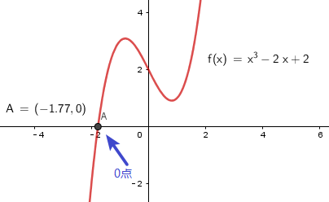

====

---

==== 求近似值的方法 -> 二分法

虽然知道有0点存在, 但要求 0点 stem:[  x_0]的精确值, 并不容易. 我们可以用不断缩小范围的二分法, 来求它的近似值:

即: 给定"近似的精度 stem:[ \epsilon ]",  用"二分法" 求零点stem:[ x_0 ]的 近似值 stem:[ x_1 ], 使得 stem:[ |x_1 - x_0| < \epsilon ] 的一般步骤, 如下:

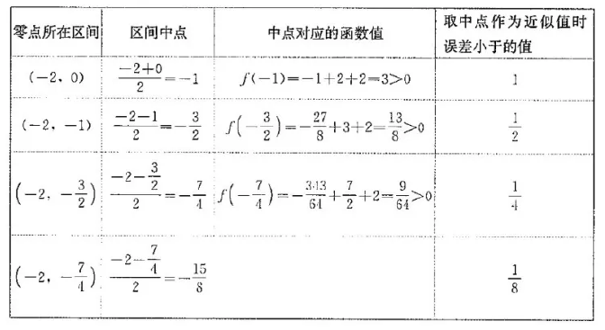

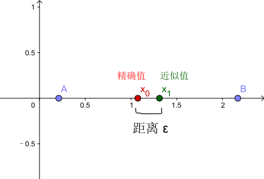

---

https://mp.weixin.qq.com/s/QQuUN0onX49OrN8idXWHjQ

115
