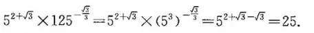
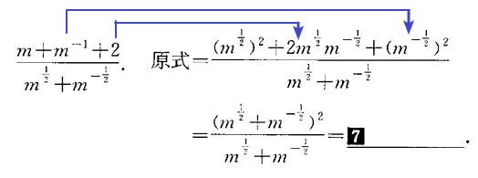
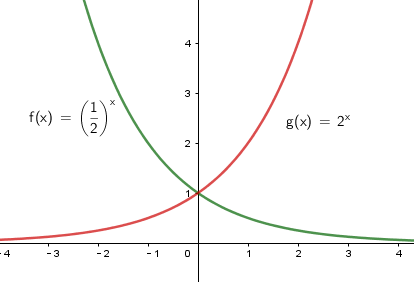
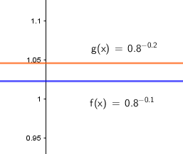
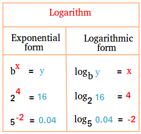

= 指数函数, 对数函数, 幂函数
:toc:
---

== 有理指数幂 运算法则

[options="autowidth" cols="1a,1a"]
|===
|运算法则 |Header 2

|整数指数幂
|
\begin{align}
\boxed{
a^m a^n = a^{m+n} \\
(a^m) ^n = a^{m n} \\
(ab)^m = a^m b^m
}
\end{align}

.标题
====
例如：

\begin{align}
& 8^{\frac{3} {5}} * 8^{\frac{2} {5}}
= 8^{\frac{3+2}{5}} = 8 \\
\\
& (a^{\frac{2}{3}} * b^{\frac{1}{4}} )^3
= a^{\frac{2}{3}*3} *  b^{\frac{1}{4}*3}
= a^2 * b^{\frac{3}{4}}
\end{align}
====

|二次根式
|
\begin{align}
\boxed{
(\sqrt{a})^2 = a \\
\sqrt{a} \sqrt{b} = \sqrt{ab} \\
\frac{\sqrt{a}} {\sqrt{b}}= \sqrt{\frac{a} {b}}
}
\end{align}

|根式
|
\begin{align}
\boxed{
(\sqrt[n]{a})^n = a \\
\sqrt[n]{a^n} =a <-  当 n 为奇数时 \\
\sqrt[n]{a^n} = \|a\| <- 当 n 为偶数时
}
\end{align}

.标题
====
例如：
\begin{align}
\sqrt[7]{(-2)^7} = -2
\end{align}
====

|分数指数幂
|如果n是正整数, 那么:

当
\begin{align}
\sqrt[n]{a}
\end{align} 有意义时, 则:

\begin{align}
\boxed{
a^{\frac{1}{n}} = \sqrt[n]{a} \\
a^{\frac{m} {n}} = (\sqrt[n]{a})^m = \sqrt[n]{a^m} \\
a^{-s} = \frac{1} {a^s}
}
\end{align}

.标题
====
例如：
\begin{align}
& 4^\frac{1} {2} = \sqrt{4} \\
\\
& (-27)^\frac{1} {3} = \sqrt[3]{-27} \\
\\
& 5^\frac{3} {4} = (5^3 )^\frac{1} {4} = (5^\frac{1} {4})^3 \\
\\
& 8^{\frac{2} {3}}
= (8^{\frac{1} {3}})^2
= (\sqrt[3]{8})^2
= 2^2 =4 \\
\\
& 3\sqrt{3} * \sqrt[3]{3}* \sqrt[6]{3}
= 3 * 3^{\frac{1} {2}} * 3^{\frac{1} {3}} * 3^{\frac{1} {6}}
= 3^{1+ \frac{1}{2} + \frac{1}{3} + \frac{1}{6} }
= 3^2 = 9
\end{align}
====

|===

---

== 实数指数幂

.标题
====
例如：
\begin{align}
\frac{\sqrt[3]{\sqrt{3^{10}}}} {\sqrt[3]{9}}
= [(3^{10} )^{\frac{1} {2}}]^{\frac{1}{3}} * (3^2 )^{-\frac{1}{3}}
= 3^{10 * \frac{1} {2} * \frac{1} {3} + 2*(-\frac{1} {3})}
= 3^1 =3
\\
\end{align}

image:img_math/math_83.webp[]

====

---

== 指数函数(stem:[y=a^x ])  -> stem:[y=2^{-x}  ] 与  stem:[ y=2^x] (指数是相反数) 的图像, 关于y轴对称

可以看出, 指数函数 stem:[ y=2^x] 与 stem:[ y=(\frac{1}{2})^x] 的图像, 关于y轴对称. +
而stem:[(\frac{1}{2})^x = 2^{-x}], 所以就是 stem:[y=2^{-x}  ] 与  stem:[ y=2^x] 的图像关于y轴对称. 即, #指数是相反数, 则它们的图像关于y轴对称.#

stem:[y=a^x ] 的图像一定过 点(0,1). 因为你把0代入x就知道: stem:[ a^0 = 1].

所以指数函数 stem:[y=a^x  (a>0 且 a \ne 1) ] 有以下性质:

[cols="1a,3a"]
|===
|Header 1 |Header 2

|定义域
|定义域是实数集R

|值域
|值域是 (stem:[ 0, +\infty]). 所以函数图像一定是在x轴上方. 即对于任何实数x, 都有 stem:[ a^x >0]

|过点(0,1)
|函数图像一定过 点(0,1)

|增减性
|- 当常数 a>1 时, stem:[ y= a^x ] 是增函数
- 当常数 0<a<1 时, stem:[ y= a^x ] 是减函数
|===

.标题
====
例如：判断 stem:[ 0.8^{-0.1}] 与 stem:[0.8^{-0.2} ] 的大小

思考: 因为常数 a=0.7 < 1 , 所以该指数函数是"减函数". +
因为 -0.1 > -0.2, 对于减函数来说, 就是 stem:[ 0.8^{-0.1} < 0.8^{-0.2}] 了.

====

.标题
====
例如：已知实数 a, b 满足 stem:[(\frac{3} {7})^a > (\frac{3}{7})^b ], 判断 stem:[ 6^a ] 与 stem:[ 6^b] 的大小.

思考:

- 常数 stem:[ \frac{3}{7} < 1], 所以该指数函数是"减函数", 即x值越大时, y值就越小. 所以指数 a < b. +
- 现在来判断 stem:[ 6^a ] 与 stem:[ 6^b] 的大小. 因为指数6 >1, 所以该指数函数是"增函数", 因为刚刚我们算出指数 a < b. 所以  stem:[ 6^a < 6^b ] 了.
====

---

== 对数函数 -> stem:[ 原指数x = log_{原常数a}原y值], 其实算出来的就是原"指数"!

如果 stem:[ a^x = y \quad (a>0, a \ne 1)],  那么 x 就叫做以a为底的 y的"对数"(logarithm ). 记作 :
\begin{align}
\boxed{
x = log_aY \\
即: 原指数x = log_{原常数a}原y值
}
\end{align}
其中:

- a : 叫做对数的"底数". 其实就是原"常数". +
常数又称"定数"，是指一个数值不变的"常量"，与之相反的是"变量"。
- y : 叫做"真数".  +
只有 Y>0 时, stem:[log_aY ] 才有意义. 即: #0和负数没有对数.# 即: stem:[ log_0Y 和 log_-nY ] 这种的不存在.
- x : 叫做以a为底的 y的"对数"(logarithm). #其实就是原"指数".#

因为 stem:[ x = log_aY ] 就是原指数, 所以我们可以把 x 代入回 原指数方程 stem:[ a^x = Y], 就会得到:
\begin{align}
a^x = Y \\
a^{log_aY } = Y
\end{align}

....
logarithm  对数
/ˈlɔːɡərɪðəm/
-> 来自logos,词，思考，比例，词源同logic,arithmos,数字，词源同arithmetic.
....

.标题
====
例如：
因为 stem:[ 2^6 = 64 ], 所以 stem:[ log_{2}64 = 6] <- #对数函数求出来的, 就是原"指数".#
====

.标题
====
例如：
\begin{align}
4^1 = 4 \\
log_4 4 = 1 <- 原指数是1
\end{align}

从上图最后一题, 可以看出:  +
#对数的意思就是: 5 要 变成 0.04, 则5自身要"自己乘以自己" 多少次?#
====

[cols="1a,3a"]
|===
|Header 1 |Header 2

|stem:[ log_a1 =0]
|1的对数为0.  +
即: a要变成1, a自己要乘以自己多少次? 0次. 即: stem:[ a^0 =1]

|stem:[ log_a a =1]
|底的对数为1.  +
即: a要变成a, a自己要乘以自己多少次? 不乘, 就原地保留自己1次就行了. 即: stem:[ a^1 =1]

|stem:[ a^{log_aY } = Y]
|\begin{align}
& 因为: a^x = Y, -> x = log_aY \\
& 所以: a^{log_aY } = Y
\end{align}

.标题
====
例如：
\begin{align}
& 2^{log_2 32} = 2^{原指数}= 32 \\
\\
& log_{10}10^3 => 10要变成10^3, 得10自己乘以自己多少次? = 3
\end{align}
====
|===

.标题
====
例如：
\begin{align}
& log_2 \frac{1}{2} \\
& 思考: 2要变成\frac{1}{2}, 则2自己要乘以自己多少次? 即: 2^x = \frac{1}{2} \\
& 显然, x=-1, \\
& 所以, log_2 \frac{1}{2} = -1
\end{align}
====

.标题
====
例如：
\begin{align}
& 5^{2 log_5 3} \\
& = 5^{2 (log_5 3)}
= (5^{log_5 3})^2 \\
& 思考: 对于 log_5 3, 即 5要变成 3, 则5自己要乘以自己多少次? 即 5^x = 3. \\
& 但这里的原指数x其实没必要求出来, 因为我们会发现: 本题的 5^{log_5 3} 的值就是Y, 要求的是Y, 而不是x.  \\
& 而 Y是多少? 它已经告诉我们了, 就是3了. \\
& 所以, (5^{log_5 3})^2 = 3^2 = 9
\end{align}
====

---

==== ① 常用对数 stem:[ log_{10}Y = lg Y], ② 自然对数 stem:[log_eY = ln N]

[cols="1a,3a"]
|===
|Header 1 |Header 2

|常用对数 stem:[ log_{10}Y]
|以10为底的对数, 就是"常用对数". +
底数10(即原"常数")可以省略不写, 就把 log 改写成 lg. 即: +
stem:[ \log_{10}Y ] 可简写成 stem:[lg Y ]

后续如果没有指出对数的底, 则默认指的就是"常用对数". 例如,"100(原Y)的对数是2(原x)", 就是指"100的常用对数是2".

|自然对数  stem:[log_eY ]
|以无理数 e = 2.71828... 为底的对数, 叫做"自然对数". e叫做"自然常数". +
自然对数 stem:[log_eY ] 通常简写为 stem:[ln N ]
|===

.标题
====
例如：
\begin{align}
\lg 10 \\
& 即原指数函数是 : 10^x  = 10 \\
& x = 1 \\
\\
\lg 0.01 \\
& 即原指数函数是 : 10^x = \frac{1}{10^2} \\
& x= -2 \\
\\
\ln e^5 \\
& 即原指数函数是 :  e^x = e^5 \\
& x=5
\end{align}
====

.标题
====
例如：已知 stem:[ \log_4a = \log_{25}b = \sqrt{3}] , 求 stem:[ \lg(ab)]的值.

因为
\begin{align}
& \log_4a =\sqrt{3} <- 原指数是\sqrt{3} \\
& 即: 4^{\sqrt{3}} = a \\
\\
& \log_{25}b =\sqrt{3} <- 原指数是\sqrt{3} \\
& 即: 25^{\sqrt{3}} = b \\
\\
& ab = 4^{\sqrt{3}}  25^{\sqrt{3}} \\
& = (4*25)^{\sqrt{3}}  = 10^{2 \sqrt{3}} \\
\\
& 所以 \lg(ab) = \lg 10^{2 \sqrt{3}} \\
& 即,原指数方程是 : 10^x = 10^{2 \sqrt{3}} \\
& x= 2 \sqrt{3}
\end{align}

====

.标题
====
例如：历史地震的计算公式为:
\begin{align}
里氏震级 M= \lg \frac{被测地震的最大振幅 A}{标准地震的振幅 A_0}
\end{align}

所以, 7.8级地震就是:
\begin{align}
原指数 7.8 = \lg \frac{A_{7.8}}{A_0} \\
即 10^{7.8} = \frac{A_{7.8}}{A_0} \\
A_{7.8} = 10^{7.8} A_0
\end{align}

8.0级地震就是:
\begin{align}
原指数 8.0 = \lg \frac{A_{8.0}}{A_0} \\
即 10^{8.0} = \frac{A_{8.0}}{A_0} \\
A_{8.0} = 10^{8.0} A_0
\end{align}

所以, 8级比上7.8级地震, 威力相差倍数就是:
\begin{align}
\frac{A_{8.0}}{A_{7.8}}
= \frac{10^{8.0} A_0}{10^{7.8} A_0}
= \frac{10^{8.0}} {10^{7.8}}
\approx 1.58
\end{align}
====

---

==== 对数的运算法则

\begin{align}
& 一般地, 设 : \\
& a^{x_1} = Y_1 > 0, & ① \\
& a^{x_2} = Y_2 > 0, \\
& 则: \\
& \log_a Y_1 = x_1, & ② \\
& \log_a Y_2 = x_2 \\
\\
& a^{x_1 + x_2} = a^{x_1} a^{x_2}  = Y_1 Y_2 <- 把 ①继续算下去\\
& 即头尾就是:  a^{x_1 + x_2} = Y_1 Y_2 \\
& log_a (Y_1 Y_2) = x_1 + x_2 <- 原指数 \\
& 把②代入进来, 即得: \\
& log_a (Y_1 Y_2) = log_a Y_1 + log_a Y_2
\end{align}

即:
\begin{align}
\boxed{
log_a Y_1 + log_a Y_2  = log_a (Y_1 Y_2)  = x_1 + x_2 <- 即两个原指数相加
}
\end{align}

.标题
====
例如：
\begin{align}
log_6 3 + log_6 2 = log_6 (3*2) = 1
\end{align}
====

可以继续推导出有:

\begin{align}
\boxed{
log_a (Y_1 * Y_2 * ... * Y_k) = log_a Y_1 +  log_a Y_2 + ... + log_a Y_k
}
\end{align}

特别的, 当"正因数"全部相等时, 可得:
\begin{align}
\boxed{
log_a Y^k = k * log_aY \quad (k 是正整数)
}
\end{align}

.标题
====
例如：
\begin{align}
lg 0.001
= lg 10^{-3}
= -3* lg 10
\end{align}
====

进一步, 由上面两个结论可知:

\begin{align}
log_a{\frac{M}{N}} = log_a (MN^{-1}) = log_aM + log_a N^{-1}
=  log_aM - log_a N
\end{align}

即:
\begin{align}
\boxed{
log_a{\frac{M}{N}}  =   log_aM - log_a N \quad (其中 a>0 且 a \ne 1, M>0, N>0, a \in R)
}
\end{align}

---

https://mp.weixin.qq.com/s/sfK-dws_jgjdiFON2ILP6A

17
