= 三角函数
:toc:
---

== 毕达哥拉斯定理 -> stem:[ a^2 + b^2 = c^2 ]

勾股定理:: 直角三角形, 斜边长为c, 两条直角边为a, b, 则: +
stem:[ a^2 + b^2 = c^2 ]

.标题
====
例如： 电梯门, 高2m, 宽1m. 现在你家装修, 要运一块木材进去, 木材长3m, 宽2.2m, 能运进电梯么?

木材的最短边长(宽2.2m), 也超过了电梯的最长边长(高2m),只能来算算电梯门的对角线距离了.

\begin{align}
2^2 + 1^2 = c^2 \\
c = \pm\sqrt{5} \\
取 \sqrt{5} \approx 2.24
\end{align}

电梯门斜边大于木材的宽度2.2m, 可以进.
====

---

== 费马大定理 Fermat's Last Theorem -> stem:[ x^n + y^n = z^n]（n >2时，没有正整数解）

毕达哥拉斯定理 stem:[  x^2 + y^2 = z^2 ], 每一组勾股数 (即 x, y, z), 都是这个方程的正整数解.

那么高于二次的方程 stem:[x^3 + y^3 = z^3 ], stem:[x^4 + y^4 = z^4 ], stem:[x^5 + y^5 = z^5 ], ..., 是否也有正整数解呢? 这个问题就是费马大猜想.

最终证明 : 当整数 n >2时，关于x, y, z的方程 stem:[x^n + y^n = z^n] 没有正整数解。

---

== 弧长 -> stem:[  1° arcL = \frac{2 \pi R} {360°} = \frac{ \pi R} {180°} ]

#把"圆周"除以360份, 就是每 1 圆心角度对应的"弧长".#

弧长:: 半径为 R 的圆中, 360°的圆心角所对的弧长, 就是圆周长 C (circumference) = 2πR. (半径 radius)

所以, 1°的圆心角所对的弧长 (即圆心角1° 所对应的圆的周长上的片段)就是 :
\begin{align}
\boxed{
    1° arcLength = \frac{2 \pi R} {360°} = \frac{ \pi R} {180°}
}
\end{align}

所以, n°的圆心角所对的弧长 (arc length), 就是 :
\begin{align}
\boxed{
    n° arcLength = \frac{n \pi R} {180°}
}
\end{align}

image:img_math/math_44.jpg[]

.标题
====
例如： 你要制作一个框架, 规格如下图, 那么它转角处的弧长是多少呢?

image:img_math/math_45.png[]

已知 r = 900mm,  则 100°角, 对应的弧长就是:

\begin{align}
100° arcLength = 100 * \frac{\pi r} {180} \\
=10 * \frac{900 \pi}{18} \\
=500 \pi = 2970 mm
\end{align}

====

---

== 三角函数 (sin, cos, tan, cot, sec, csc)

image:img_math/math_42.jpg[200,200]

[options="autowidth" cols="1a,1a"]
|===
|Header 1 |Header 2

|\begin{align}
sin A = \frac{\angle A 的对边} {斜边}= \frac{a}{c}
\end{align}
|

|\begin{align}
cos A = \frac{\angle A 的邻边} {斜边}= \frac{b}{c}
\end{align}
|

|\begin{align}
tan A = \frac{\angle A 的对边} {\angle A 的邻边}= \frac{a}{b}
\end{align}
|
|===

.标题
====
例如：如图, 你的飞船F在距离地球表面343 km 的轨道上飞行. 此时, 你的正下方地表(P点), 与你能看到的地球表面最远点(Q点)之间, 即 PQ弧长是多少?

image:img_math/math_42.png[]

地球半径 = 6400 km

分析: 要计算 PQ弧长, 需要首先知道 stem:[ \angle \alpha ] 的角度. 才能使用"弧长公式"来算出弧长 PQ.

stem:[ \angle \alpha ] 的角度怎么算? 用三角函数公式.

第一步: 算出 stem:[ \angle \alpha ] 的角度
\begin{align}
\cos \alpha = \frac{OQ}{OF} = \frac{6400}{343+6400} \approx 0.9491 \\
使用"反三角函数计算器", 来求出角度. \\
\alpha \approx 18.36°
\end{align}

第二步: 求出 PQ弧长
\begin{align}
18.36° arcLength = \frac{18.36° * \pi r } {180°}
= \frac{18.36° * \pi 6400 km } {180°}
\approx 2051 km
\end{align}

即:

-

#三角函数 -> 能知道直接三角形"各边长"的比例关系#
- #弧长 -> 能知道"圆心角度 & 半径"和"弧长"之间的关系#

====

.标题
====
例如：
你的无人机, 飞过某建筑奇观, 在距离建筑为水平距离120m时, 看到建筑顶部的角度, 为仰角30° ; 看到底部的角度, 为俯角60°. 那么这个建筑整体有多高? (即求BC的长)

image:img_math/math_46.png[]

BC = BD + DC

所以先用三角函数公式, 求BD :

\begin{align}
\tan \alpha = \frac{BD} {AD} \\
\tan 30° = \frac{BD} {120} \\
BD = \frac{\sqrt{3}} {3} * 120
= 40 \sqrt{3}
\end{align}

求DC :

\begin{align}
\tan \beta = \frac{DC} {AD}
= \frac{DC} {120} \\
tan 60° = \frac{DC} {120} \\
DC = \sqrt{3} * 120
\end{align}

所以

\begin{align}
BC = BD + DC =  40 \sqrt{3} + \sqrt{3} * 120  \\
= 160 \sqrt{3} = 277.13 m
\end{align}
====

---

== 角度 -> "逆时针转"为正的角度, "顺时针转"为负数角度

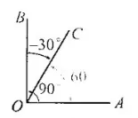

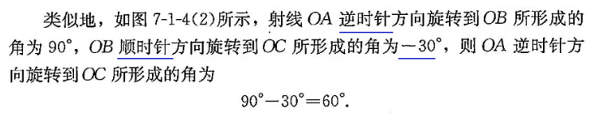

角 stem:[ \alpha + k * 360° (k \in Z)], 与 角α 的终边相同. k * 360° 的意思就是旋转了若干周. +
即: 任意两个终边相同的角, 它们的差一定是 360° 的整数倍. +
因此, 所有与 stem:[ \alpha] 终边相同的角 组成一个集合, 这个集合可以记为:
\begin{align}
S = \{\beta \mid \beta = \alpha + k * 360°, k \in Z\}
\end{align}

---

== 弧度制

弧度制是一种角度的度量制度. 角度制不够吗? 为什么还要弄个弧度制？ 因为它能够让很多公式变得简单。

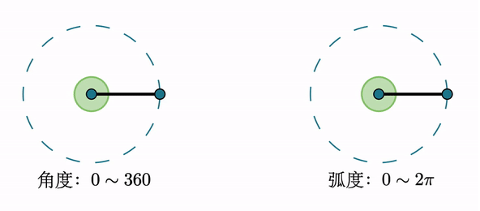

[cols="1a,4a"]
|===
|Header 1 |Header 2

|角度
|角度是这么度量的：当没有旋转时，角的大小记作 0°  ，当旋转了1/4 时，记作 90° ，旋转一周记作 360°.  +
<- 这种计量方法是古巴比伦人发明的.

|弧度
|弧度是这么度量的：当没有旋转时，角的大小记作 0  ，旋转了 1/4 时，记作stem:[  \frac{1}{2} \pi] ，旋转一周记作 stem:[ 2 \pi ]. 所以1° 对应 stem:[  \frac{2 \pi}{360}] rad. +
<- 这种计量方法包含了圆周率 stem:[ \pi ] ，这是圆的本质特征，所以它会是更好的计量方法。

|===

[cols="1a,4a"]
|===
|Header 1 |Header 2

|1弧度
|1弧度:: 如果 AB弧, 长度等于半径r, 则该弧所对应的圆心角, 就是 1弧度, 记为: 1 rad.  +
弧度用 rad 表示.

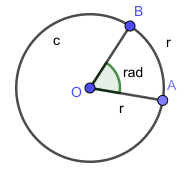

\begin{align}
\end{align}

\begin{align}
即: 若 \widehat{AB} 的长 = 半径 r, 则\widehat{AB} 所对的圆心角, 就是"1弧度"的角.
\end{align}

|弧度制
|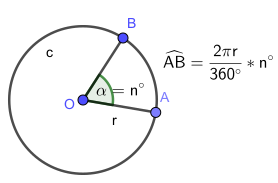

设 圆心角 stem:[ \alpha = n°] , 半径 OA = r, 则:
\begin{align}
弧长 \widehat{AB} = \frac{2\pi r}{360°} * n° \\
即: \frac{\widehat{AB}}{r} = n° * \frac{\pi}{180°}
\end{align}

这表明: "弧长"比"半径"的值, 只与"圆心角"的角度数有关.

弧度制 radian measure :: 指用"弧长"与"半径"之比, 来度量对应"圆心角"角度的方式。 #当圆弧的长 = r 时, 该圆弧所对的圆心角, 叫做"1弧度"的角。#

|===

[options="autowidth"]
|===
|弧长 |该弧长对应的圆心角的度数(弧度数)

|r
|1 rad

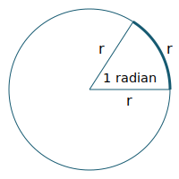

|两种计量角度的对应关系:  +
"角度" 对应 "弧度"
|\begin{align}
& \because r = 1 rad <- 弧长r 对应 1弧度 \\
& \therefore   2 \pi r(=360°) = 2 \pi (rad) <- 圆周长  对应360度, 对应   2 \pi 弧度 \\
& 1° = \frac{ 2 \pi }{360°} rad = \frac{\pi}{180°} rad <- 1°的弧长对应的\\
& 30° = \frac{\pi * 30°}{180°} rad  = \frac{\pi}{6} \\
& 45°  = \frac{\pi * 45°}{180°} rad  = \frac{\pi}{4} \\
& 60°  = \frac{\pi *60°}{180°} rad  = \frac{\pi}{3} \\
& 90°  = \frac{\pi *90°}{180°} rad  = \frac{\pi}{2} \\
& 180°  = \frac{\pi *180°}{180°} rad  = \pi \\
\end{align}

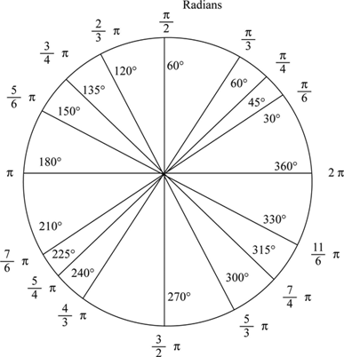

因为 stem:[ 60° = \frac{\pi}{3} rad \approx 1.05 rad > 1 rad ],  +
所以 stem:[  1 rad < 60°] <- 1弧度的角, 小于传统计数的60°.

|===

以后, rad 可以省略不写, 如:

[options="autowidth"]
|===
|Header 1 |表示的意思

|stem:[  \alpha = 2  ]
|stem:[ \alpha ] 是一个 2 rad 的角

|stem:[ \sin \frac{\pi}{3} ]
|弧度是 stem:[\frac{\pi}{3}], 这个角的正弦
|===

"弧度"与"角度"之间的换算 :

根据公式 :
\begin{align}
\boxed{
360° = 2 \pi (rad) <- 角度与弧度的换算关系\\
1° = \frac{2 \pi (rad)}{360°} <- 1角度,对应 ?弧度\\
或: \pi (rad ) =  \frac{360°}{2} <- \pi 弧度,对应?角度 \\
即: 1 (rad) =  \frac{360°}{2 \pi} \approx 57.3°
}
\end{align}

.标题
====
例如：stem:[  \frac{8 \pi}{5}] 弧度, 对应多少角度?

思考:
\begin{align}
& \because  \pi (rad ) =  \frac{360°}{2} \\
& \therefore \frac{8 \pi}{5} (rad)
= \frac{8}{5} *\frac{360°}{2}
= 288°
\end{align}
====

---

== ----- -----

---

== 三角函数

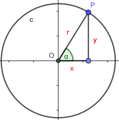
\begin{align}
\boxed{
正弦 \sin \alpha = \frac{y}{r}, \quad
余弦 \cos \alpha = \frac{x}{r}, \quad \\
正切 \tan \alpha = \frac{y}{x}, \quad <- "远边" 比 "近边"  \\
余切 \cot \alpha = \frac{x}{y}, <- 是 tan 的倒数, 即: cot \alpha = \frac{1}{\tan \alpha} \\
正割 \sec \alpha = \frac{r}{x}, <- 是 cos 的倒数, 即: sec \alpha = \frac{1}{\cos \alpha} \\
余割 \csc \alpha = \frac{r}{y}, <- 是 sin 的倒数, 即: csc \alpha = \frac{1}{\sin \alpha}
}
\end{align}

#可以看出: 三角函数的本质, 其实就是两条边的比值而已, 至于是哪两条变来比, 可以是任意两条!#

另外,
\begin{align}
由于
\tan^2 \alpha + 1 = \frac{\sin^2 \alpha}{\cos^2 \alpha} +1 \\
= \frac{\sin^2 \alpha + \cos^2 \alpha}{\cos^2 \alpha} \\
= \frac{1}{\cos^2 \alpha} = \sec^2 \alpha \\
因此 :
\boxed{
\tan^2 \alpha + 1 = \sec^2 \alpha
}
\end{align}

类似的, 还能得到:
\begin{align}
\boxed{
\cot^2 \alpha + 1 = \csc^2 \alpha
}
\end{align}

其实, 这些公式, 还包括其他的, 都可以从 "三角函数六边形记忆法" 来轻松记住.

钝角的 sin, 就等于它的补角的 sin, 即 : stem:[  \sin \alpha=sin(180－\alpha)]

---

==== sin , cos, tan 的正负号
从 stem:[ \sin \alpha = \frac{y}{r}  ] 可以看出 : 半径r 永远是 >0 的, 所以 stem:[ sin \alpha ] 的正负号, 就只取决于 y 的正负号.  即:

- 当角 stem:[ \alpha ] 的终边(即y) 在 第 1,2 象限时, y值为正, 所以 stem:[ sin \alpha > 0 ]
- 当 y 在 第 3,4 象限时, 为负值, 此时就 stem:[ sin \alpha < 0 ]

下图中, 阴影为负

image:img_math/math_112.png[]

.标题
====
例如：
\begin{align}
& \tan \frac{10 \pi}{3} 的正负号为何? \\
& 由 \frac{10 \pi}{3} = 2 \pi + \frac{4 \pi}{3}, 可知它是 第3象限 的角. \\
& 所以 \tan \frac{10 \pi}{3} > 0
\end{align}
====

---

==== 单位圆 与 三角函数

如果圆的半径r = 1, 则: 根据三角函数, 它构成的直角三角形的另两条边, 就会分别是 sin 和 cos.

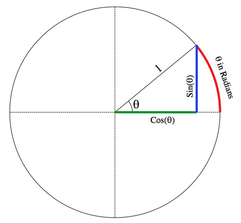

那么根据勾股定理 :
\begin{align}
& \sin^2 \alpha + \cos^2 \alpha = 1 \\
& \tan \alpha = \frac{sin \alpha }{cos \alpha}
\end{align}

.标题
====
例如： 已知 stem:[ sin \alpha = 4/5], 且 stem:[ \alpha] 是 第二象限角, 求角 stem:[ \alpha] 的 cos 和 tan.

思考:
\begin{align}
& 根据公式   \sin^2 \alpha + \cos^2 \alpha = 1  \\
& 代入即 :  (4/5)^2 +  \cos^2 \alpha = 1 \\
& \cos^2 \alpha = 1- \frac{16}{25}
= \frac{9}{25} \\
& \cos \alpha = \pm \frac{3}{5} \\
& 因为 已知  \alpha 是 第二象限角, 所以 \cos \alpha = -\frac{3}{5} \\
& \\
& \tan \alpha = \frac{\sin \alpha}{\cos \alpha}
= \frac{\frac{4}{5}}{-\frac{3}{5}}
= - \frac{4}{3}
\end{align}
====

.标题
====
例如： 已知 stem:[ \tan \alpha = - \sqrt{5}], 且 stem:[ \alpha] 是 第二象限角, 求 角 stem:[ \alpha] 的 sin 和 cos.

思考: 可以用方程组来做:
\begin{cases}
\sin^2 \alpha + \cos^2 \alpha = 1  \\
\dfrac{\sin \alpha}{\cos \alpha} =  - \sqrt{5}
\end{cases}

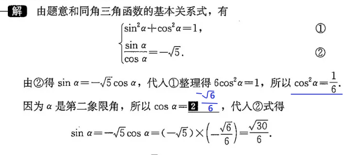
====

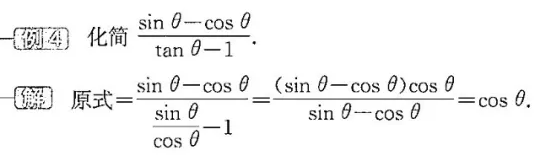

.标题
====
例如： 求证 stem:[\sin^4 \alpha -\cos^4 \alpha = 2 \sin^2 \alpha -1 ]

思考:
\begin{align}
& \sin^4 \alpha -\cos^4 \\
& = (\sin^2 \alpha +\cos^2 \alpha)(\sin^2 \alpha -\cos^2 \alpha ) \\
& = 1 * (\sin^2 \alpha -\cos^2 \alpha ) \\
& = \sin^2 \alpha -(1- \sin^2 \alpha ) \\
& = 2 \sin^2 \alpha -1
\end{align}
====

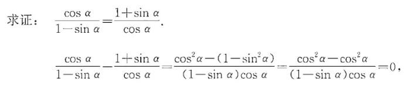

从上面可以看出: 证明一个三角恒等式, 可以有几种方法:

1. 从它的任意一边开始, 推导出它等于另一边 (即, 从等号的左边证明出右边, 或从右边证明出左边)
1. 用作差法, 证明等式两边之差等于0.

---

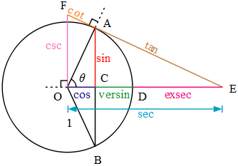

如上图, 半径 = 1, 则:
[options="autowidth"]
|===
|Header 1 | 半径 r = OA = OB = 1

|stem:[ \sin \alpha]
|\begin{align}
\frac{AC}{AO} = \frac{AC}{1} = AC
\end{align}

|stem:[ \cos \alpha]
|\begin{align}
\frac{OC}{OA} = \frac{OC}{1} = OC
\end{align}

|stem:[ \tan \alpha]
|\begin{align}
\frac{AE}{AO} = \frac{AE}{1} = AE
\end{align}

|stem:[ \cot \alpha]
|\begin{align}
\frac{AO}{AE} = \frac{FA}{AO} = \frac{FA}{1} = FA
\end{align}

|stem:[ \sec \alpha]
|Column 2, row 5

|stem:[ \csc \alpha]
|Column 2, row 6
|===

---

== Mnemonics in trigonometry 六边形记忆法 -> 上弦/中切/下割，左正/右余/1中间

image:img_math/math_117.jpg[]

人们借助 "六边形记忆法" Mnemonics in trigonometry (#图形结构为 :“上弦/中切/下割，左正/右余/1中间”#),  来记忆三角函数的基本关系: 图中:

[cols="2a,1a"]
|===
|规律 |Header 2

|规律1: 六边形对角线, 互为倒数（倒数关系）. 即: 对角线上, 两个函数的积为 1.

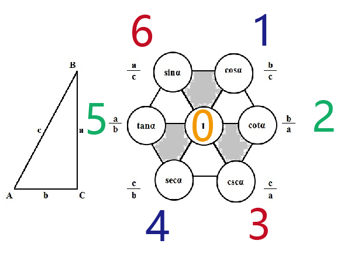

即:  +
1 - 4 是倒数关系 +
2 - 5 是倒数关系 +
3 - 6 是倒数关系

|即:
\begin{align}
\sin x = \frac{1}{\csc x } \\
\cos x = \frac{1}{\sec x} \\
\tan x = \frac{1}{\cot x}
\end{align}

|规律2: 三角形最高两端的平方之和, 等于低端平方（平方关系）

即上图中就是:
\begin{align*}
⑥^2 + ①^2 = 0^2 \\
⑤^2 + 0^2 = ④^2 \\
0^2 + ②^2 = ③^2
\end{align*}

|即:
\begin{align}
\sin^2 \alpha + \cos^2 \alpha = 1 \\
\tan^2 \alpha + 1^2 = \sec^2 \alpha \\
1^2 + \cot^2 \alpha = \csc^2 \alpha
\end{align}

|规律3: 任意一点的值, 等于这一点顺时针的第一个值 与第二个值的比值.

即上图中就是:
\begin{align}
⑥ = \frac{①}{②} \\
① = \frac{②}{③}
\end{align}

|即:
\begin{align}
\sin x = \frac{cos x}{cot x} , \quad
\cos x = \frac{cot x}{csc x} \\
\tan x = \frac{sin x}{cos x}, \quad
\cot x = \frac{csc x}{sec x} \\
\sec x = \frac{tan x}{sin x}, \quad
\csc x = \frac{sec x}{tan x}
\end{align}

|规律4: 任意一点的值, 等于紧挨着这一点的外围两个端点的值的积.

即上图中就是:
\begin{align}
① = ⑥ * ② \\
② = ① * ③
\end{align}

|即:
\begin{align}
\sin x = \cos x * \tan x, \quad
\cos x = \sin x * \cot x \\
\tan x = \sin x * \sec x, \quad
\cot x = \cos x * \csc x \\
\sec x = \csc x * \tan x, \quad
\csc x = \cot x * \sec x
\end{align}
|===

---

== 诱导公式

[options="autowidth"]
|===
|Header 1 |Header 2

|\begin{align}
sin(-x) = - sin( x)
\end{align}

|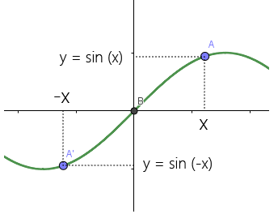

sin x 是 奇函数. 从上图可以看出, sin(x) 和 sin(-x) 对应的y值, 是相反数, 正负符号相反. 所以:
\begin{align}
\boxed{
sin(x) = - sin(- x)
}
\end{align}

其实也可以从下图上能看出来:

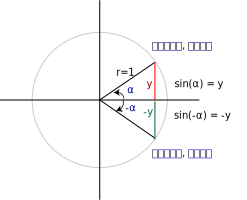

即: stem:[ sin \alpha] 的y值, 和 stem:[  sin(- \alpha) ] 的y值, 是相反数.

|\begin{align}
cos (- \alpha) = cos (\alpha)
\end{align}

|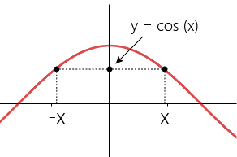

cos x 是 偶函数, 从图上可以看出 x值是相反数的两个点, 它们的y值是一样的 :
\begin{align}
\boxed{
cos (x) = cos (-x)
}
\end{align}

|\begin{align}
tan(- \alpha) = - tan (\alpha)
\end{align}

|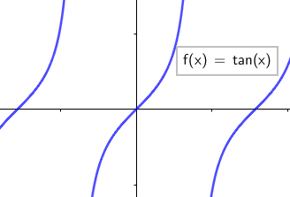

tan x 是 奇函数, 所以, x值是相反数的两个点, 它们的y值也是相反数 :

\begin{align}
\boxed{
tan (x) = - tan (-x)
}
\end{align}

|===

---

29

---

