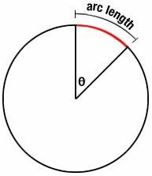
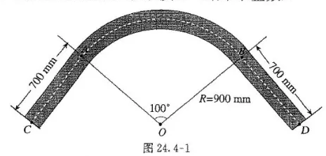
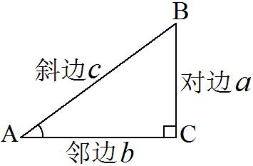
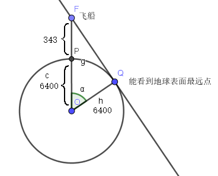
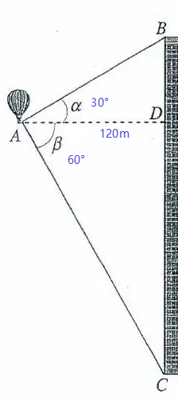

= 三角函数
:toc:
---

== 毕达哥拉斯定理 -> stem:[ a^2 + b^2 = c^2 ]

勾股定理:: 直角三角形, 斜边长为c, 两条直角边为a, b, 则: +
stem:[ a^2 + b^2 = c^2 ]

.标题
====
例如： 电梯门, 高2m, 宽1m. 现在你家装修, 要运一块木材进去, 木材长3m, 宽2.2m, 能运进电梯么?

木材的最短边长(宽2.2m), 也超过了电梯的最长边长(高2m),只能来算算电梯门的对角线距离了.

\begin{align}
2^2 + 1^2 = c^2 \\
c = \pm\sqrt{5} \\
取 \sqrt{5} \approx 2.24
\end{align}

电梯门斜边大于木材的宽度2.2m, 可以进.
====

---

== 费马大定理 Fermat's Last Theorem -> stem:[ x^n + y^n = z^n]（n >2时，没有正整数解）

毕达哥拉斯定理 stem:[  x^2 + y^2 = z^2 ], 每一组勾股数 (即 x, y, z), 都是这个方程的正整数解.

那么高于二次的方程 stem:[x^3 + y^3 = z^3 ], stem:[x^4 + y^4 = z^4 ], stem:[x^5 + y^5 = z^5 ], ..., 是否也有正整数解呢? 这个问题就是费马大猜想.

最终证明 : 当整数 n >2时，关于x, y, z的方程 stem:[x^n + y^n = z^n] 没有正整数解。

---

== 弧长 -> stem:[  1° arcL = \frac{2 \pi R} {360°} = \frac{ \pi R} {180°} ]

把"圆周"除以360份, 就是每 1 圆心角度对应的"弧长".

弧长:: 半径为 R 的圆中, 360°的圆心角所对的弧长, 就是圆周长 C (circumference) = 2πR. (半径 radius)

所以, 1°的圆心角所对的弧长 (即圆心角1° 所对应的圆的周长上的片段)就是 :
\begin{align}
\boxed{
    1° arcLength = \frac{2 \pi R} {360°} = \frac{ \pi R} {180°}
}
\end{align}

所以, n°的圆心角所对的弧长 (arc length), 就是 :
\begin{align}
\boxed{
    n° arcLength = \frac{n \pi R} {180°}
}
\end{align}

.标题
====
例如： 你要制作一个框架, 规格如下图, 那么它转角处的弧长是多少呢?

已知 r = 900mm,  则 100°角, 对应的弧长就是:

\begin{align}
100° arcLength = 100 * \frac{\pi r} {180} \\
=10 * \frac{900 \pi}{18} \\
=500 \pi = 2970 mm
\end{align}

====

---

== 三角函数 (sin, cos, tan, cot, sec, csc)

[options="autowidth" cols="1a,1a"]
|===
|Header 1 |Header 2

|\begin{align}
sin A = \frac{\angle A 的对边} {斜边}= \frac{a}{c}
\end{align}
|

|\begin{align}
cos A = \frac{\angle A 的邻边} {斜边}= \frac{b}{c}
\end{align}
|

|\begin{align}
tan A = \frac{\angle A 的对边} {\angle A 的邻边}= \frac{a}{b}
\end{align}
|
|===

.标题
====
例如：如图, 你的飞船F在距离地球表面343 km 的轨道上飞行. 此时, 你的正下方地表(P点), 与你能看到的地球表面最远点(Q点)之间, 即 PQ弧长是多少?

地球半径 = 6400 km

分析: 要计算 PQ弧长, 需要首先知道 stem:[ \angle \alpha ] 的角度. 才能使用"弧长公式"来算出弧长 PQ.

stem:[ \angle \alpha ] 的角度怎么算? 用三角函数公式.

第一步: 算出 stem:[ \angle \alpha ] 的角度
\begin{align}
\cos \alpha = \frac{OQ}{OF} = \frac{6400}{343+6400} \approx 0.9491 \\
使用"反三角函数计算器", 来求出角度. \\
\alpha \approx 18.36°
\end{align}

第二步: 求出 PQ弧长
\begin{align}
18.36° arcLength = \frac{18.36° * \pi r } {180°}
= \frac{18.36° * \pi 6400 km } {180°}
\approx 2051 km
\end{align}

即:

- *三角函数 -> 能知道直接三角形"各边长"的比例关系*
- *弧长 -> 能知道"圆心角度 & 半径"和"弧长"之间的关系*

====

.标题
====
例如：
你的无人机, 飞过某建筑奇观, 在距离建筑为水平距离120m时, 看到建筑顶部的角度, 为仰角30° ; 看到底部的角度, 为俯角60°. 那么这个建筑整体有多高? (即求BC的长)

BC = BD + DC

所以先用三角函数公式, 求BD :

\begin{align}
\tan \alpha = \frac{BD} {AD} \\
\tan 30° = \frac{BD} {120} \\
BD = \frac{\sqrt{3}} {3} * 120
= 40 \sqrt{3}
\end{align}

求DC :

\begin{align}
\tan \beta = \frac{DC} {AD}
= \frac{DC} {120} \\
tan 60° = \frac{DC} {120} \\
DC = \sqrt{3} * 120
\end{align}

所以

\begin{align}
BC = BD + DC =  40 \sqrt{3} + \sqrt{3} * 120  \\
= 160 \sqrt{3} = 277.13 m
\end{align}
====

---

https://mp.weixin.qq.com/s/8TpbmlJE04OfFHPXDgjdwQ

76

