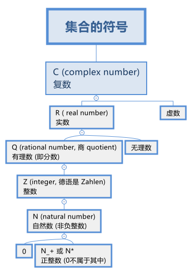
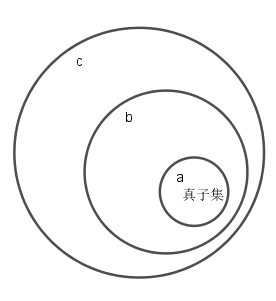

= 集合
:toc:
---

= 集合 set

==== 集合中元素的性质 -> 1. 条件确定性, 2.互异性,唯一性, 3. 无序性

集合的元素, 具有以下特点:

[cols="1a,3a"]
|===
|Header 1 |Header 2

|确定性
|集合的元素必须是确定的. 因此, 不能确定的对象, 不能组成集合. +
即, 给定一个集合, 则任何对象是不是这个集合的元素, 应该可以明确地判断出来.

比如:

- "你的公司中, 高个子的人能组成一个集合吗?" <- 不能组成集合. 因为什么才能算做"高个子"? 不满足确定性. 没有给出判定条件.
- "你的公司中, 身高不低于175cm的人能组成一个集合吗?" <- 可以组成集合.

|互异性
|对于一个给定的集合, 集合中的元素一定是不同的. +
因此, 集合中的任意两个元素, 必须都是不同的对象. 相同的对象归入同一个集合中时, 只能算作集合中的一个元素.

例如 : success 所的所有字母组成的集合, 包含的元素只有4个: s, u, c, e

|无序性
|集合中的元素无所谓前后顺序
|===

---

==== "有限集"中包括"空集"
\begin{align}
集合
    \begin{cases}
    有限集 (含有有限个元素)
        \begin{cases}
        ... \\
        空集 (包含0个元素的集合)
        \end{cases} \\
    无限集 (含有无限个元素)
    \end{cases}
\end{align}

---

==== 常见数集的符号 ->

按从小到大的范围, 如下:
[cols="1a,3a"]
|===
|Header 1 |Header 2

|N (natural number)
|自然数集 : 即所有"非负整数"组成的集合.

'''

注意: 0 是 自然数集N 中的一个元素:
stem:[ 0 \in N]

'''

可以看出: 如果 stem:[ a \in N, b \in N], 则:

- 一定有 stem:[ ab \in N]
- 但 stem:[a-b \in N ] 和 stem:[ \frac{a}{b} \in N] 都不一定成立.

例如:

stem:[ 1 \in N, 3 \in N], 但 stem:[1-3= -2 \notin N ] 且 stem:[ 1/3 \notin N]

|stem:[ N_+] 或 stem:[ N^\ast]
|正整数集: 即自然数集N中, 去掉元素0之后的集合.

|Z (integer, 德语是 Zahlen)
|整数集 : 即所有"整数"组成的集合.

与自然数集N 不同的是 : 对于整数集, 如果 stem:[ a \in Z, b \in Z ], 则:

- 一定有 stem:[a-b \in Z ]
- 但 stem:[ \frac{a} {b} \in Z] 不一定成立.

|Q (rational number, 商 quotient)
|由于两个整数相比的结果(商)叫做有理数,商的英文是quotient, 所以就用Q了.

quotient  /ˈkwəʊʃnt/ -> 来自拉丁语quot,多少，词源同quality,quantity. 用于数学名词"商"。 +
( mathematics 数 ) a number which is the result when one number is divided by another 商（除法所得的结果）

'''

有理数集 : 即所有"有理数"组成的集合. 什么叫做"有理数"? 就是凡是能够表示成"分数"的数, 就称为"有理数".

因此, 如果 stem:[a \in Q, b \in Q, 且 b \ne 0, 则 \frac{a} {b} \in Q]

例如: stem:[3 \in Q, 1/2 \in Q, 则 \frac{3} {1/2} =6 \in Q]

|R ( real number)
|实数集 : 即所有实数组成的集合.

|C (complex number)
|复数集
|===

---

== 特征性质描述法

特征性质:: 一般地, 如果属于集合A的任意一个元素x, 都具有性质 p(x), 而不属于集合A的元素都不具有这种性质, 则, 性质p(x) 就称为集合A 的一个"特征性质".

特征性质描述法 (简称"描述法"):: 此时, 集合A 可以用它的"特征性质" p(x) 表示为: +
stem:[ {x | p(x)} ] +
这种表示集合的方法, 就称为"特征性质描述法".

例如: 所有能被3整除的整数, 组成的集合, 可以用描述法表示为: +
stem:[{x | x=3n, \quad n \in Z}]

---

== 集合的基本关系

==== 子集

子集:: 如果集合A的任何一个元素, 都是集合B中的元素, 那么集合A 就称为是集合B 的子集.

[cols="1a,3a"]
|===
|Header 1 |Header 2

|包含于
|若集合A 是集合B 的子集, 就记作:

\begin{align}
A \subseteq B \quad (或 B \supseteq A)
\end{align}

读作 "A包含于B" (或"B包含A")

|不包含于
|如果 A 不是 B 的子集, 则记作:
\begin{align}
A \nsubseteq B \quad 或 (B \nsupseteq A)
\end{align}

读作 "A不包含于B" (或"B不包含A")
|===

[options="autowidth"]
|===
|Header 1 |Header 2

|\begin{align}
A \subseteq A
\end{align}
|任意集合A , 都是它自身的子集

|\begin{align}
\varnothing \subseteq A
\end{align}
|空集是任意一个集合A 的子集.
|===

---

==== 真子集

真子集:: 如果集合A 是集合B 的子集, 并且集合B中 *至少有一个元素不属于A*, 那么集合A 就称为集合B 的"真子集".

记作:
\begin{align}
A \subsetneqq B \quad (或 B \supsetneqq A)
\end{align}

读作 "A真包含于B" (或 "B真包含A")

image:img_math/math_48.png[]

根据子集, 真子集 的定义可知:
对手集合 A, B, C :

\begin{align}
如果 A \subseteq B, \quad B \subseteq C, \quad 则 A \subseteq C \\
如果 A \subsetneqq B, \quad B \subsetneqq C, \quad 则 A \subsetneqq C
\end{align}

.标题
====
例如：写出集合A = {6,7,8} 中的所有子集和真子集.

思考: 集合A中含有3个元素, 因此它的"子集"含有的元素个数, 最少就为0个, 最大就为3个:

[options="autowidth"]
|===
|Header 1 |Header 2

|子集中的元素个数为0个的
|即 \begin{align}
\varnothing
\end{align}

|子集中的元素个数为1个的
|有 {6}, {7}, {8}

|子集中的元素个数为2个的
|有 {6,7}, {6,8}, {7,8}

|子集中的元素个数为3个的
|有 {6,7,8}
|===

在上述子集中, 除去集合A本身, 即 {6,7,8}, 剩下的都是A的"真子集".

====

.标题
====
例如：
已知
\begin{align}
& S = \{ x \mid (x+1)(x+2)=0\}, \\
& T= \{ -1, -2 \}
\end{align}

问 : 这两个集合的元素有什么关系?  stem:[S \subseteq T] 吗? stem:[T \subseteq S] 吗?

因为**集合之间的关系, 是通过元素来定义的. **所以只要针对集合中的元素进行分析即可.

其实, 组成S的元素, 和组成T的元素, 完全相同, 都是{-1, -2}. 所以 S = T.

另外, 从子集的定义可知:

- 如果 stem:[ A \subseteq B] 且 stem:[ B \subseteq A], 则 stem:[ A=B]. 即 两者互为对方子集的话, 它们就相等.
- 如果 stem:[ A = B], 则 stem:[  A \subseteq B], 则 stem:[ B \subseteq A]. 即 如果两者相等, 则它们就互为对方的子集.

====

---

https://mp.weixin.qq.com/s/QQuUN0onX49OrN8idXWHjQ

12
