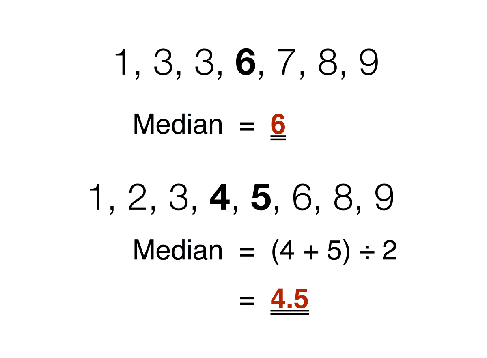
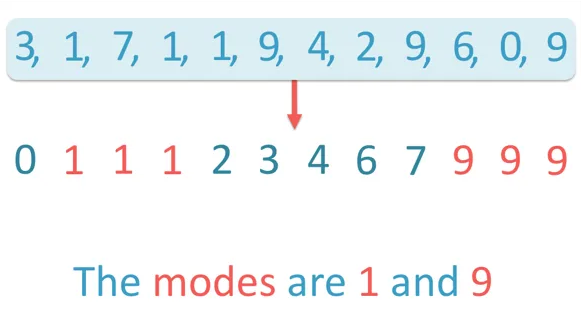
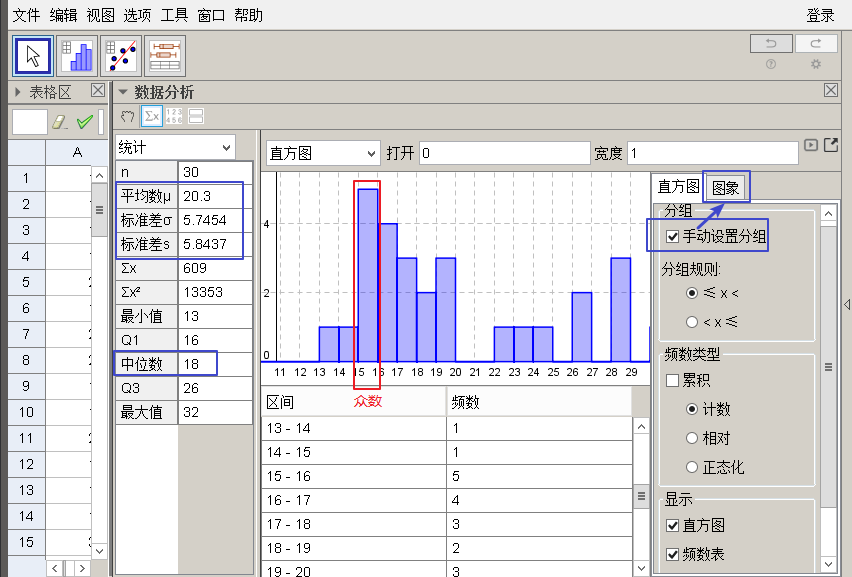
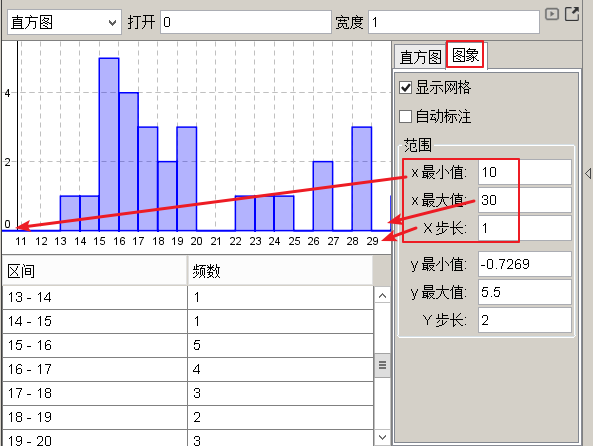
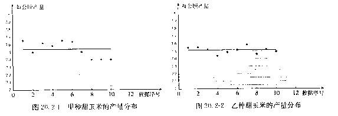

= 概率统计
:toc:
---

== 加权平均数  weighted average

加权平均数:: 一般地, 若n个数stem:[ x_1, x_2, ...,x_n] 的"权"分别是 stem:[w_1, w_2, ... w_n], 则: +
+
\begin{align}
    \boxed{
        \frac{x_1w_1 + x_2w_2 + ... +x_nw_n}{w_1+w_2+ ... +w_n}
    }
\end{align}
+
就叫做这n个数的"加权平均数".

权 weight::  即对不同数据, 赋予不同比重的重要程度.

.标题
====
例如：
某演讲赛评判, 评判标准有三个维度 : 1.演讲内容(权重占50%), 2.演讲能力(40%), 3.演讲效果(10%). 有两人获得以下分数:

|===
|赛者   | 演讲内容  | 演讲能力|演讲效果

|权重|0.5|0.4|0.1
|  A |  85|95|95
| B | 95 |85|95
|===

那么根据加权平均数, 谁赢了?

赛者A的加权平均数得分是:
stem:[ \frac{85*0.5 + 95*0.4 + 95*0.1}{0.5+0.4+0.1} = 90 ]

赛者B的加权平均数得分是:
stem:[ \frac{95*0.5 + 85*0.4 + 95*0.1}{0.5+0.4+0.1} = 91  ]
====

在求n个数的平均数时, 如果 x1出现 f1次, x2出现f2次, ..., stem:[x_k] 出现 stem:[f_k] 次 (这里  stem:[f_1 + f_2 + ... + f_k = n]), 那么, 这 n 个数的平均数

\begin{align}
\boxed{
    平均数 \overline{x} = \frac{x_1f_1 + x_2f_2 + ... + x_kf_k}{n} \quad (n= f_1 + f_2 + ... + f_k)
}
\end{align}

也叫做 stem:[x_1, x_2, ... x_k] 这 k 个数的"加权平均数".

其中 stem:[f_1, f_2, ..., f_k] 分别叫做 stem:[x_1, x_2, ..., x_k] 的权. (出现的次数叫做"权"?)

.标题
====
例如：
你的工厂生产的产品, 为了测算它们的实际使用寿命, 你随机抽取了50个样品. 实测寿命如下. 它们的平均使用寿命是多长? 这样, 你就能用抽样样本, 来估算总体产品的平均数.

[options="autowidth"]
|===
|使用寿命 life/hour |产品数量 num

| 600 ≤ life < 1000
|5

| 1000 ≤ life < 1400
|10

| 1400 ≤ life < 1800
|12

| 1800 ≤ life < 2200
|17

| 2200 ≤ life < 2600
|6
|===

解: 我们取每组中的"中值", 来代表每组产品的平均寿命.

根据平均数公式 :

\begin{align}
& \overline{life} = \frac{800*5 + 1200*10 + 1600*12 + 2000*17 + 2400*6} {5+10+12+17+6} \\
& = 1672 hour
\end{align}

====

---

== 中位数 median

中位数:: 将一组数据按照由小到大(或由大到小)的顺序排列,  +
-> 如果数据的个数是奇数,则处于中间位置的数, 就是这组数据的"中位数". +
-> 如果数据的个数是偶数,则**中间两个数据的平均数**, 就是这组数据的"中位数".

.标题
====
例如：
你的公司, 员工月薪如下, 其中位数是多少?

[options="autowidth"]
|===
|月收入/元 |人数

|45000| 1
|18000| 1
|10000| 1
|5500| 3
|5000| 6
|3400 <- 中位数 | 1
|3000| 11
|1000| 1
|===

解: 将全部25名员工, 月薪数据从小到大排列, 就能看出中位数是3400.  +
*这意味着除去月薪为3400的员工, 一半员工的收入高于3400元, 另一半员工的收入低于3400元.*

====

---

== 众数 mode

众数:: 一组数据中, 出现次数最多的那个数据, 就称为这组数据的"众数".

"众数"意味着什么?:: *当一组数据有较多的重复数据时, *众数"能更好地反映其集中的趋势.* +
例如, 如果一家公司的员工薪水水平, 众数只有3000, 这说明这家公司中, 月薪3000元的员工人数最多. 能为你考虑入职提供参考依据.

.标题
====
例如：
你开的店, 在一段时间内售出了某女鞋30双, 各种尺码的销售量如下表. 那个尺码的销量最大? 就是你进货的参考依据.

[options="autowidth"]
|===
|尺码 /cm |销量 /双

|22
|1

|22.5
|2

|23
|5

|23.5  <- 众数
|12

|24
|7

|24.5
|3

|25
|1
|===

====

---

== 统计学价值 - 实战案例

.标题
====
例如：你的公司, 下属销售员, 每月业绩(万元/月)如下表. 它们的平均数, 中位数, 众数, 各是多少?

====

---

== 极差

极差:: 一组数据中, 最大值与最小值的差, 就称为这组数据的"极差".

- 优点: 在反映数据波动程度的各种工具(包括方差, 极差, 平均差, 标准差等)中, "极差"是最简单的一个.
- 缺点 : 它仅仅反映了数据的波动范围, 没有提供其他信息. 而且它受"极端值"的影响较大.

---

== 平均差 -> 用来度量数据的波动程度 -> stem:[\frac{|x_1 - \overline{x}| + |x_2 - \overline{x}| + ... + |x_n - \overline{x}|}{n}]

即: "每个数据与其平均数的差"的绝对值的平均数. 即:

\begin{align}
\boxed{
    \frac{|x_1 - \overline{x}| + |x_2 - \overline{x}| + ... + |x_n - \overline{x}|}{n}
}
\end{align}

---

== 方差 variance / deviation Var -> 反映数据的波动(离散)程度 -> stem:[s^2 = \frac{1}{n} [(x_1 - \overline{x} )^2 + (x_2 - \overline{x} )^2 + ... + (x_n - \overline{x} )^2]]

设有n个数据, stem:[x_1, x_2, ... ,x_n ] +
"各数据与它们的平均数 stem:[\overline{x}] 的差"的平方, 分别是: stem:[(x_1-
\overline{x})^2, (x_2-
\overline{x})^2, ... (x_n-
\overline{x})^2,] +
则, 我们用这些值的平均数, 即用:

\begin{align}
\boxed{
    s^2 = \frac{1}{n} [(x_1-
\overline{x})^2 + (x_2-
\overline{x})^2 + ... + (x_n-
\overline{x})^2]
}
\end{align}

来衡量这组数据的波动大小, 并把它叫做这组数据的"方差" 记作 stem:[ s^2].

- 当数据分布比较分散(即数据在"平均数"附近波动较大)时, 各个数据与"平均数的差"的平方和, 就较大, 方差就越大.
- 当数据分布比较集中时, 各个数据与"平均数的差"的平方和, 就较小, 方差就越小.

这样, 就可以用"方差", 来描述出数据的波动程度, 即:

- 方差越大 -> 数据的波动就越大
- 方差越小 -> 数据的波动就越小

.标题
====
例如：
你培育的粮食种子, 有两个品种, 试验产量分别如下:

[options="autowidth"]
|===
|品种A (单位: t/公顷)|B

|7.65
|7.55

|7.5
|7.56

|7.62
|7.53

|7.59
|7.44

|7.65
|7.49

|7.64
|7.52

|7.5
|7.58

|7.4
|7.46

|7.41
|7.53

|7.41
|7.49
|===

哪个品种的平均产量高? 并且产量稳定性强(即方差小)?

品种A的方差是:
\begin{align*}
s^2_A = \frac{(7.65-7.54)^2 + (7.5-7.54)^2 + ... + (7.41-7.54)^2 } {10} \approx{0.01}
\end{align*}

品种B的方差是:
\begin{align*}
s^2_A = \frac{(7.55-7.52)^2 + (7.56-7.52)^2 + ... + (7.49-7.52)^2 } {10} \approx{0.002}
\end{align*}

所以 A 的波动比 B 大. B的产量更稳定.

事实上, 从单纯的产量数据图也能看出来.

====

---

== 标准差 -> stem:[ s = \sqrt{\frac{(x_1-\overline{x})^2 + (x_2-\overline{x})^2 + ... + (x_n-\overline{x})^2}{n}}]

标准差:: 是"方差"的算术平方根. +
标准差的单位, 与原始数据的单位相同.  +
实际生活中, 也常用它, 来度量数据的波动程度.

即:
\begin{align}
\boxed{
    s = \sqrt{\frac{(x_1-
\overline{x})^2 + (x_2-
\overline{x})^2 + ... + (x_n-
\overline{x})^2}{n}}
}
\end{align}

---

