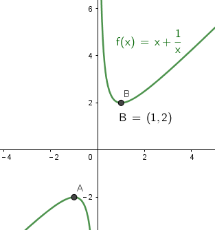
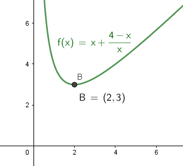

= 不等式
:toc:

---

== 如何比较两个数字的大小? -> 作差法 -> stem:[ 若A-B>0，则A>B]

比较两个数字(a,b)大小的方法, 可以用"作差法" : 即将一个数减去另一个数 (比如让 a-b), 来看其值是否等于0? 如果不等于0, 就说明两数不相等.

- 若A-B>0，则A>B
- 若A-B<0，则A<B
- 若A-B=0，则A=B

.标题
====
例如： stem:[ a, b \in (0,+\infty) , \quad A =  \sqrt{a} + \sqrt{b},  \quad B = \sqrt{a+b}], 问 A , B 的大小关系?

*既然 a,b 都是正数, 那么取它们的平方, 不会改变两者的大小关系, 即 : 如果 a>b, 则依然 stem:[ a^2 > b^2].*

即:
\begin{align}
\boxed{
若 a>b>0,  \quad 则  a ^n > b^n, \quad (n \in N^*)
}
\end{align}

所以, 本题中, 为了把根号消掉, 我们就来比较下它们取平方后的大小关系:
\begin{align}
& A^2 = a + b+ 2\sqrt{ab} \\
& B^2 = a+b \\
& A^2  -B^2 =  2\sqrt{ab} > 0 \\
& \therefore  A^2 > B^2 \\
& 即 \; A>B
\end{align}
====

---

== 如何比较两个数字的大小? -> 作商法 -> stem:[  a>0,\quad b>0, 若 \quad \frac{a}{b}>1, 则 a>b]

[options="autowidth" cols="1a,1a"]
|===
|Header 1 |Header 2

|- stem:[  a>0,\quad b>0, 若 \quad \frac{a}{b}>1, 则 a>b]
|即:
\begin{align}
& \frac{a}{b}>1 \\
& \frac{a}{b}*b > 1*b <- 两边同时乘上一个正数, 大小符号不变 \\
& 即得出: a>b
\end{align}
|===

.标题
====
例如： stem:[ a>b>0], 比较 stem:[ \frac{a^2-b^2}{a^2 + b^2}] 与 stem:[ \frac{a-b}{a+b}] 的大小.

我们就用"作商法", 来比较它们的大小:
\begin{align}
& 设 A= \frac{a^2 - b^2} {a^2 + b^2}, \quad B = \frac{a-b}{a+b} \\
& \frac{A}{B} = \frac{(a+b)(a-b)}{a^2 + b^2} * \frac{a+b}{a-b} \\
 &= \frac{(a+b)^2} {a^2 + b^2} \\
&= \frac {a^2 + b^2 + 2ab}  {a^2 + b^2} \\
&= 1 + \frac {2ab}  {a^2 + b^2} <- 由于a, b 都是正数, 显然, 这里的和 > 1 \\
& \therefore A>B
\end{align}
====

---

.标题
====
例如：
已知 stem:[ a>b>0, c<0], 求证 stem:[ c/a > c/b]

*我们使用"倒推法"来做, 假设要求证的内容为"真", 来倒推回去, 看看是否能得出最开始的已知条件 (即, 从"终点"往"起点"走, 看看能不能走通). 如果有矛盾, 则要求证的内容就为"假", 否则, 的确为"真".*

\begin{align}
& 证: 假如  \frac{c}{a} > \frac{c}{b} 为真, \\
& 则: \frac{c}{a} *ab > \frac{c}{b} * ab <- 两边同时乘上一个正数, 大小关系不变 \\
& 就有 \; bc > ac \\
& 从这个式子上, 我们可以得出: 若 c>0, 则 b>a;  若c<0, 则 a>b \\
& 结果发现, "若c<0, 则 a>b 部分", 和题目给出的条件完全相符, 无矛盾之处. 所以证明要求证的内容完全正确.
\end{align}

====

---

== 基本不等式(均值不等式) Inequality of arithmetic and geometric means -> stem:[ x+y \ge 2 \sqrt{xy}  ]

首先, 我们要知道两个概念:

[options="autowidth"  cols="1a,1a"]
|===
|Header 1 |Header 2

|算数平均数 Arithmetic mean
|设一组数据为X1，X2，...，Xn，简单的"算术平均数"公式为：
\begin{align}
AM = \frac{x_1 + x_2 + ... + x_n}{n}
\end{align}

|几何平均数 Geometric Mean
|简单几何平均数, 计算公式为:
\begin{align}
GM = \sqrt[n]{x_1 * x_2 *  ... * x_n}
= \sqrt[n]{\prod_{i=1}^n X_i}
\end{align}
即: 简单几何平均数,是n个变量值连乘积, 的n次方根。
|===

下面, 我们来推导出"基本不等式":

\begin{align}
& (a-b)^2 \ge 0 <- 无论a,b为何数, 这个式子都成立. 如果 a=b, 该式子的确也 = 0 \\
& 展开后就有 \; a^2 + b^2 - 2ab \ge 0 \\
& a^2 + b^2  \ge 2ab \\
& 我们引入两个变量 x, y, 令 x = a^2, \; y = b^2 \\
& 就有: x+y \ge 2 \sqrt{xy} \\
& \boxed{
\frac{x+y}{2} \ge \sqrt{xy}
} \\
& <- 这个就是"基本不等式". 即: 两个正实数的"算术平均数", 大于或等于它们的"几何平均数"。
\end{align}

那么这个"基本不等式"什么时候取等号呢?  原式是 a=b 时, 原式就能取等号. 这里就是 x=y 时, 这个式子能取到等号.

上面"基本不等式"的完整形态, 其实是:
\begin{align}
\boxed{
\sqrt{\frac{x^2+ y^2}{2}} \ge \frac{x+y}{2} \ge \sqrt{xy} \ge \frac{2}{\frac{1}{a} + \frac{1}{b}} \\
即: 平方均值 \ge 算术均值 \ge 几何均值 \ge 调和均值
}
\end{align}

其实:
[options="autowidth"]
|===
|Header 1 |Header 2

|\begin{align}
\frac{x+y}{2}
\end{align}
|<- 这部分, 就是"算数平均数 AM".

|\begin{align}
\sqrt[2]{xy}
\end{align}
|<- 这部分, 就是"几何平均数 GM".
|===

.标题
====
例如： 当 x>0 时,  stem:[  x + 1/x \ge ?]

利用"基本不等式"公式: stem:[ x+y \ge 2 \sqrt{xy} ], 我们就能知道:
\begin{align}
 x + \frac{1}{x} \ge 2 \sqrt{x * \frac{1}{x}} = 2
\end{align}
并且, 当 stem:[ x= 1/x] 时, 即 x=1 时, 上面的式子就能取等号.

====

.标题
====
例如： 若 a > 0, 则 stem:[ a + \frac{4 - a}{a}] 的最小值为:

这里, 假如直接套用"基本不等式"公式: stem:[ x+y \ge 2 \sqrt{xy} ], 就会有:
\begin{align}
a + \frac{4 - a}{a} &\ge 2 \sqrt{a * \frac{4 - a}{a} } \\
& \ge 2 \sqrt{4-a}
\end{align}
<- 发现  stem:[ \sqrt{xy}] 做出来不是一个常数, 而是依然带有变量a存在. 于是就没法开根号, 来算出里面的具体值.

所以, 我们要先处理一下原式, 才能让 stem:[ \sqrt{xy}] 做出一个常数. 怎么处理呢? 可以把分数拆分一下试试:

\begin{align}
& a + \frac{4 - a}{a} = a+ \frac{4}{a} - \frac{a}{a}\\
&= (a + \frac{4}{a}) -1 <- a + \frac{4}{a} 就能套用"基本不等式"公式了,因为这两个数相乘能消掉变量,而变成常数 \\
& \ge 2 \sqrt{a *  \frac{4}{a}} -1 \\
& \ge 2 *2  -1 \\
& \ge 3
\end{align}

====

.标题
====
例如：若对任意的 stem:[ x \in (0, +\infty)], 都有 stem:[ x + 1/x \ge a], 则 a 的取值范围是?

我们先用"基本不等式"公式, 来算 stem:[ x + 1/x ] 大于或小于什么?
\begin{align}
& x + \frac{1}{x} \ge 2\sqrt{x *  \frac{1}{x}} <- 套用基本不等式公式 x+y \ge 2 \sqrt{xy} \\
& \ge 2
\end{align}
即,  stem:[ f(x) = x + 1/x] 中的所有点, y值只有一个是2, 其他都在2以上.  +
而 a 就是2. 所以就能知道, 曲线上的点的y值, 除了一个是等于a以外, 其他所有点的y值都超过了 a.  那么a就肯定是小于等于2的.

即: stem:[ a \in (- \infty, 2 \] ]

image:img_math/math_144.png[]
====

---

https://www.bilibili.com/video/BV147411K7xu?p=116

