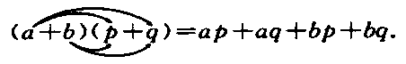
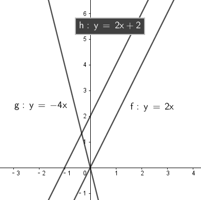
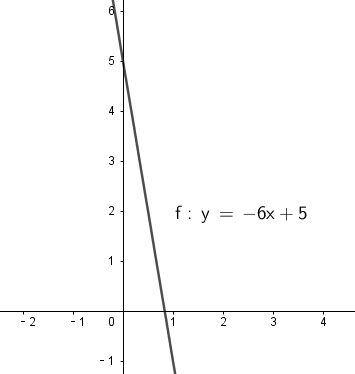
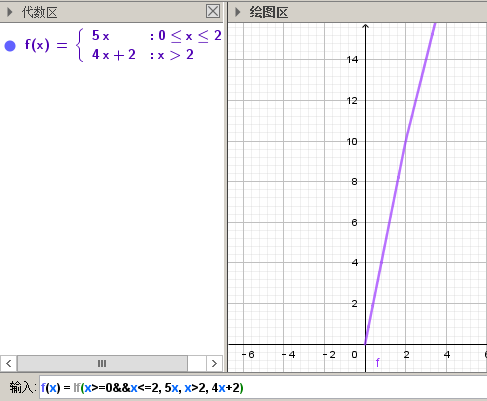
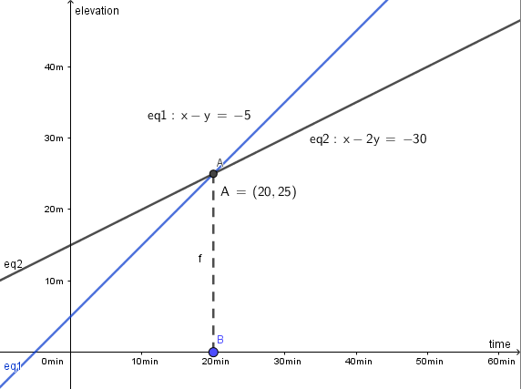

#### 实数

许多"正有理数"的算术平方根 (例如 $\sqrt{3}, \sqrt{5}, \sqrt{7}$ 等), 都是"无限不循环小数".

例如:  
第一宇宙速度 $v_1$ (单位: m/s) 是:   
$$
v_1^2 =gR
$$

第二宇宙速度 $v_2$ (单位: m/s) 是:   
$$
v_2^2 =2gR
$$

其中: 

- g : 是重力加速度, $\approx 9.8 m/s^2 $
- R : 是地球半径, $R\approx 6.4*10^6 m$

你来计算一下 第一和第二宇宙速度的确切值? 

$$
v_1 = \sqrt{gR} = \sqrt{\frac{9.8m}{1s^2} * 6.4*10^6m} \\
v_2 = \sqrt{2gR} \\
$$

例:  
你有一块正方形的土地, 面积为  $400m^2$, 你想在上面造一个小别墅, 面积为$300m^2$, 且最好长宽比为3:2, 能够实现吗?

$$ 
先来算土地的边长 \\ 
土地的边长 = \sqrt{400} = 20 m^2 \\[10px]

再来算出小别墅的具体长宽尺寸 \\ 
\frac{长}{宽} = \frac{3}{2} = \frac{3x米}{2x米} \\ 
3x*2x = 300m^2 \\ 
x^2 = 50 \\ 
∴ 别墅的实际长度 = 3x = 3* \sqrt{50} \\ 
\sqrt{50} > 7 \\ 
别墅的实际长度 3x = 3* \sqrt{50} > 3*7 \\[10px] 

这个别墅的实际长度, 大于21米, 超过了正方形土地的边长20米. 所以你的别墅长宽方案不可行. 
$$

---

#### 平方根

若 $a =x^2$ 

- x : 叫做 a 的"平方根" square root, 或"二次方根".

如 : 9 的平方根是 $\pm3$

#### 开平方根

求一个数 a 的"平方根 x" 的运算, 叫做"开平方" extraction of square root.

如, 若 $x^2 = a$ , 则对 a 开平方, 就是求 $\sqrt{a}$ , 即求 x.  
所以, "平方"与"开平方"互为逆运算.

$\pm2$ -> 平方 ---> 4  
$\pm2$ <- 开平方 <- 4  

|     | 平方根  |
|  ----  | ----  |
| 正数 a  | 有两个平方根 : 它们互为相反数, 即 $\pm\sqrt{a}$ |
| 0  | 0 |
| 负数  | 没有平方根 |

#### 立方根

$\sqrt[3]{a}$

- 3 : 是"根指数" radical exponent 

#### 实数

有理数 = 整数 + 分数 (有限小数 + 无限循环小数)

分数 : 都可以写成 "有限小数" 或 "无限循环小数" 的形式.  

事实上, 任何"有理数", 都可以写成"有限小数" 或 "无限循环小数" 的形式: 

|  有理数   | 都可以写成"有限小数" 或 "无限循环小数" 的形式  |
|  ----  | ----  |
| 整数  | 1 = 1.0 |
| 分数  | $\frac{2}{5} = 2.5$   $-\frac{11}{9} = 1.222...$|

#### 无理数

无理数 irrational number : 即"无限不循环小数".  换言之, 我们把那些不能写成"分数"形式的数, 就称为"无理数".  

很多数的"平方根"和"立方根", 都是"无限不循环小数". 

如 : $\sqrt{2}, -\sqrt{5}, \sqrt[3]{2}, \sqrt[3]{3}, -\pi$ 等都是"无理数".

#### 实数

实数 = 有理数(包括0, 有限小数, 无限循环小数) + 无理数(无限不循环小数)

虽然无理数, 小数点后无穷无尽, 但神奇的是, 每一个无理数, 都可以对应到用数轴上的一个点来表示出来!

比如, 半径为 1/2 的圆, 从原点(O点)沿着数轴向右滚动一周(到达O'点), 这个O'点 = $2\pi r$ = $\pi$ , 即是一个无理数. 

即 : "实数"与"数轴上的点", 是一一对应的.

-----

#### 二元一次方程

二元一次方程 linear equation in two unknowns : ① 方程中含有两个未知数(比如x 和 y), ② 含有未知数的项的次数是1.

解法: 

"消元"思想 : 二元一次方程组中, 有两个未知数, 如果消去其中一个未知数, 那我们就把它转化为了一元一次方程.   
用这种方式, 即, 我们先求出其中一个未知数, 再求另一个未知数, 这种将未知数的个数"由多化少", 逐一解决的思想, 就叫做"消元"思想.

例

你的公司生产消毒洗手液, 每天能生产22.5t. 根据市场调查, 你的产品销量中, 大瓶装(500g) 和 小瓶装(250g) 的销售数量(按瓶算), 比例为 2:5. 那么, 你每天生产的洗手液, 应该分配给大瓶和小瓶, 各多少瓶呢?

1吨=1000千克=$1*10^6$克

$$
设, 大瓶数应为 x, 小瓶数 y \\
\begin{cases}
500x + 250y = 22.5 * 10^6 \\
\frac{2}{5} = \frac{x}{y}
\end{cases} \\

\begin{cases}
... \\
x = 2y/5
\end{cases} \\

\begin{cases}
500(2y/5) + 250 = 22.5 * 10^6 \\
...
\end{cases} \\

$$

解法2 : 加减消元法

$$
\begin{cases}
x+y = 10  \\
2x + y = 16 
\end{cases}
$$

可以看出, 直接第二个方程减去第一个方程, 就能消去y.

又例

$$
\begin{cases}
3x+4y = 16  & ① \\
5x + 6y = 33 & ②
\end{cases}  \\[10px]

将①*3, ②*2 \\
\begin{cases}
9x+12y = 16*3  \\
10x + 12y = 33*2 
\end{cases} \\[10px]

这样, 就能两个公式相减, 消掉y了.
$$

---

#### 三元一次方程组的解法

同样使用"消元法" :  
三元一次方程组 -(消元)-> 二元一次方程组-(消元)-> 一元一次方程组

例如

$$
\begin{cases}
3x+4z =7  & ① \\
2x+3y+z=9 & ② \\
5x-9y+7z=8 & ③
\end{cases} \\[10px]
$$
方程①只含x, z, 所以,可以由 ②, ③ 来消去y, 组成一个"二元一次方程组".

又例

$$
\begin{cases}
a-b+c=0 & ① \\ 
4a + 2b + c = 3 & ② \\ 
25a + 5b + c =60 & ③
\end{cases}
$$

将 ②-①, 消掉c,  
将 ③-①, 消掉c,   
就得到了一个"二元一次方程组".

---

#### 整式的乘法

$\boxed{a^m * a^n = a^{m+n}}$ (m, n 都是正整数)

如

$x^2*x^5=x^{2+5}=x^7$

$\boxed{(a^m)^n = a^{m*n}}$ (m, n 都是正整数)

如

$(x^3)^5=x^{3*5}=x^{15}$

$$
\boxed{
ac^5 * bc^2 \\ 
= (a*b)*(c^5*c^2) \\
= abc^7
}
$$

如
$$
(2x)^3(-5xy^2) \\
= 2^3*(-5) * x^3*xy^2 \\
= -40x^4y^2
$$

$$
\boxed{
(a+b)(p+q) 
= a(p+q) +b(p+q) 
= ap + aq + bp + bq
}
$$

$$
\boxed{
\frac{a^m}{a^n} = a^{m-n}
} 
(a \ne 0; m,n都是正整数, 且 m>n)
$$  

如

$$
\frac{12a^3b^2x^3}{3ab^2} = 4a^2x^3
$$

$$
\frac{12a^3-6a^2+3a}{3a} 
= \frac{12a^3}{3a} -\frac{6a^2}{3a} + \frac{3a}{3a} 
= 4a^2 - 2a +1
$$

$$
\boxed{a^0=1}
$$  

$$
\boxed{
    (a+b)(a-b) = a^2-b^2
}
$$

例如

$$
(x+2y-3)(x-2y+3) \\
= [x+(2y-3)][x-(2y-3)] \\
= x^2 - (2y-3)^2
$$

$$
\boxed{
    (a+b)^2 = a^2 + 2ab + b^2
}
$$

$$
\boxed{
    (a-b)^2 = a^2 - 2ab + b^2
}
$$

例如

$$
(a+b+c)^2 \\
= [(a+b)+c]^2 \\
= (a+b)^2 + 2(a+b)c + c^2 \\
= a^2 + 2ab + b^2 + 2ca + 2cb + c^2 \\
= a^2 + b^2 + c^2 + 2ab + 2ac + 2bc
$$

#### 因式分解

因式分解 factorization : 把一个多项式, 化成几个整式的"积"的形式(即, 从原来的加法, 变成乘法), 像这样的变形过程, 就叫做"因式分解". 也叫做把这个多项式"分解因式".

可以看出, "因式分解", 与"整式乘法", 是方向相反的变形: 

(x+1)(x-1) -整式乘法-> $x^2-1$  
(x+1)(x-1) <-因式分解- $x^2-1$ 

因式分解的两种基本方法:

1.提公因式法

"公因式"即"公共的因式", 存在于各项之中. 如下面的 p 就是公因式.

$$
\boxed{
    pa+pb+pc = p(a+b+c)
}
$$

例如

$$
8a^3b^2 + 12ab^3c \\
= 4ab^2(2a^2+3bc)
$$
可以看出, 从原始的加法, 变成最终的乘法. 即"分解因式".

又例

$$
2a(b+c) - 3(b+c) \\
= (b+c)(2a-3)
$$
同样, 从加法, 变成乘法.

2.公式法

$\boxed{
    a^2-b^2 = (a+b)(a-b)
}
$

例如

$$
x^4-y^4 \\
= (x^2+y^2) * (x^2-y^2) \\
=(x^2+y^2)(x+y)(x-y)
$$

$\boxed{
    a^2+2ab+b^2 = (a+b)^2
}
$

$\boxed{
    a^2-2ab+b^2 = (a-b)^2
}
$

例如

$$
3ax^2 + 6axy + 3ay^2 \\ 
= 3a(x^2 + 2xy + y^2) \\ 
= 3a(x+y)^2
$$

因为 : 

$$
(x+p)(x+q) \\ 
= x^2 +qx + px + pq \\ 
= x^2+x(p+q)+pq
$$

所以 : 
$x^2+x(p+q)+pq$ 因式分解, 就是 (x+p)(x+q)  

例如

$$
x^2 + 3x + 2 \\ 
对其进行因式分解, \\
中间的3, 是两个数字相加得到的 \\
最后的2, 是两个数字相乘得到的 \\ 
那么这两个数字是多少呢? 就是1和2了 \\ 
= (x+1)(x+2)
$$

又例 : 
$x^2 + 7x-18$ 因式分解  
7是两个数字相乘的结果, -18是两个数字相加的结果,  
那么这两个数字是多少呢? 就是 9 和 -2 了.  
所以, 因式分解的结果就是 : (x+9)(x-2)

---

#### 分式 fraction

约分 reduction of a function : 把一个分式的分子与分母的"公因式"约去, 叫做分式的"约分".  

最简分式 fraction in a lowest terms : 像这样分子与分母没有"公因式"的分式, 就叫做"最简分式".

$$
\frac{6x^2 - 12xy + 6y^2}{3x-3y} \\[10px] 
= \frac{6(x^2-2xy+y^2)}{3(x-y)} \\[10px] 
= \frac{2(x-y)^2}{x-y} \\[10px] 
= 2(x-y)
$$

将分式的分子和分母同时乘上适当的整式, 不会改变分式的值. 比如, 我们可以把 $\frac{1}{ab}$ 和  $\frac{2a-b}{a^2}$ 化成分母相同的分式.  

通分 reduction of fractions to a common denominator : 像这样, 把几个异分母的分式, 分别化成与原来分式相等值的同分母的分式, 就叫做分式的"通分".

为"通分", 要先确定各分式的"公分母". 一般取各分母的所有因式的最高次幂的"积", 作为"公分母", 它叫做"最简公分母".

例如: 

$$ 
\frac{3}{2a^2b} 与 \frac{a-b}{ab^2c} 做通分: \\[10px] 
它们的最简公分母就是 2a^2b^2c \\[10px] 

\frac{3}{2a^2b} = \frac{3*bc}{2a^2b *bc} = \frac{3bc}{2a^2b^2c} = \frac{3bc}{2a^2b^2c}
\\[10px] 
\frac{a-b}{ab^2c} = \frac{(a-b)*2a}{ab^2c*2a} = \frac{2a^2-2ab}{2a^2b^2c} 
$$

例如

$$
\frac{2x}{x-5} 与 \frac{3x}{x+5} 做通分 \\[10px] 
它们的最简公分母是 (x-5)(x+5) \\[10px] 
\frac{2x}{x-5} = \frac{2x * (x+5)}{(x-5)(x+5)} = \frac{2x^2+10x}{x^2-25} \\[10px] 
\frac{3x}{x+5} =\frac{3x*(x-5)}{(x+5)(x-5)} 
$$

分式的乘除

$$
\boxed{
    \frac{a}{b} * \frac{c}{d} = \frac{ac}{bd}
}
$$

$$
\boxed{
    \frac{a}{b} \div \frac{c}{d} =\frac{a}{b} * \frac{d}{c} = \frac{ad}{bc}
}
$$

$$
\boxed{
    (\frac{a}{b})^n = \frac{a^n}{b^n}
}
$$

例

$$
(\frac{a^2b}{-cd^3})^3 \div \frac{2a}{d^3} * (\frac{c}{2a})^2 \\[10px] 
= \frac{a^6b^3}{-c^3d^9} * \frac{d^3}{2a} * \frac{c^2}{4a^2} \\[10px] 
= -\frac{a^6b^3c^2d^3}{8a^3c^3d^9} \\[10px] 
= -\frac{a^3b^3}{8cd^6}
$$

$$
\boxed{
    \frac{a}{c} \pm \frac{b}{c} = \frac{a \pm b}{c}
}
$$

$$
\boxed{
    \frac{a}{b} \pm \frac{c}{d} = \frac{ad}{bd} \pm \frac{bc}{bd}= \frac{ad \pm bc}{bd}
}
$$

例

$$
(\frac{x+2}{x^2-2x} - \frac{x-1}{x^2-4x+4}) \div \frac{x-4}{x} \\[10px]
= (\frac{x+2}{x(x-2)} - \frac{x-1}{(x-2)^2}) * \frac{x}{x-4} \\[10px]
= \frac{(x+2)(x-2) - x(x-1)}{\cancel{x}(x-2)^2} * \frac{\cancel{x}}{x-4} \\[10px]
= \frac{x^2-4-x^2+x}{(x-2)^2(x-4)} \\[10px]
= \frac{x-4}{(x-2)^2(x-4)} \\[10px]
= \frac{1}{(x-2)^2}
$$

#### 整数的指数幂

"正整数指数幂"的运算性质为:

$a^m*a^n = a^{m+n}$ (m, n 是正整数)

$(a^m)^n = a^{mn}$ (m, n 是正整数)

$(ab)^n = a^n*b^n$ (n 是正整数)

$a^m\div a^n = a^{m-n}$ (a $\ne$ 0 ; m, n 是正整数, m > n)

$(\dfrac{a}{b})^n = \dfrac{a^n}{b^n}$

$a^0 = 1 \quad (当a\ne 0 时)$ 

$$
\boxed{
    a^{-n} = \frac{1}{a^n} \quad (a \ne 0)
}
$$
即, $a^{-n} \quad (a \ne 0)$ 是 $a^n$ 的倒数.

例如

$$
a^3 * a^{-5} 
= \frac{a^3}{a^{-5}} 
= \frac{1}{a^2} 
= a^{-2}
= a^{3-5}
$$

例如

$$
a^{-2}b^2 * (a^2b^{-2})^{-3} \\
= a^{-2}b^2 * a^{-6}b^6 
= a^{-8} b^8
= \frac{b^8}{a^8}
$$

例如
$$
2.57*10^{-5} = 0.000,025,7
$$

#### 分式方程

分式方程 fractional equation : 即分母中含有未知数的方程.

如   
$$
\frac{90}{30+v} = \frac{60}{30-v}
$$
分母中含有未知数.  

注意 : 分母不能为0, 即, 你求出的解, 如果代入分母(具体说就是"最简公分母")后, 使得"最简公分母"为0了, 该解就不是本方程的解了! 即本方程无此解.

例如

$$
\frac{2}{x-3} = \frac{3}{x} \\[10px] 
2x = 3(x-3)  \\
2x - 3x = -9 \\
x = 9 \\
把 x=9 代入原方程的最简公分母 x(x-3) 中, 发现  x(x-3) \ne 0, \\ 
所以x=9 是原分式方程的解.
$$

---

#### 二次根式

$$
\boxed{
    (\sqrt{a})^2 = a \quad(a \ge 0)
}
$$

$$
\boxed{
    \sqrt{a^2} = a \quad(a \ge 0)
}
$$

$$
\boxed{
    \sqrt{a} * \sqrt{b} = \sqrt{ab} \quad(a \ge 0, b \ge 0)
}
$$

例如

$$
\sqrt{\frac{1}{3}} * \sqrt{27} 
= \sqrt{\frac{1}{3}*27} 
= \sqrt{9} = 3
$$

$$
\sqrt{4a^2b^3} 
= \sqrt{4} * \sqrt{a^2} * \sqrt{b^3}
= 2* a * \sqrt{b^2} * \sqrt{b}
= 2ab \sqrt{b}
$$

$$
3 \sqrt{5} * 2 \sqrt{10}
= 3*2* \sqrt{5*10}
= 6 \sqrt{5*5*2}
= 6*5*\sqrt{2}
=30 \sqrt{2}
$$

$$
\boxed{
    \frac{\sqrt{a}}{\sqrt{b}} = \sqrt{\frac{a}{b}} \quad(a \ge 0, b > 0)
}
$$
两件雨衣遮上下两个人(一人一件雨衣), 能等同于一件大雨衣遮上下两个人.

例如

$$
\sqrt{\frac{3}{2}} \div \sqrt{\frac{1}{18}} 
= \sqrt{\frac{3}{2} \div \frac{1}{18}}
= \sqrt{\frac{3}{2} * 18}
= 3\sqrt{3}
$$

又例

$$
\sqrt{\frac{75}{27}} 
= \frac{\sqrt{75}}{\sqrt{27}}
= \frac{\sqrt{25*3}}{\sqrt{9*3}} 
=\frac{5\sqrt{3}}{3\sqrt{3}}
= \frac{5}{3}
$$

sample 

$$
\frac{3\sqrt{2}}{\sqrt{27}}
= \frac{...}{3\sqrt{3}}
= \frac{\sqrt{2}}{\sqrt{3}}
= \frac{\sqrt{2}*\sqrt{3}}{\sqrt{3}*\sqrt{3}}
= \frac{\sqrt{6}}{3}
$$

$$
\sqrt{8} + \sqrt{18}
= 2\sqrt{2} + 3 \sqrt{2}
= 5\sqrt{2}
$$

$$
2\sqrt{12} - 6\sqrt{\frac{1}{3}} + 3\sqrt{48} \\[10px]
= 4\sqrt{3} - 6\sqrt{\frac{1*3}{3*3}} +3\sqrt{16*3} \\[10px]
= ... -\frac{6\sqrt{3}}{\sqrt{3^2}} +... \\[10px]
= 4\sqrt{3} - 2\sqrt{3} + 12\sqrt{3} \\[10px]
= 14\sqrt{3}
$$ 

---

#### 一次函数

正比例函数 proportional function : 一般地, 形如 y=kx (k是常数, k≠0) 的函数, 叫做"正比例函数". 其中, k 叫做"比例系数".

正比例函数 : 
$$
\boxed{
    y = kx \quad (k是常数, 且 k \ne 0)
}
$$

一般地, 正比例函数 y = kx 的图像, 是一条经过坐标系原点的直线.  

- 当 k>0 时, 直线 y=kx 经过 第3, 第1象限. 从左向右上升, 随着x的增大, y也增大.
- 当 k> 0时, 直线 y=kx 经过 第2, 第4 象限. 从左向右下降, 随着x的增大, y减小.

由于两点可以确定一条直线, 所以我们可以用"两点法" 画出 y= kx (k ≠ 0) 的图像.  
一般地, 过原点(0,0) 和 点(1, k) (k是常数, k≠0) 的直线, 即是 y= kx (k ≠ 0) 的图像.  

例如

你要翻过一座山, 出发点的温度为 5 ℃, 海拔每升高 1 km, 气温下降 6 ℃. 那么你面临的温度y与高度x的函数关系, 是怎样的?

$$
5 + x(-6) = y \\
y = -6x + 5
$$

一次函数 linear function : 一般的, 形如 y=kx + b (k, b 是常数, k≠0) 的函数, 叫做"一次函数".  
当 b = 0 时, y= kx + b 即 y=kx, 所以说, "正比例函数"是一种特殊的"一次函数
.

比较一次函数 y=kx+b (k ≠ 0) 与 正比例函数 y=kx (k ≠ 0) 的图像, 可以看出 :  

- y=kx+b (k ≠ 0) 的图像, 可以由直线 y=kx 平移 |b| 个各单位长度得到. 即 :   
当 b>0 时, 图像沿着y轴向上平移,   
当 b<0 时, 图像沿着y轴向下平移. 

- y = kx+b (k ≠ 0) 的图像也是一条直线.

已知 一次函数的图像, 过点(3,5) 和 (-4,-9), 那么它的公式(解析式)是什么?

解 : 我们的目的是求出 y = kx + b 的 k 和 b (都叫做"待定系数"), 就能知道它的具体解析式.

把两个点的坐标代进去.

$$
\begin{cases}
3k + b = 5 \\ 
-4k + b = -9
\end{cases} \\ 

\begin{cases}
k = 2 \\ 
b = -1
\end{cases}
$$

所以, 该直线的解析式就是 y = 2x - 1 

例 : 买种子, 其重量(kg)我们用 x 来表示.   
-> 当 0 ≤ x  ≤ 2kg 时, 种子的价格为 5元/kg  
-> 当 x > 2kg 时, 在x≤2的部分, 仍按 5元/kg来算; x超出2kg的部分(即 x-2 kg), 种子价格按4元/kg 计算 (即打8折)  
你来得出函数公式, 与函数图

$$
设 : 你买的种子的总重量为x,  总价格为y \\ 
\begin{cases}
y = 5x & (0 ≤ x  ≤ 2kg ) \\
y = 5*2kg + (x-2kg)*4 & (x>2)
\end{cases} \\[10px]

\begin{cases}
y = 5x \\ 
y = 10 + 4x - 8
\end{cases} \\[10px]

\begin{cases}
y = 5x & (0 ≤ x  ≤ 2kg )\\ 
y = 4x +2 & (x>2)
\end{cases} \\[10px]

\begin{cases}
x = 2 \\ 
y = 10  \\
\end{cases}
$$

例

下面3个方程, 是什么意思?  

$$
(1) 2x +1 =3  \\ 
(2) 2x+1=0   \\ 
(3) 2x+1=-1
$$

这三个方程, 等号左边的函数体都一样, 只是等号右边的数字不一样, 其实等号右边就是 y的不同取值而已.   
即 : 解这3个方程相当于在 y = 2x+1 的函数值(y值)分别为 3, 0, -1 时, 求自变量 x 的值.   
或者说, 是在直线  y = 2x+1 上取 y = 3, 0, -1 的点, 看这些点的 x 坐标是多少.

解"一元一次方程", 相当于在某个一次函数 y=ax+b 的函数值(即y值)为0时, 求自变量 x 的值.

例

$$
(1) 3x+2>2 \\ 
(2) 3x+2<0 \\ 
(3) 3x+2<-1
$$

可以看出, 上面3个不等式的不等号左边, 都是 3x+2, 不等号及不等号右边不一样.   
从函数的角度看, 解这3个不等式, 就相当于在一次函数 y=3x+2 的函数值分别大于2, 小于0, 小于 -1 时, 求自变量 x 的取值范围.

因为任何一个以 x 为未知数的"一元一次不等式" 都可以变形为 ax + b >0 或 ax + b < 0 (a ≠ 0) 的形式, 所以解"一元一次不等式", 就相当于在某个一次函数 y=ax+b 的值大于0 或小于0 时, 求自变量 x 的取值范围.

例

你坐热气球, 从海拔5m处出发, 以1m/min 的速度上升. 与此同时, 她从海拔15m处出发, 以 0.5m/min 的速度上升. 你们两个热气球上升的时间都是 1h. 

思考 :   
- 你们两个热气球, 上升时间(time)和到达海拔(elevation), 这两个变量的函数关系是怎样的?
- 什么时候, 你们两个气球会位于同一高度? 这时气球上升了多少时间? (你们两个气球是同时出发的)

如果两个气球能达到同一高度 (elevation相同), 则必能连成方程组(同一上升用时, 同一到达海拔高度), 我们来算算它们有没有解?

$$
\begin{cases}
5 + (1*t)  = e \\ 
15 + 0.5t = e
\end{cases} \\ 

\begin{cases}
t-e = -5 \\ 
t-2e= -30 
\end{cases} \\

设, 用时time(单位 min) 为 x, 到达海拔 elevation (单位m) 为y. \\

\begin{cases}
x-y = -5 \\ 
x-2y= -30 
\end{cases} \\ 
\begin{cases}
x = 20 \\
y = 25  
\end{cases}
$$

也就是说当上升20min时, 两个气球都位于海拔25m的高度.

一般地, 每个含有未知数x和y的二元一次方程, 都可以改写为y=kx+b (k,b是常数, k≠0) 的形式. 所以每个这样的方程, 都对应一个一次函数, 于是也对应一条直线. 这条直线上每个点的坐标(x,y) 都是这个二元一次方程的解.

由两个二元一次方程, 组成的方程组, 其解就是这两条直线的"交点"处的坐标.

#### 一元二次方程

一元二次方程 quadratic equation in one unknown, 形如 $x^2+2x-4=0$, 即: 只有一个未知数(一元)x, 且x的最高次方是2.

quadratic  /kwɒˈdrætɪk/ a. ( mathematics 数 ) involving an unknown quantity that is multiplied by itself once only 平方的；二次方的  
-> quadr-,四，-atic,形容词后缀。用于数学名词平方。

一元二次方程的一般形式是 :  
$$
ax^2 + bx + c = 0 \quad (a \ne 0)
$$

- $ax^2$  : 是二次项
- a : 是二次项的系数
- bx : 是一次项
- b : 是一次项的系数
- c : 是常数项

根 root : 使方程左右两边相等的未知数的值, 就是这个一元二次方程的解. 一元二次方程的解, 也叫做一元二次方程的"根".

解一元二次方程:

配方法: 配方是为了将次, 把一个一元二次方程, 转化为两个一元一次方程来解.

如

$$
2x^2 - 3x = -1 \\[7px]
x^2 - \frac{3x}{2} = -\frac{1}{2} \\[7px]

x^2 -  \frac{3}{2}x + (\frac{3}{4})^2 = -\frac{1}{2} +(\frac{3}{4})^2  \\[7px]
//进行配方, 目的是为了把x未知数的次数, 从二次降维成一次. \\[7px]

(x-\frac{3}{4})^2 = \frac{1}{16} \\[7px] 
//现在, 就已经降级成一元一次方程了 \\[7px]

x-\frac{3}{4} = \pm\frac{1}{4} \\[7px]
x_1 = 1, \quad x_2 = \frac{1}{2}

$$

一般地, 对于方程
$$
x^2 = p
$$

|  $x^2 = p$   | 根root  |
|  ----  | ----  |
|  p>0 |  方程有两个不等的实数根 :    $x_1=\sqrt{p}, \quad x_2=-\sqrt{p}$ |
| p=0 | 有两个相等的实数根 :    $x_1= x_2= 0$  |
|p<0| 无实数根|

一般地, 如果一个一元二次方程通过配方, 转化成
$$
(x+n)^2 = p
$$
的形式, 那么就有: 

|  $(x+n)^2 = p$   | 根root  |
|  ----  | ----  |
|  p>0 |  方程有两个不等的实数根 :    $x_1=-n-\sqrt{p}, \quad x_2=-n + \sqrt{p}$ |
| p=0 | 有两个相等的实数根 :    $x_1= x_2= -n$  |
|p<0| 无实数根|

公式法: 

任何一个一元二次方程, 都可以写成一般形式:

$$
ax^2 +bx +c =0 \quad (a \ne 0)
$$

用配方法来算下去:

$$
ax^2 +bx +c =0 \\ 
ax^2 +bx = -c  \\ 
x^2 + \frac{b}{a}x = -\frac{c}{a} \\[7px] 
下面进行配方 \\[7px] 
x^2 + \frac{b}{a}x +(\frac{b}{2a})^2= -\frac{c}{a}+(\frac{b}{2a})^2 \\[7px] 
... = \frac{b^2}{4a^2} - \frac{c*4a}{a*4a} \\[7px]
(x+\frac{b}{2a})^2 = \frac{b^2-4ac}{4a^2} \quad ① \\[7px]
$$

因为 $a \ne 0$, 所以 $4a^2 > 0$ , 那么等号右边的整体是大于, 等于, 还是小于0呢? 这就要看分子 $b^2-4ac$ 的情况了: 它有三种情况:

(1)
$$
若 b^2-4ac >0 \\ 
这时, \frac{b^2-4ac}{4a^2} >0 \\[7px] 
则, 由①得: \\ 
(x+\frac{b}{2a})^2 = \frac{b^2-4ac}{4a^2}  \\[7px]
x+\frac{b}{2a} = \pm\frac{\sqrt{b^2-4ac}}{2a}\\[7px]
x  = -\frac{b}{2a}\pm\frac{\sqrt{b^2-4ac}}{2a}\\[7px]

所以, 方程有两个不等的实数根: \\[7px] 
x_1 = \frac{-b+\sqrt{b^2-4ac}}{2a} \\[7px]
x_2= \frac{-b-\sqrt{b^2-4ac}}{2a} \\
$$

(2)

$$
若 b^2-4ac =0 \\[7px] 
这时, \frac{b^2-4ac}{4a^2} =0 \\[7px] 
则, 由①得: \\[7px] 
(x+\frac{b}{2a})^2 = \frac{b^2-4ac}{4a^2}  \\[7px]
... = 0 \\[7px]
所以, 方程有两个相等的实数根 : \\[7px]
x_1= x_2 = -\frac{b}{2a}
$$

(3)
$$
若 b^2-4ac <0 \\[7px] 
这时, \frac{b^2-4ac}{4a^2} <0 \\[7px] 
则, 由①得: \\[7px] 
(x+\frac{b}{2a})^2 = \frac{b^2-4ac}{4a^2}  \\[7px]
... = 0 \\[7px]
等号左边是平方, 平方的值不可能小于0, 所以 x 取任何实数都做不到. 所以此方程无解.
$$

一般地, 式子 $b^2-4ac$ 就叫做一元二次方程 $ax^2+bx+c=0$ 的根的判别式. 通常用希腊字母 Δ 表示它. 即 $\Delta = b^2-4ac$

由上可知: 

|  $\Delta = b^2-4ac$   | 方程 $ax^2+bx+c=0 \quad (a ≠ 0)$ 根的情况:   |
|  ----  | ----  |
| $\Delta>0$  | 两个不等的实数根 :    $x_1 = \dfrac{-b+\sqrt{b^2-4ac}}{2a}$   $x_2= \dfrac{-b-\sqrt{b^2-4ac}}{2a}$ |
|  $\Delta=0$   | 有两个相等的实数根 :   $x_1= x_2 = -\dfrac{b}{2a}$ |
| $\Delta<0$|无实数根|

---

http://www.dzkbw.com/books/rjb/shuxue/

https://mp.weixin.qq.com/s/BZrPeOmX5EDFmSt1CwDMQA

11
