= geogebra
:toc:

---

== 官方文档, 指令查询

https://wiki.geogebra.org/en/Manual

---

== ----- -----

---

== 修改 x 和 y 轴的名字 -> 右键 - 绘图区

比如, 你要把 x 轴改成 变量名是 time,  y 轴改成 变量名是elevation :

在绘图区空白处，单击鼠标右键——绘图区, 分别设置 x 和 y 轴的 "标签"(即新变量名) 和 "单位".

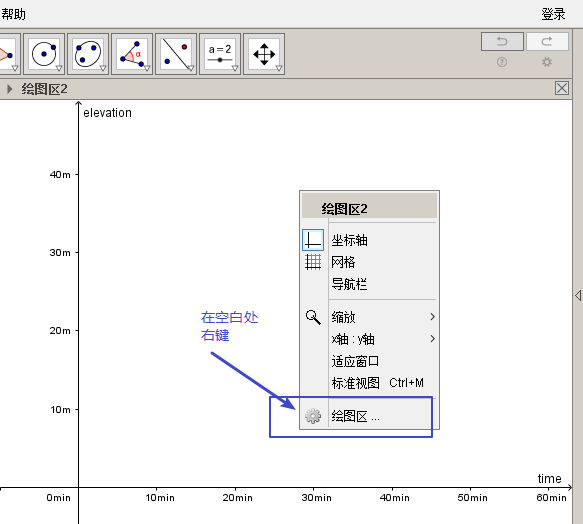

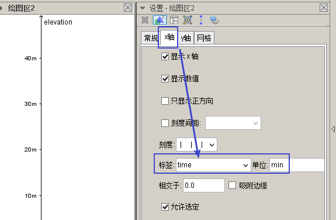

---

== 在字符串中引用变量 <- 类似于 python中的 字符串的 .format()方法

即相当于 python 中 字符串中引用变量的方法 :
....
info_3 = "the name is {} \n, the age is {}".format(name ,age)
....

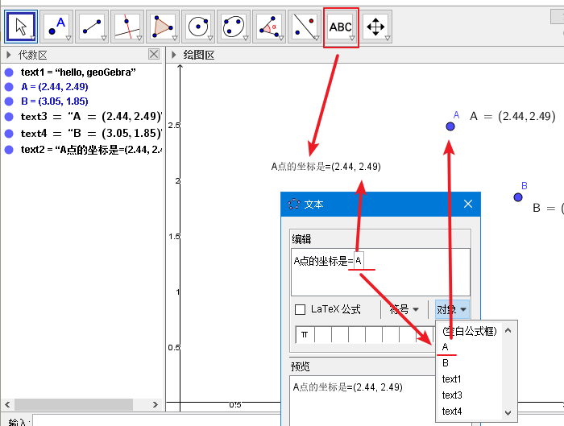

---

== 关闭跟踪

只清除本次的跟踪 -> ctrl + F

关闭跟踪 : 用右键点击原来跟踪的点或者线，然后选择里面的“取消跟踪”.

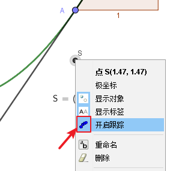

---

== ----- -----

== 创建变量 -> 变量=变量值

....
a=1
//生成变量 a, 值为1

//然后就可以将这个变量, 使用到其他式子中了, 就像编程一样. 比如:
f(x)=a*x^2
....

注意, 默认情况下, 变量在生成后, 前面的图层眼睛是关掉的, 即看不到滑动条. 你打开后, 才能看到.

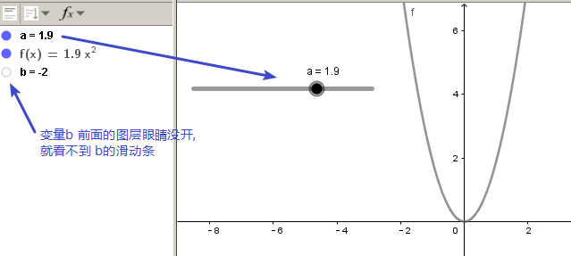

把图形隐藏掉的好处是什么? 比如你多个"点"在同一个坐标处, 你不想某一个"点"被移动, 就可以暂时把它隐藏起来(相当于锁定功能).

---

== 平移 -> 新对象= Translate [原对象, 某向量]

平移后的新对象名称 A'= Translate [原对象A,向量v]，可建立将原对象以向量 v 为基准，所建立的新平移后对象。

....
A'= Translate[A,v]
//将点A, 以向量v的长度和方向, 平移到新的点A'
....

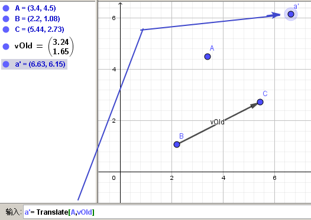

....
newLine = Translate[oldLine, vOld]
//将直线oldLine, 以向量vOld的长度和方向, 平移到新的直线位置newLine处.
....

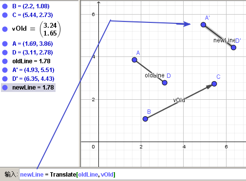

....
newTriangle = Translate[oldTriangle, vOld]
//将三角形oldTriangle, 以向量vOld的长度和方向, 平移到新的三角形位置newTriangle处.
....

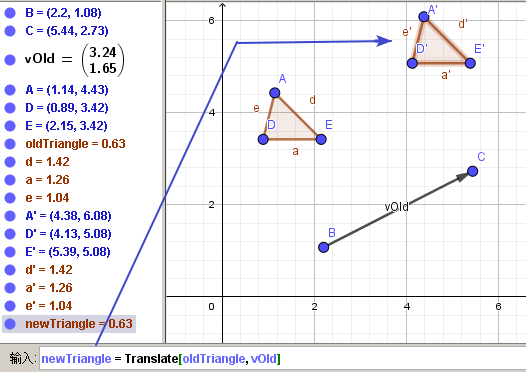

---

== 旋转 -> 新变量 = rotate[被旋转对象, 旋转角度, 旋转中心点]

....
line2 = rotate[line1, angle, pointA]
\\ 将line1, 以pointA为旋转中心, 逆时针旋转angle角度, 得到的新line赋给新变量 line2.
....

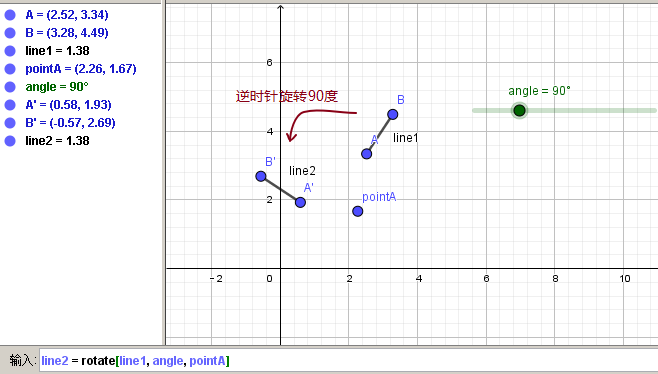

....
newTriangle= rotate[oldTriangle, angle, pointA]
\\ 将三角形oldTriangle, 以pointA为旋转中心, 逆时针旋转angle角度, 得到的新三角形赋值给新变量 newTriangle.
....

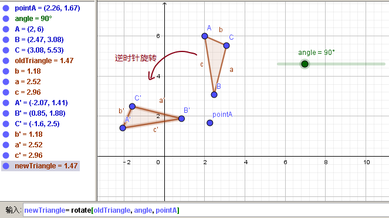

== ----- -----

---

== 点

==== 绘制"点" -> 点名大写=(x坐标,y坐标)

....
P=(3,2)
....
构造点P

注意: Geogebra对字母大小写敏感. 所以, 点名必须用大写! 不能用小写, 用小写会变成箭头:

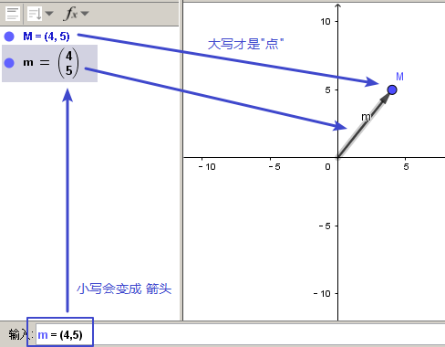

[options="autowidth"]
|===
|Header 1 |Header 2

|点
|要使用大写字母为首的名称； +
例如：A=(1,2)

|线段, 线, 圆, 函数名, 变量名
|用小写字母为首来命名. +
如： +circle c: (x-2)\^2+(y-1)^2=16 +
f(x)=3*x+2
|===

---

==== 以某一点为基础, 创建另一个点 -> 新点 = 老点+(x坐标的位移值, y坐标的位移值)

....
B=A+(0,3)
// B点的坐标是A点坐标的(x+0,y+3), 即B点是从A点向上平移3个单位.
....

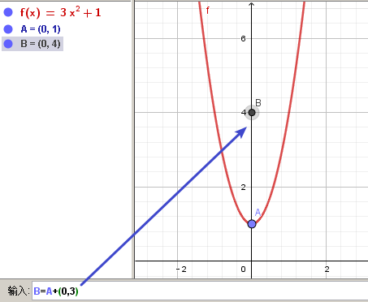

---

==== 获取某点的坐标 -> x(某点的变量名), y((某点的变量名)

这个类似于编程中的 x()函数, 功能是获取某点的x坐标.

....
S=(x(A), slope)

//创建一个S变量, 它是一个点.
x(A)给出点Ａ的ｘ轴坐标; y(A)给出点A的y坐标.
slope也是个变量, 它是某条函数曲线的某点处的斜率. 可以用 : "变量名slope=Slope[切线]" 来获得.
....

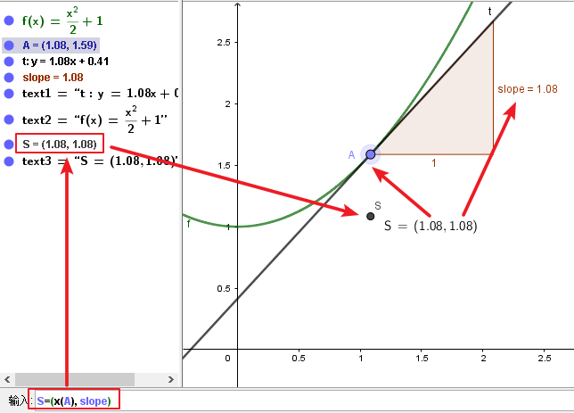

---

== 交点 -> A=Intersect[a, b]

....
A=Intersect[a, b]
//创建直线 a、b 的交点, 赋值给变量A
....

---

== 中心点 -> C=Midpoint[A, B]

....
C=Midpoint[A, B]
//创建点 A、B 之中点, 赋值给变量C

或
C=Midpoint[s]
//创建直线s的中点, 赋值给变量C
....

---

== ----- -----

---

== 线段

==== 画线段 -> 线段名=Segment[点1,点2]

可以用命令来输入 :
....
s=Segment[A,C]
//这个意思为: 创建一个经过 A 和 C点的线段,
并且对该线段, 起名为s线段.

对图形起"变量名"有什么好处? 就可以像编程一样, 在其他地方来引用这个变量名了!
比如 : 你要在这个 名叫s的 线段上, 取它的中点, 就可以用这个命令:
D=Midpoint[s]
同样, 我们给新建的中点, 起变量名叫 D.
....

---

==== 线段 : 保持水平或垂直, 或斜45度 -> 按 alt + 画线段

绘制直线/线段时, 按住键盘上的Alt键，可以15° 为单位, 来选择倾斜角。

---

== 直线

==== 过已存在的两点, 来绘制直线

A, B 两点若已存在, 就可以用
....
Line[A,B]
....
命令, 来创建经过这两点的直线.

---

== 切线 -> 先选点, 再选圆

依次选择点和圆, 就能做切线.  +
比如下例, 先选中B点, 再选中圆.

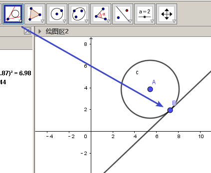

---

== 射线 -> 新变量名=Ray[起点,点2]

....
b=Ray[A,B]
// 起点 A 通过 B 点的射线。

或
c=Ray[A,v]
// 起点 A 且方向为 v 向量方向射线。
....

---

== 垂直线 -> 新变量名 = PerpendicularLine[通过的某点, 某直线]

Perpendicular : n. / v.  ~ (to sth) 垂直的；成直角的 +
-> per-,整个的，-pend,悬挂，词源同depend,pendulum.引申词义垂直的。 +
- Are the lines perpendicular to each other? 这些直线相互垂直吗？

....
L=PerpendicularLine[C,a]
\\ 通过点C, 且垂直于 a 的直线。

或
L=PerpendicularLine[C,u]
\\通过点C,  且垂直于向量 u 的直线。
....

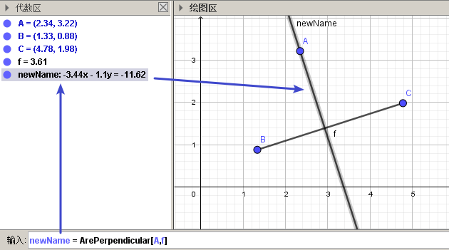

---

== 中垂线 -> 新变量名==LineBisector[某线段]

....
L=LineBisector[A,B]
\\ 创建线段 AB 的中垂线, 赋值给变量 L

L=LineBisector[s]
\\s 线段的中垂线
....

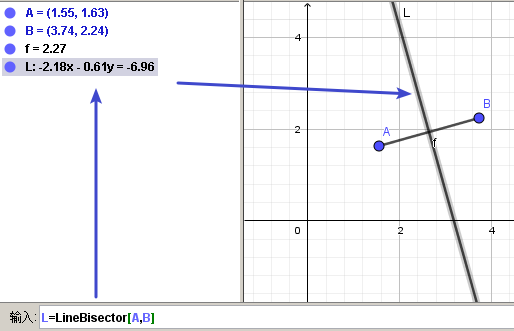

---

== 平行线 -> 新变量名=line[通过某点,平行于某直线]

....
L=line[C,a]
//通过 C 点, 且平行于 a 直线的直线
....

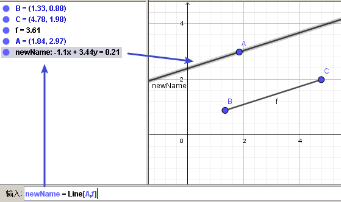

---

== ----- -----

---

== 角度

....
α=Angle[A,B,C]
//以 B 为顶点，线段BA 和 线段BC 为两边的夹角.
注意 A、C 二点的点选顺序，是采用"逆时针"方向的有向角观念。
....

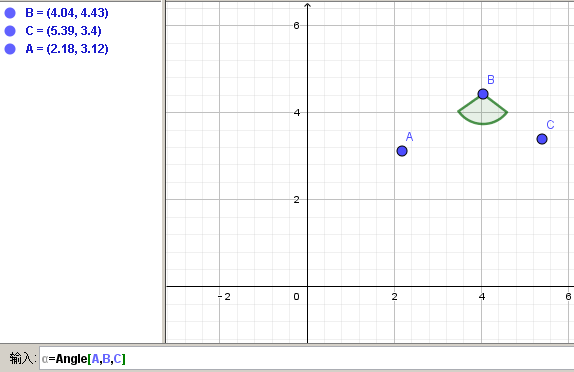

---

== ----- -----

---

== 多边形

依次点击多边形的所有顶点，就构成了一个多边形。

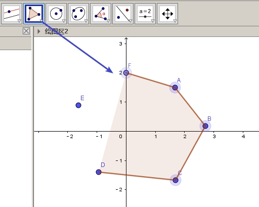

---

== 经过某几个点的多边形 -> 新变量名 = Polygon[点1,点2,边数n]

....
Poly1=Polygon[A,B,n],n≧3
\\ 创建出包括点 A、B 的正 n 边形
....

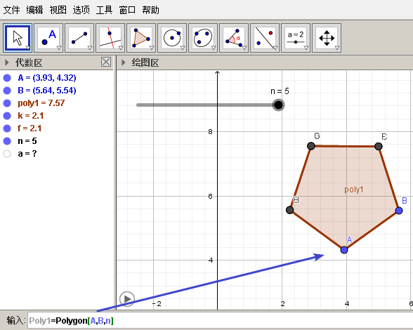

---

== 圆形

==== 画圆形 -> 新圆的变量名=Circle[圆心,圆周上的任意一点]

....
d=Circle[D,C] //这里中括号[], 写成小括号() 也行.
//以点D为圆心, 经过点C的圆, 并且对新建的该圆, 起变量名为d.
....

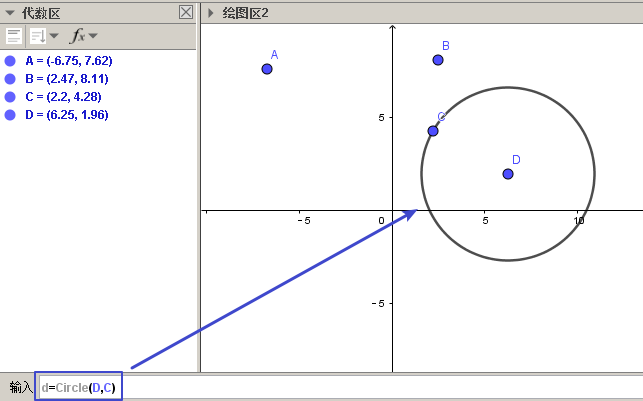

---

==== 创建圆

....
c=Circle[M,r]
\\ 圆心M, 且半径为 r 的圆。

c=Circle[M,s]
\\ 圆心M, 且半径为 s 的长度的圆，其中s 为一已知线段。

c=Circle[M,A]
\\ 圆心M, 通过点 A 的圆。

c=Circle[A,B,C]
\\通过三点 A、B、C 的圆。
....

---

== 扇形 -> 新变量名=CircularSector[圆心, 起点, 终点]

....
c=CircularSector[M,A,B]

\\ 圆心为M，起点为A, 终点为B的扇形，
注意 : A、B 两点点选的顺序，是采用"逆时针"方向的.
....

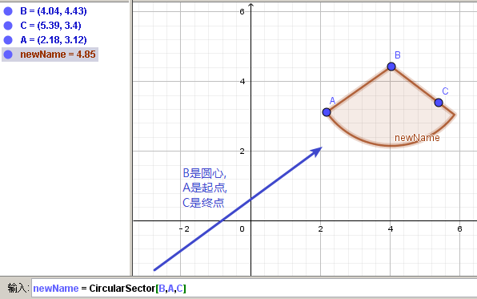

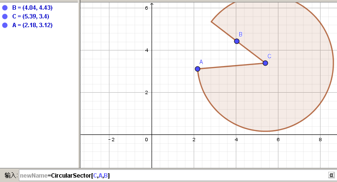

---

== 圆弧 ->  newName = CircularArc[圆心, 起点, 终点]

....
c=CircularArc[M,A,B]
\\ 圆心为M，起点为A、终点为B 的圆弧，注意 A、B 两点的点选的顺序，是采用"逆时针"方向的有向角观念。
....

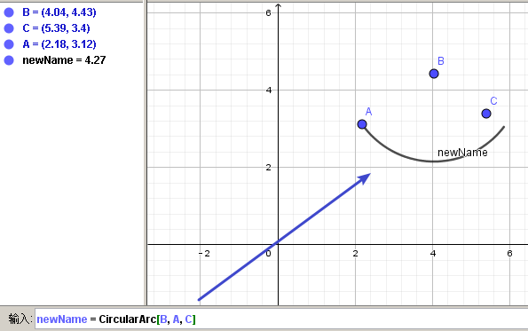

---

== 圆弧 ->  newName = CircumcircularArc[点1,点2,点3]
....
c=CircumCircularArc[A,B,C]
\\依序通过 A、B、C 三点的圆弧。
....

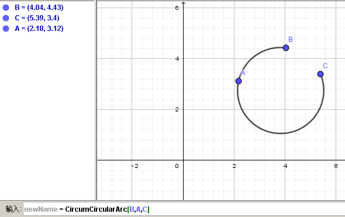

---

== ----- -----

---

== 函数

==== 自定义函数的名字 -> yourName(x) = 解析式

即, 写成形如 "f(x) = 函数公式"的形式. 将 f 换成你自定义的函数名即可.
....
yourName(x) = ax^2 + 2x -1
....

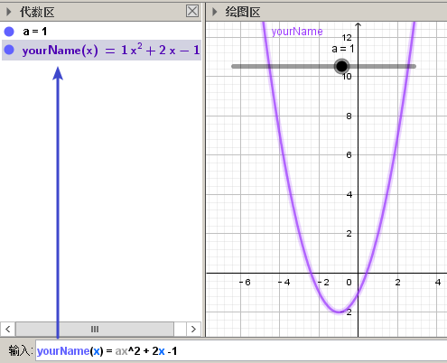

注意 : 不要同时输入两条 f(x) = ... , 这其实是相同的函数名, 你第二次输入的函数, 会把第一次输入的同名函数覆盖掉! 所以, 当你要输入两条函数时, 函数名不能一样!

注意: 如果你写成 y =  ax^2 + 2x -1 , 虽然画出来的图好像是一样的, 但这并不表示一个函数，而是一个曲线方程!  此时的 x 和 y 不是"自变量"和"因变量"的意思，而是代表着曲线上某点的两个坐标。

函数, 和曲线方程, 本质是不一样的:

- 函数: 只能"一对一"或"多对一"(多个x映射到同一个y值)
- 曲线方程 : 是可以"一对多"的(一个x映射多个y值)

---

==== 自定义函数的名字 -> yourName : 解析式

即, 在解析式前面, 写上你起的名字, 再加一个冒号 ":"

....
myName : ax^2 - 3x +1
....

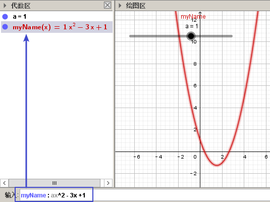

注意: 坐标轴默认的x和y, 是两个保留关键字, 不能作为你自定义的函数名.

---

==== 只在特定"定义域"上显示函数图 -> Function[解析式,x起始值,x终止值]

如 : 我们 让 x^2 的图像, 只显示 定义域在(1,3) 段上的部分

....
Function[x^2,1,3]
....

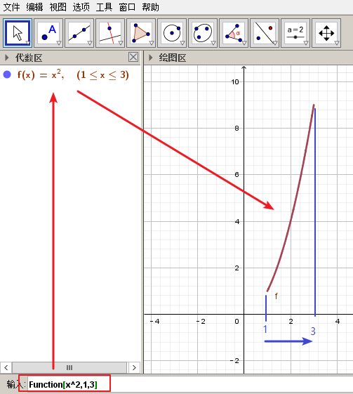

---

==== 只在特定"定义域"上显示函数图 -> f(x)=If[定义域条件, 解析式]

如, 我们要做 x^2 的图像, 定义域限定为 1≤ x ≤3

....
f(x)=If[ x<=3 && x>=1 ,x^2]
....

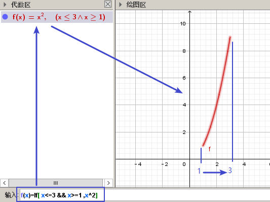

---

== 分段函数

==== 画"分段函数"的图 -> if(条件, 表达式1, 条件, 表达式2, ...)

如, 我们来话这样一个"分段函数" : +
-> 当x<0时，函数值为x； +
-> 当0<x<2时，函数值为x²； +
-> 当2<x时，函数值为sinx。

....
if(x<0, x, x>=0&&x<2, x^2, x>2, sinx)
// 注意: if和()之间不能有空格!
....

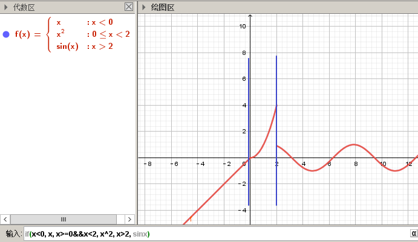

---

== 获得多项式f的根 -> R=Root[ f函数 ]

....
f(x)=0.5x3+2x2+0.2x-1
//输入三次多项式f

R=Root[ f ]
//获得多项式f的根, 每个根都以变量名R 为名字.
如果有多个根，Geogebra会自动生成下标以示区别, 如（R1,R2,R3）。
....

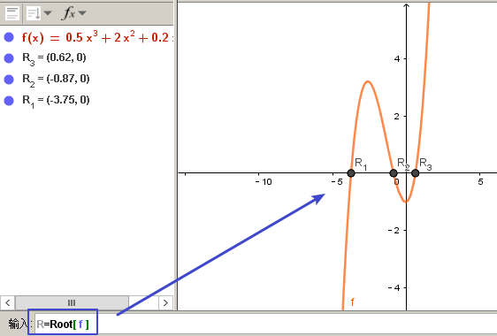

---

== 获得函数f 的"极值" -> E=Extremum[ f ]

....
f(x)=0.5x3+2x2+0.2x-1
//输入三次多项式f

E=Extremum[ f ]
//获得f的极值, 给这个极值取变量名为E
....

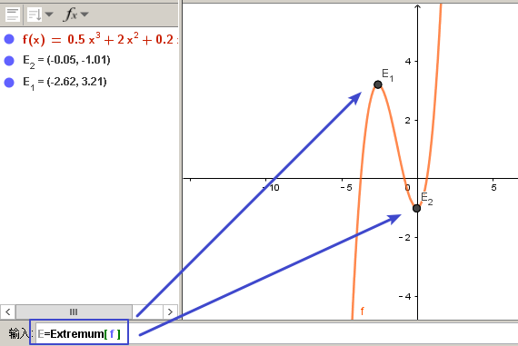

---

== 获得函数f 的"拐点" -> I=InflectionPoint[f]

....
f(x)=0.5x3+2x2+0.2x-1
//输入三次多项式f

I=InflectionPoint[f]
//获得f的拐点, 给这个拐点取变量名为 I
....

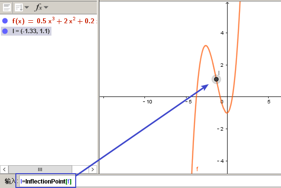

---

== 获得函数的斜率函数 -> slope=Slope[切线t]

....
f(x)=x^2 / 2 + 1

//然后, 在函数f上新建一个点A,
绘制通过A点的函数f的切线t,

slope=Slope[t] // 创建切线t的斜率, 赋给变量slope.
....

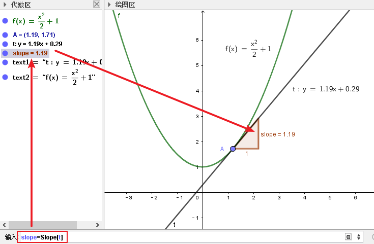

---

== ----- -----

---

== 绝对值函数 -> f(x) = abs(x)

....
f(x) = abs(x)
....

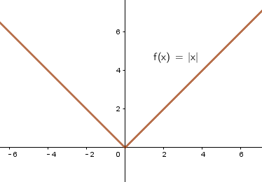

---

== 常数函数 -> g(x) = y值

....
g(x) = 3
....

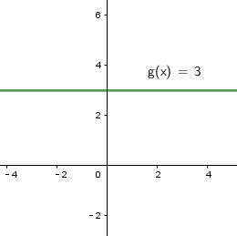

---

== ----- -----

---

== 矢量,向量

==== 创建矢量 -> 矢量变量名=Vector[点1,点2]

....
u=Vector[A,B]
// 矢量方向是从A到B. 并且, 将这个新建的矢量变量赋给 u.
....

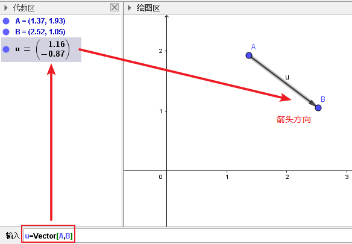

---

==== 创建矢量 -> 矢量变量名=Vector[某点]

....
a=Vector[A]
// 创建原点到 A 点的向量
....

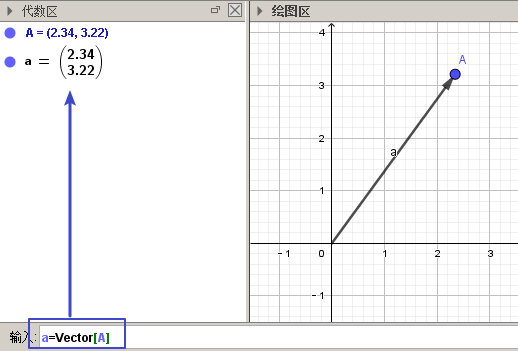

---

== 集合

==== 创建集合 -> SET={2,5,8,3,4}

....
SET={2,5,8,3,4}
\\建立名为 SET 集合，内含五个数
....

---

==== 选取某集合中的第item项元素

....
a=Element[SET,3]
\\撷取 SET 集合中的第3个元素
....

---

使用入门

41

