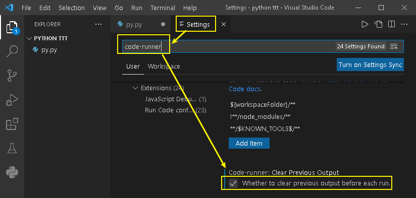

= vscode 配置 python
:toc:
:sectnums:

---

== 给右键添加运行 python程序 -> 安装 Code Runner 插件

安装 Code Runner 插件即可.

---

== 为什么 vscode 运行 python, 总是重复打印老的输出结果?

因为你忘了让 vscode 自动保存你修改过的 python文件了!

开启 "file -> auto save" 即可.

---

== 让vscode在运行代码时, 清除上一次的打印信息

在设置中 (file -> preferences -> settings), 搜索 "code-runner". 进行设置

---

