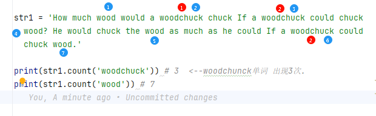

= python string
:toc: left
:toclevels: 3
:sectnums:
:stylesheet: myAdocCss.css

'''

== 换行 -> \n

注意!python的换行符是 \n, 不是 \r\n

== 格式化

---

== 增 / 连接

---

== 删

==== 移除字符串头尾指定的字符 -> str.strip([chars])

[source, python]
....
str.strip([chars]) --> new str
....
用于移除字符串头尾指定的字符序列（默认为空白符（包括'\n', '\r',  '\t',  ' ')）。

**注意: 删除的是一个字母序列! 而不是一个单词或一段短语! 即: chars 参数并非指定单个前缀或后缀；而是会移除参数值的所有组合.**

**最外侧的前导和末尾 chars 参数值, 将从字符串中移除。 开头端的字符的移除, 将在遇到一个未包含于 chars 所指定字符集的字符时停止。 类似的操作也将在结尾端发生。**

[source, python]
....
print('saaaay yes no yaaaassyas'.strip('say')) # " yes no "
print('ysassyayes no syasayyas'.strip('say')) # "es no "
....

又如:
[source, python]
....
list_str = ['http://www.google.com',
            'www.facebook.com',
            'http://www.twitter.com']

for i in list_str:
    new_str = i.strip('http://www.')  # 注意,由于strip()方法删除的是一个序列, 所以这里就包括了删除:"htp:/w."这里面的所有字符
    print(new_str)

'''
google.com
facebook.com
itter.com <-- 注意这个, twitter 中的 tw也被删除
'''
....

由于strip()返回的是一个新的字符串, 所以就支持链式调用string的方法了, 可以连着写:
[source, python]
....
str = '  a b  c,,,   '
print(str.strip().rstrip(','))  # a b  c
....

---

==== 截掉字符串左边的指定字符序列 -> str.lstrip([chars])

[source, python]
....
str.lstrip([chars]) --> new str
返回一个新字符串。
....

---

==== 删除 string 字符串末尾的指定字符序列 -> str.rstrip([chars])

[source, python]
....
str = '朝辞白帝\n'
print(str.rstrip('\n'))  # 朝辞白帝
....

---

== 改

---

== 查

==== 查找子字符串的索引值 -> str.find(str, beg=0, end=len(string))

[source, python]
....
str.find(str, beg=0, end=len(string)) --> index
....

- str -- 指定检索的字符串
- beg -- 开始索引，默认为0。
- end -- 结束索引，默认为字符串的长度。

**检测字符串中是否包含子字符串 str** ，如果指定 beg（开始） 和 end（结束） 范围，则检查是否包含在指定范围内，如果包含子字符串**返回开始字符的索引值**，否则返回-1。

[source, python]
....
str = "A man can't ride your back unless it is bent. "
print(str.find('ride'))  # 12   ride中的r字母,索引位置是[12]
print(str.find('ok')) # -1
....

---

==== 查找子字符串最后一次出现的index位置 -> str.rfind(str, beg=0 end=len(string))

[source, python]
....
str.rfind(str, beg=0 end=len(string))
....

返回字符串最后一次出现的索引位置(从右向左查询)，如果没有匹配项则返回-1。 +

[source, python]
....
str = "A year from now you will wish you had started today."

index1 = str.find('you')
print(index1) # 16  从前向后找,第一个

index2 = str.rfind('you')
print(index2)  # 30  从后向前找,第一个
....

'''

== 统计

==== 统计字符串中某个单词的数量 -> strObj.count(word)

字符串的count() 方法,用于统计字符串里, **某个字符(或子字符串)出现的次数。 (如果该字符串, 前后有其他字母包围, 也能被找到.)** +
可选参数为, 在字符串搜索的"开始"与"结束位置"。

str.count(sub, start= 0,end=len(string))

- sub -- 搜索的子字符串
- start -- 字符串开始搜索的位置。默认为第一个字符, *第一个字符索引值为0。*
- end -- 字符串中结束搜索的位置。默认为字符串的最后一个位置。

[source, python]
....
str1 = 'How much wood would a woodchuck chuck If a woodchuck could chuck wood? He would chuck the wood as much as he could If a woodchuck could chuck wood.'

print(str1.count('woodchuck')) # 3  <--woodchunck单词 出现3次.
print(str1.count('wood')) # 7

....

'''

== 转换

==== 转义 -> 转移符是: 反斜杠 \

[source, python]
....
print("doesn\'t") # doesn't
print('doesn\'t') # doesn't
....

'''

==== 忽略转义 -> r"..."

使用 "原始字符串"，可以忽略"转义符\"的转义功能，而保留原样。方法是在第一个引号前面加上一个 r:

[source, python]
....
print(r'C:\some\name')  # C:\some\name
....

'''

==== 字符和ascii码 互转

[source, python]
....
print(chr(65)) # A <-- ASCII数值 -> 转成字母
print(ord('A')) # 65 <-- 字母 -> 转成ASCII数值
....

'''

==== 编码 encode

str.encode(encoding='UTF-8',errors='strict')

- encoding -- 要使用的编码，如"UTF-8"。
- errors -- 设置不同错误的处理方案。默认为 'strict',意为编码错误引起一个UnicodeError。 其他可能得值有 'ignore', 'replace', 'xmlcharrefreplace', 'backslashreplace' 以及通过 codecs.register_error() 注册的任何值。

[source, python]
....
str1 = '谷歌'
print(str1.encode('utf-8')) # b'\xe8\xb0\xb7\xe6\xad\x8c'
print(str1.encode('gbk')) # b'\xb9\xc8\xb8\xe8'
....

[.small]
[options="autowidth" cols="1a,1a"]
|===
|Header 1 |Header 2

|GB2312
|有6763个简体汉字

|GBK是对GB2312的进一步扩展 +
（K是汉语拼音kuo zhan（扩展）中“扩”字的声母）.
|GBK收录了21886个汉字和符号

|GB18030 是 GBK的扩展
|GB18030收录了70244个汉字和字符
|===

'''

==== 解码 decode

str.decode(encoding='UTF-8',errors='strict')

Python decode() 方法, 以 encoding 指定的编码格式, 解码字符串。默认编码为字符串编码。

[source, python]
....
str1 = '谷歌'

code_utf8 = str1.encode('utf-8') #对str1, 用utf-8 来编码, 获得bytes类型对象.
print(code_utf8) # b'\xe8\xb0\xb7\xe6\xad\x8c'

print(code_utf8.decode('utf-8')) # 谷歌  <-- 对utf-8编码后的字节, 进行解码, 还原成字符串.
....

'''

