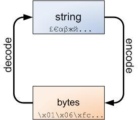

= python 乱码问题
:toc:

---

== 乱码, 往往是因为string转成bytes造成的

字符串类型, 和字节类型, 可以互相转换.
|===
|把string 进行某"编码"并转成-> bytes | 把bytes进行"解码"并转成-> string

|string字符串.encode('编码') => bytes字节
|bytes字节.decode('解码') => string字符串

|===

[source, python]
....
import chardet

string = 'zzr周芷若'

# 以 utf-8 编码对字符串string进行编码，返回一个bytes字节类型对象
byteStr = string.encode('utf-8')
print(byteStr)  # b'zzr\xe5\x91\xa8\xe8\x8a\xb7\xe8\x8b\xa5'

# 以 utf-8 编码对字符串字节byteStr进行解码，返回一个字符串string类型对象
print(byteStr.decode('utf-8'))  # zzr周芷若

....

---

== 对于 用"字符串形式"来表示的bytes内容(中文是乱码状态), 如何解码成正常中文的字符串呢? -> 'raw_unicode_escape'

[source, python]
....
import chardet

# 有b前缀的, 为bytes类型
byte_HavePreB = b"label:\xe5\xbf\x97\xe6\x84\xbf\xe8\x80\x85/\xe7\xa4\xbe\xe4\xbc\x9a\xe5\xb7\xa5\xe4\xbd\x9c\xe8\x80\x85"

# bytes转string类型, 要用 decode()来对字节解码, 才能拿到字符串
print(byte_HavePreB.decode('utf-8'))  # label:志愿者/社会工作者

# ---------------------

# 但是对于没有b前缀的, 以字符串形式来表现的字节的内容, 就无法直接使用 decode()来解码了. 因为字符串没有decode方法!
str_byteNoPreB = "label:\xe5\xbf\x97\xe6\x84\xbf\xe8\x80\x85/\xe7\xa4\xbe\xe4\xbc\x9a\xe5\xb7\xa5\xe4\xbd\x9c\xe8\x80\x85"

# print(str_byteNoPreB.decode('utf-8')) # 报错 AttributeError: 'str' object has no attribute 'decode'

'''
只能使用这种方式来解决问题:
1. 先把这个字符串string编码(encode)成bytes字节(用'raw_unicode_escape'来编码),
2. 再把字节bytes解码(decode)成字符串string.
即:  string形式的bytes内容.encode('raw_unicode_escape').decode()
'''
print(str_byteNoPreB.encode('raw_unicode_escape').decode())  # label:志愿者/社会工作者

....

---

== jetbrain系列软件, 对中文输出是"\xbf\xe8\x80"乱码的问题

其实, 类似"\xbf\xe8\x80"的乱码, 它不是字符串, 而是字节bytes! 但在把字节转成字符串之前, 我们首先需要知道该字节到底是什么编码的? chardet模块可以帮我们做到这一点.

当我们拿到一个bytes时，就可以对其检测编码:
[source, python]
....
chardet.detect(b'Hello, world!') # 对字节进行编码猜测
{'encoding': 'ascii', 'confidence': 1.0, 'language': ''}
....

又如:
[source, python]
....
data = '离离原上草，一岁一枯荣'.encode('gbk') # encode()会返回bytes类型对象
chardet.detect(data)
{'encoding': 'GB2312', 'confidence': 0.7407407407407407, 'language': 'Chinese'}
....
检测的编码是GB2312，注意到GBK是GB2312的超集，两者是同一种编码，检测正确的概率是74%，language字段指出的语言是'Chinese'。

获取到字节的编码后，就能转换为str了。

[source, python]
....
import chardet

# \x...这样的中文乱码, 其实它不是字符串, 而是字节bytes !
byteStr = b"label:\xe5\xbf\x97\xe6\x84\xbf\xe8\x80\x85/\xe7\xa4\xbe\xe4\xbc\x9a\xe5\xb7\xa5\xe4\xbd\x9c\xe8\x80\x85"

# 为了把字节转成字符串, 我们先用 chardet 模块来看看这个字节(乱码)是什么编码的?
print(chardet.detect(byteStr))  # {'encoding': 'utf-8', 'confidence': 0.99, 'language': ''}

# 把字节转成字符串, 方法是: str(字节, encoding=编码)
print(str(byteStr, encoding='utf-8'))  # label:志愿者/社会工作者

# 或用: 字节.decode('解码') , 就能返回string
print(byteStr.decode('utf-8'))  # label:志愿者/社会工作者
....

---

== 有些网站, 用scrapy爬取到的html代码, 不是string类型, 而是bytes类型的, 当你直接打印它时也会是中文乱码状态

比如智联招聘网站, 用response.body()拿到该页面html时, 发现该内容居然是个bytes字节类型的, 所以, 我们必须先把这个字节类型, 转成字符串类型才行. 即, 用 response.body.decode('utf-8') 方法来拿到string类型的html代码. 然后再用css()选择器, 来进一步提取你想要的内容.

---

