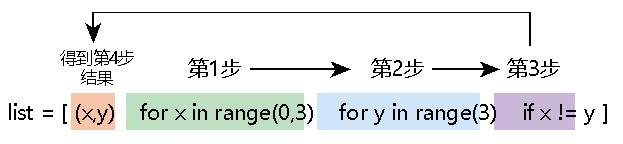
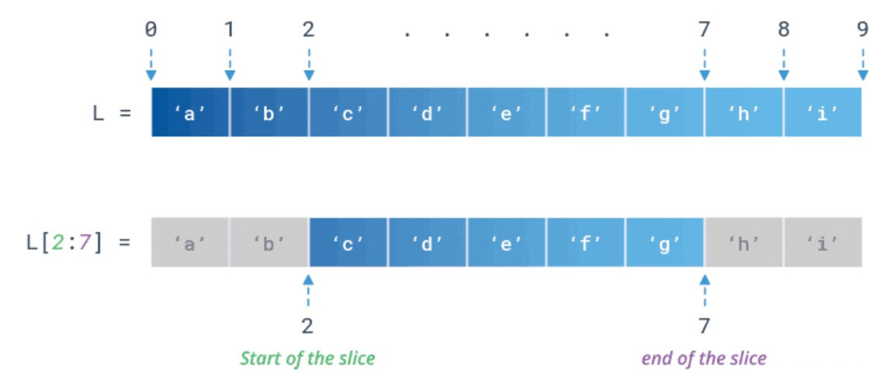
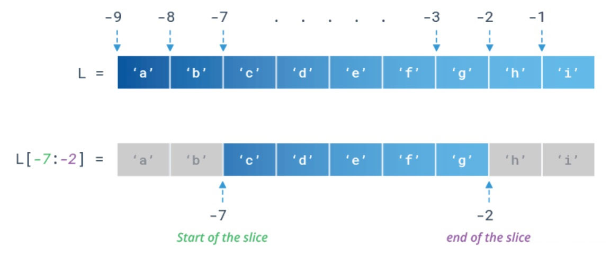
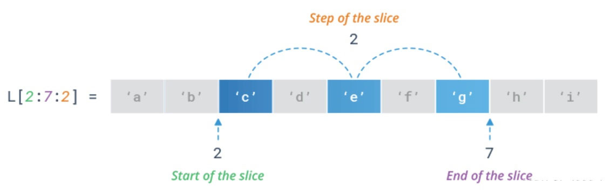

= list
:toc: left
:toclevels: 3
:sectnums:
:stylesheet: myAdocCss.css

'''

== 创建

==== 列表推导式（又称解析式）

推导式（又称解析式）,推导式是可以从⼀个数据序列  构建另⼀个新的数据序列 的结构体。 共有三种推导 :

- 列表(list)推导式
- 字典(dict)推导式
- 集合(set)推导式

利用"列表推导式"（list comprehensions）, 可以动态地创建新列表. +
python早就支持函数式编程特性, 例如 lambda, map() 和 filter()等. 但通过列表解析, 它们可以被简化成一个列表解析式子.

列表解析的语法:

[source, python]
....
[expr表达式    for iter_var in iterable    if cond_expr]
....
加入了判断语句，只有满足条件的内容, 才把iterable里相应内容放到iter_var中.

[source, python]
....
m = [x*x   for x in range(10)]
'''
注意左右两边必须要加的[]中括号，因为它是‘列表’推导式.
这个x从哪里来? 就是从后面的for循环语句中诞生.
'''
print(m)   # [0, 1, 4, 9, 16, 25, 36, 49, 64, 81]
....

还可以对“列表推导式”加筛选条件，比如下例中，我们筛选出可以被3整除的那些数字。
[source, python]
....
m = [x*x   for x in range(30)   if x % 3 == 0]
print(m)   #[0, 9, 36, 81, 144, 225, 324, 441, 576, 729]
....

又例:
[source, python]
....
list = [(x,y)   for x in range(0,3)   for y in range(3)   if x != y]
print(list)  # [(0, 1), (0, 2), (1, 0), (1, 2), (2, 0), (2, 1)]

# 等同于:
list = []
for x in range(3):
    for y in range(3):
        if x != y:
            list.append((x,y))

print(list)  # [(0, 1), (0, 2), (1, 0), (1, 2), (2, 0), (2, 1)]
....

值得注意的是在上面两个方法中的 for 和 if 语句的前后顺序, 完全对应! 先for x, 后for y, 再 if 判断。

[source, python]
....
外列表= [[1,2,3], [4,5,6], [7,8,9]] # 每个元素都是一个list,假设我们称之为 "内列表"

list2 = [元素   for 内列表 in 外列表   for 元素 in 内列表]
'''
按语句的前后顺序, 先解包外列表(得到内列表),
再解包内列表(得到内列表中的每个元素), 得到的最内层的元素,
就作为这个列表生成式生成的list2的元素.
'''
print(list2)  # [1, 2, 3, 4, 5, 6, 7, 8, 9]
....

列表生成式中的元素, 如果想要得到一个类型是元组的元素, 就给它加上小括号.
[source, python]
....
list = [(x, x**2)     for x in range(6)]  # 列表中的每一个元素,是元组. 因为有小括号括起来.
print(list)  # [(0, 0), (1, 1), (2, 4), (3, 9), (4, 16), (5, 25)]
....

列表推导式, 可使用复杂的表达式和嵌套函数:
[source, python]
....
import math
list1 = [round(math.pi, 保留几位小数)   for 保留几位小数 in range(6)]
# 分别从range(6)中, 获得保留0位小数, 保留1位小数,… 保留5位小数
print(list1)  # [3.0, 3.1, 3.14, 3.142, 3.1416, 3.14159]
....

注意: **虽然有'列表推导式', 但是没有'元组推导式',** 因为元组是不可变对象, 其元素是不能修改的.

---

==== 创建一个含N个可变类型对象的列表

python中, 列表list和字典dict是可变数据类型.

错误的方法是:
[source, python]
....
three_list = [None]*3 # 因为列表是可变的，所以 * 操作符（如上）将会创建一个包含N个且指向 同一个 列表的列表，这可能不是您想用的。
print(three_list) # [None, None, None]
print(three_list[0] is three_list[1]) # True
....

正确的方法是: 用列表解析式：
[source, python]
....
four_lists = [[] for __ in range(4)]  # "__"表示我们不需要用到这个变量的值, 就将值存在这个"__"的变量名里
print(four_lists) # [[], [], [], []]
print(four_lists[0] is four_lists[1]) # False
....

'''

==  list()方法

list() 方法, 用于将"元组"转换为"列表"。即 list( tup ), 它返回一个列表. +
元组与列表是非常类似的，区别在于**元组的元素值不能修改，元组是放在圆括号()中，列表是放于方括号[]中。**

[source, python]
....
tuple_zrx=('zrx',19,'male')
list_zrx = list(tuple_zrx) # list() 能将传入的元组, 转成列表

print(list_zrx) # ['zrx', 19, 'male']
....

[source, python]
....
dict1 ={'x':1,'y':2}
print(dict1.keys()) # dict_keys(['x', 'y'])

print(list(dict1.keys())) # ['x', 'y']  # 可以用list() 来把dict中的 key 存在一个列表中.
....

'''

== 增 / 连接

==== 添加元素到list尾部 -> list.append(x)

list.append(元素) 与 list + [元素] 的效果是类似的, 只不过 前者是在原位改变, 后者是生成一个新的列表. +
和'+'合并不同, 由于append无需生成新的对象, 所以它通常速度更快.

---

==== 添加n个元素到list尾部 ->  list[len(list):] = [x]

用 list[len(list):] = [x]  相当于在一个列表的尾部追加n个新元素.

[source, python]
....
list = [0, 1, 2, 3] # 其列表长度为4, 所以 list[len(list)]=list[4], 即其中第5个元素的位置.
list[len(list):] = [77, 88, 99]  # 将比索引[-1]还要后面的一个元素, 值改成三个新元素, 相当于将新元素添加到list尾部.
print(list)  # [0, 1, 2, 3, 77, 88, 99]
....

---

==== 添加n个元素到list头部 -> list[:0] = [x]

用 list[:0] = [x]  相当于在一个列表头部追加.

[source, python]
....
list = [0, 1, 2, 3]
list[:0] = [77, 88, 99]  # 将比索引[0]还要前面的一个元素, 值改成三个新元素, 相当于将新元素添加到list头部.
print(list)  # [77, 88, 99, 0, 1, 2, 3]
....

---

==== 添加元素到指定index处 ->  list.insert(index, x)

index: 是准备插入到其前面的那个元素的索引， +
例如 a.insert(0, x) 会将x插入到整个列表之前， +
而 a.insert(len(a), x) 相当于 a.append(x)。

[source, python]
....
list1 = ['item1', 'item2']
list1.insert(1, 'new1')
print(list1)  # ['item1', 'new1', 'item2']

'''
注意!! 对list的修改, 都会直接修改原数组.
所以对list的修改, 千万不要重新赋值给一个新列表,
否则就是指针指向新的同名空列表,而老的list就丢失了. 如下:
'''
list1 = list1.insert(0, 'new2')
print(list1)  # None
....

---

==== 扩展列表 -> listA.extend(ListB)

listA.extend(ListB) 是将列表B中的所有元素, 都添加到列表A中，相当于 a[len(a):] = ListB。

[source, python]
....
list1 = [1,2,3]
list2 = [5,6,7]
list1.extend(list2)
print(list1)  # [1, 2, 3, 5, 6, 7]
....

---

=== 连接 -> 加号+

可以直接用 + 加号, 来连接两个列表

[source, python]
....
list1 = [1, 4, 9]
list2 = list1 + ['a','b','c']
print(list2)  # [1, 4, 9, 'a', 'b', 'c']
....

---

== 删

==== 删除第一处出现的某元素 -> list.remove(被删元素x)

[source, python]
....
array.remove(x)
....
Remove **the first occurrence of x** from the array.

删除列表中值为 x 的第一个元素。如果没有这样的元素，就会返回一个错误。

[source, python]
....
list1 = [1,2,3,4,5,3]
list1.remove(3) # remove方法只会删除第一个该元素,本例中有两个3存在,所以只会删除第一个3.
print(list1) # [1, 2, 4, 5, 3]
....

---

==== 删除并返回某index处的元素 ->  list.pop([index])

[source, python]
....
array.pop([index])
....
Removes the item with the index i from the array and returns it. **The optional argument defaults to -1**, so that by default the last item is removed and returned.

从列表的指定索引位置处, 删除元素，并将其返回。如果没有指定索引，a.pop() 返回最后一个元素。元素随即从列表中被删除.  +
（方法中参数 index 两边的方括号表示这个参数是可选的，而不是要求你输入一对方括号，你会经常在Python 库参考手册中遇到这样的标记）。

[source, python]
....
list1 = [1,2,3,4,5,3]
list1.pop(3) # 弹出第3个索引位置处的元素
print(list1) # [1, 2, 3, 5, 3]
....

---

==== 删除一段切片 -> del list[index]

注意,这个不是list的方法,而是python的内置函数. +
该函数可以从列表中, 按给定的索引(而不是值) 来删除一段切片.

[source, python]
....
list = [-1, 1, 66.25, 333, 333]
del list[1] # 删除索引[1]处的元素
print(list)  # [-1, 66.25, 333, 333]

# ---

list = [-1, 1, 66.25, 333, 333]
del list[1:3]  # 删除切片
print(list)  # [-1, 333, 333]

# ---

list = [-1, 1, 66.25, 333, 333]
del list[:]  # 删除整个列表切片
print(list)  # []

# ---

del list  # del 也可以删除整个变量, 该变量就不存在了
....

---

==== 删除一段切片 -> 将该片段的所有元素, 赋值空值即可

可以用片分赋空值的方法, 来切掉列表中的一部分片段.

[source, python]
....
列表=[1,2,3,4,5,6,7,8]
列表[2:4]=[]  # 用空列表,赋值给原列表的2-3索引位置
print(列表) #[1,2,5,6,7,8]
....

---

==== 清空所有元素, 但不删列表 -> list.clear()

[source, python]
....
list1 = [1,2,3,4,5,3]
list1.clear()
print(list1) # []
....

---

== 改

==== 修改列表元素的值

由于列表是可变的,所以你直接对元素赋值, 就是在改变它的值!

[source, python]
....
list = ['zzr', 19, 'female']
list[1] = 23 # 直接赋值给元素, 就能修改列表
print(list)  # ['zzr', 23, 'female']
....

注意, 片分赋值时, 片分的长度,不一定要和新赋值的切片长度相等.

[source, python]
....
list = [0, 1, 2, 3]
list[1:2] = [77, 88, 99]  # 片分只切了1个元素,但赋值却可以给n个元素
print(list)  # [0, 77, 88, 99, 2, 3]
....

这是为什么? 其实, 片分的赋值事实上是分为两步的: (1)python先删除等号左边指定的片分, (2)然后在旧片分删除的位置插入一个新的. 所以, 插入项的数,可以与删除的项数不匹配.  +
你可以删除1个旧元素, 插入n个新元素.

---

== 查

==== 拿到第一个值为x的元素的index索引 -> list.index(x)

[source, python]
....
array.index(x)
....
Return the smallest i such that i is **the index of the first occurrence of x** in the array.

返回列表中第一个值为 x 的元素的索引。如果没有匹配的元素就会返回一个错误。

[source, python]
....
list1 = [1,2,3,4,5,3]
print(list1.index(3))  # 2   第一个值是3的元素,其索引值是[2]
....

---

==== 用字段来代替索引号, 来索引列表

[source, python]
....
listZzrInfo = ['zzr', 19, 'female']
name, age, sex = range(3)
'''
 直接拆包可迭代对象.
 现在,name=0, age=1, sex=2, 我们就可以用这三个字段,来代表这三个索引号了!
'''
print(name, age, sex)  # 0 1 2

print(listZzrInfo[2])  # female
....

---

== 统计

==== 统计x元素在列表中出现的次数 -> list.count(x)

[source, python]
....
list1 = [1,2,3,4,5,3]
print(list1.count(3))  # 2
....

---

==== 统计list中一共有多少个元素?

[source, python]
....
len(list1)
....

---

== 切片

==== list[start:end:step]

- start : 表示切片开始的位置,默认是0
- end : 表示切片截止的位置(不包含),默认是列表长度
- step : 表示切片的步长,默认是1
- 当step为负数时,表示反向切片, 这时start值应该比end值大.
- 注意:切片操作创建了一个新的列表.

[source, python]
....
list1 = [i  for i in range(10)]
print(list1) # [0, 1, 2, 3, 4, 5, 6, 7, 8, 9]

#逆序
print(list1[::-1]) # [9, 8, 7, 6, 5, 4, 3, 2, 1, 0]

#获取索引值是"偶数位"的元素
print(list1[::2]) # [0, 2, 4, 6, 8]

#获取索引值是"奇数位"的元素
print(list1[1::2]) # [1, 3, 5, 7, 9]

#获取切片(注意"包头不包尾")
print(list1[3:5]) # 获取index=3到4 范围的元素: [3, 4]

#替换列表中某切片的内容. 注意, 使用下面的方法, 会直接修改原list.
list1[5:9] = ["A","B","C","D"] # 替换index=5到8 的内容为 "A,B,C,D"
print(list1) # [0, 1, 2, 3, 4, 'A', 'B', 'C', 'D', 9]

#删除列表中某切片的内容, 使用del关键字. 注意, 该方法会直接修改原list.
del list1[4:8] # 将 index = 4到7的内容, 全删除
print(list1) # [0, 1, 2, 3, 'D', 9]
....

---

==== 切片(浅拷贝) -> [:]

对列表进行切片, 会返回一个切片(新列表)的（浅）拷贝副本。

[source, python]
....
list1 = [1, 4, 9, 16, 25]
list2 = list1[:]
print(list2 is list1)  # False
....

又如:
[source, python]
....
listA = [1,2,[3,4]]
listB = listA[:]  # 浅拷贝

listA[2].append(99)  # listA[2]即第3个元素,是一个引用类型,list
print(listA) # [1, 2, [3, 4, 99]]
print(listB) # [1, 2, [3, 4, 99]] # 可见，对a的修改影响到了b。
....

切片的index, 包头不包尾
[source, python]
....
str = 'abcd'
print(str[:1])  # a  <-- 索引包前不包后,所以这句是取到第0个索引值, 即字母a
....

对于字符串来说, 这使得 s[:i] + s[i:] 永远等于 s.

|===
|s[:i] |+ |s[i:] |= |s

|(0)->(i-1)
|
|(i) -> 最末一位
|
|全部元素
|===

---

==== 每隔几步取一个元素 -> [::步长]

列表切片, 两个冒号 :: 时的情况, 第三个索引值表示"步长"参数

[source, python]
....
list=[1,2,3,4,5,6,7,8,9]
print(list[::3])  #[1, 4, 7]   第三个索引值, 是步长参数, 本例即每三个元素取一个
....

---

== 拷贝

==== 浅复制列表, 方法1 -> list2 = list(list1)

复制列表（或多数内置的"可变集合"）最简单的方式, 是使用内置的类型构造方法。例如：

[source, python]
....
list1 = [1,2,[66,77]]
list2 = list(list1)  # 浅复制列表

list1[2].append(88)

print(list1) # [1, 2, [66, 77, 88]]
print(list2) # [1, 2, [66, 77, 88]] <-- 浅复制的列表, 引用类型的元素, 是共享状态的.
....

'''

==== 浅复制, 方法2 -> list2 = list1[:]

[source, python]
....
list1 = [1,2,3]
list2 = list1[:]

print(list1 == list2) # True   <- == 用于判断引用变量的值, 是否相等。

print(list1 is list2 ) # False  <- is 用于判断两个变量引用对象是否为同一个内存地址.  a is b 相当于 id(a)==id(b)，id() 能够获取对象的内存地址。
....

is 与 == 区别 ： +
如果 a=10; b=a; 则此时 a 和 b 的内存地址一样的; +
但当 a=[1,2,3]; 另 b=a[:] 时，*虽然 a 和 b 的值一样，但内存地址不一样。*

Python出于对性能的考虑，**但凡是"不可变对象" (int，string，float，tuple)，**在同一个代码块中的对象，*只有是值相同的对象，就不会重复创建，而是直接引用已经存在的对象。*

[source, python]
....
a= 10 # int类型是"不可变对象"
b= 10

print(a==b) # True
print(a is b) # True

print (id(a)) # 140734818935880
print (id(b)) # 140734818935880
....

'''

==== 浅拷贝 -> list.copy()

返回列表的一个浅拷贝。等同于 a[:]。

[source, python]
....
listA = [1,2,[3,4]]
listB = listA.copy()  # 浅拷贝

listA[2].append(99)  # listA[2]即第3个元素,是一个引用类型,list
print(listA) # [1, 2, [3, 4, 99]]
print(listB) # [1, 2, [3, 4, 99]]
....

---

==== 深拷贝 -> listB = copy.deepcopy(listA)

为了解决浅拷贝,对引用类型的元素,无法复制出完全独立的一份的问题, 我们使用深拷贝. 使用copy模块中的deepcopy()函数。

[source, python]
....
import copy
listA = [1,2,[3,4]]
listB = copy.deepcopy(listA)  # 深拷贝

listA[2].append(99)  # listA[2]即第3个元素,是一个引用类型,list
print(listA) # [1, 2, [3, 4, 99]]
print(listB) # [1, 2, [3, 4]] 不受影响了!
....

---

== 排序 / 变换

==== 对元素排序 -> list.sort()

[source, python]
....
list = [3, 17, 2, 99, 45, 38, 52, 41, 82]
list.sort()  # 默认是升序排列元素, 会直接改变原数组
print(list)  # [2, 3, 17, 38, 41, 45, 52, 82, 99]

list.sort(reverse=True)  # 加上参数reverse=True, 就是降序排列元素
print(list)  # [99, 82, 52, 45, 41, 38, 17, 3, 2]
....

注意: **append()和sort()方法, 会直接改变原列表, 所以它们没有返回值**(严格的说, 会返回一个 None值), 不会返回新列表.  +
所以如果你写成 new_list = list.append(x)的话, 是得不到list调整后的结果的. 事实上, 你会同时失去对列表的引用.

---

==== 反转顺序, 会直接修改原list -> list.reverse()

Reverse the order of the items in the array.

注意: 这里是按索引值颠倒过来, 而非元素值从大到小或从小到大排!

[source, python]
....
list1 = [1,2,3,10,15,13]
list1.reverse()
print(list1) # [13, 15, 10, 3, 2, 1]
....

---

==== 反转列表, 并返回一个新list -> [::-1]

注意: 这里是按索引值颠倒过来, 而非元素值从大到小或从小到大排!

[source, python]
....
list = [3, 17, 2, 99]
list2 = list[::-1]  # <--第三个步长参数为 -1 时, 可视为"翻转"操作. 注意, 会返回一个新列表!
print(list2)  # [2, 3, 17, 38, 41, 45, 52, 82, 99]

print(list)  # [3, 17, 2, 99] <--原列表不受影响
....

---

==== 嵌套列表 行列交换

对嵌套列表中的行列交换:

下面是一个由三个长度为 4 的列表组成的 3x4 矩阵, 现在，如果你想交换行和列，可以用嵌套的列表推导式:

[source, python]
....
外列表= [
    [1,2,3,4],
    [5,6,7,8],
    [9,10,11,12]
]

listB = [[内列表[i]   for 内列表 in 外列表   for i in  range(4)]
'''
按语句顺序,先从外列表中找到每一个内列表;
再从range()生成器,拿到0-3这4个数字,作为索引号;
然后获取到每一个内列表的依次这些索引号元素.

即: 第一轮循环将获得第一行的[0],第二行的[0],第三行的[0];
第二轮循环将获得 第二行的[1],第二行的[1],第三行的[1]…

新列表B的每个元素,也都是一个列表,
第一行(即第一个内列表中的元素分别是:listA[0][0],listA[1][0],listA[2][0]
'''

print(listA)  # [[1, 5, 9], [2, 6, 10], [3, 7, 11], [4, 8, 12]]
....

上面的方法, 其实等价于下面的操作:
[source, python]
....
old外列表 = [
    [1,2,3,4],
    [5,6,7,8],
    [9,10,11,12]
]

new外列表 = []  # 用于存放行列置换后的新列表

for i in range(4):  # 最终会生成4个内列表.
# 注意,这里的语句顺序,和上面的列表推导式中的, 顺序不同, 这里是先range,后for内列表.
    new单个内列表 = []
    for old单个内列表 in old外列表:
        new单个内列表.append(old单个内列表[i])
    new外列表.append(new单个内列表)

print(new外列表) # [[1, 5, 9], [2, 6, 10], [3, 7, 11], [4, 8, 12]]
....

其实, 这里用zip() 函数会更方便.

---

==== 乱序化元素 -> random.shuffle(list)

乱序化列表, 原list会就地改变

[source, python]
....
import random
list1 = [1,2,3,4,5,6]

random.shuffle(list1)
print(list1) # [3, 1, 4, 2, 5, 6
....

---

== 案例

==== 将列表, 输出每n个元素后, 就换行打印

[source, python]
....
list1 = [1, 2, 3, 4, 5, 6, 7, 8, 9, 10, 11, 12, 13, 14, 15, 16, 17]

count = 0 # 计数器

for i in list1:
    print(i, end=',')
    count += 1

    if (count / 5 == 1): # 每5个元素后, 就换行打印
        print()
        count = 0

'''
1,2,3,4,5,
6,7,8,9,10,
11,12,13,14,15,
16,17,
'''

....

---

