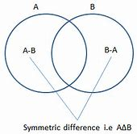

= python set集合
:toc:
---

set （集合）数据类型, 是一个无序不重复元素的集。基本功能包括关系测试和消除重复元素。

---

== 创建

==== 用大括号, 创建集合
[source, python]
....
set_basket = {'apple', 'orange', 'apple', 'pear', 'orange', 'banana'}  # 用大括号创建集合set
print(set_basket) # {'orange', 'pear', 'apple', 'banana'}
print(type(set_basket)) # <class 'set'>
....

---

==== 用set()函数, 创建集合

注意: set()只能接受1个参数,而不是多个. 所以对于多个数值, 必须放在一个list中, 再来传给set().

[source, python]
....
list1 = ['apple', 'orange', 'apple', 'pear', 'orange', 'banana']
set1 = set(list1) # 用set()函数来创建集合
print(set1) #{'apple', 'orange', 'banana', 'pear'}
print(type(set1)) # <class 'set'>
....

---

==== 用"集合推导式"来创建

集合推导式(set comprehensions),
类似于 "列表推导式" 的写法:

[source, python]
....
setA = {x    for x in 'abcdedadcdgeh'    if x not in 'abc'}
print(setA)  # {'d', 'e', 'g', 'h'}
....

---

==== 集合推导式, 案例: 选出列表中的出现次数超过1次的元素, 放在一个新集合中.

对一个列表, 排除掉只出现一次的元素, 将出现次数超过1次的元素, 放在一个集合中, 来查看到底是哪些元素?

[source, python]
....
list1 = [1, 3, 5, 7, 1, 3, 5, 9, 'a', 'b', 'c']
set1 = set(x for x in list1 if list1.count(
    x) > 1)
'''
x是从list1中取出的每一个元素, list.count(x) 返回x元素在列表list1中出现的次数。
本句的意思即, 如果元素重复出现大于1次, 就保存在set集合中.
'''
print(set1)  # {1, 3, 5}
....

---

==== 创建空集合

想要创建空集合，你必须使用 set() 而不是 {}。后者用于创建空字典.

[source, python]
....
a = set() # 用set()函数创建空集合
print(type(a))  # <class 'set'>
print(a) # set()
print(len(a))  # 0
....

---

== 增

==== 添加一项 -> set.add(item)

[source, python]
....
set1 = {1,2,3}
set1.add('a')   # 添加一项
print(set1)  # {1, 2, 3, 'a'}
....

---

==== 添加多项 ->  set.update(item1, item2, ...)

[source, python]
....
set2 = {1,2,3}
set2.update('x','o','xxoo')
print(set2)  # 添加多项 {1, 2, 3, 'x', 'o'} <--注意,'xxoo'在集合里面被分解成了'x'和'o'两个元素.
....

只有将多个元素放在一个list列表中, 作为一个整体(一个参数)传入set()集合,才不会被分解成字母:

[source, python]
....
set1 = {1,2,3}
set1.update(['xxoo','usa'])
print(set1) # {1, 2, 3, 'xxoo', 'usa'}
....

== 删

==== 删除一项 -> set.remove(item)

使用 remove()可以删除一项. **有就删除，没有就报错**

[source, python]
....
set1 = {1,2,3}
set1.remove(3)
print(set1)  #{1, 2}
....

---

==== 删除一项 -> set.discard(item)

 discard() 删除1个元素, **有就删除，没有也不会报错.**

[source, python]
....
set1 = {1,2,3}
set1.discard(2)
print(set1) # {1, 3}

set1.discard(5)  # 不存在元素5, 所以就不会删除, 也不报错.
print(set1) # {1, 3}
....

---

==== 弹出并删除 -> set.pop()

[source, python]
....
set1 = {1,2,3}
pop_item = set1.pop() # pop() 随机弹出一个, 并同时在集合中删除它
print(pop_item) # 1
print(set1) # {2, 3}
....

---

== 改

---

== 查 / 判断

==== 集合中的元素数量 -> len(set)

[source, python]
....
set1 = {1, 2, 3, 'x', 'o'}
print(len(set1)) # 5
....

---

==== 判断元素是否存在 -> item in set

|===
|方法 |说明

|x in s
|测试 x 是否是 s 的成员

|x not in s
|测试 x 是否不是 s 的成员
|===

[source, python]
....
set1 = {1, 2, 3, 'x', 'o'}
print('x' in set1) # True
....

关于查询速度: +
在set, 和dict中来查找一个项, 比在list中查找, 速度更快.

有时我们需要在集合体中查找一个元素。让我们看看这两个封装选择：列表和集合（set）。
[source, python]
....
s = set(['s', 'p', 'a', 'm'])
l = ['s', 'p', 'a', 'm']

def lookup_set(s):
    return 's' in s

def lookup_list(l):
    return 's' in l
....

对于list, 为了判断一个项是否在列表中，Python会查看每个项, 直到它找到匹配的项。这是很耗时的.
而**集合(set, dict)具有可哈希的特性, 即使集合很大，查询的速度也会很快。**

但是对于小的集合体，或者您不会频繁查找的集合体，建立哈希带来的额外时间和内存的开销, 经常会大过改进搜索速度所节省的时间。所以, 对于小数据, 你可能会发现, 在set中搜索, 要比在list中搜索, 速度更慢.

---

==== 判断子集与超集

|===
|方法 |说明

|s.issubset(t)
 即 s \<= t
|测试是否 s 中的每一个元素, 都在 t 中

|s.issuperset(t)
 即 s >= t
|测试是否 t 中的每一个元素, 都在 s 中
|===

[source, python]
....
set1 = {1, 2, 3, 'x', 'o'}
set2 = {1,'o'}
set3 = {1,9,'o'}

print(set2.issubset(set1)) # True <-- set1是set2的子集吗?
print(set3.issubset(set1)) # False

set1.issuperset(set2) # True <-- set1是set2的超集吗?
set1.issuperset(set3) # False
....

---

== 拷贝

==== 浅拷贝 -> set.copy()

s.copy() 返回 set “s”的一个浅复制.

---

== 集合关系

==== 交集 / 并集 / 差集 / 对称差集

集合对象还支持 union（联合），intersection（交），difference（差）和 sysmmetric difference（对称差集）等数学运算。

|===
|关系 |写法1 |写法2

|交集
|a&b
|set1.intersection(set2)

|并集
|a\|b
|set1.union(set2)

|差集 +
（项在a中，但不在b中）
|a-b
|set1.difference(set2)

|对称差集 = 全集-交集 +
（项在a或b中，但不会同时出现在二者中）
|a^b
|set1.symmetric_difference(set2)
|===

第一种写法, 用算数和逻辑符号:
[source, python]
....
setA = {'aa', 'ab', 'ac', 'mm'}
setB = {'ba', 'bb', 'bc', 'mm'}

print(setA - setB)  # 存在于a而不存在于b 的元素:  {'ac', 'ab', 'aa'}
print(setB - setA)  # 存在于b而不存在于a的元素:  {'ba', 'bb', 'bc'}
print(setB | setA)  # 并集 {'ab', 'aa', 'ac', 'bb', 'mm', 'bc', 'ba'}
print(setA & setB)  # 交集  {'mm'}
print(setA ^ setB)  # 对称差集=全集-交集 , 即: 项在a或b中，但不会同时出现在二者中 {'bc', 'aa', 'ba', 'ac', 'bb', 'ab'}
....

第二种写法, 用函数方法:
[source, python]
....
list1 = [1, 3, 5, 7, 0, 100]
list2 = [2, 5, 6, 8, 0, 100]

set1 = set(list1)  # 注意,要使用集合的功能,必须先把列表转换成集合数据才能使用集合的方法
set2 = set(list2)

print(set1.intersection(set2))  # 交集(两个列表里面都有的值) {0, 100, 5}

print(set1.union(set2))  # 并集（把两个列别合并起来，然后去重） {0, 1, 2, 3, 100, 5, 6, 7, 8}

print(set1.difference(set2))  # 差集（把list_1里面有的而list_2里面没有的取出来） {1, 3, 7}

print(set1.symmetric_difference(set2))  # 对称差集（两个列表里面，互相没有的取出来，也就是只去掉那些互相都有的值） {1, 2, 3, 6, 7, 8}
....

---

==== 关系测试: 子集 / 超集 / 无交集

[source, python]
....
set3 = {1, 2, 3}
set4 = {1, 2, 3, 4}

print(set3.issubset(set4))  # 子集（判断list_4是否包含了list_3里面的所有值）  True
print(set3.issuperset(set4))  # 父集（判断list_4是否为list_3的父集） False

set5 = {10, 20, 30}
set6 = {'a', 'b', 'c'}
print(set5.isdisjoint(set6))  # 无交集（判断list_5和list_6是否完全没有任何交集）True
....

---