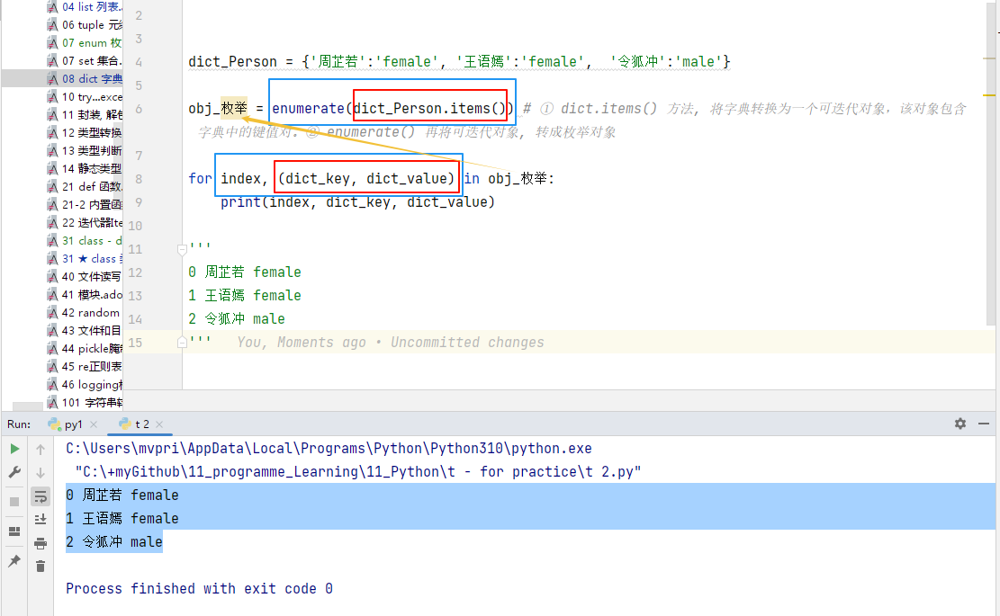

= python dict
:toc: left
:toclevels: 3
:sectnums:

'''

字典是映射,不是序列, 所以在它的项中没有'有序'这个概念. 像合并(有序连接), 分片(提取相邻片段)这样的操作都无法运用.

字典以 关键字 为索引，**关键字(key)必须是不可变类型**，通常用字符串或数值。

元组能不能做dict的key索引呢? 虽然元组是不可变的, 但如果元组中的元素是list, list不就是可变类型了吗? 如果元组中只包含字符串和数字，它可以做为dict的key关键字; 但如果元组直接或间接的包含了可变对象(比如list)，就不能当做关键字。

**如果你用一个已经存在的关键字(key),来存储新值(value)，则旧值会被丢失, 只会记住最新值.**

---

== 创建dict

==== 直接赋值创建

[source, python]
....
dictZzr = {"name": "zzr", "age": 19, "sex": "female"}
# 注意: 和JavaScript中的object不同, 在js中, obj的key可以是变量; 而在python中, 必须是字符串, 所以别忘了加引号!
....

---

==== 通过dict()函数和关键字参数创建

[source, python]
....
dictZzr = dict(name="zzr", age=19, sex="female")
# 这种方法, 里面的key就是参数变量了(不能加双引号!), 而不是字符串
....

---

==== 通过"字典推导式"创建

字典推导（dictcomp）可以从"任何以键值对作为元素的可迭代对象"中, 构建出字典。

[source, python]
....
dic = {i: 2*i     for i in range(3)}
print(dic)  # {0: 0, 1: 2, 2: 4}
....

又如:
[source, python]
....
dictA = {k: k**2    for k in (2, 4, 6)}  # k**2  就是v值
print(dictA)  # {2: 4, 4: 16, 6: 36}
....

---

==== 通过dict.fromkeys()创建

fromkeys() 函数用于创建一个新字典，以序列seq中元素做字典的键，value为字典所有键对应的初始值。

[source, python]
....
dict.fromkeys(seq[, value]))
....
key = seq +
初始值v = value

通常用来初始化字典, 设置value的默认值.

[source, python]
....
listName = ['zzr', 'wyy', 'mwq']
dictMoney = dict.fromkeys(listName, 0) # fromkeys() 属于类方法，会返回一个新字典。 value 默认为 None。
print(dictMoney)  # {'zzr': 0, 'wyy': 0, 'mwq': 0}
....

'''

== ★ 创建一个对key不区分大小写的字典

首先要安装 requests 模块, 才能用.
方法是: 在 cmd(管理员模式打开) 中, 输入命令:
....
pip install requests -i https://pypi.tuna.tsinghua.edu.cn/simple torch
....

然后, 在python文件中, 尝试:

[source, python]
....
from requests.structures import CaseInsensitiveDict

user_dict = CaseInsensitiveDict()
user_dict['name'] = 'John'
user_dict['Age'] = 25
user_dict['EMail'] = 'john@example.com'

print(user_dict['name'])
print(user_dict['age'])
print(user_dict['email'])
....

---

== 增

==== 添加元素 -> 直接赋值 dict[k] = v

要添加元素,就直接赋值

[source, python]
....
dictA = {'us':'美国','cn':'中国','eu':'欧洲'}
dictA['jp'] = '日本' # 直接赋值
print(dictA) # {'us': '美国', 'cn': '中国', 'eu': '欧洲', 'jp': '日本'}
....

---

=== 添加元素 -> old_dict.update(other_dict)

把字典dict2的键/值对更新到dict里。
该方法没有任何返回值。因为字典是可修改的对象.

[source, python]
....
dict = {'name': 'zzr', 'age': 17}
dict2 = {'sex': 'female'}
dict.update(dict2)  # 就地更新老字典
print(dict)         # {'name': 'zzr', 'age': 17, 'sex': 'female'}
....

---

== 删

==== 删除元素 -> del dict[key]

删除字典中的元素, 用del命令

[source, python]
....
dictA = {'us':'美国','cn':'中国','eu':'欧洲'}
del dictA['us']     # 删除字典中的 key是'us'的键值对
print(dictA)        # {'cn': '中国', 'eu': '欧洲'}
....

---

==== 删除并返回某元素 -> dict.pop(key[,无此key则返回的默认值default])

[source, python]
....
dict.pop(key[,default])
....
key: 要删除的键值 +
default: 如果没有 key，返回 default 值

指定键, 返回 dict[key]的value值, 并删除该键值对. +
**为什么要指定‘键’，而不是pop最后一个‘键’？因为字典是无序的啊。**

[source, python]
....
dict = {'usa': ['纽约', '华盛顿'],
        'cn': ['江苏', '上海'],
        'jp': ['东京', '大阪']}

print(dict.pop('jp'))  # ['东京', '大阪'] <--返回了被删的key所对应的value
print(dict.keys())  # dict_keys(['usa', 'cn'])
....

又如:
[source, python]
....
dict = {'usa': ['纽约', '华盛顿'],
        'cn': ['江苏', '上海'],
        'jp': ['东京', '大阪']}

print(dict.pop('eng', '无此数据'))  # 无此数据 <-- 若key不存在, 则返回你第二个参数中设置的默认值
print(dict.keys())  # dict_keys(['usa', 'cn', 'jp'])
....

---

==== 删除并返回最后一个元素 -> dict.popitem()

从字典中移除并返回一个 (键, 值) 对。 键值对会按 LIFO 的顺序被返回。 LIFO (后进先出). 从试验来看, 应该会删除dict中最后一个kv键值对.

注意: 在 3.7 版之后, 会确保采用 LIFO 顺序。 而在之前的版本中，popitem() 会返回一个任意(随机)的键/值对。 +
如果字典已经为空，却调用了此方法，就报出KeyError异常。

[source, python]
....
dict = {'usa': ['纽约', '华盛顿'],
        'jp': ['东京', '大阪'],
        'cn': ['江苏', '上海'], # 最后一个元素后加逗号, 也没事
        }

print(dict.popitem())  # ('cn', ['江苏', '上海'])  <--永远会删除最后一个kv键值对, 并返回该"键值对", 而不仅仅是"键"或"值"
print(dict.keys())  # dict_keys(['jp', 'usa'])

....

---

==== 删除整个字典 -> del dict

对字典变量使用del命令, 能删除整个字典变量

[source, python]
....
dictA = {'us': '美国', 'cn': '中国', 'eu': '欧洲'}
del dictA       # 删除整个dictA字典
print(dictA)    # NameError: name 'dictA' is not defined
....

---

==== 清空字典 -> dict.clear()

字典对象的clear()方法,能清空整个字典中的元素

[source, python]
....
dictA = {'us':'美国','cn':'中国','eu':'欧洲'}
dictA.clear()
print(dictA)  # {}
....

---

== 改

==== 修改元素 -> 直接赋值 dict[k] = new_v

要修改已存在键的值, 也是直接赋新值即可.

[source, python]
....
dictA = {'us': '美国', 'cn': '中国', 'eu': '欧洲'}
dictA['us'] = '美利坚'  # 直接赋新值
print(dictA)  # {'us': '美利坚', 'cn': '中国', 'eu': '欧洲'}
....

注意: 与列表不同的是, 如果你赋值的是一个字典中不存在的'键', 那么字典就会新添加这个键值对, 相当于列表的append方法.

[source, python]
....
字典 = {1: 'a', 2: 'b', 3: 'c'}
字典[5] = ['xxx', 'ooo']  # 由于字典中不存在键5,所以你的赋值相当于给字典新添加了一个键值对
print(字典)  # {1: 'a', 2: 'b', 3: 'c', 5: ['xxx', 'ooo']}

....

---

== 查

[source, python]
....
dict.get(key, default=None)
dict.setdefault(key, default=None)
# 注意, 虽然这里的第二个参数, 写成了像是关键字参数的样子, 但真正使用时, 是不需要写上"default=" 的!
....

以上二者调用返回的结果完全相同，都是当dict中不含有该键时，返回后面你给的默认值； +
但二者也有区别——get方法不会改变dict，而setdefault方法会在一次调用后, 向dict中添加这个之前不存在的键值对.

---

====  以键取值 -> dict.get(key, 无则返回默认值value)

如果 key 存在于字典中, 则返回 key 的值，否则返回 default。 +
如果 default 未给出则默认为 None，因而此方法绝不会引发 KeyError。

[source, python]
....
dict = {'usa': ['纽约', '华盛顿', '芝加哥'], 'cn': ['江苏', '上海']}
print(dict.get('cn'))  # ['江苏', '上海']
print(dict.get('jp', '无此记录'))  # 无此记录
....

---

==== 获取value -> dict.setdefault(key, 无则添加此key和默认的value)

[source, python]
....
setdefault(key[, defaultValue = None])
....
如果字典中包含有给定键，则返回该键对应的值; 否则返回为该键设置的默认值(默认value值为 None), 并插入这个新的kv键值对到dict中.

[source, python]
....
dictZzr = {"name": "zzr", "age": 19, "sex": "female", }

print(dictZzr.setdefault("age")) # 19
print(print(dictZzr.setdefault("money", 999))) # 999
# money这个key不存在, 则返回第二个参数设置的默认value

print(print(dictZzr.setdefault("job"))) # None
# job这个key不存在, 也没有设置它的默认value值, 就会自动用None作为它的默认值.

print(dictZzr) # {'name': 'zzr', 'age': 19, 'sex': 'female', 'money': 999, 'job': None}
....

---

== 遍历

由 dict.keys(), dict.values() 和 dict.items() 所返回的对象是 "视图对象(view objects)"。 该对象提供字典条目的一个动态视图，这意味着当字典改变时，视图也会相应改变。

Return a new view of the dictionary’s items ((key, value) pairs).

关于 视图对象(view objects) 的官方介绍, 见 +
https://docs.python.org/3.7/library/stdtypes.html?highlight=items#dict-views

---

==== 遍历key -> dict.keys()

返回由字典的key组成的一个新视图。

[source, python]
....
dictZzr = {
    "name": "zzr",
    "age": 19,
    "sex": "female",
}

print(dictZzr.keys()) # dict_keys(['name', 'age', 'sex'])

for k in dictZzr.keys():
    print(k)
#
name
age
sex
....

---

==== 遍历value -> dict.values()

返回由字典value组成的一个新视图。

[source, python]
....
dictZzr = {
    "name": "zzr",
    "age": 19,
    "sex": "female",
}

print(dictZzr.values()) # dict_values(['zzr', 19, 'female'])

for v in dictZzr.values():
    print(v)
#
zzr
19
female
....

---

==== 遍历key 或 value -> for key in dict

[source, python]
....
dictZzr = {
    "name": "zzr",
    "age": 19,
    "sex": "female",
}

for k in dictZzr:
    print(k, dictZzr[k])

# 打印
name zzr
age 19
sex female
....

---

==== 遍历key和value -> for k,v in dict1.items()

*items()方法##把字典中的每个'键值对'组成一个元组*##, 并把这些元组放在列表(其实是 <class 'dict_items'>类型)中返回.

[source, python]
....
dictZzr = {
    "name": "zzr",
    "age": 19,
    "sex": "female",
}

print(type (dictZzr.items())) # <class 'dict_items'>

for k,v in dictZzr.items():
    print(k, v)

''' 打印
name zzr
age 19
sex female
'''
....

'''

==== 遍历时, 再加上索引值 index -> 要借用 enumerate() 函数

虽然字典本身不是一个可迭代对象（你不能直接迭代字典来获取键和值），但**你可以使用 dict.items() 方法将其转换为一个可迭代对象，该对象包含字典中的"键值对"。**然后，你可以使用 enumerate() 来遍历这些"键值对". 但请注意，**enumerate() 实际上会为你提供每个键值对的"索引"（即它们在迭代中的位置），**而不是字典中的键。当然, 一般我们更关心键和值本身，而不是它们的索引。

[source, python]
....
dict_Person = {'周芷若':'female', '王语嫣':'female',  '令狐冲':'male'}

obj_枚举 = enumerate(dict_Person.items()) # ① dict.items() 方法, 将字典转换为一个可迭代对象(里面的每一个元素, 是元组类型, 即(key,value) )，该对象包含字典中的键值对。② enumerate() 再将可迭代对象, 转成枚举对象(里面的每一个元素, 也是元组类型, 即(indx, value) )

for index, (dict_key, dict_value) in obj_枚举:
    print(index, dict_key, dict_value)

'''
0 周芷若 female
1 王语嫣 female
2 令狐冲 male
'''
....

---

== 拷贝

==== 浅拷贝 -> dict.copy()

[source, python]
....
dict1 = {"name": "zzr",
         "listJob": ['teatcher', 'civilServant']
         }
dict2 = dict1.copy()  # 浅拷贝

dict1["listJob"].append('xxx')
print(dict2)  # {'name': 'zzr', 'listJob': ['teatcher', 'civilServant', 'xxx']} <-- dict2也被影响了!
....

注意, 和JavaScript中的object对象不同, **python中, dict在引用key时, 不能用"点号语法", 只能用中括号[]来引用该key. ** 否则会报错:
[source, python]
....
print(dict1.listJob) # 'dict' object has no attribute 'listJob'
....

---

== 变换 / 排序

==== key和value置换

可以用字典推导式, 来对一个字典的键值对进行交换, 即 '键'变成'值', '值'变成'键'.

[source, python]
....
list1 = ['alice','bob','clack','david','eric']

oldDict = {k:v   for k,v in enumerate(list1)} # enumerate函数返回一个序列的索引与值. 本句即字典推导式
print(oldDict) # {0: 'alice', 1: 'bob', 2: 'clack', 3: 'david', 4: 'eric'}

dict_kv交换 = {v:k   for k,v in oldDict.items()}
# 再次运用字典推导式, 将老的dict的kv交换位置,生成一个新dict
print(dict_kv交换) # {'alice': 0, 'bob': 1, 'clack': 2, 'david': 3, 'eric': 4}
....

---

==== 排序 -> sorted(iterable,fn_key,reverse)

- iterable表示可以迭代的对象，例如可以是dict.items()、dict.keys()等，
- key是一个函数，用来选取参与比较的元素，
- reverse则是用来指定排序是倒序还是顺序，**reverse=true则是倒序，reverse=false时则是顺序，默认时reverse=false。**

[source, python]
....
dict1 = {"wyy": 24, 'zzr': 19, 'mwq': 43, 'hr': 65, 'ypp': 38}

# 错误的写法:
list2 = sorted(dict1) # 这样只会对key排序,并得到key
print(list2) # ['hr', 'mwq', 'wyy', 'ypp', 'zzr']

# 正确的写法:
list3 = sorted(dict1.items()) # 这样才行! 返回一个list, 按key排序
print(list3) # [('hr', 65), ('mwq', 43), ('wyy', 24), ('ypp', 38), ('zzr', 19)]

# 反向排序, 加上参数 reverse=True
list4 = sorted(dict1.items(),reverse=True) # 将key降序排序
print(list4) # [('zzr', 19), ('ypp', 38), ('wyy', 24), ('mwq', 43), ('hr', 65)]
....

sorted()返回的是个list, 如果我们不要返回 list, 我们就要返回正序的dict, 可以这样做: 使用"字典生成式", 重新创建一个排序后的新dict.

[source, python]
....
dict1 = {"wyy": 24, 'zzr': 19, 'mwq': 43, 'hr': 65, 'ypp': 38}

listKey正序 = sorted(dict1.keys())
print(listKey正序) # ['hr', 'mwq', 'wyy', 'ypp', 'zzr']

dict2 = {k:dict1[k]    for k in listKey正序} # 使用字典生成式, 创建出正序的新字典
print(dict2) # {'hr': 65, 'mwq': 43, 'wyy': 24, 'ypp': 38, 'zzr': 19}
....

---

== 统计

==== 计算字典中元素的个数 -> len(dict)

计算字典元素个数，即键的总数。
[source, python]
....
dict = {'usa': ['纽约', '华盛顿', '芝加哥'],
        'cn': ['江苏', '上海']}
print(len(dict))  # 2
....
