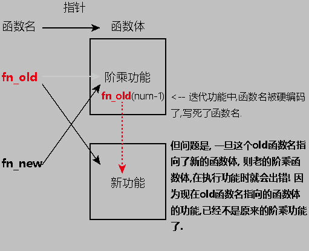

= python def 函数
:toc:
---

== 参数

==== 参数的类型在实际传入前, 是未知的

python不是强类型语言. 比如, 当我们通过引用来访问对象，比如a＝A()，则python会首先创建一个类A，然后声明一个变量a，再将变量a与类A联系起来。**变量a是没有类型的，它的类型取决于其关联的对象。** a=A()时，a是一个A类型的引用，我们可以说a是A类型的，如果再将a赋值3，a=3，此时a就是一个整数型的引用.

可以这么理解，在python中变量类似与c中的指针，和c不同的是**python中的变量可以指向任何类型.** +
**因此，在python运行过程中，参数在被实际传递进来之前, 是并不知道参数的类型的.**

---

==== 不定数量的参数 ->定义函数时, 星号用来打包: *args(是打包成元组) , **kwargs(是打包成字典) ; 调用函数时, 星号用来解包. 一个星*, 用来解包tuple; 两个星**, 用来解包dict

其实并不是必须写成*args 和**kwargs。只有变量前的 *(星号)才是必须的.

|===
|星号的作用 |定义函数时, 是"打包"
|调用函数时, 是"解包"

|*tuple
|把离散元素, 打包成tuple
|把tuple, 解包成离散元素

|**dict
|把离散元素, 打包成dict
|把dict, 解包成离散元素

|===

当你预先不知道该给函数传多少个参数时(即,参数数量不确定时),就可以使用到这两个关键词.

|===
|写法 |类型

|*args
|tuple

|**kwargs
|dict
|===

***args  -> tuple**

*args 会将n个参数, 在函数中自动打包成tuple, 给函数体调用.  +
n个参数是: 非键值对, 比如拆散的list元素, 拆散的tuple元素,即不带[],()括号的拆散的序列).

注意, 你传参的时候,不需要由你来把它们手动组成tuple来传. 而是函数会自动把你的n个参数, 打包成tuple, 供函数体内部来调用. 当然, 首先你得在函数体内, 解包这个元组.

[source, python]
....
def fn1(arg1, arg2, *tupel_argRest):
    print(tupel_argRest)

fn1(1,2,3,4,5,6) # (3, 4, 5, 6)
....

也可以直接将元组作为参数, 传给*args
[source, python]
....
def fn1(*tupel_argRest):  # 定义函数时, *星号的作用是: 将离散元素"打包".
    print(tupel_argRest)

tuple1 = ('zzr', 'wyy')
fn1(*tuple1)  # ('zzr', 'wyy') <--调用函数时, *星号的作用是: "解包"成离散元素.
fn1(tuple1)  # (('zzr', 'wyy'),) <--注意区别, 如果不用星号*解包元组的话, 就会把tuple作为一个整体传进去.
....

---

==== 不定数量的参数 -> **kwargs(是个字典)

**kwargs 允许你将不定长度的 '键值对', 作为参数传递给一个函数。

[source, python]
....
def fn1(**dict_kwargs): # 定义函数, **两个星号, 会将接收到的离散具名参数, 打包成dict
    print(dict_kwargs)

fn1(name='zzr', age=19, sex='female')  # 给函数传参, 要以具名参数的形式, 来传入离散的kv键值对.
 # {'name': 'zzr', 'age': 19, 'sex': 'female'}
....

或者,你可以直接把字典当做一个变量传入函数中, 就不用"关键字参数"的形式了.

[source, python]
....
def fn1(**dict_kwargs):  # 定义函数, **两个星号, 会将接收到的离散具名参数, 打包成dict
    print(dict_kwargs)

dictZzr = {'name': 'zzr', 'age': 19, 'sex': 'female'}

fn1(**dictZzr)  # 调用函数时, **两个星号, 功能是将dict解包成离散的kv对.
# {'name': 'zzr', 'age': 19, 'sex': 'female'}

fn1(dictZzr)  # 不先解包dict的话,就会报错: TypeError: fn1() takes 0 positional arguments but 1 was given
....

---

==== 同时用上 *args 和 **kwargs

如果你还希望 某个函数, 能同时接受任意数量的"位置参数", 和"关键字参数"，可以同时使用*和**。

[source, python]
....
def fn1(*tuple_args, **dict_kwargs):
    print(tuple_args)   # ('a', 'b')
    print(dict_kwargs)  # {'k1': 'v1', 'k2': 'v2', 'k3': 'v3'}

fn1('a', 'b', k1='v1', k2='v2', k3='v3')
....

使用这个函数时，**所有"位置参数", 会被放到args元组中，所有"关键字参数"(即key=value形式的参数), 会被放到字典kwargs中。**

---

==== 参数的固定排序位置 -> 1. 位置参数、2. *tuple_args、 3. **dict_kwargs

注意顺序: 位置参数、*args、 \**kwargs三者的顺序必须是: 1. 位置参数、2. *tuple_args、 3. **dict_kwargs，不然就会报错.

[source, python]
....
def fn1(x, *args, **kwargs):
    print(x)        # 99
    print(args)     # (1, 2, 3, 4)
    print(kwargs)   # {'a': 11, 'b': 22, 'c': 33}

fn1(99, 1, 2, 3, 4, a=11, b=22, c=33)
....

如果违反这个参数顺序, 就会报错:
[source, python]
....
def a(x, *args, y):
    '''会报错 TypeError: a() missing 1 required keyword-only argument: 'y'
    如果*args不是出现在最后, 则y必须是**kwargs参数.
    换言之, *后面, 只能放**即"关键字参数", 而不能放其他类型的参数!
    '''
    print(args)

a(1, 2, 3, 4, 5)
....

---

==== "可选参数"的默认值

给函数参数设置默认值, 只要使用"关键字参数"就行了. 注意: **关键字参数, 必须放在参数列表的最后一个!**

[source, python]
....
def fn(name, sex='male'):  # sex是关键字参数, 有一个默认值'male'
    print(sex)

fn('zzr')  # male <--关键字参数是可选的, 不输入也没关系,不输入的话, 就使用函数中定义的默认值.

fn('wyy', 'female')  # female <--如果输入了关键字参数的值, 就覆盖掉函数中定义的默认值.
....

如果默认参数是一个可修改的容器(即可修改类型的变量), 比如一个列表、集合或者字典，可以使用None作为默认值:

[source, typescript]
....
# Using a list as a default value
def fn1(a, list_b=None):
    if list_b is None:
        list_b = []
    ...
....

---

==== 判断某个参数, 是否被传进了实参 -> object()

如果不想给某个参数添加默认值, 而只是想测试一下该参数是不是有值传递进来, 可以这样写: 将该参数的值设为 object().

关于object()对象:
[source, python]
....
objNoValue = object()
'''
创建一个空对象.
object类是Python中所有类的基类.
注意: object类没有定义 __dict__，所以不能对object类实例对象, 尝试设置属性值。
'''

objNoValue.age = 19 # 错误! 无法对object类实例对象, 设置属性值。
print(objNoValue)  # AttributeError: 'object' object has no attribute 'age'
....

在函数中, 将参数设置为object()
[source, python]
....
objNoValue = object()

def fn(arg1, arg2=objNoValue):
    if arg2 is objNoValue:
        print('arg2形参, 没有收到任何实参传进来')
    else:
        print('age2收到实参是:{}'.format(arg2))

fn('zzr')       # arg2形参, 没有收到任何实参传进来
fn('zzr', 19)   # age2收到实参是:19
fn('zzr', None) # age2收到实参是:None <-- 可以发现, 传递一个None值, 和不传值, 两种情况是有差别的。
....

一个函数 需要测试某个"可选参数"是否被使用者传递进来。 这时候需要小心的是, **你不能用某个默认值比如 None、 0 或者False值, 来测试用户提供的值(因为这些值都是合法的值**，是可能被用户传递进来的)。

因此，你需要其他的解决方案: 你可以创建一个独一无二的私有对象实例，就像上面的 objNoValue变量那样。 +
 在函数里面，你可以通过检查 被传递进来的实参的值, 是否跟这个object()实例的值一样, 来判断。  +
 **这里的思路是, 用户不可能去传递这个object()实例作为输入。 因此，这里通过检查这个值, 就能确定某个参数是否被传递进来了。**

object 是python中所有类的基类。 **你可以创建 object 类的实例，但是这些实例 没什么实际用处，因为它并没有任何有用的方法， 也没有任何实例数据(因为它没有任何的实例字典，你甚至都不能设置任何属性值)。 ** 你唯一能做的就是测试同一性。这个刚好符合我的要求，因为我们在函数中 就只需要一个同一性的测试而已。

---

==== 默认参数的值, 第一次赋值后就终身不变

注意: 默认参数的值, 仅仅在函数定义的时候, 赋值一次。之后就永远是这个值了, 不会再被改变.

[source, python]
....
yourCountry = 'cn'

def fn(name, country=yourCountry):  # country参数一旦被默认赋值为'cn', 就永远是这个值了.
    print(name, country)

fn('zzr')  # zzr cn

yourCountry = 'usa'  # 再次改变yourCountry变量的值, 对函数中的默认参数country, 毫无影响. 两者已经互不相干了.
fn('wyy')  # wyy cn
....

注意到, 当我们改变yourCountry的值的时候, 对默认参数country值并没有影响，这是因为在函数定义的时候就, 已经确定了它的默认值了。

注意: **默认参数的值, 应该是不可变的对象，比如None、True、False、数字或字符串。** 特别的，千万不要像下面这样写代码：

[source, python]
....
def fn1(a, b=[]): # NO!  列表是可变对象!
    ...
....

如果你这么做了，当默认值在其他地方被修改后, 你将会遇到各种麻烦。这些修改会影响到下次调用这个函数时的默认值。比如：

[source, python]
....
def fn(arg1, listArg=[]):
    print(arg1, listArg)
    return listArg
    '''
    listArg是个可变数据list, 你在函数中返回它, 就能在外部改变这个list的值!
     造成本fn函数不再稳定!
    '''

listArg = fn('zzr')
listArg.append('zzrFather')
listArg.append('zzrMonther')

print(fn('wyy'))  # wyy ['zzrFather', 'zzrMonther'] <--上面zzr的操作, 直接改变了fn函数的listArg的默认值, 这是个漏洞!
....

**为了避免这种情况的发生，应该将"可变类型"的默认参数的 默认值设为None**， 然后在函数里面检查它。

**在测试None值时, 使用 is 操作符是很重要的，也是这种方案的关键点。** 有时候大家会犯下下面这样的错误：在判断某参数是否被传入实参时, 误写成了  if not arg

[source, python]
....
def fn(arg1, listArg=None):
    if not listArg:  # 错误的判断写法!
        listArg = []
        print('listArg没有接收到实参, 因此采用默认值:{}'.format(listArg))
    else:
        print('listArg接收到实参:{}'.format(listArg))

fn('zzr')       # listArg没有接收到实参, 因此采用默认值:[]
fn('zzr', 0)    # listArg没有接收到实参, 因此采用默认值:[]
fn('zzr', '')   # listArg没有接收到实参, 因此采用默认值:[]
....

上面这么写的问题在于, **尽管None值确实是被当成False，但是还有其他的对象(比如长度为0的字符串、列表、元组、字典等)都会被当做False。** 因此，上面的代码会误将一些其他输入, 也当成是没有输入。

正确的写法应该是: 判断时, 写成 **arg is None**
[source, python]
....
def fn(arg1, listArg=None):
    if listArg is None:  # 这才是正确的判断写法!
        listArg = []
        print('listArg没有接收到实参, 因此采用默认值:{}'.format(listArg))
    else:
        print('listArg接收到实参:{}'.format(listArg))

fn('zzr')       # listArg没有接收到实参, 因此采用默认值:[]
fn('zzr', 0)    # listArg接收到实参:0
fn('zzr', '')   # listArg接收到实参:''
....

---

== 函数名

==== 硬编码函数名, 会导致的问题

[source, python]
....
def fn_old(num):    # 阶乘函数
    if num<=1:
        return 1
    else:
        return num*fn_old(num-1)  # 迭代函数名,在这里被硬编码了.

print(fn_old(5))    #120

def fn_新函数体():
    print('我是一个新函数体')

fn_new = fn_old     # 用一个新函数名来指向老函数体
print(fn_new(5))    # 120  目前正常

fn_old = fn_新函数体 # 老函数名,断开与老函数体(阶乘功能)的关系,指向一个新函数体

print(fn_new(5))    # 报错:TypeError: fn_新函数体() takes 0 positional arguments but 1 was given.
....

可以看到, 阶乘函数体肚子里的迭代函数名, 是老的函数名, 但在老函数名的指针指向被改变后,这个阶乘函数体的迭代功能就失败了.  +
 即,fn_new函数名, 指向阶乘函数体; 阶乘函数体调用了内部的迭代函数fn_old函数名, 而fn_old函数名指向的函数体, 之前早就被改变成其他的fn_新函数体了, 造成阶乘功能执行失败! 向上回溯也就是fn_new()执行失败.  +
 fn_新函数体()当然不需要接收参数, 而我们fn_new(5)却给它传入了参数, 于是报错.

---

== 闭包

---

== lambda表达式 (即匿名函数)

lambda 表达式，通常是在需要一个函数，但是又不想费神去命名一个函数的场合下使用，也就是指匿名函数。

冒号前面的是函数参数, 冒号后面的是返回值.

[source, python]
....
fnAdd = lambda arg1, arg2: arg1 + arg2
print(fnAdd)  # <function <lambda> at 0x0000026DCD1D1EA0>

print(fnAdd(1, 2))  # 3
....

如果定义匿名函数，还要给它绑定一个函数名字的话，有点画蛇添足，通常是直接使用 lambda 函数。那么 lamdba 函数的正确使用场景在哪呢？

---

==== 使用场景: 函数式编程

像 map、reduce、filter、sorted 这些函数, 都支持接收一个函数作为参数，lambda 函数就可以应用在函数式编程中。

比如sorted()函数
[source, python]
....
sorted(iterable, *, key=None, reverse=False)
....

参数key的值, 是一个带有"单个参数"的函数. list.sort() 和 sorted() 都有一个 **key 形参来指定在进行比较之前, 要在每个列表元素上进行调用的函数。**

key 形参的值应该是一个函数，它接受一个参数并并返回一个用于排序的键key。

[source, python]
....
list1 = [3, 5, -4, -1, 0, -2, -6]
newList = sorted(list1, key=lambda x: abs(x)) # 参数key的值, 就是个匿名函数
print(newList) # [0, -1, -2, 3, -4, 5, -6]
....

又如:
[source, python]
....
map( lambda x: x*x,    [y    for y in range(10)] ) # map(function, iterable, ...)
# map将传入的函数function, 依次作用到序列iterable的每个元素，并把结果作为新的迭代器返回。
....

key -- 主要是用来进行比较的元素，key=匿名函数体, 意思就是将匿名函数体的返回值, 作为key参数的参数值.   +
**匿名函数体只接收一个参数(本例是x)，具体的函数的参数就是取自于可迭代对象中，指定可迭代对象中的一个元素来进行排序。**

这个写法要好过
[source, python]
....
def fn1(x):
    return x * x

map(fn1, [y    for y in range(10)])
....

因为后者多定义了一个（污染环境的）函数(即浪费了一个函数名fn1)，尤其如果这个函数只会使用一次的话。 +
而且第一种写法实际上更易读，因为那个映射到列表上的函数具体是要做什么，非常一目了然(即直接给你展现了函数体)。

Python 之中，类似能用到 lambda 表达式的「高级」函数还有 reduce、filter 等等，这种**能够接受一个函数作为参数的函数, 叫做「高阶函数」（higher-order function），**是来自函数式编程（functional programming）的思想。

尽管lambda表达式允许你定义简单函数，但是它的使用是有限制的。 你只能指定单个表达式，它的值就是最后的返回值。也就是说不能包含其他的语言特性了， 包括多个语句、条件表达式、迭代以及异常处理等等。

---

==== 使用场景: 闭包

简单地理解, 闭包就是一个定义在外函数内部的内函数，闭包使得变量即使脱离了该外函数的作用域范围, 也依然能被访问到内函数。

[source, python]
....
def fnOutter(name):
    return lambda age: '{},{}'.format(name, age)
    '''
    外函数会返回一个匿名内函数体.
    这里的 lambda 函数就是一个闭包. 它包含着外函数的参数name, 即使在外函数结束了也能访问到name
    '''

fnInner = fnOutter('zzr')
# 用fn_inner这个的变量, 来指向返回的匿名内函数体. 相当于是匿名函数的函数名了

print(fnInner(19))  # zzr,19
....

---

==== 使用场景: 允许函数作为一个对象来进行传递

某些语言由于历史原因，只有匿名函数可以作为对象传递，而具名函数不可以，比如PHP。

---

==== lambda表达式中的外援变量x是一个自由变量，在运行匿名函数时绑定值，而不是定义匿名函数时就绑定

[source, python]
....
外援变量x = 10
fn1 = lambda y: 外援变量x + y # lambda函数中, 外援变量x被赋值后, 并非是终身不变的! 这个普通函数的"参数默认值"不一样!
print(fn1(10))  # 20

外援变量x = 20
print(fn1(10))  # 30  <-- 可见, 外援变量x的修改, 会直接影响到匿名函数体中的x的值
....

这其中的奥妙在于, **lambda表达式中的外援变量x是一个自由变量，在运行匿名函数时绑定值，而不是定义匿名函数时就绑定，这跟函数的默认值参数定义是不同的( 默认参数的默认值, 是在函数定义时就绑定, 并且此后不再被改变的)。**  +
因此，在调用这个lambda表达式的时候，x的值, 是"执行"匿名函数时的x值。

**如果你想让某个匿名函数, 在定义时就捕获到值，可以将那个参数值, 定义成"默认参数"即可**:

[source, python]
....
外援变量x = 10
fn1 = lambda y, x=外援变量x: x + y  # 关键词参数必须放在最后一个!
print(fn1(10))  # 20

外援变量x = 20
print(fn1(10))  # 20  <-- 可见, 外援变量x的修改, 这时就不会影响到匿名函数体中的x的值了
....

在这里列出来的问题, 是新手很容易犯的错误。 比如，通过在一个循环或列表推导中, 创建一个lambda表达式列表，并期望函数能在定义时, 就记住每次的迭代值。例如：

[source, python]
....
list_fn = [lambda a:  a+外援变量b    for 外援变量b in range(5)]
# 这个列表生成式中的每一个元素, 都是一个匿名函数. 匿名函数返回a+b的值,a由用户稍后提供, b则取自0到4.

for fn in list_fn:
    print(fn(0))

# 打印:
4
4
4
4
4
....

但是实际效果是, 运行时"外援变量b"的值, 已经为迭代的最后一个值(即4)。

现在我们用另一种方式修改一下：
[source, python]
....
list_fn = [lambda a, b=外援变量b : a+b    for 外援变量b in range(5)]
# 将外援变量b, 变成"默认参数"后, 就能在函数定义时,就捕获到该b的值了,
# 而不是在函数调用时再来捕获该b值. 在调用时, b早就从0变成了4了.

for fn in list_fn:
    print(fn(0))

# 打印:
0
1
2
3
4
....

**通过使用函数"默认值参数"形式，lambda函数在定义时, 就能绑定到值。**

---

== 高阶函数

==== map(function, iterable, ...)

Map会将⼀个函数依次作用到⼀个Iterable可迭代对象的所有元素上, 并把结果封装为新的Iterator迭代器, 返回。

image:./img_python/python map.png[]

[source, python]
....
def fn1(x):
    return x*x

list1 = [1, 2, 3, 4, 5]

iterator_result = map(fn1, list1)  # 返回一个迭代器
print(type(iterator_result))  # <class 'map'>
print(list(iterator_result))  # [1, 4, 9, 16, 25]
....

---

==== functools.reduce(function, iterable[, initializer])

参数function必须接收两个参数.

functools模块的 reduce()函数的作用效果即:
[source, python]
....
reduce(f, [x1, x2, x3, x4]) = f(f(f(x1, x2), x3), x4)
....

又例:
[source, python]
....
reduce(lambda x, y: x+y, [1, 2, 3, 4, 5]) 等于== ((((1+2)+3)+4)+5)
....

案例: +
比如, 把序列[1, 3, 5, 7, 9]变换成整数 1万3579，reduce就可以派上用场：

[source, python]
....
import functools

def fn扩大10倍(x,y):
    return x*10+y

list1 = [1,3,5,7,9]
print(functools.reduce(fn扩大10倍,list1)) # 13579
....

---

==== filter(function, iterable) => 返回一个Iterator

Python内建的filter()函数用于过滤序列。作用相当于一个筛子。**func函数是一个布尔函数，filter()调用这个布尔函数，将每个seq中的元素依次过一遍筛子，选出使func返回值是Ture的元素的序列。**

即, filter()把传入的函数依次作用于每个元素，然后根据返回值是True还是False决定保留还是丢弃该元素。

注意:过滤函数function只需要写个函数名就行了, 它不接受参数, 它会自动把iterable中的每一个元素,自动作为参数传递进过滤函数中.

例如，在一个list中，删掉偶数，只保留奇数，可以这么写：

[source, python]
....
def fn1(n):
    return n%2 ==1  # 当n%2==1,则返回True

list1 = [1, 2, 4, 5, 6, 9, 10, 15]
print(type(filter(fn1,list1))) # <class 'filter'>
print(list(filter(fn1,list1))) # [1, 5, 9, 15]
....

想要给过滤函数传入额外的参数的话

**如果筛选逻辑需要额外的参数，**由于filter()中的过滤函数不接受手动传入参数, 所以我们只能这样操作: +
**将过滤函数, 变成一个嵌套函数, 即过滤函数(作为外函数), 再内包一个内函数, 然后用内函数来接收你需要传入的额外的参数, 并在内函数中处理它们. 然后, 再用外函数(即过滤函数)返回这个内函数名. 交给filter()函数, **这样,就符合filter()函数只需要一个过滤函数名字的要求了.

[source, python]
....
def fn求奇数(分子):  # 这是过滤函数, 作为外函数.
    def fn内函数(分母):  # "分母"变量, 会接收你额外传入的参数.
        return 分母 % 分子 == 1 # 分母%2==1, 即 该分数的值是奇数.
    return fn内函数  # 过滤函数(外函数)将内函数的名字返回.

list1 = [1, 2, 4, 5, 6, 9, 10, 15]

分子 = 2  # 这个变量将作为额外的参数,提供给过滤函数(外函数)

内函数名 = fn求奇数(分子)  # 将额外的参数(本例为"分子"),用内函数来接收并处理.

print(list(filter(内函数名, list1)))
'''
[1, 5, 9, 15]
list1序列中的每一个元素,会自动作为过滤函数(此处已变成"内函数")的参数,传递给过滤函数.
即,内函数的参数"分母",就是接收list1中的每一个元素.
'''
....

也可使用lambda表达式, 返回匿名函数名，例如：

[source, python]
....
def is_odd(n):
    return lambda x: x % n == 1 # 返回一个匿名函数, 函数体是 x%2 ==1 , 即x是奇数.

n = 2
list(filter(is_odd(n), [1, 2, 4, 5, 6, 9, 10, 15]))
....

---

== 回调函数

[source, python]
....
def apply_async(func第一步处理, args, *, callback第二步处理):
    '''
这个异步函数, 指定了callback作为自己运算结果的回调函数.
就相当于接力棒一样, 本函数算出"结果"后, 将"结果"这个接力棒, 交给"回调函数",
让回调函数继续来对"运算结果"进行进一步处理.
'''

    # Compute the result
    result = func第一步处理(*args)

    # Invoke the callback with the result
    callback第二步处理(result)  # 召唤回调函数, 进一步对第一步操作后的结果, 进行第二步处理.
....

....
asynchronous [e'sɪŋ-krə-nəs]
异步的, 并非同步发生的.
syn共同,相同 + chron时间 + ous ……的 →共同时间的
....

---

== 装饰器

装饰器的目的, 就是用来增强老函数的功能. 如下:
[source, python]
....
def fnOld():
    print('can walk')

def fnCreateSuper(fnOld):
    def fnSuper(): # 内函数(即fnSuper函数), 用来更新fnOld函数的功能
        fnOld()
        print('can fly')
    return fnSuper

fnOld = fnCreateSuper(fnOld) # 保留老的函数名fnOld, 但指针指向新的函数体fnSuper

fnOld()
'''
can walk
can fly
'''
....

上面的写法, 可以用另一种形式代替: 即装饰器 @ 符号.

[source, python]
....
def fnCreateSuper(fnOld):
    def fnSuper():  # 内函数(即fnSuper函数), 用来更新fnOld函数的功能
        fnOld()
        print('can fly')
    return fnSuper

@fnCreateSuper  # 等价于把它下面所装饰的fnOld 作为参数传入fnCreateSuper()中, 并返回一个增强版的fnOld函数.
def fnOld():
    print('can walk')

fnOld()
''' 打印
can walk
can fly
'''
....

---

==== 同时使用两个装饰器

[source, python]
....
def fn1_canFly(fnOld):
    def fnSuper():  # 内函数(即fnSuper函数), 用来更新fnOld函数的功能
        fnOld()
        print('can fly')
    return fnSuper

def fn2_canMakeInvisible(fnOld):  # 隐身功能
    def fnSuper():
        fnOld()
        print('can make self invisible')
    return fnSuper

'''
下面同时使用两个装饰器.
注意: 最靠近old函数的装饰器, 会先执行, 越远离old函数的装饰器,会越后执行.
因此这里的顺序就是, 先用 fn1_canFly来装饰, 再用 fn2_canMakeInvisible来装饰.
'''
@fn2_canMakeInvisible
@fn1_canFly
def fnOld():
    print('can walk')

fnOld()
'''
can walk
can fly
can make self invisible
'''
....

**最靠近old函数的装饰器, 会先执行, 越远离old函数的装饰器,会越后执行. 原因是: @装饰器下面必须紧跟old函数体,才能起作用.** 所以, 紧跟old函数的fn1会先执行.

---

==== 用装饰器, 装饰"带有参数的old函数"

[source, python]
....
def fnUpgrade(fnOld):
    def fnSuper(oldArg1, newArg2): # 形函数可以接收2个参数
        fnOld(oldArg1)
        print('oldArg1:{}, newArg2:{}'.format(oldArg1,newArg2))
    return fnSuper

@fnUpgrade # 等价于将fnOld作为参数,传入fnUpgrade()中; 并让老函数名的指针, 指向升级后的新函数体.
def fnOld(oldArg1): # 开函数只接受1个参数
    print('oldArg1:{}'.format(oldArg1))

fnOld('zzr','wyy')
'''
oldArg1:zzr
oldArg1:zzr, newArg2:wyy
'''
....

---

==== 用装饰器, 装饰"带有不定长参数的函数"

[source, python]
....
def fnUpgrade(fnOld):
    def fnSuper(*list_args, **dict_kwargs):  # 定义函数时, *星号是打包.
        # 由于这个升级版本的函数体, 会被老函数的指针指向它. 所以给老函数传参, 就是给这个fnsuper函数传参!
        print('升级!')
        fnOld(*list_args, **dict_kwargs)
    return fnSuper

@fnUpgrade # 装饰器
def fnOld(*list_args, **dict_kwargs):  # 接收不定长参数
    print(list_args)
    print(dict_kwargs)

listName = ['zzr', 'wyy']
dictOther = {'age': 19, 'sex': 'female'}
fnOld(*listName, **dictOther)  # 调用函数是, *星号是解包
'''
升级!
('zzr', 'wyy')
{'age': 19, 'sex': 'female'}
'''
....

---

==== 给装饰器传参

