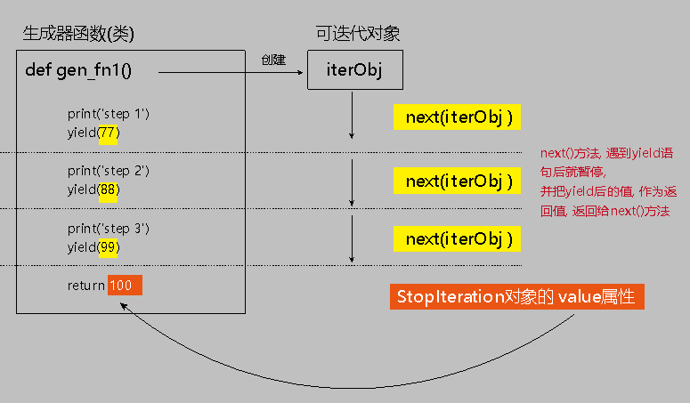

= 迭代器, 生成器, 可迭代对象
:toc:

---

== 生成器/生成器函数 Generator -> yield, next()

一边循环, 一边计算出后续元素的机制，称为生成器：generator。 +
python中, 生成器是迭代器的一种.

生成器的特征有:

- 每次调用yield会暂停
- 使用next()函数和send()函数, 能恢复生成器. **本质上, generator保存的是算法(类似于函数)，**每次调用next(g)，就计算出g的下一个元素的值，直到计算到最后一个元素. 没有更多的元素时，抛出StopIteration的错误。 +
因此**生成器看起来像是一个函数，但是表现得却像是迭代器.**

---

==== 创建生成器的方法1: 只要把一个"列表生成式"的[]改成()

只要把一个"列表生成式"的[]改成()，就创建了一个generator.

[source, python]
....
list1 = [x * x for x in range(6)]
print(type(list1), list1)  # <class 'list'> [0, 1, 4, 9, 16, 25]

generator1 = (x * x for x in range(6)) # 创建一个"生成器"
print(type(generator1), generator1)  # <class 'generator'> <generator object <genexpr> at 0x00000000025939E8>
....

那么如何得到生成器中的每一个值呢?  通过next()函数, 来依次获得generator的下一个返回值即可:

[source, python]
....
# 接上例
print(next(generator1)) # 0
print(next(generator1)) # 1
print(next(generator1)) # 4
....

可以通过for循环来迭代generator对象,
[source, python]
....
# 接上例
for i in generator1:
    print(i)
....

"列表生成式" 与 "列表生成器"的区别:

|===
|区别 |写法 |for循环 |next()方法

|列表生成式 +
List Comprehensions
|[i for i in range(0,5)]
|√
|×

|列表生成器 +
generator
|(i for i in range(0,5)) # 外面是小括号!
|√
|√

|===

---

==== 创建生成器的方法2: 将函数变成生成器 -> 将return写成yield

**如果一个函数定义中包含yield关键字，那么这个函数就不再是一个普通函数，而是一个generator**：

[source, python]
....
def fnGenerator():  # 生成器函数
    print('step1')
    yield (77)
    '''
    每次对"可迭代对象"调用next()方法, 就会执行到yield语句处返回(类似于return),
    yield语句后小括号里的值, 就是返回值. 会被next()方法接收.
    '''

    print('step2')
    yield (88)

    print('step3')
    yield (99)

    return 100
    '''
    generator是拿不到return语句的返回值的。
    如果想要拿到返回值，必须捕获StopIteration错误，返回值包含在StopIteration的value中.
    '''

objIter = fnGenerator()
res1 = objIter.__next__() # step1
print(res1) # 77

res2 = next(objIter) # step2
print(res2) # 88

res3 = objIter.__next__() # step3
print(res3) # 99

res4 = next(objIter) # 报错 StopIteration: 100
'''
执行3次yield后，已经没有yield可以执行了，所以，第4次调用next()就报错。
并且, return语句的返回值包含在StopIteration的value中.
'''
....

generator和函数的执行流程不一样。函数是顺序执行，遇到return语句或者最后一行函数语句就返回。 +
而**变成generator的函数后，在每次调用next()方法的时候才执行该函数，遇到yield语句则返回; 再次执行时, 从上次返回的yield语句处, 继续执行。**

可以用for循环, 来迭代出"生成器"中的每个值:
[source, python]
....
objIter = fnGenerator()

for i in objIter:
    print(i)
'''
C:/Users/Administrator/PycharmProjects/untitled5/py2.py
step1
77
step2
88
step3
99
<-- 同样拿不到return语句的返回值.
'''
....

**要想拿到函数中return语句的返回值, 必须用try…except语句来捕获错误, 错误对象里的value属性的值, 就是"生成器函数"的return语句的返回值.**

[source, python]
....
objIter = fnGenerator()

while True:
    try:
        print(next(objIter))
    except StopIteration as err:
        print('生成器函数的return值是:-->', err.value)  # 生成器函数的return值是:--> 100
        break
....

---

== 迭代器对象 Iterator -> 即: 有next()方法的对象

迭代器对象Iterator可以表示一个无限大的数据流，例如全体自然数。而使用list是不可能存储全体自然数的。所以**从根本上说, 迭代器就是一个有 next()方法的对象, 而不是通过索引来取值.**

==== 把Iterable可迭代对象(只支持for循环), 变成-> Iterator迭代器对象(支持被next()函数调用) => iter(object[, sentinel])

**将可迭代对象(只支持for循环, 不支持next()方法), 转化为迭代器(支持next()方法) , 可以通过iter()方法来实现.**

[source, python]
....
iter(object[, sentinel])  # 用来生成迭代器。Return an iterator object.
....

根据第二个参数是否存在，第一个参数的解释非常不同。 +
**如果不提供第二个参数，则第一个参数object必须是支持迭代协议（\___iter___()方法）的集合对象**(a collection object)，或者它必须支持序列协议 (\___getitem___()方法，其整数参数从0开始)。 +
如果它不支持这些协议中的任何一个，则引发TypeError。 +

**如果给出第二个参数sentinel，则第一个参数object必须是可调用对象(a callable object)**。

[source, python]
....
iterator_list = iter([1,2,3])
# iter()函数: 可以把可迭代对象Iterable(只支持for循环), 变成迭代器对象Iterator(支持被next()函数调用)

print(isinstance(iterator_list, Iterable)) # True

print(next(iterator_list)) # 1 <--转成迭代器对象后, 就能使用next()方法了
print(next(iterator_list)) # 2
print(next(iterator_list)) # 3
print(next(iterator_list)) # StopIteration
....

---

==== 判断一个对象是否是"迭代器对象" -> isinstance(obj, Iterator)

[source, python]
....
from collections.abc import Iterator  # 注意! 导入的是Iterator(迭代器对象)! 而不是Iterable(可迭代对象)
print(isinstance(obj, Iterator))
....

---

==== 集合类型的数据, 自身拥有 \___iter___()方法, 能返回一个迭代器. 就能支持next()方法了.

其实, 列表等集合元素, 虽然它们不是迭代器, 不能直接使用next()方法, 但它们自身却拥有 \___iter___()方法, 这个方法能返回一个迭代器. 就能支持next()方法了.

[source, python]
....
from collections.abc import Iterable, Iterator  # 导入模块

list1 = [i for i in range(0, 5)]  # 列表生成式,(注意, 不是生成器!)
objIterator = list1.__iter__()  # 返回一个迭代器对象.

print(isinstance(objIterator, Iterable))  # True <--它既是一个可迭代对象(只支持for循环迭代)
print(isinstance(objIterator, Iterator))  # True <-- 同时,也是一个迭代器! (除了for循环, 还能支持next()方法)

print(objIterator.__next__())  # 0  <--即可使用next()方法.
print(objIterator.__next__())  # 1
....

在python中, **实现了\___iter___()方法的对象是可迭代的.** 集合元素是可迭代的, 所以它们都拥有\___iter___()方法.

**如果进一步实现了next()方法的对象, 它就升级成了是一个迭代器.** +
实际上要想让一个迭代器工作，至少要实现\___iter___()方法和next()方法。

---

==== for循环的本质, 其实是它先自动进行"转成迭代器'的操作, 再来调用next()方法.

事实上, Python的for循环，本质上就是通过不断调用next()函数实现的。即先把比如 list 自动转换为迭代器对象， 然后再使用next()来不断获取下一个元素.

[source, python]
....
for x in [1, 2, 3, 4, 5]:
    pass

# 实际上完全等价于：

# 首先获得Iterator对象:
it = iter([1, 2, 3, 4, 5]) # for循环帮你把"转成迭代器"的操作给自动隐式做了!
# 循环:
while True:
    try:
        # 获得下一个值:
        x = next(it)
    except StopIteration:
        # 遇到StopIteration就退出循环
        break
....

---

== 可迭代对象 Iterable -> 可以被for循环迭代的数据类型(包括生成器)

**可以直接作用于for循环的对象, 统称为可迭代对象：Iterable。**

|===
|区别 |说明 |for循环 |next()方法

|可迭代对象 Iterable
|可以直接作用于for循环的对象.  +
包括list, tuple, dict, set, str, 生成器. +
**可以使用 isinstance(), 来判断一个对象是否是Iterable对象.**
|√
|×

|迭代器 Iterator
|即从生成器函数(类)创建出来的实例对象. +
**可以使用iter() 函数, 来生成"迭代器"。**
|√
|√

|===

那么python中, 哪些数据类型, 能被for循环迭代, 而成为"可迭代对象"呢?

- 一类是集合数据类型，如 list、tuple、dict、set、str等；
- 一类是generator，包括"生成器"和"带yield的generator function"。

---

==== 判断一个对象是否是Iterable对象 -> isinstance(object, collections.Iterable)

isinstance(object, classinfo)   用来判断一个对象, 是否是属于某个类的"实例"或"子类". +
因此, 判断一个对象是否是可迭代对象, 方法是**通过collections模块的"Iterable类型"来判断**:

[source, python]
....
from collections.abc import Iterable # 导入模块

print(isinstance((x for x in range(10)), Iterable))  # True  <--生成器是可迭代对象

....

---

