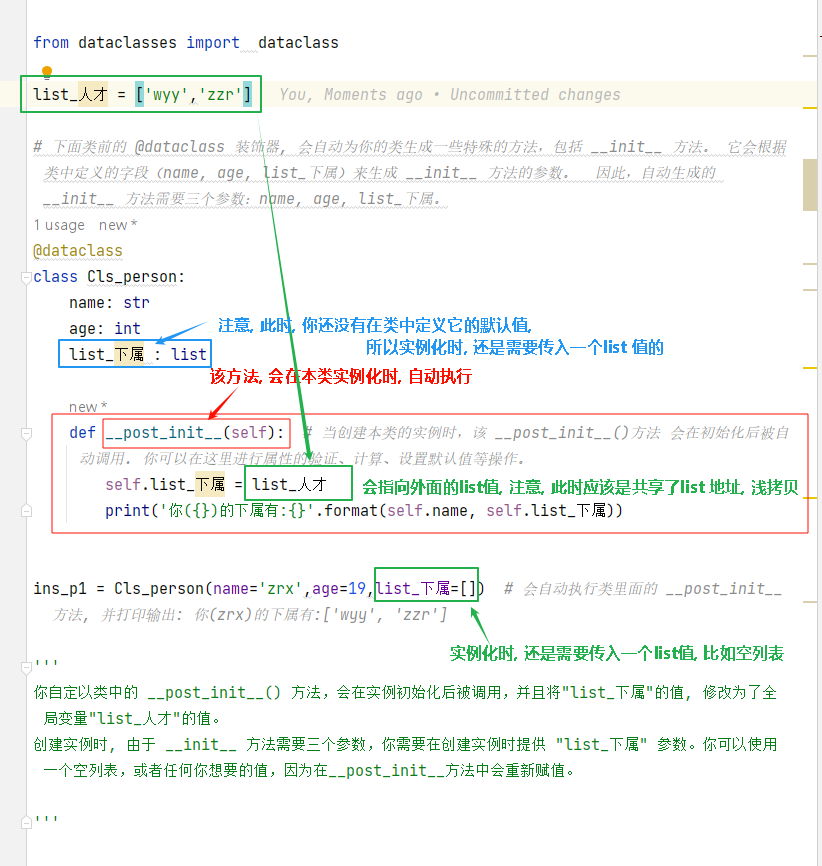
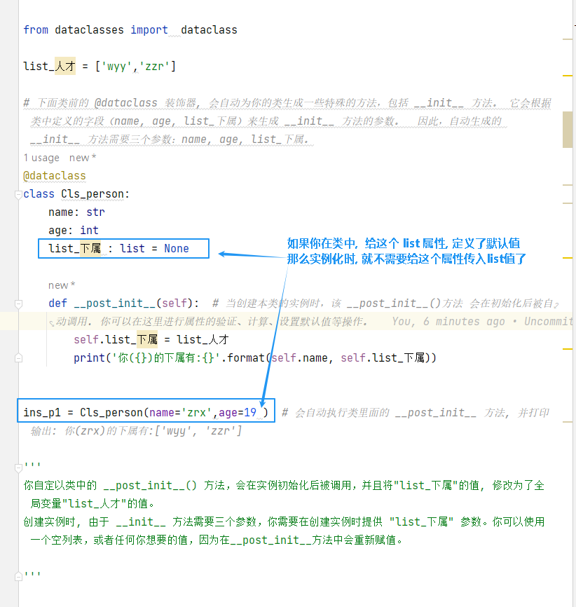

= class - dataclasses 数据类
:toc: left
:toclevels: 3
:sectnums:
:stylesheet: myAdocCss.css

'''

== __post_init__ 方法

....
def __post_init__(self):
....
是在使用 Python 的 `dataclasses` 模块创建数据类（data class）时，可以定义的一个特殊方法。*这个方法在数据类"实例初始化"后被调用，用于执行一些额外的初始化逻辑。*

[source, python]
....

from dataclasses import  dataclass

list_人才 = ['wyy','zzr']

# 下面类前的 @dataclass 装饰器, 会自动为你的类生成一些特殊的方法，包括 __init__ 方法。 它会根据类中定义的字段（name, age, list_下属）来生成 __init__ 方法的参数。  因此，自动生成的 __init__ 方法需要三个参数：name, age, list_下属。
@dataclass
class Cls_person:
    name: str
    age: int
    list_下属 : list

    def __post_init__(self):  # 当创建本类的实例时，该 __post_init__()方法 会在初始化后被自动调用. 你可以在这里进行属性的验证、计算、设置默认值等操作。
        self.list_下属 = list_人才
        print('你({})的下属有:{}'.format(self.name, self.list_下属))

ins_p1 = Cls_person(name='zrx',age=19,list_下属=[])  # 会自动执行类里面的 __post_init__ 方法, 并打印输出: 你(zrx)的下属有:['wyy', 'zzr']

'''
你自定以类中的 __post_init__() 方法，会在实例初始化后被调用，并且将"list_下属"的值, 修改为了全局变量"list_人才"的值。
创建实例时, 由于 __init__ 方法需要三个参数，你需要在创建实例时提供 "list_下属" 参数。你可以使用一个空列表，或者任何你想要的值，因为在__post_init__方法中会重新赋值。
'''
....

或者，如果你的目的是在初始化的时候，list_下属直接被list_人才赋值，那么可以对类的定义进行更改，设置一个默认值。

