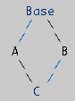

= python class 类
:toc:

---

传统的程序设计, 主张将程序看作一系列函数的集合，或者直接就是一系列对电脑下达的指令。

而"面向对象程序设计"中的每一个对象, 都应该能够接收数据、处理数据, 并将数据传达给其它对象，因此它们都可以被看作一个小型的“机器”，即对象。

类的出现，为面向对象编程（Object-Oriented，OO）的三个最重要的特性提供了实现的手段:

- 封装性（Encapsulation）
- 继承性（Inheritance）
- 多态性（Polymorphism /ˌpɒlɪ'mɔːfəs/

---

== 类的写法

[source, python]
....
class ClsPerson:
    clsAttr类属性 = '来自地球的人类'
    # 类属性, 可以被类和实例都能调用到. 类的属性是被所有实例对象所共享的.

    def __init__(self, name, age):
        self.name = name  # self代表类的实例，而非类
        self.age = age

    @staticmethod
    def fn静态方法():
        print('我是静态方法')
    '''
    静态方法中没有self参数, 也就无法访问实例属性.
    但静态方法, 可以同时被"类"和"实例"调用.
    '''

    @classmethod
    def fn类方法(cls):
        print('我是类方法, 可以调用类属性cls.clsAttr:', cls.clsAttr)
    '''
    类方法, 有cls参数, 可以直接访问到类属性.
    类方法, 可以同时被"类"和"实例"调用.
    '''

    # 实例方法, 第一个参数必须是 self
    def fn实例方法GetInfo(self):
        print('info:', self.name, self.age)

    def fn实例方法GetClass(self):
        print(self.__class__)  # self 代表的是类的实例，代表当前对象的地址，而 self.__class__ 则指向类。

insZzr = ClsPerson('zzr', 19)  # 实例化

print(insZzr)  # <__main__.ClsPerson object at 0x0000022447C81A90>

print(insZzr.name)             # zzr
insZzr.fn实例方法GetInfo()      # info: zzr 19
insZzr.fn实例方法GetClass()     # <class '__main__.ClsPerson'>

# 类属性, 可以被"类"和"实例"调用
print(ClsPerson.clsAttr)    # 来自地球的人类
print(insZzr.clsAttr)       # 来自地球的人类

# 类的静态方法, 可以被"类"和"实例"调用
ClsPerson.fn静态方法()      # 我是静态方法
insZzr.fn静态方法()         # 我是静态方法

# 类方法, 可以被"类"和"实例"调用
ClsPerson.fn类方法()       # 我是类方法, 可以调用类属性cls.clsAttr: 来自地球的人类
insZzr.fn类方法()          # 我是类方法, 可以调用类属性cls.clsAttr: 来自地球的人类
....

staticmethod 和 classmethod 均被作为"装饰器"，用作定义一个函数为"staticmethod"还是"classmethod".

总结:

|===
|类中有 |可被"类"调用|可被"实例"调用|说明|可以访问"类属性"|可以访问"实例属性"

|类属性
|√
|√
|
|
|

|静态方法 +
@staticmethod +
def 静态方法():
|√
|√
|@staticmethod 表示下面的方法是"静态方法". +
参数中没有self或cls. 因此无法访问实例属性. +
但你想访问类属性的话, 可以用 "类名.类属性" 来调用到.
|√ +
"类名.类属性"
|×

|类方法 +
@classmethod +
def 类方法(cls):
|√
|√
|@classmethod 表示下面的方法是"类方法". +
有cls参数, 因此可以访问类属性, 但不能访问实例属性.
|√
|×

|实例方法(instance methods) +
def fn实例方法(self):
|×
|√
|
|√ +
"类名.类属性"
|√

|===

'''

==== 可以修改实例对象中的属性值

[source, python]
....

from dataclasses import dataclass
@dataclass
class Cls1:
        name: str

        def fnTalk(self):
            print(self.name)

ins = Cls1("zrx")
ins.fnTalk() # zrx

#可以修改实例对象中的属性值
ins.name = 'wyy' # 给实例中的name属性, 重新赋值
ins.fnTalk() # wyy
....

'''

== 查看实例或类拥有的属性和方法

==== \___dict___ -> 返回字典, 只显示"实例属性", 不包含属于"类"的东西

一个实例的\__dict__属性仅仅是那个实例的实例属性的集合，并不包含该实例的所有有效属性。所以如果想获取一个对象所有有效属性，应使用dir()。

**\__dict__只返回对象的"可写属性"（writable attributes）**，而dir()返回各种相关（relavent）属性，且对于不同类型对象，作用不同。

object.\___dict___
A dictionary or other mapping object used to store an object’s (writable) attributes.

[source, python]
....
class ClsPerson:
    clsAttr类属性 = ''

    def __init__(self, name, age):
        self.name = name
        self.age = age

    @staticmethod
    def fn静态方法():
        pass

    @classmethod
    def fn类方法(cls):
        pass

    def fn实例方法GetInfo(self):
        pass

insZzr = ClsPerson('zzr', 19)

print(insZzr.__dict__) #  {'name': 'zzr', 'age': 19}
# __dict__ 只显示属于实例自己的属性, 不包扩只属于类的类属性, 类方法, 和实例方法(python中, 实例方法是属于类的, 被所有实例共享)

print(insZzr.__dir__())
'''
['name', 'age', '__module__', 'clsAttr类属性', '__init__',
'fn静态方法', 'fn类方法', 'fn实例方法GetInfo', '__dict__',
'__weakref__', '__doc__', '__repr__', '__hash__', '__str__',
'__getattribute__', '__setattr__', '__delattr__', '__lt__',
'__le__', '__eq__', '__ne__', '__gt__', '__ge__', '__new__',
 '__reduce_ex__', '__reduce__', '__subclasshook__',
 '__init_subclass__', '__format__', '__sizeof__', '__dir__', '__class__']
'''
....

---

==== dir(obj) -> 返回list, 属于"实例"自己的, 和属于"类"的东西, 都能显示

dir()函数会自动寻找一个对象的所有属性(包括从父类中继承的属性)。包括\__dict__中的属性，即, \__dict__是dir()的子集.

|===
|能显示 |dir(ClsPerson) |dir(insZzr) |insZzr.\__dir__() #每边有两个下划线

|静态方法
|√
|√
|√

|类方法
|√
|√
|√

|类属性
|√
|√
|√

|实例方法
|√
|√
|√

|实例属性
|×
|√
|√
|===

---

== 类属性 and 实例属性

==== 同名"实例属性", 会覆盖掉同名的"类属性"

类属性，归class类所有, 但类的所有实例都可以访问到。

[source, python]
....
class P(object):
    country = 'china' # 类属性

p = P()
print(p.country) # china    .因为实例并没有country属性，所以会继续向上查找class的country属性

p.country = 'usa' # 创建一个同名的实例自己的属性, 由于实例属性优先级比类属性高，因此，它会屏蔽掉类的country属性
print(p.country) # usa
print(P.country) # china

del p.country # 当删除掉实例的这个属性后, 类属性就能显现出来.
print(p.country) # china
....

从上面的例子可以看出，在编写程序的时候，千万不要对"实例属性"和"类属性"使用相同的名字，因为**相同名称的"实例属性"将屏蔽掉"类属性".** 只有当你删除"实例属性"后，"类属性"才能显现出来, 被实例访问到。

**"类属性"是被所有实例所共享的. +
"实例属性"只属于实例对象本身.**

如果你新建了一个"实例属性", 但名字和"类属性"相同, 你只是在创建出了一个同名的"实例属性"而已. 换句话说, 原来的"类属性"不受影响, 只是被暂时"遮蔽"掉了. 即, 你无法再通过"实例.类属性"来调用它了, 只能通过"类名.类属性"来调用它.

[source, python]
....
class Cls(object):
    id = '我是类属性id'

ins = Cls() # 实例化
print(ins.id)  # 我是类属性id <--类属性被所有实例共享

ins.id = "实例属性id"  # 你不是在修改"类属性"的值, 而只是创建出了一个同名的"实例属性"而已!
print(ins.id)  # 实例属性id <-- 由于实例有了自己的同名"实例属性", 所以你就无法再通过实例来访问"类属性"了.

# 只能通过"类名.类属性"来访问.
print(Cls.id)  # 我是类属性id <--可以看到, "类属性"不受影响

del ins.id # 只有在你删除了这个同名的"实例属性"后, 我们才能再次用实例访问到"类属性". 如下
print(ins.id) # 我是类属性id
....

**所以, 从实例中来访问"类属性"须谨慎. 任何对"实例属性"的赋值, 都会创建一个"实例属性"（如果不存在的话）, 并且对其赋值。但如果"类属性"中存在同名属性的话，副作用就会产生 ——即实例的同名"实例属性",会覆盖了 类中的同名"类属性". **只能通过类名来访问"类属性"了.

又例:
[source, python]
....
class 类(object):
    a = 99

实例 = 类()
实例.a += 1   # 从实例中更改"类属性"的值,依然会新建出一个同名的"实例属性"
print(实例.a)   # 100   这个100是属于"实例属性"的
print(类.a)   # 99  "类属性"不受影响
....

即:
[source, python]
....
实例.a = 类.a + 1
....

不过, 如果"类属性"是可变数据的话, 就可能会是一个陷阱: 实例就能真的改变"类属性"的值了.

[source, python]
....
class Cls(object):
    list=[1,2] # 类属性是个"可变数据类型"

ins = Cls()
ins.list.append(3) # 实例就能直接修改"类属性"的值, 而不是创建出自己的"实例属性list"

print(Cls.list) # [1, 2, 3] <--类属性被修改了!
....

**可见, 使用 '实例属性' 来修改 '类属性' 是很危险的. 修改 '类属性' 最好使用类名, 而不是实例名.**

---

==== "类属性"被所有实例成员共享

类属性的修改, 会影响到所有的实例.

[source, python]
....
class Cls(object):
    a = 99

ins1 = Cls()
print(ins1.a) # 99

Cls.a = 100 # 修改"类属性"的值

print(ins1.a) # 100 <--可见实例中, 会同步更新到最新的"类属性"值.
....

---

==== 动态添加 实例属性/方法

python允许"实例的属性", 先"诞生"实例, 后给实例"添加"新属性. +
但是注意: **后天添加的实例属性和实例方法, 只存在于"该实例对象"自己身上, 而不存在于"类"身上.**

[source,python]
....
class ClsP(object):  # 这个类中啥都没有
    def __init__(self):
        pass

ins = ClsP()  # 先生孩子, 创建出实例对象
ins.name = 'zzr'  # 再给实例添加"实例属性"

def fnGetName(self):  # 这个函数, 稍后会被添加到实例上, 作为实例方法.
    print(self.str人才名字)
ins.fnGetName = fnGetName  # 给实例添加上实例方法

ins.fnGetName(ins)  # 调用实例方法, 传入参数self,  self就是ins实例对象自己.

print(ins.__dir__())  # ['name', 'fnGetName', ...] <--被添加到了实例对象自己身上.
print(dir(ClsP)) # 但是类中, 却并不存在后天添加的 name 和 fnGetName 属性.
....

事实上, python提供了一个types模块的MethodType()方法, 能帮我们动态绑定实例属性或方法.

==== anotherRef=types.MethodType(methodName,instance)

[source, python]
....
anotherRef=types.MethodType(methodName,instance)
....
其中第一个参数为一个方法名称， 第二个参数是一个实例对象，**表示将 method 绑定到instance对象上(作为"实例方法")，是的当method被调用的时候自动传入instance对象作为self参数。**

**方法的返回值是一个method对象anotherRef**，我们可以使用anotherRef引用调用方法，也就是anotherRef(). **当anotherRef方法执行的时候, 实际上就是在执行methodName对应的方法**，此时instance会作为methodName的默认参数传入到methodName中。

[source,python]
....
import types # 导入模块

class ClsP(object):
    def __init__(self):
        pass

ins = ClsP()
ins.name = 'zzr'

def fnGetName(self):
    print(self.str人才名字)

ins.fnGetName = types.MethodType(fnGetName,ins) # 将fnGetName函数绑定到实例ins上, 成为"实例方法"

ins.fnGetName() # zzr
....

再次提醒: 给一个实例绑定的方法，对另一个实例是不起作用的. 因为后天绑定到某对象身上的实例方法, 不存在于类中. 所以不被所有实例共享.

---

==== 动态添加 类属性/类方法

为了给所有实例都能绑定到后天添加的方法，可以把方法直接绑定到class类身上!

[source,python]
....
class ClsP(object):
    def __init__(self, name):
        self.name = name

def fnGetName(self): # self参数表明, 它是用作实例方法的
    print(self.str人才名字)

def fnSetAge(self, age):
    self.age = age  # 给实例动态添加一个age属性

ClsP.fnGetName = fnGetName  # 把方法绑定到类身上, 就能被所有实例共享了
ClsP.fnSetAge = fnSetAge

ins1 = ClsP('zzr')
ins2 = ClsP('wyy')
ins1.fnGetName()  # zzr
ins2.fnGetName()  # wyy
# 注意,动态绑定的属性或方法,python不会给出属性名的自动代码提示. 只能你自己记住新的属性名了.

print(dir(ClsP))['fnGetName', 'fnSetAge', ...]
....

---

== 封装 Encapsulation

==== 1. 双下划线开头: __私有属性

封装(Encapsulation) 即“私有化”，就是将类或者函数中的某些属性, 限制在某个区域之内，外部无法调用。

Python 中私有化的方法比较简单，就是在属性（包括方法、数据）名字前面, 加双下划线。

[source, python]
....
class Cls(object):
    def __init__(self):
        self.__money = 999  # 设为私有属性. 只能在内部访问, 外部无法访问.

    def fnGetMoney(self):
        print(self.__money)  # 开放一个接口, 用实例方法来访问私有属性

ins = Cls()
print(ins.__money)  # 报错 AttributeError: 'Cls' object has no attribute '__money'
ins.fnGetMoney()  # 999
....

---

==== 强制从外部,来访问类内部的私有属性 -> "_类名\__属性名", "_类名__私有方法名"

加上双下划线\__后, 其实是 Python把"__属性名", 改名成了**"_类名\__属性名"**, 所以而我们依然可以在外部通过"_类名__属性名"来访问到私有属性.

|===
|类型 |你起的名字 |python在背后的改名为

|私有属性
|__属性名
|_类名__属性名

|私有方法
|__方法名
|_类名__方法名

|===

[source, python]
....
class Cls(object):
    def __init__(self):
        self.__money = 999  # 设为私有属性

ins = Cls()
print(ins._Cls__money)  # 999 <-- 私有属性, 其实被python改名成了: _类名__属性名
....

但是强烈建议你不要这么干，因为不同版本的Python解释器可能会把__name改成不同的变量名。

同样, **私有方法, 也会被python自动改名成: "_类名__私有方法"**

[source, python]
....
class Cls(object):
    def __fn(self):
        print("我是私有方法")

ins = Cls()
ins._fn() # 私有方法不能直接从外部调用, 会报错: AttributeError: 'Cls' object has no attribute '_fn'

print(ins.__dir__()) # 可以看到, 私有方法被python改名成了 _Cls__fn

ins._Cls__fn() # 我是私有方法
....

---

==== 2. 单下划线开头: _可从外部访问的私有变量

以一个下划线开头的变量 "_属性名", 也是可以被从外部直接访问到的, 但请把它看作私有变量, 而不要直接从外部访问.

[source, python]
....
class Cls(object):
    def __init__(self):
        self._age = 17 # 单下划线开头, 是可从外部访问的私有属性.

ins = Cls()
print(ins._age) #17
....

---

==== 注意陷阱: 不要在外部来直接修改私有属性的值! 而不使用类提供的修改方法.

[source, python]
....
class Cls(object):
    def __init__(self):
        self.__money = 999 # 私有属性

ins = Cls()
ins.__money = 3000 # 陷阱操作!!
'''
你以为你在修改私有属性的值, 但其实由于python已经把这个私有属性改名成了"_Cls__money",
你本句的操作其实是新增了一个"__money"属性! 现在就有两个money属性了!
'''

print(ins.__dir__()) # ['_Cls__money', '__money', ...] <--可证!
....

---

==== 私有属性和私有方法, 无法被子类覆盖

python会自动对"私有属性"和"私有方法"改名字.这样做的意义为何? 答案就是继承——私有的属性和方法, 是无法被子类"遮蔽"掉的。

[source, python]
....
class ClsFather(object):
    def __init__(self):
        self.__attrPrivate = 100    # 私有属性
        self.attrNormal = 111       # 普通属性

    def __fnPrivate(self):
        print("我是ClsFather的私有方法")

class ClsSon(ClsFather):
    def __init__(self):
        super().__init__()
        self.__attrPrivate = 200    # 子类无法"遮蔽"掉父类的同名"私有属性"和"私有方法"
        self.attrNormal = 222       # 子类可以"遮蔽"掉父类的同名"普通属性"和"普通方法"

    def __fnPrivate(self):
        print("我是ClsSon的私有方法")

print(dir(insSon)) # 子类"遮蔽"了父类的同名"普通属性", 但无法遮蔽父类的"私有属性"和"私有方法".
# ['_ClsFather__attrPrivate', '_ClsFather__fnPrivate', '_ClsSon__attrPrivate', '_ClsSon__fnPrivate', 'attrNormal'...]
....

---

==== 3. 头尾双下划线包围: \___特殊变量___

|===
|类型 |写法 |特征

|私有属性
|双下划线开头. 如: __money
|不能直接从外部访问

|特殊变量
|前后都是双下划线. 如 \___money___
|可以从外部直接访问

|===

[source, python]
....
class Cls(object):
    def __init__(self):
        self.__money = 999 # 私有属性
        self.__age__ = 17 # 特殊变量(不属于私有变量)

ins = Cls()
print(ins.__age__) #17 <-- 特殊变量, 可以直接从外部访问到
....

---

==== 4. 单下划线结尾_

有时候你定义的一个变量, 和某个保留关键字冲突的话，这时候可以使用单下划线作为后缀 ( 比如 class_ )

---

== 继承 Inheritance

继承可以使得子类具有父类别的各种属性和方法.

如果子类重写了父类的方法，就使用子类的该方法，父类的被遮盖。**子类重写父类的方法，其实只是把相同的属性名, 绑定到了不同的函数对象上。可见 Python 是没有覆写（override）的概念的。**严格来讲，Python 并不支持「多态」。

---

==== 单传继承

[source, python]
....
class Cls_GrandFather(object):
    def fn_GrandFather(self):
        pass

class Cls_Father(Cls_GrandFather): # 父类继承爷爷类
    def fn_Father(self):
        pass

class Cls_Son(Cls_Father): # 子类继承父类
    def fn_Son(self):
        pass

insSon = Cls_Son() # 子类拥有了所有祖先类的方法和属性
print(insSon.__dir__())  # ['fn_Son', 'fn_Father', 'fn_GrandFather',...]
....

---

==== 在子类中调用父类的方法 -> super(子类名,self).父类方法(arg)

子类覆盖了父类的同名方法后, 那么如何再调用到父类的该方法呢？ **使用 super(子类名,self) 函数, 就能获取到子类的父类.**

Python3.x 和 Python2.x 的一个区别是: Python 3 可以使用直接使用 super().xxx 代替 super(Class, self).xxx

[source, python]
....
class ClsFather(object):
    def fnFather(self, content):
        print('父类收到内容:', content)

class ClsSon(ClsFather):  # 继承父类
    def fnSon(self, content): # 实例方法
        ClsFather.fnFather(self, content) # 子类中调用父类的方法. 注意: 这时self参数需要显式传递!

insSon = ClsSon()
insSon.fnSon('python')  # 父类收到内容: python
....

但是, 上面的写法还有一些缺陷，比如, 由于子类在调用父类方法时, 是硬绑定"父类类名"的, 会造成如果修改了父类名称，那么在子类中会涉及多处修改.

另外, Python是允许多继承的. 硬绑定类名, 会导致在多重继承时, 修改起来更麻烦.

为了解决这些问题，Python引入了super()机制. +
**在子类的实例方法中, 调用父类的实例方法, 要改成这样的写法:  super(子类类名,self).父类的实例方法(arg)**

[source, python]
....
class ClsFather(object):
    def fnFather(self, content):
        print('父类实例收到内容:', content)

class ClsSon(ClsFather):
    def fnSon(self, content):
        super(ClsSon,self).fnFather(content) # 注意要改成这句的写法! 同样是在子类的实例方法中, 调用父类的实例方法

insSon = ClsSon()
insSon.fnSon('python')  # 父类收到内容: python
....

---

==== 在子类的构造方法中, 调用父类的构造方法 -> super(子类名, self).\___init__(arg)

[source, python]
....
class ClsFather(object):
    def __init__(self, money):
        self.money = money

class ClsSon(ClsFather):
    def __init__(self, money, wife): # 子类"遮蔽"了父类的同名构造函数.
        super(ClsSon, self).__init__(money) # 子类调用父类的构造方法
        self.wife = wife

insSon = ClsSon(9999, 'wyy')
print(insSon.money, insSon.wife) # 9999 wyy
....

上例, 由于子类也有自己的 \___init___()构造方法, 就屏蔽了父类的同名构造方法. 所以, 为了调用父类的构造方法, 我们只能使用 super(子类类名, self).\___init___() 的方式才行.

---

==== 子类遮蔽掉父类的同名属性或方法

[source, python]
....
class Cls_Father(object):
    def __init__(self):
        self.attr = 'father attr'

    def fn(self):
        print('father fn')

class Cls_Son(Cls_Father):
    def __init__(self):
        self.attr = 'son attr'  # 子类属性, 遮蔽掉了父类的同名属性

    def fn(self):  # 子类方法, 遮蔽掉了父类的同名方法
        print('son fn')

insFather = Cls_Father()
insSon = Cls_Son()

print(insSon.attr)      # son attr
insSon.fn()             # son fn

print(insFather.attr)   # father attr <--父类的属性和方法仍然存在
insFather.fn()          # father fn
....

---

== super

==== MRO 列表

super 其实和父类没有实质性的关联。

比如以下的 多重继承: +
其中，Base 是父类，A, B 继承自 Base, C 继承自 A, B，它们的继承关系如下：

[source, python]
....
class Base(object):
    def __init__(self):
        print('--> Base')  # 进入Base
        print('Base --> ')  # 离开Base

class A(Base):
    def __init__(self):
        print('--> A')
        super(A, self).__init__()  # 调用A的父类的init方法
        print('A -->')

class B(Base):
    def __init__(self):
        print('--> B')
        super(B, self).__init__()  # 调用B的父类的init方法
        print('B -->')

class C(A, B):
    # 如果一个子类继承了两个父类，并且两个父类有同样的方法或者属性，
    # 那么在实例化子类后，调用那个方法或属性，是属于哪个父类的呢？——“广度优先”.
    def __init__(self):
        print('--> C')
        # C有两个父类, 这里使用super()后, 调用的会是C的哪个父类呢? 是父类A,还是父类B?
        super(C, self).__init__()
        print('C -->')

c = C()

# 打印
- -> C
- -> A
- -> B
- -> Base
Base - ->
B - ->
A - ->
C - ->
....

如果你认为 super 代表『调用父类的方法』，那你很可能会疑惑为什么 enter A 的下一句不是 enter Base 而是 enter B。原因是，super 和父类没有实质性的关联，现在让我们搞清 super 是怎么运作的——MRO 列表。

MRO 列表

事实上，对于你定义的每一个类，Python 会计算出一个方法解析顺序**（Method Resolution Order, MRO）列表，它代表了类继承的顺序，**我们可以使用下面的方式, 获得某个类的 MRO 列表：

[source, python]
....
类名.__mro__
....

如:
[source, python]
....
# 接上例：
c = C()
print(C.__mro__)  # 得到一个tuple. 注意：__mro__属性,是类的, 而不是实例的. 实例对象没有__mro__属性!

# 打印:
( < class '__main__.C' > ,
< class '__main__.A' > ,
< class '__main__.B' > ,
< class '__main__.Base' > ,
< class 'object' > )

'''
为了实现继承，Python会在MRO列表上, 从左到右开始查找基类，
直到找到第一个匹配这个属性的类为止。
'''

....

那这个 MRO 列表的顺序是怎么定的呢，它是通过一个 C3 线性化算法来实现的. 总的来说，一个类的 MRO 列表, 就是合并所有父类的 MRO 列表，并遵循以下三条原则：

- 子类永远在父类前面.
- 如果有多个父类，会根据它们在列表中的顺序被检查.
- 如果对下一个类存在两个合法的选择，选择第一个父类.

当你使用 super() 函数时，Python会在MRO列表上, 继续搜索下一个类。 只要每个重定义的方法统一使用 super() , 并只调用它一次， 那么控制流最终会遍历完整个MRO列表，每个方法也只会被调用一次。

---

==== super 原理

super 的工作原理如下：

[source, python]
....
def super(cls, inst):  # cls 代表类，inst 代表实例
    # __class__ 用来获取 类型，即实例对应的类名是什么。
    # inst.__class__就获得了这个实例的类名，mro()是类方法
    mro = inst.__class__.mro()
    return mro[mro.index(cls) + 1]  # mro是个list, 后面用中括号,来以index取列表中的元素值.
....

上面的代码做了两件事：

1. 获取 inst 的 MRO 列表.
2. 查找 cls 在当前 MRO 列表中的 index, 并返回它的下一个类，即 mro[index + 1]

当你使用 super(cls, inst) 时，Python 会在 inst 的 MRO 列表上搜索 cls 的下一个类。

现在，让我们回到前面的例子。

[source, python]
....
class C(A, B):
    def __init__(self):
        print('--> C')
        super(C, self).__init__()
        '''打印:
        [<class '__main__.C'>,
         <class '__main__.A'>,
         <class '__main__.B'>,
         <class '__main__.Base'>,
         <class 'object'>]
        '''
        print(self.__class__.mro())

print('C -->')
....

可以看到，C 的下一个类是 A，于是，跳到了 A 的 \___init___，这时会打印出 enter A，并执行下面一行代码：

[source, python]
....
super(A, self).__init__() # super(cls, inst) 获得的是 cls 在 inst 的 MRO 列表中的下一个类。
....

注意，这里的 self 也是当前 C 的实例，MRO 列表跟上面是一样的，搜索 A 在 MRO 中的下一个类，发现是 B，于是，跳到了 B 的 \___init__，这时会打印出 enter B，而不是 enter Base。

整个过程还是比较清晰的，关键是要理解 super 的工作方式，而不是想当然地认为 super 调用了父类的方法。

---

==== 多重继承

[source, python]
....
class A(object):
    def fn1(self):
        print('执行A类的方法')

class B(object):
    def fn1(self):
        print('执行B类的方法')

class C(A, B):  # 多重继承
    pass

print(C.__mro__)
'''
(<class '__main__.C'>,
<class '__main__.A'>,
<class '__main__.B'>,
<class 'object'>)
'''

c = C()
c.fn1()  # 执行A类的方法
# 虽然C同时继承自A和B,但却打印出了A的方法, 而没有打印出B的方法. 请查看C类的MRO列表.
....

对比一下, 如果我们在上面例子的A类中, 加上"super().fn1() "这句后, 最后的打印结果就不同了:

[source, python]
....
class A(object):
    def fn1(self):
        print('执行A类的方法')
        super().fn1() # 加上这句后, 最后的打印结果就不同了

class B(object):
    def fn1(self):
        print('执行B类的方法')

class C(A, B):  # 多重继承
    pass

print(C.__mro__)
'''
(<class '__main__.C'>,
<class '__main__.A'>,
<class '__main__.B'>,
<class 'object'>)
'''

c = C()
c.fn1()  # 执行A类的方法, 执行B类的方法 <--打印结果和上例不同!
'''
原因是:
从C类的继承链中, 可以看到, A为子类, B为父类;
A类中调用了它父类的fn1()方法, A的父类就是B啊, 所以就去执行了B类中的fn1()方法!
'''
....

---

== 多态 Polymorphism, 鸭子类型(duck typing)

一个对象只要“看起来像鸭子，走起路来像鸭子”，那它就可以被看做是鸭子。而不需要知道这个对象到底是属于哪个class类的.

换句话说, 我们关注的不是对象的类型本身, 而是该对象身上具有的方法. 一个对象的特征不是由父类决定，而是由对象的方法决定的。

在java等静态语言中, 对象的特性取决于其父类。而python这样的动态语言则不一样，比如迭代器，任何实现了 __iter__ 和 __next__方法的对象都可称之为迭代器，但对象本身是什么类型不受限制，可以自定义为任何类.

[source, python]
....
def fn_对象有run方法即可传进来(ins): # 本函数不管参数是什么类型的, 只要参数有fnRun方法, 就能传进来做处理.
    ins.fnRun()

class Cls人(object):
    def fnRun(self):
        print('人在跑')

class Cls钟表(object):
    def fnRun(self):
        print('光阴似箭...')

fn_对象有run方法即可传进来(Cls人())  # 人在跑
fn_对象有run方法即可传进来(Cls钟表())  # 光阴似箭...
....

没有谁规定"fn_对象有run方法即可传进来()"函数接收的参数必须是属于什么类型的。该函数只规定，它接收一个参数，只要该参数存在fnRun()方法, 就能调用它。如果没有，python就报错，这就是python的运行方式。 ---- 这就是动态语言的“鸭子类型”，它并不要求严格的继承体系，一个对象只要“看起来像鸭子，走起路来像鸭子”，那它就可以被看做是鸭子, 来处理。

**Python的“file-like object“就是一种鸭子类型。对真正的文件对象，它有一个read()方法，返回其内容。但是，许多对象，只要有read()方法，就都被视为“file-like object“。许多函数接收的参数就是“file-like object“，你不一定要传入真正的文件对象，完全可以传入任何实现了read()方法的对象。**

所以, 动态语言的鸭子类型特点, 决定了继承不像静态语言那样是必须的。

在程序设计中，鸭子类型（英语：duck typing）是动态类型的一种风格。在这种风格中，**一个对象有效的语义，不是由继承自特定的类或实现特定的接口，而是由当前方法和属性的集合决定。**

在不使用鸭子类型的语言中，我们可以编写一个函数，它接受一个类型为鸭的对象，并调用它的走和叫方法。而在使用鸭子类型的语言中，这样的一个函数可以接受一个任意类型的对象，并调用它的走和叫方法。**任何拥有这样的正确的走和叫方法的对象(无论其类型如何), 都可被函数接受.**

---

== @property装饰器 <- 将一个方法, 变成像属性一样调用, 不需要带小括号()

[source, python]
....
class Cls(object):
    def __init__(self):
        self.__money = 999  # 设为私有属性

    @property # 将方法变成像属性那样调用, 即调用时不需要带小括号()了
    def fnGetMoney(self):
        return self.__money  # 开放一个接口, 用实例方法来访问私有属性

ins = Cls()
print(ins.fnGetMoney)  # 999
....

---

== 特殊方法

==== \___call___() -> 实例名() 就是在调用call方法

只要类中带有 \___call___() 方法, 这个类的实例, 就能像函数一样来调用它. 事实上, 函数对象被调用时, 正是调用的\___call___()。

[source, python]
....
class clsP(object):
    def __init__(self, name):
        self.name = name

    def __call__(self, *args, **kwargs):
        print('我是:{}'.format(self.name))

    '''
    如果在创建class的时候写了__call__()方法，
    那么该class在实例化出实例后， 执行"实例名()"语句, 就是在调用__call__()方法。
    '''

p = clsP('周芷若')
p()  # 我是:周芷若.
....

---

