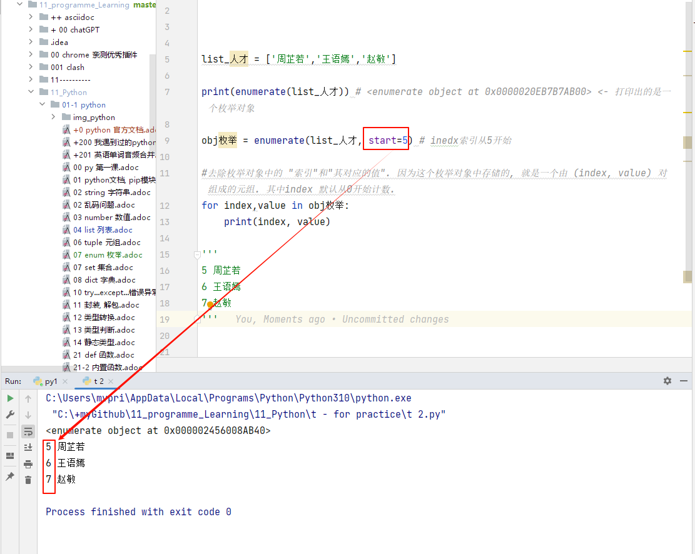
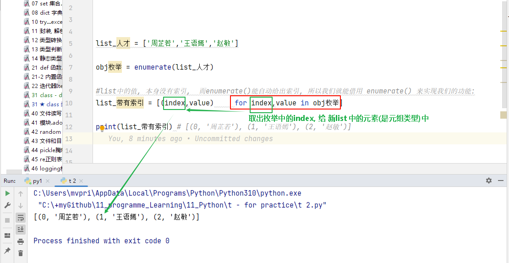

= enumerate(iterable, start=0) 函数
:toc: left
:toclevels: 3
:sectnums:
:stylesheet: myAdocCss.css

'''

== enumerate(iterable, start=0) -> 能自动给可迭代对象 添加 index索引

返回一个枚举对象。iterable 必须是一个序列，或 iterator，或其他支持迭代的对象。  +
*enumerate() 返回的迭代器的 __next__() 方法, 返回一个"元组"，里面包含一个计数值（从 start 开始，默认为 0）, 和通过迭代 iterable 获得的值。*

enumerate() 函数**返回一个"枚举对象"，该对象是一个迭代器，##它生成由 (index, value) 对组成的元组，##其中 index 是从 start（默认为 0）开始计数的索引，value 是从输入的可迭代对象中获取的值。**

[source, python]
....
list_人才 = ['周芷若','王语嫣','赵敏']

print(enumerate(list_人才)) # <enumerate object at 0x0000020EB7B7AB00> <- 打印出的是一个枚举对象

obj枚举 = enumerate(list_人才)

#要取出枚举对象中的 "索引"和"其对应的值". 因为这个枚举对象中存储的, 就是一个由 (index, value) 对组成的元组. 其中index 默认从0开始计数.
for index,value in obj枚举:
    print(index, value)

'''
0 周芷若
1 王语嫣
2 赵敏
'''
....

== 如果你想自定义index的起始值, 就用 start 参数来指定

你可以通过 start 参数, 来指定索引的起始值。

[source, python]
....
list_人才 = ['周芷若','王语嫣','赵敏']

print(enumerate(list_人才)) # <enumerate object at 0x0000020EB7B7AB00> <- 打印出的是一个枚举对象

obj枚举 = enumerate(list_人才, start=5) # inedx索引从5开始

#去除枚举对象中的 "索引"和"其对应的值". 因为这个枚举对象中存储的, 就是一个由 (index, value) 对组成的元组. 其中index 默认从0开始计数.
for index,value in obj枚举:
    print(index, value)

'''
5 周芷若
6 王语嫣
7 赵敏
'''
....

'''

== 案例: 给列表添加索引, 转成一个新列表

即将枚举中的index, value, 合作为一个元组, 存在一个list中

[source, python]
....
list_人才 = ['周芷若','王语嫣','赵敏']

obj枚举 = enumerate(list_人才)

#list中的值, 本身没有索引,  而enumerate()能自动给出索引, 所以我们就能借用 enumerate() 来实现我们的功能:
list_带有索引 = [(index,value)     for index,value in obj枚举]

print(list_带有索引) # [(0, '周芷若'), (1, '王语嫣'), (2, '赵敏')]
....

'''

== enumerate() 可以与任何可迭代对象结合使用，包括文件对象、生成器等。

