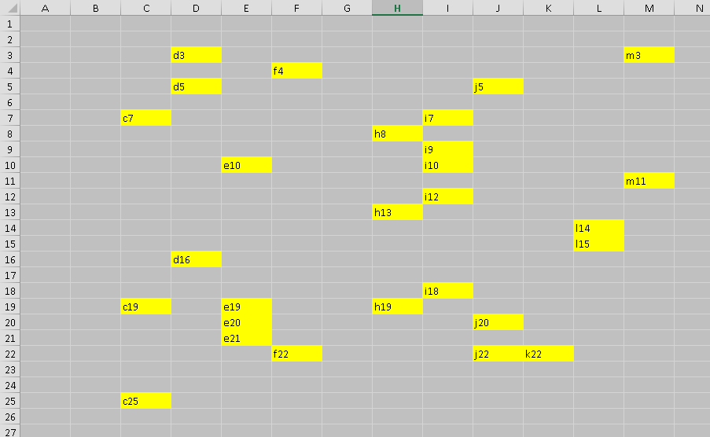

= OpenPyXL库: excel操作
:toc:

---

== 官方文档

https://openpyxl.readthedocs.io/en/stable/

安装库
....
pip install openpyxl
....

总结:

|===
|功能 |方法

|在内存中创建一个xlsx文件(工作簿), +
默认里面只有一张表worksheet(工作表)
|openpyxl.Workbook() -> xlsxWorkBook

|在xlsx文件中, 创建新表worksheet
|xlsxWorkBook.create_sheet('新表名') -> workSheetNew

|将内存中的xlsx文件中, 实际保存到电脑上 +
注意, 如果同名文件已经存在, save()方法会覆盖原文件.
|xlsxWorkBook.save('电脑路径')

|读取电脑上的xlsx文件
|openpyxl.load_workbook(xlsx文件路径) -> xlsxWorkBook

|
|

|查看xlsx文件中, 所有存在的表的表名
|xlsxWorkBook.sheetnames -> list

|获取xlsx文件中, 当前激活中的那张worksheet表,  +
默认总归是获取到第一张worksheet表
|xlsxWorkBook.active -> workSheetActive

|获取xlsx文件中指定的表
|xlsxWorkBook['表名'] -> 指定表名的workSheet

|复制workSheet表, +
只能在同一xlsxWorkBook工作簿内复制表
|xlsxWorkBook.copy_worksheet(xlsxWorkBook['某表名'])

|修改workBook表名
|某workSheet.title = '新表名'

|
|

|给单元格赋值
|某workSheet[坐标] = '新值' +
或  某workSheet.cell(row=行数坐标, column=列数坐标, value='新值')

|获取某单元格的值
|某workSheet[坐标] # 以键取值即可

|访问一个矩形片区的单元格
|某workSheet['左上角单元格坐标':'右下角单元格坐标']

|遍历整张worksheet的所有数据, 一行一行迭代
|某workSheet.rows

|遍历整张worksheet的所有数据, 一列一列迭代
|某workSheet.columns

|===

---

== 对 工作簿(xlsxWorkBook) 的操作

==== 在内存中创建xlsx, 再在里面创建n张表, 最后保存到电脑上

[source, python]
....
import openpyxl

# 在内存中创建一个xlsx文件 Create a workbook. 它会至少包含一个表worksheet
xlsxWorkBook = openpyxl.Workbook()

# 获取xlsx文件中, 当前激活中的那张worksheet表, 默认总归是获取到第一张worksheet表
workSheetActive = xlsxWorkBook.active

# 在这个xlsx文件中, 创建一张新表,位置默认在最后.
workSheet2 = xlsxWorkBook.create_sheet('表2')  # insert at the end (default)
workSheet3 = xlsxWorkBook.create_sheet('表3')
workSheet3 = xlsxWorkBook.create_sheet('表-1', 0)  # insert at first position

# 查看xlsx文件中, 所有表的名字
print(xlsxWorkBook.sheetnames)  # ['表-1', 'Sheet', '表2', '表3']

xlsxWorkBook.save('d:/ttt.xlsx')  # 把内存中的xlsx文件, 正式保存到电脑上.
# 注意, 如果同名文件已经存在, save()方法会覆盖原文件.
....

---

==== 读取电脑上的xlsx文件 ->  openpyxl.load_workbook(文件路径)

[source, python]
....
import openpyxl
pathXlsx = 'd:/ttt.xlsx'

# 读取电脑上的xlsx文件
xlsxWorkBook = openpyxl.load_workbook(pathXlsx)
print(xlsxWorkBook.sheetnames)  # ['表-1', 'Sheet', '表2', '表3']

....

---

==  对 工作表(WorkSheet)的操作

==== 获取某个表worksheet, 以对它进行操作 -> xlsxWorkBook[表名]

[source, python]
....
import openpyxl

pathXlsx = 'd:/ttt.xlsx'

# 读取电脑上的xlsx文件
xlsxWorkBook = openpyxl.load_workbook(pathXlsx)
print(xlsxWorkBook.sheetnames)  # ['表-1', 'Sheet', '表2', '表3']

# ---------------------------

# 拿到里面的'表2'
workSheet2 = xlsxWorkBook['表2'] # 类似于dict以键取值的操作.
print(workSheet2) # <Worksheet "表2">

# 修改表名
workSheet2.title = 'new表2'
print(xlsxWorkBook.sheetnames) # ['表-1', 'Sheet', 'new表2', '表3']
....

---

==== 复制workSheet表 -> xlsxWorkBook.copy_worksheet(xlsxWorkBook['某表名'])

注意, 不能垮xlsxWorkBook复制, 只能在同一个xlsxWorkBook内复制workSheet表.

您无法在工作簿(workbooks)之间复制工作表(worksheets)。 +
如果工作簿以只读或只写模式打开，则无法复制工作表。

[source, python]
....
import openpyxl

pathXlsx = 'd:/ttt.xlsx'

# 读取电脑上的xlsx文件
xlsxWorkBook = openpyxl.load_workbook(pathXlsx)
print(xlsxWorkBook.sheetnames)  # ['表-1', 'Sheet', '表2', '表3']

# ----------------------------

# 下面, 我们来复制'表3'
xlsxWorkBook.copy_worksheet(xlsxWorkBook['表3'])
print(xlsxWorkBook.sheetnames) # ['表-1', 'Sheet', '表2', '表3', '表3 Copy']

# 别忘了保存! 注意:保存时, 该文件不能在excel中已经打开, 先关掉它.
xlsxWorkBook.save('d:/ttt.xlsx')
....

---

== 对 单元格(cell)的操作

当worksheet在内存中被创建后, 默认是没有单元格的, 单元格会在你第一次访问它们时, 被创建出来.

==== 给单元格赋值 ->  某worksheet['坐标'] = '新值'; 及获取单元格中的内容 -> 某worksheet['表名'].value

[source, python]
....
import openpyxl

pathXlsx = 'd:/ttt.xlsx'
xlsxWorkBook = openpyxl.load_workbook(pathXlsx)  # 读取电脑上的xlsx文件

workSheet2 = xlsxWorkBook['表2']
workSheet2['b1'] = 'zzr' # 给b1单元格直接赋值.
print(workSheet2['b1'].value) # zzr <-- 查看b1单元格中的值

xlsxWorkBook.save('d:/ttt.xlsx')
....

---

==== 给单元格赋值 -> 某workSheet.cell(row=行数坐标, column=列数坐标, value='新值')

也可以通过制定行列数, 来赋值. 比如下例: 第1列,第3行,就是a3单元格. 有返回值, 就是你的赋值数据.

[source, python]
....
import openpyxl

pathXlsx = 'd:/ttt.xlsx'
xlsxWorkBook = openpyxl.load_workbook(pathXlsx)  # 读取电脑上的xlsx文件

workSheet2 = xlsxWorkBook['表2']
value_a3 = workSheet2.cell(row=3, column=1, value='wyy')  # 本例用cell()方法, 来给第1列,第3行,就是a3单元格 赋值. 并返回所赋的值
print(workSheet2['a3'].value)  # wyy
....

通过这种方式, 而我们就能批量给单元格赋值了. 使用for...in...来遍历访问单元格.

[source, python]
....
import openpyxl

pathXlsx = 'd:/ttt.xlsx'
xlsxWorkBook = openpyxl.load_workbook(pathXlsx)  # 读取电脑上的xlsx文件

workSheet2 = xlsxWorkBook['表2']

# 下面给[j5-t10]区域的单元格赋值
for row in range(5, 11):
    for column in range(10, 21):
        workSheet2.cell(row=row, column=column, value=row * column)

xlsxWorkBook.save(pathXlsx)
....

---

==== 访问一个矩形片区的单元格 -> 某workSheet['左上角单元格坐标':'右下角单元格坐标']

[source, python]
....
import openpyxl

pathXlsx = 'd:/ttt.xlsx'
xlsxWorkBook = openpyxl.load_workbook(pathXlsx)  # 读取电脑上的xlsx文件

workSheet2 = xlsxWorkBook['表2']

# 下面来访问[j5-t10]区域的单元格
tupleCellArea = workSheet2['j5':'t10'] # 注意中间是冒号!
# 会返回一个元组, 元组中的每一个元素(也是个元组),代表一行.

for row in tupleCellArea:
    for cell in row:
        print('{},'.format(cell.value), end='')
    print()
....

---

==== 获取worksheet表中的所有数据 -> worksheet.rows 或 worksheet.columns

[source, python]
....
import openpyxl

pathXlsx = 'd:/ttt.xlsx'
xlsxWorkBook = openpyxl.load_workbook(pathXlsx)  # 读取电脑上的xlsx文件

workSheet2 = xlsxWorkBook['表2']

# 遍历整张worksheet的所有数据, 一行一行迭代
tupleCellArea = workSheet2.rows

for row in tupleCellArea:
    for cell in row:
        print('{},'.format(cell.value), end='')
    print()
....

如果把上面的语句改成 workSheet2.columns, 就变成一列一列迭代了, 相当于行列转置.

[source, python]
....
import openpyxl

pathXlsx = 'd:/ttt.xlsx'
xlsxWorkBook = openpyxl.load_workbook(pathXlsx)  # 读取电脑上的xlsx文件

workSheet2 = xlsxWorkBook['表2']

# 遍历整张worksheet的所有数据, 一列一列迭代
tupleCellArea = workSheet2.columns

for row in tupleCellArea:
    for cell in row:
        print('{},'.format(cell.value), end='')
    print()
....

---

== 样式

==== 给单元格, 填背景色 -> PatternFill() / 获取单元格的背景色 -> workSheetActive['坐标'].fill.fgColor.rgb

[source, python]
....

import openpyxl
from openpyxl.styles import PatternFill # 导入此模块

urlFile = 'e:/ttt/excel_01.xlsx'

insWorkBook = openpyxl.load_workbook(urlFile) # 读取电脑上的xlsx文件
workSheetActive = insWorkBook.active # 获取xlsx文件中, 当前激活中的那张worksheet表

workSheetActive['a2'] = 'abc' # 给a2单元格赋值
print(workSheetActive['a2'].value) # 查看a2单元格中的值

#-----------------
# 下面开始对单元格, 设置背景色

insFill = PatternFill("solid", fgColor="FFFF00")
# 创建"填充"样式的实例, 为黄色.
# 注意: 实例一旦被创建实例的属性就不可更改，只能重新创建实例。

workSheetActive['a2'].fill = insFill # 给a2单元格, 赋予黄色填充, 即将此单元格变成黄色背景

insWorkBook.save(urlFile) # 保存

#-----------------
# 如果想获取某单元格的背景色, 用 workSheetActive['坐标'].fill.fgColor.rgb 来拿到.

print(workSheetActive['a2'].fill.fgColor.rgb)  # 00FFFF00 <--注意, 拿到的16进制颜色, 前面都有两个0

if workSheetActive['a2'].fill.fgColor.rgb == "00FFFF00":
    print('此单元格的背景色是黄色') # 顺利打印!

....

所有excel内置颜色, 见 +
https://openpyxl.readthedocs.io/en/latest/_modules/openpyxl/styles/colors.html

---

==== 案例: 给表格中, 某区域中的随机坐标的单元格, 填充背景色

[source, python]
....
import openpyxl, random
from openpyxl.styles import PatternFill

# 单元格坐标的类
class Cls_CellIndex:
    def __init__(self, x_letterMin, x_letterMax, y_numMin, y_numMax):  # x和y坐标的最小值和最大值, 就单元格坐标的区间范围.
        # x横坐标是英文字母, y纵坐标是数字
        self.x_letterMin = x_letterMin
        self.x_letterMax = x_letterMax
        self.y_numMin = y_numMin
        self.y_numMax = y_numMax
        self.listLetter_X = self.fn_getListLetter()  # 表格的x坐标,是字母
        self.listNum_Y = self.fn_getListNumber()  # 表格的y坐标,是数字

    def fn_getListLetter(self):  # 创建一个英文字母区间的list
        list_AsciiNum = [i for i in range(ord(self.x_letterMin), ord(self.x_letterMax) + 1)]
        listLetter = [chr(i) for i in list_AsciiNum]  # chr(numAscii) 能将ascii数值,转成对应的英文字母
        return listLetter

    def fn_getListNumber(self):  # 创建一个数值区间的list
        listNumber = [i for i in range(self.y_numMin, self.y_numMax + 1)]
        return listNumber

    def fn_getRandomIndex(self):  # 根据x和y坐标的区间范围, 获取里面随机的单元格的坐标
        tuple_RandomIndex = (random.choice(self.listLetter_X), random.choice(self.listNum_Y))
        # random.choice(sequence) 从序列中, 随机抽取一个元素
        return tuple_RandomIndex

# ---------------------.

urlFile = 'e:/ttt/excel_01.xlsx'

insWorkBook = openpyxl.load_workbook(urlFile)  # 读取电脑上的xlsx文件
workSheetActive = insWorkBook.active  # 获取xlsx文件中, 当前激活中的那张worksheet表

ins_CellIndex = Cls_CellIndex('c', 'm', 2, 25)  # 获取只存在于这个区间范围内的excel表的单元格的 坐标实例

insFill = PatternFill("solid", fgColor="FFFF00")
# 创建"填充"样式的实例, 为黄色.
# 注意: 实例一旦被创建实例的属性就不可更改，只能重新创建实例。

for i in range(30):  # 来填充30个随机坐标的单元格的背景色
    tupleIndex = ins_CellIndex.fn_getRandomIndex()
    strIndex = str(tupleIndex[0]) + str(tupleIndex[1])
    workSheetActive[strIndex].fill = insFill  # 将黄色填充样式, 赋予strIndex坐标的单元格, 即填充黄色背景
    workSheetActive[strIndex] = strIndex # 再给这单元格填充文字内容

insWorkBook.save(urlFile)  # 保存

....

效果 +

---

