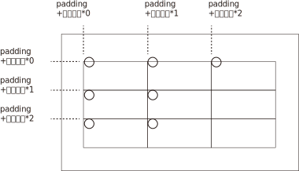

= Pillow 图像编辑
:toc:

---

== 官方文档

https://pillow.readthedocs.io/en/latest/handbook/index.html +
https://github.com/python-pillow/Pillow

安装
....
pip install Pillow
或
pip install -i https://pypi.tuna.tsinghua.edu.cn/simple Pillow
....

---

== 新建, 打开, 与保存图片

==== 新建一个空白图片 -> Image.new(颜色模式, tuple图片尺寸, 背景色color=0) => 返回一个图片实例(Image object)

[source, python]
....
PIL.Image.new(mode, size, color=0)
....

- mode : 图片的颜色模式(比如"RGB","CMYK")
- size : 是个2元元组, 包含宽度和高度的像素
- color: 图片的背景色是什么?

此方法的官方文档见 +
 https://pillow.readthedocs.io/en/latest/reference/Image.html#PIL.Image.new

[source, python]
....
from PIL import Image

insImg = Image.new("RGB",(300,600),"red") # 新建一个宽300高600像素的, 背景为红色的图片. 如果想要白色底色, 就设置为"white"
insImg.show()
....

---

==== 载入并显示图片 -> Image.open('img.xxx') => insImg

[source, python]
....
from PIL import Image  # 导入Image类

insImg = Image.open('img.png')  # 打开图像,封装成Image实例
print(insImg.format)  # PNG
print(insImg.size)  # (368, 548) <-- 是个元组, 表示图片的宽和高(像素)
print(insImg.mode)  # RGBA

insImg.show() # 会先将图片保存到一个临时目录中, 并调用系统默认的图片浏览器, 来打开图片
....

---

==== 转换图片格式, 并另存文件 -> insImg.save('newImg.xxx')

对图片实例, 调用save()方法, 并传入新的文件名(包括扩展名), 就能进行图片转换了. pillow会自动根据你新文件名中的扩展名, 来做出相应的格式转换.

[source, python]
....
from PIL import Image  # 导入Image类

insImg = Image.open('img.png')  # 打开图像,封装成Image实例
try:
    insImg.save('newImg.bmp') # 经测试, png无法转换成jpg, 但能转换成bmp
except IOError:
    print('出错了,无法转换图片格式!')
....

注意: save()方法, 默认会对jpg进行压缩, 可以设置第二个参数quality 来控制图片质量: 值的范围从1（最差）到95（最佳）。 默认值为75，使用中应尽量避免高于95的值; 100会禁用部分JPEG压缩算法，并导致图像文件容量过大, 但质量几乎没有任何增益。

[source, python]
....
insImg.save(img_name, quality=95)
....

---

== 修改图片尺寸

==== 创建图片缩略图(只缩小不放大) -> insImg.thumbnail(tupleSize_WidthAndHeight) => 无返回值, 会直接修改原始insImg对象

[source, python]
....
from PIL import Image  # 导入Image类

insImg = Image.open('img.png')
newSize = (100, 1000)  # 宽, 高. 注意,
# 虽然本句, 我们没有按比例来设定宽高, 但insImg.thumbnail()方法依然会按比例来缩小图片.

try:
    insImg.thumbnail(newSize)
    '''
    按比例缩小, 创建缩略图. 如果新尺寸大于原图尺寸, 则原图不会放大.
    注意!! thumbnail()方法没有返回值, 会直接修改原始insImg对象!
    '''
    insImg.save('newImg.bmp') # 将缩略图另存为
except IOError:
    print('出错了,无法创建缩略图!')
....

---

==== 改变图片尺寸(不按原图比例) -> insImg.resize(tuple_newSize) => newInsImg

[source, python]
....
from PIL import Image

insImg = Image.open('img.webp')
newInsImg = insImg.resize((150,150)) # 强制指定宽高像素, 即不按原图比例来缩放图片
newInsImg.show()
....

---

==== 改变图片尺寸(按原图比例) -> insImg.resize(tuple_newSize) => newInsImg

[source, python]
....
from PIL import Image

insImg = Image.open('img.webp')
width, height = insImg.size  # 先拿到原图的宽高
tuple_newSize = (int(width * 0.5), int(height * 0.5)) # 在原图宽高上同比缩放, 就能让图片按原图比例来缩放了
newInsImg = insImg.resize(tuple_newSize)
newInsImg.show()
....

---

== 选转, 翻转图片

==== 旋转图片 (逆时针方向) -> insImg.rotate(逆时针旋转的度数) => newInsImg

[source, python]
....
from PIL import Image

insImg = Image.open('img.webp')
insNewImg = insImg.rotate(45) # 逆时针旋转45度, 返回一个新图片实例
insNewImg.show()
....

也可以用transpose()方法来实现. transpose()既可以用来"翻转"图片(见下一小节), 也能用来"旋转"图片.
[source, python]
....
from PIL import Image

insImg = Image.open('img.webp')
insNewImg = insImg.transpose(Image.ROTATE_90) # 逆时针旋转90度
insNewImg = insImg.transpose(Image.ROTATE_180) # 逆时针旋转180度
insNewImg = insImg.transpose(Image.ROTATE_270) # 逆时针旋转270度, 等价于顺时针旋转90度
insNewImg.show()
....

---

==== 翻转图片 -> insImg.transpose(pillow内置变量)

[source, python]
....
from PIL import Image

insImg = Image.open('img.webp')
insNewImg = insImg.transpose(Image.FLIP_LEFT_RIGHT) # 左右翻转图片
insNewImg = insImg.transpose(Image.FLIP_TOP_BOTTOM) # 上下翻转图片
insNewImg.show()
....

---

== 复制, 粘贴

==== 对图片的子区域. 进行拷贝与粘贴, 并旋转图片 -> 目标图片实例.paste(图片子区域实例, 粘贴坐标)

[source, python]
....
from PIL import Image

insImg = Image.open('img.webp')

tuple_boxSize = (100, 100, 200, 200)
region = insImg.crop(tuple_boxSize)  # 选取子区域, 返回的类型;, 依然是个Image对象
print(type(region))  # <class 'PIL.Image.Image'>

region = region.transpose(Image.ROTATE_90)  # 把刚刚复制下来的图片子区域, 逆时针旋转90度
insImg.paste(region, tuple_boxSize)  # 再把这个子区域, 原坐标粘贴回原图上

insImg.show()
....

---

==== 拷贝图片到另一张图片上 -> Image.copy() => 返回原图实例

[source, python]
....
from PIL import Image

insImg空白图 = Image.new('RGB', (1024, 768), 'black')  # 颜色模式, 必须用大写字母!
insImg抽奖券 = Image.open('img.webp')
insImg抽奖券.thumbnail((150, 150))  # 先对原图进行一下缩略图操作, 注意: thumbnail()方法回直接修改原始insImg对象!

width, height = insImg抽奖券.size  # 拿到抽奖券图片的宽高尺寸, 是个tuple元组
print(width, height)  # 97 150

insImg抽奖券的拷贝 = insImg抽奖券.copy()  # 对抽奖券图片进行整体拷贝
insImg空白图.paste(insImg抽奖券的拷贝, (0, 0))  # 把抽奖券,拷贝到空白图的(0,0)坐标处!
insImg空白图.show()
....

---

== 加上字体 -> 要用到 ImageDraw类 和 ImageFont类

[source, python]
....
from PIL import Image, ImageFont, ImageDraw
# ImageDraw模块, 用来为Image对象提供简单的2D图形绘制.

insImg = Image.open('img.webp') # 打开一张本地图片
insDraw = ImageDraw.Draw(insImg)  # 创建一个专门用来在的insImg图片上 画二维图的Draw实例对象
insFont = ImageFont.truetype('msyh.ttc', 36)  # 拿到字体: 微软雅黑, 36号字, 创建这个字体类的实例

insDraw.text((50, 100), '百日依山尽\n黄河入海流', 'blue', font=insFont)  # 调用Draw对象的打字text()方法, 文字的左上角坐标是(50,100), 蓝色字, 用微软雅黑字体

insImg.show()
insImg.save('img2.webp') #  把添加了文字的这个图片,另存为名叫 img2.webp
....

---

== 案例: A4纸平铺抽奖券, 并编号

每张抽奖券的左上角坐标计算图 +

[source, python]
....
'''
- 载入抽奖券
- 输入总共要几张抽奖券?
- 获取抽奖券的宽高像素
- 进行计算, 这n张抽奖券, 每张a4纸最多只能放多少张抽奖券? 总共要创建多少张a4纸, 才能摆得下全部的抽奖券?
- 将抽奖券拷贝, 并粘贴到a4纸上, (注意: a4纸不能顶着边缘粘贴图像, 四周必须各保留100像素的空白空间), 并保存a4纸到电脑上
'''
from PIL import Image, ImageDraw, ImageFont

# ---------------------
# 你只需要输入以几个值, 然后直接运行本py文件即可!

str抽奖券路径 = r'C:\Users\Administrator\PycharmProjects\myTest\抽奖券.jpg'  # 抽奖券路径
numStart = 1  # 抽奖券初始编号
numEnd = 100  # 抽奖券结束编号
str字体名字 = 'msyh.ttc'  # 抽奖券上要添加编号的字体名称
num字号大小 = 36
str文字颜色 = 'black'
tuple_text左上角坐标 = (30, 50)  # 编号文本, 在抽奖券图片上的左上角坐标
strA4纸背景色 = 'white'
numA4纸四边留空像素 = 100

# 文本的内容的设置, 到62行寻找 textContent 变量

# ---------------------

# 抽奖券类
class ClsTicket(object):
    def __init__(self, pathTicket, numOfTotal):  # 传入抽奖券图片的路径, 和你需要抽奖券的总数量
        self.抽奖券路径 = pathTicket
        self.抽奖券总数量 = numOfTotal
        self.insImg = self.fn_getInsImg()  # 居然可以在__init__()中调用实例方法!
        self.width, self.height = self.fn_获取抽奖券的宽高()  # 抽奖券的宽高

    def fn_getInsImg(self):  # 载入抽奖券图片, 封装成Image对象
        insImg = Image.open(self.抽奖券路径)
        return insImg

    def fn_获取抽奖券的宽高(self):
        return self.insImg.size

    # 对自己这个Image对象, 进行拷贝
    def fn_获取抽奖券Image对象的副本(self):
        insCopy = self.fn_getInsImg().copy()
        return insCopy

    # 创建从编号numStart到 numEnd 数量的抽奖券, 并将这些图片保存到电脑上
    def fn_创建所有编号的抽奖券并另存到电脑(self, numStart, numEnd):
        insFont = ImageFont.truetype('msyh.ttc', 36)

        for i in range(numStart, numEnd + 1):
            insCopyTemp = self.fn_获取抽奖券Image对象的副本()
            insDraw = ImageDraw.Draw(insCopyTemp)
            textContent = '编号:{}'.format(str(i))  # 要添加的文字内容是这个
            insDraw.text(tuple_text左上角坐标, text=textContent, fill=str文字颜色, font=insFont)  # 添加上文字, 第一个参数为文字的左上角坐标
            insCopyTemp.save('copy抽奖券-{}.jpg'.format(i), quality=95)

    # 给抽奖券的copy副本, 添加上文字, 并返回这个新的insImg对象
    def fn_创建抽奖券Image对象的副本并添加上文本内容(self, num当前抽奖券的编号):  # 传入编号
        insFont = ImageFont.truetype(str字体名字, num字号大小)
        insCopyTemp = self.fn_获取抽奖券Image对象的副本()
        insDraw = ImageDraw.Draw(insCopyTemp)
        textContent = '编号:{}'.format(num当前抽奖券的编号)  # 要添加的文字内容是这个
        insDraw.text(tuple_text左上角坐标, text=textContent, fill=str文字颜色, font=insFont)  # 添加上文字
        return insCopyTemp

# A4空白纸类
class ClsA4(object):
    def __init__(self, insTicket):  # 传入抽奖券的Image实例对象
        self.insTicket = insTicket
        self.padding = numA4纸四边留空像素  # a4纸四边要留空的像素数
        self.width = 2480  # A4纸的宽度像素
        self.height = 3508  # A4纸的高度像素
        self.insImg = self.fn_getInsImg()  # 这是A4纸的Image实例对象
        self.widthSafe, self.heightSafe = self.fn_获取A4纸的安全宽高()  # 扣除边缘不可打印部分的中间安全宽高
        self.numInX, self.numInY = self.fn_计算在单张A4上横向和竖向能摆放的抽奖券数量()  # 单张A4上, 横向和竖向可摆放几张抽奖券
        self.num共需要多少张A4纸 = self.fn_计算需要多少张A4纸()

    def fn_getInsImg(self):  # 创建A4纸
        insImg = Image.new('RGB', (self.width, self.height), strA4纸背景色)  # 用new()方法(而非open方法!), 来创建一个绿色背景的a4纸 的Image对象
        return insImg

    def fn_获取A4纸的安全宽高(self):  # 获取A4纸实际可利用的宽高
        widthSafe = self.width - self.padding * 2
        heightSafe = self.height - self.padding * 2
        return (widthSafe, heightSafe)

    # 计算在单张A4上, 横向和竖向可摆放几张抽奖券
    def fn_计算在单张A4上横向和竖向能摆放的抽奖券数量(self):
        numInX = self.widthSafe // insTicket.width  # //即取整, 不要小数点后的余数!
        numInY = self.heightSafe // insTicket.height
        print('单张A4可放:横向{}张,纵向{}张抽奖券'.format(numInX, numInY))
        return (numInX, numInY)

    # 计算需要多少张A4纸?
    def fn_计算需要多少张A4纸(self):
        numTotalA4 = (insTicket.抽奖券总数量 // (self.numInY * self.numInX)) + 1
        print('总共需要{}张A4'.format(numTotalA4))
        return numTotalA4

    # 对所有数量的抽奖券, 需要多少张A4 ,就创建多少张A4, 并粘贴上这些抽奖券
    def fn_创建所有的A4并另存到电脑(self, numStart, numEnd):
        num当前编号 = numStart
        numA4编号 = 1
        while num当前编号 <= numEnd:
            insA4对象 = self.fn_getInsImg()  # 先创建一个空白a4

            for numSortInY in range(0, self.numInY):  # 竖向(y轴)第n张抽奖券
                for numSortInX in range(0, self.numInX):  # 横向(x轴)第n张抽奖券
                    # print(numSortInY, numSortInX)
                    tuple_每张抽奖券的左上角坐标 = (
                        self.padding + insTicket.width * numSortInX,
                        self.padding + insTicket.height * numSortInY,)  # 当前抽奖券的左上角坐标

                    # print(tuple_每张抽奖券的左上角坐标)
                    ins抽奖券Image对象的副本 = insTicket.fn_创建抽奖券Image对象的副本并添加上文本内容(str(num当前编号))
                    print('当前num编号--> ', num当前编号)
                    num当前编号 += 1
                    insA4对象.paste(ins抽奖券Image对象的副本, tuple_每张抽奖券的左上角坐标)

                numSortInX += 1
            numSortInY += 1
            insA4对象.save('a4-{}.jpg'.format(numA4编号))  # 将A4纸图片文件保存到电脑
            numA4编号 += 1

insTicket = ClsTicket(str抽奖券路径, 100)
insA4 = ClsA4(insTicket)
insA4.fn_创建所有的A4并另存到电脑(numStart, numEnd)  # 亲测成功!

....

---

