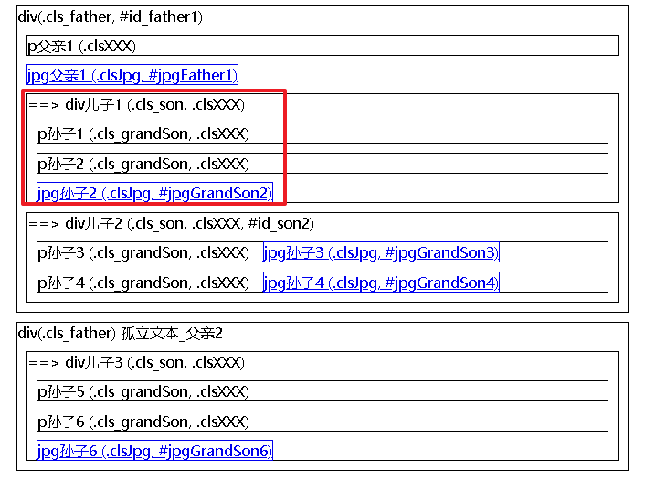
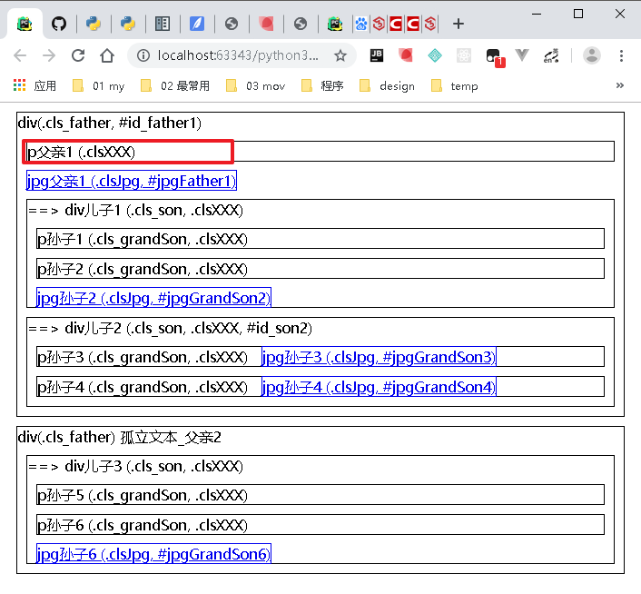
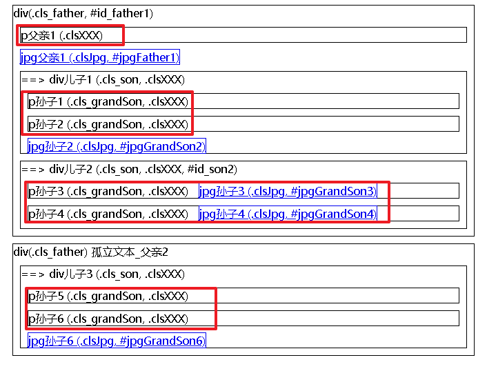
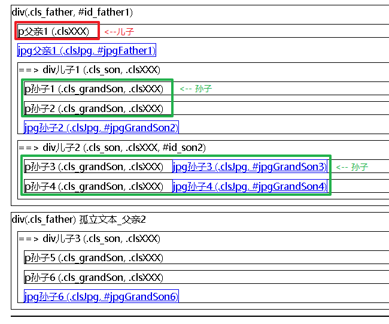
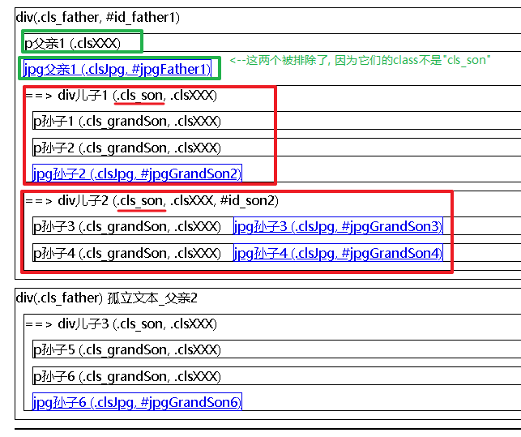
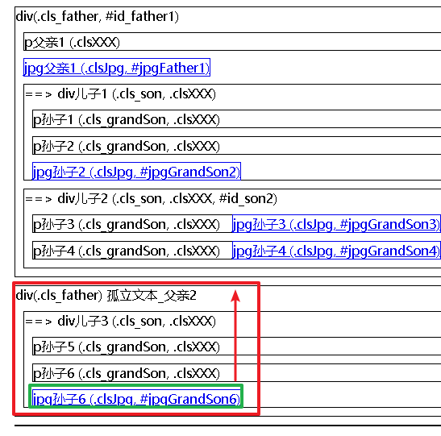

= PyQuery库
:toc:

---

== 安装

官方文档 +
https://pythonhosted.org/pyquery/

查询的一般策略: +
**由于find()方法是可以跨层级查找的, 所以优先选择find()来查找. **而children()只能找到儿子层级上的, 孙子层级上即使存在, 也找不到的. 所以children()不推荐优先使用.

**但也正由于find()是跨层级查找的, 所以为了事先缩小范围, 而把不相关的内容屏蔽出去, 可以先用class或id选择器, 来定位到某一个元素上, 再对这个元素用find()来进一步查找细节内容.**

---

== 获取整个网页的内容

==== 获取url中的"html代码" -> pyquery.PyQuery(url=url地址).html()

[source, python]
....
import requests
import pyquery

url = 'https://movie.douban.com/'
pq = pyquery.PyQuery(url=url) # 将url地址, 挂在url参数上.
print(pq.html()) # 拿到 html代码
....

---

==== 获取html中的"html代码" -> pyquery.PyQuery(html).html()

注意: html代码最好所有的tag必须有闭标签! 并且不要有游离于tag标签外的孤立文本内容为好! 即严格遵循html5规范.

实验html为:
[source, html]
....
html = """

 div(.cls_father, #id_father1)
    
p父亲1 (.clsXXX)

    <a href="http://www.abc.com/father1.jpg" class="clsJpg" id="jpgFather1">jpg父亲1 (.clsJpg, #jpgFather1)</a>

    
 ==> div儿子1 (.cls_son, .clsXXX)
        
p孙子1 (.cls_grandSon, .clsXXX)

        
p孙子2 (.cls_grandSon, .clsXXX)

        <a href="http://www.abc.com/grandSon2.jpg" class="clsJpg" id="jpgGrandSon2">jpg孙子2 (.clsJpg, #jpgGrandSon2)</a>
    

    
 ==> div儿子2 (.cls_son, .clsXXX, #id_son2)
        
p孙子3 (.cls_grandSon, .clsXXX)
            <a href="http://www.abc.com/grandSon3.jpg" class="clsJpg" id="jpgGrandSon3">jpg孙子3 (.clsJpg, #jpgGrandSon3)</a>
        

        
p孙子4 (.cls_grandSon, .clsXXX)
            <a href="http://www.abc.com/grandSon4.jpg" class="clsJpg" id="jpgGrandSon4">jpg孙子4 (.clsJpg, #jpgGrandSon4)</a>
        

    

 div(.cls_father)
    孤立文本_父亲2
    
 ==> div儿子3 (.cls_son, .clsXXX)
        
p孙子5 (.cls_grandSon, .clsXXX)

        
p孙子6 (.cls_grandSon, .clsXXX)

        <a href="http://www.abc.com/grandSon6.jpg" class="clsJpg" id="jpgGrandSon6">jpg孙子6 (.clsJpg, #jpgGrandSon6)</a>
    

 """
....

[source, python]
....
import requests
import pyquery

html = """<html>...""" # 这里面已经存放了html代码

pq = pyquery.PyQuery(html) # 现在，pq 就像 jQuery 中的 $ 一样了。
print(pq.html()) # 拿到 html代码
....

---

==== 获取text"纯文本"内容 -> pyquery.PyQuery(url=url地址).text()

[source, python]
....
import requests
import pyquery

url = 'https://movie.douban.com/'
pq = pyquery.PyQuery(url=url)
print(pq.text())  # 拿到text纯文本.
....

注意: text()方法虽然能够拿到html中的纯文本内容, 但是在<script>标签中的JavaScript代码, 也会被拿到!

---

== class类 选择器

==== 获取选中的class类中的第一个元素的 html代码 -> pyquery.PyQuery(url=url地址)('.类名').html()

注意: html()方法只能拿到匹配到的"第一个"元素.

[source, python]
....
pq = pyquery.PyQuery(html代码)
print(pq('.cls_son').html()) # 儿子有很多, 但html()只能拿到第一个儿子.
....

---

==== 获取选中的class类中的 text纯文本内容 -> pyquery.PyQuery(url=url地址)('.类名').text()

text()能拿到"所有"匹配到的元素的纯文本内容!

[source, python]
....
pq = pyquery.PyQuery(html代码)
print(pq('.cls_son').text())
....

遍历: 用items()方法.
[source, python]
....
pq = pyquery.PyQuery(html代码)
for i in pq('p').items():  # 遍历选中的所有p元素, 注意, 别忘了要先使用 .items()方法!
    '''
    通过items()方法,可以得到一个生成器，
    并且我们通过for循环得到的每个元素, 依然是一个pyquery对象。
    '''
    print(i.text())

'''打印结果是
p父亲1 (.clsXXX)
p孙子1 (.cls_grandSon, .clsXXX)
p孙子2 (.cls_grandSon, .clsXXX)
p孙子3 (.cls_grandSon, .clsXXX) jpg孙子3 (.clsJpg, #jpgGrandSon3)
p孙子4 (.cls_grandSon, .clsXXX) jpg孙子4 (.clsJpg, #jpgGrandSon4)
p孙子5 (.cls_grandSon, .clsXXX)
p孙子6 (.cls_grandSon, .clsXXX)
'''
....

---

== id选择器

==== 获取选中的id 中的第一个元素的 html代码 -> pyquery.PyQuery(url=url地址)('#id名').html()

由于id是唯一的, 所以就不存在选中相同id的集合的说法了. 永远只能选中唯一的元素.

[source, python]
....
pq = pyquery.PyQuery(html代码)
print(pq('#id_son2').html())
....

---

==== 获取选中的id 中的 text纯文本内容 -> pyquery.PyQuery(url=url地址)('#id名').text()

[source, python]
....
pq = pyquery.PyQuery(html代码)
print(pq('#id_son2').text())
....

---

== tag选择器

==== 选取第一个某tag元素的html代码 -> pyquery.PyQuery(url=url地址)('tag名').html()

注意: html()方法只能拿到匹配到的"第一个"元素.

[source, python]
....
pq = pyquery.PyQuery(html代码)
print(pq('p').html())
....

---

==== 选取所有某tag元素的text纯文本内容 -> pyquery.PyQuery(url=url地址)('tag名').text()

[source, python]
....
pq = pyquery.PyQuery(html代码)
print(pq('p').text())
....

---

== 索引 -- 获取集合中的第n个元素 -> pyquery.PyQuery(url=url地址)('tag名').eq(index索引值)

eq(index)方法 ——根据给定的索引号得到指定元素.

[source, python]
....
pq = pyquery.PyQuery(html代码)
print(pq('.cls_son').eq(2).text()) # 拿到所有son类中的index=[2]的元素

'''打印出
==> div儿子3 (.cls_son, .clsXXX)
p孙子5 (.cls_grandSon, .clsXXX)
p孙子6 (.cls_grandSon, .clsXXX)
jpg孙子6 (.clsJpg, #jpgGrandSon6)
'''

....

---

== 查找与过滤

==== 过滤 -- 根据类名、id名, 过滤出指定元素 -> pyquery.PyQuery(url=url地址)('tag名').filter('.类名 或 #id名')

下例, 先拿到所有p元素, 然后在里面进一步过滤出含有 class="cls_grandSon"的元素. 可以看到, "p父亲"元素就被排除了出去.

[source, python]
....
pq = pyquery.PyQuery(html代码)
for i in pq('p').filter('.cls_grandSon').items():
    print(i.text())

'''打印
p孙子1 (.cls_grandSon, .clsXXX)
p孙子2 (.cls_grandSon, .clsXXX)
p孙子3 (.cls_grandSon, .clsXXX) jpg孙子3 (.clsJpg, #jpgGrandSon3)
p孙子4 (.cls_grandSon, .clsXXX) jpg孙子4 (.clsJpg, #jpgGrandSon4)
p孙子5 (.cls_grandSon, .clsXXX)
p孙子6 (.cls_grandSon, .clsXXX)
'''
....

---

==== 只查找儿子节点,不包括孙子辈 -> .children()

children及find方法都用是用来获得element的子elements的. 区别是:

|===
|方法 |说明

|children()
|仅仅是元素一下级的**直接子元素**，即：immediate children.

|find()
|获得所有下级(**子孙**)元素，即：descendants of these elements in the DOM tree.
|===

[source,python]
....
pq = pyquery.PyQuery(html代码)

for i in pq(".cls_father").eq(0).children占人口比率().items(): # children()是以"直接子节点"为最小单位.
    print(i.text())
    print('-' * 10)

'''打印:
p父亲1 (.clsXXX)
----------
jpg父亲1 (.clsJpg, #jpgFather1)
----------
==> div儿子1 (.cls_son, .clsXXX)
p孙子1 (.cls_grandSon, .clsXXX)
p孙子2 (.cls_grandSon, .clsXXX)
jpg孙子2 (.clsJpg, #jpgGrandSon2)
----------
==> div儿子2 (.cls_son, .clsXXX, #id_son2)
p孙子3 (.cls_grandSon, .clsXXX) jpg孙子3 (.clsJpg, #jpgGrandSon3)
p孙子4 (.cls_grandSon, .clsXXX) jpg孙子4 (.clsJpg, #jpgGrandSon4)
----------
'''
....

又例:

[source,python]
....
pq = pyquery.PyQuery(html代码)
for i in pq(".cls_father").eq(0).children占人口比率('p').items():
    # children()只能获得"只儿子节点"上的元素,
    # 本例, 我们来获取第一个div元素的儿子
, 只有一个存在. 因为其他
都是属于孙子辈分了.
    print(i.text())
    print('-' * 10)

'''
p父亲1 (.clsXXX)
----------
'''
....

如果要筛选所有子节点中符合某条件的节点，比如想筛选出子节点中class为"cls_son"的节点，可以向children()方法传入CSS选择器".cls_son"作为参数：

[source,python]
....
pq = pyquery.PyQuery(html代码)
for i in pq(".cls_father").eq(0).children占人口比率('.cls_son').items():
    # 获取第一个div元素的 class="cls_son"儿子
    print(i.text())
    print('-' * 10)

'''
==> div儿子1 (.cls_son, .clsXXX)
p孙子1 (.cls_grandSon, .clsXXX)
p孙子2 (.cls_grandSon, .clsXXX)
jpg孙子2 (.clsJpg, #jpgGrandSon2)
----------
==> div儿子2 (.cls_son, .clsXXX, #id_son2)
p孙子3 (.cls_grandSon, .clsXXX) jpg孙子3 (.clsJpg, #jpgGrandSon3)
p孙子4 (.cls_grandSon, .clsXXX) jpg孙子4 (.clsJpg, #jpgGrandSon4)
----------
'''
....

---

==== 查找所有子孙节点 -> .find('元素特征')

[source, python]
....
pq = pyquery.PyQuery(html代码)
for i in pq(".cls_father").eq(0).find('p').items():
    # find()可以获得子孙节点上的某元素, 哪怕儿子节点上并不存在, 只要孙子节点存在, 也能获取到.
    print(i.text())
    print('-' * 10)

'''
p父亲1 (.clsXXX)
----------
p孙子1 (.cls_grandSon, .clsXXX)
----------
p孙子2 (.cls_grandSon, .clsXXX)
----------
p孙子3 (.cls_grandSon, .clsXXX) jpg孙子3 (.clsJpg, #jpgGrandSon3)
----------
p孙子4 (.cls_grandSon, .clsXXX) jpg孙子4 (.clsJpg, #jpgGrandSon4)
----------
'''
....

---

==== 获取父元素 -> .parent()

[source, python]
....
pq = pyquery.PyQuery(html代码)

print(pq(".cls_grandSon").eq(-1).parent())
# 获取倒数第一个class="cls_grandSon"元素的父元素(不包括爷爷等祖先元素)

'''打印

 ==&gt; div儿子3 (.cls_son, .clsXXX)
        
p孙子5 (.cls_grandSon, .clsXXX)

        
p孙子6 (.cls_grandSon, .clsXXX)

        <a href="http://www.abc.com/grandSon6.jpg" class="clsJpg" id="jpgGrandSon6">jpg孙子6 (.clsJpg, #jpgGrandSon6)</a>
    

'''
....

效果

---

== 获取属性值 ->  .attr('属性名')

[source, python]
....
pq = pyquery.PyQuery(html代码)

for i in pq(".cls_father").eq(0).find('a').items():
    # 获取第一个(即index=[0])div元素的 <a>子孙
    print(i.attr('href'))  # 然后获取<a>节点上的href属性的值

'''
http://www.abc.com/father1.jpg
http://www.abc.com/grandSon2.jpg
http://www.abc.com/grandSon3.jpg
http://www.abc.com/grandSon4.jpg
'''
....

---

