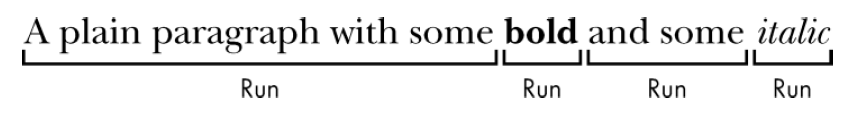

= python-docx
:toc:

---

== 能操作word的几个模块比较

|===
|模块名 |强项 | 弱项 |其他说明

|python-docx
|创建文档
|修改文档
|

|python-docx-template
|修改文档
|
|它是和jinjia2模板语言结合使用的.

|pandoc
|文档格式转换
|
|
|===

安装
[source, python]
....
pip install python-docx
....

官方文档 +
https://python-docx.readthedocs.io/en/latest/

中文教学页面 +
https://www.osgeo.cn/python-tutorial/doc-Word.html

---

== python-docx 第一个例子

背景知识：docx文件的结构分为三层: +
1、Docment对象表示整个文档； +
2、Docment包含了Paragraph对象的列表，每个Paragraph对象用来表示文档中的一个段落； +
3、一个Paragraph对象包含Run对象的列表，一个Run对象就是style相同的一段文本。

和纯文本相比， .docx 文件有多层结构。这些结构在python-docx 中, 用3种不同的类型来表示: +
在最高一层，**Document 对象表示整个文档。** +
**Document 对象包含一个 Paragraph 对象的列表**，表示文档中的段落 （用户在Word 文档中输入时，如果按下回车，新的段落 就开始了）。 +
**每个Paragraph 对象都包含一个Run 对象的列表**。

下图中的单句段落, 有4 个Run 对象。

Word 文档中的文本, 不仅仅是字符串。它包含与之相关的字体、大小、颜色和其他样式信息。在Word 中，"样式"是这些属性的集合。**一个 Run 对象, 是相同样式文本的延续。当文本样式发生改变时，就需要一个新的 Run 对象。**

例子:

[source, python]
....
from docx import Document
from docx.shared import Inches

pathDoc = r'E:\ttt\doc1.docx'

insDoc = Document() # 创建一个空文档

# 添加标题, 0表示 样式为title，1则为忽略，其他则是Heading{level}, 共9级
insDoc.add_heading('标题0',0)

insDoc.add_heading('标题1', level=1) # 如果不加第二个level参数, 默认就是level1级别的标题
insDoc.add_heading('标题2', level=2)
insDoc.add_heading('标题3', level=3)
insDoc.add_heading('标题4', level=4)
insDoc.add_heading('标题5', level=5)
insDoc.add_heading('标题6', level=6)
insDoc.add_heading('标题7', level=7)
insDoc.add_heading('标题8', level=8)
insDoc.add_heading('标题9', level=9)

# 添加段落文字
p1 = insDoc.add_paragraph('白日依山尽,') # 添加一个段落, 该方法返回一个指向新添加段落的引用.
p1.add_run('黄河').bold = True # 在段落后, 继续添加文字:粗体文字
p1.add_run('入')
p1.add_run('海流').italic = True # 在段落后, 继续添加文字:斜体文字

# 添加图片
insDoc.add_picture(r'E:\phpStorm_proj\test1\test1\img.png',width=Inches(1))

# 保存文档
insDoc.save(pathDoc)

....

效果 +

如果要读取已经存在的docx的内容, 操作如下:
[source, python]
....
import docx

path = r'E:\ttt\doc1.docx'

insDoc = docx.Document(path) # 打开已存在的docx文件
print(insDoc.paragraphs) # [<docx.text.paragraph.Paragraph object at 0x000001D94EECE908>, ...]

for para in insDoc.paragraphs:
    print(para.text) # 打印出docx中的每段文字内容
....

---

== 添加段落

==== 在某段落前面, 插入新段落 -> oldP.insert_paragraph_before('newPtext')

[source, python]
....
from docx import Document
from docx.shared import Inches

insDoc = Document() # 创建一个空文档
p1 = insDoc.add_paragraph('段落1')

# x.insert_paragraph_before() 能在x段落前面, 插入一个段落
p0 = p1.insert_paragraph_before('段落0')

insDoc.save(pathDoc) # 保存文档
....

这能使你定位在文档的中间段落处, 插入新的段落内容.

---

==== 段落中的文字格式 /对 run 设置字体、大小、颜色, 加粗, 下划线等

[source,python]
....
import docx
from docx.shared import Pt, RGBColor, Length

path = r'E:\ttt\doc1.docx'

insDoc = docx.Document()  # 创建一个空文档
myPara = insDoc.add_paragraph()  # 创建一个空段落

myPara.add_run('红色').font.color.rgb = RGBColor(255, 0, 0)
myPara.add_run('28号字').font.size = Pt(28)
myPara.add_run('加粗').font.bold = True
myPara.add_run('下划线').font.underline = True

'''
注意, 设置字体名字时, 并非是字体.tff文件的文件名! 而是word中显示的字体名字.
另外, 下面的方法只可对英文进行字体设置, 中文无效.
'''
myPara.add_run('微软雅黑字体msyh').font.str人才名字 = '微软雅黑'
myPara.add_run('Times New Roman字体').font.str人才名字 = '680-CAI978'

insDoc.save(path)
....

效果 +

---

==== 段前间距/ 段后间距 -> 你添加的段落.paragraph_format.space_before = Pt(数值)

段落间距, 分为"段前"和"段后"，设置值单位为:Pt磅. 需要先导入 from docx.shared import Pt

[source, python]
....
import docx
from docx.shared import Pt

path = r'E:\ttt\doc1.docx'

listPoem = ['君不见，黄河之水天上来，奔流到海不复回。','君不见，高堂明镜悲白发，朝如青丝暮成雪。','人生得意须尽欢，莫使金樽空对月。']

insDoc = docx.Document()

for line in listPoem:
    para = insDoc.add_paragraph(line)
    para.paragraph_format.space_before = Pt(18) # 段前间距
    para.paragraph_format.space_after = Pt(6) # 段后间距

insDoc.save(path)
....

效果 +
image:./img_python第三方库/img_python-docx/python-docx 段落间距.png[]

---

==== 多倍行距 -> 你添加的段落.paragraph_format.line_spacing  = 数值

[source, python]
....
import docx
from docx.shared import Pt
from docx.shared import Length

path = r'E:\ttt\doc1.docx'

listPoem = ['君不见，黄河之水天上来，奔流到海不复回。','君不见，高堂明镜悲白发，朝如青丝暮成雪。','人生得意须尽欢，莫使金樽空对月。']

insDoc = docx.Document()

for line in listPoem:
    para = insDoc.add_paragraph(line)
    para.paragraph_format.line_spacing  = 1.75 # 多倍行距中的 1.75倍行间距

insDoc.save(path)
....

效果 +

如果要自定义数值(磅), 就写成:
[source, python]
....
para.paragraph_format.line_spacing  = Pt(33) # 行距设为33磅
....

效果 +
image:./img_python第三方库/img_python-docx/python-docx 行距固定值.png[]

---

== 插入表格

https://python-docx.readthedocs.io/en/latest/user/quickstart.html

---

== 插入分隔符

==== 插入分页符 -> insDoc.add_page_break()

[source, python]
....
insDoc.add_paragraph('段落1')

insDoc.add_page_break() # 插入分页符

insDoc.add_paragraph('段落2')
....

---

== 读取docx中的内容

[source, python]
....
import docx

path = r'E:\ttt\doc1.docx'

def readDocx(path):
    docxData = docx.Document(path) # 拿到路径中的docx文件的内容

    for index, para in enumerate(docxData.paragraphs): # 调用paragraphs属性, 就能拿到每段内容
        print('{} --> {}'.format(index, para.text))

readDocx(path)
'''
0 --> 君不见，黄河之水天上来，奔流到海不复回。
1 --> 君不见，高堂明镜悲白发，朝如青丝暮成雪。
2 --> 人生得意须尽欢，莫使金樽空对月。
3 --> 天生我材必有用，千金散尽还复来。
'''
....

---

== 案例

==== 每500个单词, 存一个docx文件

我们有一个"+11271_考研托福gre_柯林斯全释义.txt"文件, 里面存放了一万多个单词的信息. +
现在, 我们想把每500个单词, 就存一个docx文件. +

步骤是:

1. 先创建一个空docx文档, 并读取txt,  然后读取每一行, 都存入docx中.
2. 对每一行进行判断, 如果是"编号"行, 就提取出里面的编号数字
3. 对编号数字进行判断, 如果 该数字%500 =1 , 就表示已经是1 或501 或 1001...了, 那么就先把当前行存入老的docx文件中后, 再来创建一个新的docx文件, 作为新的容器, 来存入txt中的下500个单词行.

[source, python]
....
from docx import Document
from docx.shared import Inches

pathTxt全释义 = 'E:/ttt/+11271_考研托福gre_柯林斯全释义.txt'
pathDoc路径部分 = 'E:/ttt/all_'
numDoc编号 = 1

def fn_readTxt(pathTxt全释义):
    global numDoc编号
    insDoc = Document() # 先创建一个空文档, 用来存放第一个500个单词(即001-500个单词)
    # 此处是为了模拟 do...while循环

    with open(pathTxt全释义, 'r', encoding='utf-8') as f:
        for line in f:

            if line.startswith('编号:'):
                listSep = line.strip().split(':')
                num单词编号 = int(listSep[-1].strip())
                print(num单词编号)
                insDoc.add_paragraph(line)

                # 每500个单词, 存一个docx文件
                if num单词编号 != 1 and num单词编号 % 500 == 1:
                    insDoc.save('{}{}.docx'.format(pathDoc路径部分, str(numDoc编号)))
                    numDoc编号 += 1
                    insDoc = Document()  # 如果上500个单词已满, 就新创建一个空文档, 用来存放下500个单词
                    insDoc.add_paragraph(line)
            else:
                insDoc.add_paragraph(line)

fn_readTxt(pathTxt全释义)
....

---

==== 找到docx中含有"加粗"或"下划线"存在的行

背景知识：docx文件的结构分为三层: +
1、Docment对象表示整个文档； +
2、Docment包含了Paragraph对象的列表，每个Paragraph对象用来表示文档中的一个段落； +
3、一个Paragraph对象包含Run对象的列表，一个Run对象就是style相同的一段文本。

[source, python]
....
import docx
from docx.shared import Pt, RGBColor, Length

path = r'E:\ttt\doc1.docx'

list_BoldText = []
list_UnderlineText = []

insDoc = docx.Document(path)

for para in insDoc.paragraphs:
    for insRun in para.runs:
        if insRun.font.bold == True:  # 如果是insRun是有加粗的话
            list_BoldText.append(insRun.text)
            print('含有[加粗]\t字体的行-->{}'.format(para.text))
            break

        if insRun.font.underline == True: # 如果是insRun是有下划线的话
            list_UnderlineText.append(insRun.text)
            print('含有[下划线]\t字体的行-->{}'.format(para.text))
            break

print('list加粗:{}'.format(list_BoldText))
print('list下划线:{}'.format(list_UnderlineText))

'''
含有[加粗]	字体的行-->君不见，高堂明镜悲白发，朝如青丝暮成雪。
含有[下划线]	字体的行-->人生得意须尽欢，莫使金樽空对月。
含有[下划线]	字体的行-->烹羊宰牛且为乐，会须一饮三百杯。
含有[加粗]	字体的行-->岑夫子，丹丘生，将进酒，杯莫停。
含有[下划线]	字体的行-->古来圣贤皆寂寞，惟有饮者留其名。(古来 一作：自古；惟 通：唯)
含有[加粗]	字体的行-->五花马，千金裘，呼儿将出换美酒，与尔同销万古愁。
list加粗:['高堂明', '将', '千金裘']
list下划线:['得意', '且', '惟有']
'''
....

---

