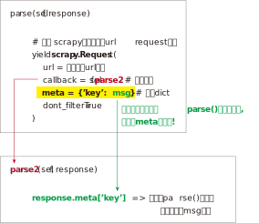
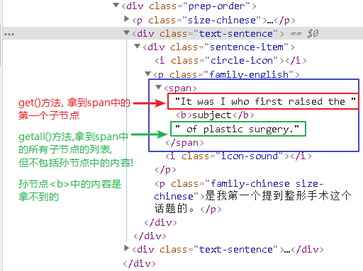
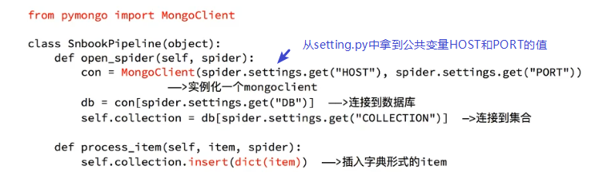

= scrapy 爬虫框架
:toc:

---

== 文档等资源

英文官方文档 +
https://docs.scrapy.org/en/latest/intro/tutorial.html

---

== 第一个例子

|===
|目的 |命令

|1. 创建爬虫项目
|scrapy startproject 项目名

|2. 进入你刚刚创建的项目目录
|cd 项目名

|3. 生成一个爬虫 +
(会从爬虫模板, 创建一个爬虫文件)
|scrapy genspider 爬虫名 爬取范围(即域名) +
例如: scrapy genspider spiderCollins www.iciba.com +
注意, 最后一个的网站名,不需要写http前缀.

新建的爬虫, 会在spiders目录下: myTest/myTest/spiders/spiderCollins.py

|4. 爬取的命令
|在项目目录下, cmd中, 输入命令:  +
scrapy crawl 你的爬虫名  --nolog +
加上 --nolog 参数, 可以不输出臃肿的日志.

|===

首先, 需要设置你的项目目录下的settings.py 文件, 设置下面两个字段的值为: +
....
USER_AGENT = 'Mozilla/5.0 (Windows NT 10.0; Win64; x64) AppleWebKit/537.36 (KHTML, like Gecko) Chrome/76.0.3809.100 Safari/537.36'

ROBOTSTXT_OBEY = False
....

现在, 打开你创建的 spiderCollins.py 爬虫文件:
[source, python]
....
# -*- coding: utf-8 -*-
import scrapy

class SpidercollinsSpider(scrapy.Spider):  # 爬虫必须继承自scrapy.Spider类.
    name = 'spiderCollins'  # 在同一个工程项目中, 爬虫类的name属性的值必须是唯一的, 不能和其他爬虫名字重名.

    allowed_domains = ['www.iciba.com']
    start_urls = ['http://www.iciba.com/subject']
    '''
    start_urls: 包含了 Spider 在启动时进行爬取的 url 列表。
    因此，第一个被获取到的页面将是其中之一。 后续的 URL 则从初始的URL获取到的数据中, 再进行提取。
    Scrapy为Spider的 start_urls 属性中的每个URL, 创建了 scrapy.Request 对象，并将 parse() 方法作为回调函数(callback)来处理 Request。
    '''

    def parse(self, response):
        '''
        调用此方法时, 会将每个初始 URL 完成下载后生成的 Response 对象, 将会作为唯一的参数 传递给该parse() 函数。
        该parse() 方法, 负责解析返回的数据(response data)，提取数据(生成 item), 以及生成需要进一步处理的 URL 的 Request 对象。

        当response没有指定回调函数时，该parse()方法是Scrapy处理下载的response的默认方法。
        parse() 负责处理response, 并返回处理的数据, 以及(/或)跟进的URL。
        Spider 对其他的Request的回调函数, 也有相同的要求。

        该方法, 及其他的Request回调函数, 必须返回一个包含 Request 及(或) Item 的"可迭代的对象"。
        '''
        # print(response)

        # print('url-->',response.url) #  the URL of this response => http://www.iciba.com/subject
        # print('headers-->',response.headers) # 可以看到 response 的包头。(包头的返回值是一个字典dict格式)

        # print('body-->',response.body) # 包体中的内容就是网页的htm代码.
        # print('selector-->',response.selector)

        # print(response.css('.text-sentence'))
        '''
        css选择器的用法, 本例查找 class=text-sentence 的所有元素.
        返回一个list, 里面的每个元素, 都是一个Selector对象.
        '''

        for ItemSelector in response.css('.text-sentence'):
            print(ItemSelector.get())  # 从选择器中, 解封出并拿到html代码 --> css选择器的 get()方法, 返回一个string;  如果是getall()方法, 则返回一个list
            '''
            get() 、getall() 是新版本的方法，extract() 、extract_first()是旧版本的方法。
            前者更好用，取不到就返回None，后者取不到就raise一个错误。推荐使用新方法，官方文档中也都改用前者了.
            '''
            print('-' * 20)

            # 既然已经拿到了网上中的html代码, 你就可以自由进行你想要的操作了, 进行纯文本法提取, 或存入fs文件中, 或存入数据库中.
....

然后在项目根目录中创建一个executeYourSpider.py文件, 专门用来执行在cmd中运行 "scrapy crawl spiderCollins"命令的操作. 这就省得你每次都在cmd中手动输入并执行这个命令了. 现在, 你只需要右键run运行这个py文件就行了.
[source, typescript]
....
# myTest/executeYourSpider.py

import os
os.system("scrapy crawl spiderCollins") # 要想执运行爬虫, 必须在cmd中运行此命令! 而不能直接右键来run爬虫文件!
# 注意"scrapy crawl"后的爬虫名, 这个爬虫名, 不是爬虫的py文件名, 也不是爬虫class类的类名, 而是定义在爬虫类里面的name字段的value值!
....

爬虫文件里的 start_urls属性, 更推荐用start_requests()实例方法来替换它.  +
start_requests() 函数, 会返回一个请求的"可迭代对象", 里面的内容, 爬虫会以这里为入口进行爬取.

[source, python]
....
# -*- coding: utf-8 -*-
import scrapy

class SpidercollinsSpider(scrapy.Spider):  # 爬虫必须继承自scrapy.Spider类.
    name = 'spiderCollins'

    allowed_domains = ['www.iciba.com']

    def start_requests(self):  # 用一个生成器函数, 来取代老版的 start_urls列表
        urls = [
            'http://www.iciba.com/subject',
            'http://www.iciba.com/stick',
        ]
        for url in urls:
            yield scrapy.Request(url=url, callback=self.parse) # 注意是yield回去一个Request对象!

    def parse(self, response):
        for ItemSelector in response.css('.text-sentence'):
            print(ItemSelector.get())
            print('-' * 20)
....

---

==== 注意, 同时匹配两个class的写法 -> response.css('.class1.class2')

有的class的值, 中间有个空格, 这表明这个class有两个值, 比如:
[source, html]
....
 
 +
....

这时, css选择器的写法就是:

 [source, python]
 ....
 response.css('.class1.class2') # 两个class名中间不要有空格!
 ....

---

==== 首页和下一页, html骨架不同, 因此只能用两个不同的parse()方法解析的, 那么假设parse()需要把自己内部的某数据传递给parse2()来用, 该怎么做呢? -> 把要传递的数据, 挂载request对象的meta参数(是个字典)上

[source, python]
....
# -*- coding: utf-8 -*-
import scrapy
import chardet
import json
import logging
from scrapy_splash import SplashRequest  # 能解析动态渲染的页面

class SpiderTest(scrapy.Spider):
    name = 'spiderTest' # 你的爬虫名起在这里
    allowed_domains = ['www.zhaopin.com']

    def start_requests(self):
        urls = [
            'https://sou.zhaopin.com/?jl=636&kw=%E5%89%8D%E7%AB%AF&kt=3&sf=0&st=0', ]
        for url in urls:
            # 返回经过JavaScript渲染后的非动态页面
            yield SplashRequest(url,
                                callback=self.parse, # # 将url发出的request请求类实例, 交给本类的parse()方法来处理.
                                args={'wait': 0.5},
                                dont_filter=True # 这个参数必须要加!!
                               )

    def parse(self, response):
        nextUrl = 'https://sou.zhaopin.com/?p=6&jl=636&sf=0&st=0&kw=前端&kt=3'
        print('parse() doing...')

        yield scrapy.Request(
            url=nextUrl,
            callback=self.parse2,  # 将下一页url的请求类的实例, 交给本类的parse2方法来解析处理.

            meta={'msgFromParse': 'parse方法中的msg数据'},
            # meta是个dict, 用来将本parse()方法中的任何数据, 传递给下一个parse2()方法中.
            # 比如, 我们将一个字符串, 挂载在meta字典的一个key "msgFromParse" 上.

            dont_filter=True  # 这句一定要加上!!!! 千万别忘了.
            # 如果不写 dont_filter=True 这个参数, scrapy会过滤掉那些不在 allowed_domains 列表中的请求 requests。导致"下一页"url不会被parse2解析!
        )

    def parse2(self, response):
        print('parse2() doing...')
        print('parse2()方法拿到了从parse()传递过来的数据-->', response.meta['msgFromParse'])
        # 打印出: parse2()方法拿到了从parse()传递过来的数据--> parse方法中的msg数据

....

---

== css选择器

Scrapy Shell是一个交互终端，可以让我们在未启动spider的情况下, 来测试选择器的功能. 用法:
....
# 进入项目的根目录，执行下列命令来启动shell:
scrapy shell 网址

# 比如:
scrapy shell https://movie.douban.com/
....

Scrapy Shell根据下载的页面, 会自动创建一些方便使用的对象，例如 Response 对象，以及 Selector 对象 (对HTML及XML内容)。

response.css(): 返回selector list列表，css选择器的语法同 BeautifulSoup4.

---

==== 直接"本节点"的[纯文本]提取 -> 标签名::text

[source, python]
....
# 找到所有的class='short-content'标签中的 -> 直接子节点的text纯文本内容
response.css(".short-content::text").getall()
....

又例:
[source, python]
....
# -*- coding: utf-8 -*-
import scrapy

class SpidercollinsSpider(scrapy.Spider):  # 爬虫必须继承自scrapy.Spider类.
    name = 'spiderCollins'
    allowed_domains = ['www.iciba.com']

    def start_requests(self):  # 用一个生成器函数, 来取代老版的 start_urls列表
        urls = [
            'http://www.iciba.com/subject',
        ]
        for url in urls:
            yield scrapy.Request(url=url, callback=self.parse)

    def parse(self, response):
        # 找到所有class='text-sentence'元素中的第一个(即index=[0])元素, 并拿到它里面的标签中的纯文本text内容.
        str = response.css('.text-sentence')[0] \
            .css('span::text') \
            .get()
        print(str)
        # get()方法,会拿到: It was I who first raised the
        # 如果是用getall()方法, 会拿到: ['It was I who first raised the ', ' of plastic surgery.']
....

**注意, 这种方法, 无法提取到孙节点中的文本内容. 要想提取孙辈节点的文本内容, 必须在标签名后, 再加个空格与*星号.**

---

==== 包括"子孙辈节点"的[纯文本]提取 -> 标签名(空格)*::text

[source, typescript]
....
# 找到所有的class='review-short'标签中的 -> 子孙标签的text纯文本内容
response.css(".review-short *::text").getall()
....

---

==== 在用::text提取纯文本时, 如果报错 AttributeError: 'str' object has no attribute 'css' 的话 -> Selector(text=你的纯文本).css()

如果你用::text提取纯文本, 发现却报错 AttributeError: 'str' object has no attribute 'css' 的话, 你发现你提取到的纯文本不是真正你想要的那个纯文本内容, 而是以纯文本形式保存的网页源代码!  +
因此, 为了进一步提取内容, 就需要把这个伪纯文本, 再次强制转换为Selector对象, 才能用css()继续提取了.
[source, python]
....
import scrapy
from scrapy.selector import Selector

Selector(text = str纯文本形式的html代码).css()
....

---

==== [属性值]提取 -> 标签名::attr(属性名)

例如, 提取url地址
[source, python]
....
# 找到所有的class='poster'标签中的 -> a子标签中的 href属性的值
response.css(".poster a::attr(href)").getall() # getall()方法返回一个list
....

其实, 空格也不是指子节点, 而是指"内的", 例如: "div p" 是值"选择
元素内的所有
元素".

又例, 提取图片地址:
[source, python]
....
# 找到所有的class='poster'标签中的 -> a子标签中的 -> img孙标签中的 src属性的值
response.css(".poster a img::attr(src)").getall()
....

---
==== 选中所有带有某[属性]的元素

[source, python]
....
# 选中所有带有id属性的元素
response.css("[id]").getall()
....

---

==== 常用的css选择器

详细见 https://www.w3school.com.cn/cssref/css_selectors.asp

选中 某class 和 id
|===
|功能 |写法 |选择器语法
|选择 class="intro" 的所有元素。
|.intro
|.class

|选择 id="firstname" 的所有元素。
|#firstname
|#id
|===

选中"某标签"
|===
|功能 |写法 |选择器语法

|选择所有元素。
|*
|*

|选择所有 
 元素。
|p
|element

|选择所有 
 元素和所有 
 元素。
|div,p
|element,element

|选择 
 元素内部的所有 
 元素。
|div p
|element element

|选择父元素为 
 元素的所有 
 元素。
|div>p
|

|选择紧接在 
 元素之后的所有 
 元素.
|div+p
|

|===

选中带有"某属性"的所有元素

|===
|功能 |写法 |选择器语法
|选择带有 target 属性所有元素。
|[target]
|[attribute]

|选择 target="_blank" 的所有元素。
|[target=_blank]
|[attribute=value]

|选择 title 属性包含单词 "flower" 的所有元素。
|[title~=flower]
|[attribute~=value]

|选择 lang 属性值以 "en" 开头的所有元素。
|[lang\|=en]
|[attribute\|=value]

|选择其 src 属性值以 "https" 开头的每个 <a> 元素。
|a[src^="https"]
|[attribute^=value]

|选择其 src 属性以 ".pdf" 结尾的所有 <a> 元素。
|a[src$=".pdf"]
|[attribute$=value]

|选择其 src 属性中包含 "abc" 子串的每个 <a> 元素。
|a[src*="abc"]
|[attribute*=value]
|===

---

== pipelines.py 管道

首先, 为了让scrapy不要输出所有日志, 干扰视线, 我们来导入logging模块. 该模块python已经内置了, 所以不需要再单独安装.

先设置 settings.py 文件, 加上下面两句代码:
[source, python]
....
import logging

LOG_LEVEL='WARNING'
# 设置只打印显示 WARNING 及以上级别的日志信息, 该级别以下的日志信息, 则不要显示.

# 要想使用管道文件, 还需要开启下面的代码. MytestPipeline是管道文件中的class类名
ITEM_PIPELINES = { # 是个dict
   'myTest.pipelines.MytestPipeline': 300,
   # key其实指明了路径, 即是 myTest目录/pipelines文件中的.MytestPipeline类
   # value值是个数字, 值越小, 该class类会先执行; 数值大多则后执行. 有了先后关系, 这样, 数据就能从一个管道进入另一个管道了.
   'myTest.pipelines.MytestPipeline2': 301,
}
....

**管道的作用是什么? 当spiders目录下的爬虫文件中的parse()函数, 用css选择器提取到内容后, 就能把这个内容, 用"yield 内容"语句, 自动发送到 pipelines.py 管道文件中, 来进行进一步处理.**

对于爬虫类中的parse()函数, 有两点需要注意: +
1. 必须用yield关键字(而非return关键字), 才能把内容发送到(返回到)管道文件中. +
2. yield不能发送字符串string类型的内容, 只能发送 Request, BaseItem, dict or None 类型的内容.

---

==== 用上"管道文件"的例子

项目目录结构如下:
....
|-- undefined
    |-- executeYourSpider.py  # 用来在cmd中执行"运行爬虫"的命令
    |-- scrapy.cfg
    |-- myTest
        |-- items.py
        |-- middlewares.py
        |-- pipelines.py # 管道文件
        |-- settings.py # 爬虫的配置文件
        |-- __init__.py
        |-- spiders
        |   |-- spiderCollins.py # 爬虫文件
        |   |-- __init__.py
....

首先, 来写爬虫文件:
[source, python]
....
# myTest/myTest/spiders/spiderCollins.py

# -*- coding: utf-8 -*-
import scrapy

class SpidercollinsSpider(scrapy.Spider):  # 爬虫必须继承自scrapy.Spider类.
    name = 'spiderCollins'
    allowed_domains = ['www.iciba.com']

    def start_requests(self):  # 用一个生成器函数, 来取代老版的 start_urls列表
        urls = [
            'http://www.iciba.com/subject',
        ]
        for url in urls:
            yield scrapy.Request(url=url, callback=self.parse)

    def parse(self, response): # 有最后的yield关键字可知, 本parse()函数是个"生成器函数"!
        # 找到所有class='text-sentence'元素中的第一个(即index=[0])元素, 并拿到它里面的标签中的纯文本text内容.
        str = response.css('.text-sentence')[0] \
            .css('span::text') \
            .get()

        '''
        由于下面最后的yield 不接收返回string类型的内容, 只支持返回 dict等类型的内容,
        (Spider must return Request, BaseItem, dict or None)
        所以我们只能先新建一个字典, 然后把str值, 挂靠在这个字典的"str"key上.
        '''
        dictItem = {}
        dictItem['str'] = str
        yield dictItem  # 必须用yield(而非return), 才能把 dictItem 传递到 pipelines.py 的管道中!
....

接着, 来写管道文件:

[source, python]
....
# myTest/myTest/pipelines.py

# -*- coding: utf-8 -*-

# Define your item pipelines here
#
# Don't forget to add your pipeline to the ITEM_PIPELINES setting
# See: https://doc.scrapy.org/en/latest/topics/item-pipeline.html

class MytestPipeline(object): # 管道1
    def process_item(self, item, spider):  # 注意, 默认的这个process_item方法名, 不能修改, 必须是这个名字!
        print('管道1接收的最原始的dictItem-->', item)
        item['newKey'] = 'newValue'  # 在管道1中, 对item进行加工处理, 比如增添一个键值对
        return item # 用return语句, 来把dictItem发送给下一个管道(本例中即管道2: MytestPipeline2).

class MytestPipeline2(object): # 管道2
    '''
    由于在settings.py中, 设置了管道1的值是300, 管道2的值是301,  因此管道2会比管道1后执行.
    管道1 处理完数据dictItem后, 会把数据dictItem发送给管道2 继续进行下一步处理.
    '''
    def process_item(self, item, spider):
        print('管道2接收到的(从管道1中发来的)dictItem-->', item)
        return item

'''
在 cmd 中执行爬虫文件命令后, 会打印出:
管道1接收的最原始的dictItem--> {'str': 'It was I who first raised the '}
管道2接收到的(从管道1中发来的)dictItem--> {'str': 'It was I who first raised the ', 'newKey': 'newValue'}
'''
....

完整的 setting.py 文件如下:
[source, python]
....
# -*- coding: utf-8 -*-

import logging # 导入logging模块

BOT_NAME = 'myTest'
SPIDER_MODULES = ['myTest.spiders']
NEWSPIDER_MODULE = 'myTest.spiders'

# Configure item pipelines
# See https://doc.scrapy.org/en/latest/topics/item-pipeline.html
ITEM_PIPELINES = {
   'myTest.pipelines.MytestPipeline': 300,
   'myTest.pipelines.MytestPipeline2': 301, #
}

LOG_LEVEL='WARNING' # 设置只打印显示 WARNING 及以上级别的日志信息, 该级别以下的日志信息, 则不要显示.

....

用下面这个py文件来在cmd中执行"运行爬虫"的命令
[source, python]
....
# myTest/executeYourSpider.py

import os
os.system("scrapy crawl spiderCollins")
....

---

==== 案例: 迭代获取"下一页"

本例, 我们爬取智联招聘, 由于该网站的页面是JavaScript动态生成的, 所以, 你先来看获取动态渲染页面的教程: scrapy-splash模块的用法.

---

==== Pipeline类 中的 open_spider() 和 close_spider()

这两个方法, 有点像JavaScript react 中的"生命周期函数".

[source, python]
....
class 管道类(object):
    def open_spider(self, spider): # 当爬虫开启的时候执行, 仅执行一次.
        ... # 比如, 执行连接数据库的操作

    def process_item(self, item, spider):
        ...
        return item # 不return的话, 另一个权重较低的pipeline就不会接收到该item

    def close_spider(self, spider): # 当爬虫关闭的时候执行, 仅执行一次.
        ... # 比如, 执行断开数据库的操作
....

例如, 在管道文件中, 把爬虫发来的数据, 存到mongodb数据库中:  +

---

== items.py 设置数据存储模板，用于结构化数据

---

== settings.py 与 scrapy.cfg 配置文件

|===
|文件 |功能

|scrapy.cfg
|项目的主配置信息

|settings.py
|真正爬虫相关的配置信息在settings.py文件中. 用来设置如: 递归的层数、并发数，延迟下载等.

|===

---

==== 在其他py文件中, 拿到 settings.py 中的变量值

setting.py文件的作用:

- 存放一些公共的变量, 比如, 数据库的地址, 账号密码等. 相当于是全局变量了.
- 一般用全大写字母作为变量名

比如, 你的setting.py中, 有一个变量叫做:
[source, python]
....
# setting.py
BOT_NAME = 'myTest' #  项目名
....

那么你在爬虫文件或其他py文件中, 如果想调用它, 有两种方法来操作:

1.作为模块导入它
[source, python]
....
from myTest.settings import BOT_NAME
....

2-1.如果在Spider爬虫文件中, 可以直接用 self.settings["keyName"] 来访问到它, 因为爬虫类中的self参数, 就是爬虫实例自己!
[source, python]
....
class SpiderTest(scrapy.Spider):
    ...
    def parse(self, response):
        self.settings["BOT_NAME"] # 拿到setting.py中的BOT_NAME变量的值
....

2-2. 如果在Pipeline管道文件中, 可以用 spider.settings["keyName"] 来拿到它
[source, python]
....
class MytestPipeline(object):
    def process_item(self, item, spider):
        print('==>',spider.settings["BOT_NAME"]) # 拿到setting.py中的BOT_NAME变量的值
....

---

== 对"动态渲染"的爬取 -> scrapy-splash模块

Scrapy只能爬取静态资源, 但对于通过ajax动态渲染的页面, 只能通过 scrapy-splash 模块来解决.  +
用scrapy-splash拿到的response,  就是JavaScript渲染之后的网页源代码。

官网 +
https://pypi.org/project/scrapy-splash/

|===
|安装步骤 |方法

|1. 安装 scrapy-splash模块
|pip install scrapy-splash

有时候会发现运行py时, 找不到已安装模块的情况, 那就输入命令:  +
pip3 show scrapy_splash +
来查看一下这个模块到底安装到哪里去了?

|2. win10 要打开 Hyper-V 功能
|开始菜单的"视窗"图标, 右键 -> 应用和功能 -> 搜索"windows功能" -> 打开"启用或关闭windows功能" -> 选中Hyper-V.

|3. 安装 docker for windows
|安装地址: +
 https://download.docker.com/win/stable/Docker%20for%20Windows%20Installer.exe

|4. 添加国内的 Docker 镜像仓库
|在win状态栏中, 右键 docker 图标 -> setting -> Daemon -> registry-mirrors -> 添加上"http://f1361db2.m.daocloud.io" +
见 https://www.daocloud.io/mirror 页面往下拉到底, 就可见到教程.

|5. 继续设置docker for windows
|右键任务栏上的 docker 图标 -> settings -> Network -> DNS Server，勾选 Fixed：8.8.8.8

|6. 在docker中启动scrapy-splash
|在cmd中, 输入命令: +
 step1: 输入“docker pull scrapinghub/splash”，等待下载完成 +
 step2: 输入“docker run -p 8050:8050 scrapinghub/splash”，把此界面挂在后台

|===

继续: +
01. 修改你爬虫项目的 settings.py文件:
[source, python]
....
# 添加上Splash服务器地址
SPLASH_URL = 'http://localhost:8050/' # 官网写的是 'http://192.168.59.103:8050', 但亲测官网的不可行

# 在DOWNLOADER_MIDDLEWARES 字段中, 添加上以下的Splash 中间件，指定优先级.
DOWNLOADER_MIDDLEWARES = {
    'scrapy_splash.SplashCookiesMiddleware': 723,
    'scrapy_splash.SplashMiddleware': 725,
    'scrapy.downloadermiddlewares.httpcompression.HttpCompressionMiddleware': 810,
}

# 在SPIDER_MIDDLEWARES字段中, 加上以下中间件
SPIDER_MIDDLEWARES = {
    'scrapy_splash.SplashDeduplicateArgsMiddleware': 100,
}

# 添加上全新自定义的DUPEFILTER_CLASS字段, 设置Splash自己的去重过滤器
DUPEFILTER_CLASS = 'scrapy_splash.SplashAwareDupeFilter'

# 开启或添加上这条, 用来缓存后台存储介质
HTTPCACHE_STORAGE = 'scrapy_splash.SplashAwareFSCacheStorage'

....

---

====  完整的爬取动态页面的例子 -> 智联招聘

项目目录结构:
....
|-- undefined
    |-- executeYourSpider.py    # 用来执行cmd命令的文件
    |-- log.log                 # 日志
    |-- scrapy.cfg
    |-- myTest
        |-- items.py
        |-- middlewares.py
        |-- pipelines.py        # 管道
        |-- settings.py         # 设置文件
        |-- __init__.py
        |-- spiders
        |   |-- spiderZLZP.py   # 爬虫
        |   |-- __init__.py
....

setting.py文件
[source, python]
....
# -*- coding: utf-8 -*-
import logging

BOT_NAME = 'myTest'

SPIDER_MODULES = ['myTest.spiders']
NEWSPIDER_MODULE = 'myTest.spiders'

USER_AGENT = 'Mozilla/5.0 (Windows NT 10.0; Win64; x64) AppleWebKit/537.36 (KHTML, like Gecko) Chrome/76.0.3809.100 Safari/537.36'

ROBOTSTXT_OBEY = False

SPIDER_MIDDLEWARES = {
    'myTest.middlewares.MytestSpiderMiddleware': 543,
    'scrapy_splash.SplashDeduplicateArgsMiddleware': 100,
}

SPLASH_URL = 'http://localhost:8050/'

DOWNLOADER_MIDDLEWARES = {
    'myTest.middlewares.MytestDownloaderMiddleware': 543,
    'scrapy_splash.SplashCookiesMiddleware': 723,
    'scrapy_splash.SplashMiddleware': 725,
    'scrapy.downloadermiddlewares.httpcompression.HttpCompressionMiddleware': 810,
}

ITEM_PIPELINES = {
    'myTest.pipelines.MytestPipeline': 300,
    'myTest.pipelines.MytestPipeline2': 301,  #
}

LOG_LEVEL = 'WARNING'  # 设置只打印显示 WARNING 及以上级别的日志信息, 该级别以下的日志信息, 则不要显示.

HTTPCACHE_STORAGE = 'scrapy_splash.SplashAwareFSCacheStorage' # 缓存设置
....

爬虫文件:
[source, python]
....
# myTest/spiders/spiderZLZP.py

# -*- coding: utf-8 -*-
import scrapy
import chardet
import json
import logging
from scrapy_splash import SplashRequest # 导入该模块!

logging.basicConfig(filename="log.log",  # 日志输出到文件的文件名
                    filemode="w",  # 文件模式，r[+]、w[+]、a[+]
                    format="%(asctime)s %(name)s:%(levelname)s:%(message)s",  # 日志输出的格式
                    datefmt="%d-%M-%Y %H:%M:%S",  # 日志附带日期时间的格式
                    # level=logging.DEBUG,  # 设置日志输出级别
                    )

class SpiderZLZPSpider(scrapy.Spider):  # 爬虫必须继承自scrapy.Spider类.
    name = 'spiderZLZP'  # 智联招聘
    allowed_domains = ['www.zhaopin.com']

    def start_requests(self):
        urls = ['https://sou.zhaopin.com/?jl=636&kw=%E5%89%8D%E7%AB%AF&kt=3&sf=0&st=0',]
        for url in urls:
            # yield scrapy.Request(url=url, callback=self.parse) # <--这是scrapy原生的yield代码, 但在我们安装了 scrapy_splash模块后, 就要改写成下面的写法了.
            yield SplashRequest(url, callback=self.parse, args={'wait': 0.5}, dont_filter=True)
            '''
            注意: 本句是关键! 我们yield返回的, 是经过了SplashRequest处理过的, JavaScript渲染后的最终的html页面了! 就已经不是动态页面了.
            另外, 如果没有args={'wait': 0.5} 这个参数，网页可能会来不及渲染，返回的仍是未经js渲染的初始页面代码！
            '''

    def parse(self, response):
        listRes = response.css('.contentpile__content__wrapper__item__info__box__jobname__title::attr(title)').getall()
        for 职业名 in listRes:
            print(职业名) # 亲测可行! 拿到职业名

....

爬虫文件与管道文件的交流: +
image:./img_python第三方库\pyquery\scrapy 爬虫与管道的交流.svg[]

上面的爬虫文件只是小试牛刀, 下面来爬取智联招聘上, 搜索"前端"的所有返回页面上的招聘信息:
[source, python]
....
# -*- coding: utf-8 -*-
# -*- coding: utf-8 -*-
import scrapy
import chardet
import json
import logging
from scrapy_splash import SplashRequest  # 使用这个模块, 才能拿到JavaScript动态渲染后的页面!

logging.basicConfig(filename="log.log",  # 日志输出到文件的文件名
                    filemode="w",  # 文件模式，r[+]、w[+]、a[+]
                    format="%(asctime)s %(name)s:%(levelname)s:%(message)s",  # 日志输出的格式
                    datefmt="%d-%M-%Y %H:%M:%S",  # 日志附带日期时间的格式
                    # level=logging.DEBUG,  # 设置日志输出级别
                    )

pageNum = 2  # 这个变量保存每页url中的唯一变化的数值, 下面会用这个变量来组装出每页的完整url

class SpiderZLZPSpider(scrapy.Spider):  # 爬虫必须继承自scrapy.Spider类.
    name = 'spiderZLZP'  # 爬虫名.  智联招聘
    allowed_domains = ['www.zhaopin.com']

    def start_requests(self):
        urls = ['https://sou.zhaopin.com/?jl=636&kw=%E5%89%8D%E7%AB%AF&kt=3&sf=0&st=0', ]
        for url in urls:
            yield SplashRequest(url,
                                callback=self.parse,
                                args={'wait': 0.5},
                                dont_filter=True)  # 返回经过JavaScript渲染后的非动态页面

    def parse(self, response):
        listAllJob_singlePage = []  # 存放单页面(而非所有页面)上的所有工作信息

        listSelector_everyJob = response.css('.contentpile__content__wrapper__item.clearfix')

        for itemSelector_SingleJob in listSelector_everyJob:
            str_JobName = itemSelector_SingleJob \
                .css('.contentpile__content__wrapper__item__info__box__jobname__title::attr(title)') \
                .getall()[0] \
                .strip()  # 岗位名

            str_salary = itemSelector_SingleJob \
                .css(".contentpile__content__wrapper__item__info__box__job__saray::text") \
                .getall()[0] \
                .strip()  # 工资

            str_companyName = itemSelector_SingleJob \
                .css('.contentpile__content__wrapper__item__info__box__cname__title.company_title::text') \
                .getall()[0] \
                .strip()  # 招聘的公司名

            str_companyType = itemSelector_SingleJob \
                .css(".contentpile__content__wrapper__item__info__box__job__comdec__item::text") \
                .getall()[0] \
                .strip()  # 公司性质(外企/民企等)

            str_PeopleNumber = itemSelector_SingleJob \
                .css(".contentpile__content__wrapper__item__info__box__job__comdec__item::text") \
                .getall()[1] \
                .strip()  # 公司人数

            str_Joblocation = itemSelector_SingleJob \
                .css('.contentpile__content__wrapper__item__info__box__job__demand__item::text') \
                .getall()[0] \
                .strip()  # 公司所在区域地址

            str_WorkSeniority = itemSelector_SingleJob \
                .css('.contentpile__content__wrapper__item__info__box__job__demand__item::text') \
                .getall()[1] \
                .strip()  # 工作年限要求

            dict_SingleJob = {}  # 每个工作的信息
            dict_SingleJob['str_JobName'] = str_JobName
            dict_SingleJob['str_salary'] = str_salary
            dict_SingleJob['str_companyName'] = str_companyName
            dict_SingleJob['str_companyType'] = str_companyType
            dict_SingleJob['str_PeopleNumber'] = str_PeopleNumber
            dict_SingleJob['str_Joblocation'] = str_Joblocation
            dict_SingleJob['str_WorkSeniority'] = str_WorkSeniority

            listAllJob_singlePage.append(dict_SingleJob)

        for dict_singleJob_InSinglePage in listAllJob_singlePage:
            print(dict_singleJob_InSinglePage)
            yield dict_singleJob_InSinglePage

        # 找到下一页的url地址
        global pageNum
        nextUrl = 'https://sou.zhaopin.com/?p={}&jl=636&sf=0&st=0&kw=%E5%89%8D%E7%AB%AF&kt=3'.format(
            pageNum)  # 下一个的url地址

        if not pageNum > 6: # 搜索"前端"工作, 只有6个页面
            print('-' * 30)
            print('下一页的pageNum-->', pageNum)
            print('下一页url-----> ', nextUrl)

            ''' 下面, 将下一页的url地址, 再次用scrapy-splash模块的SplashRequest()方法, 封装成http请求的类(即Request类), 再yield返回出去!
            注意!! 这里一定要用scrapy-splash模块, 而不能用原生的scrapy.Request()方法, 因为原生的无法解析动态页面!! 会拿不到任何数据.
            '''
            yield SplashRequest(nextUrl,
                                callback=self.parse,
                                args={'wait': 0.5},
                                dont_filter=True)  # dont_filter=True,是不要过滤相同网址的意思

        pageNum += 1

'''
输出为:
{'str_JobName': 'WEB前端开发助理/web开发实习生双休', 'str_salary': '4K-6K', 'str_companyName': '江苏宝瑞网络技术有限公司', 'str_companyType': '民营', 'str_PeopleNumber': '20-99人', 'str_Joblocation': '无锡', 'str_WorkSeniority': '经验不限'}
{'str_JobName': '前端工程师', 'str_salary': '10K-15K', 'str_companyName': '上海喔趣信息科技有限公司', 'str_companyType': '合资', 'str_PeopleNumber': '100-499人', 'str_Joblocation': '无锡-新吴区', 'str_WorkSeniority': '3-5年'}
...

'''

....

executeYourSpider.py 文件如下:
[source, python]
....
import os
os.system("scrapy crawl spiderZLZP") # 在cmd中执行"运行爬虫"的命令
....

---

