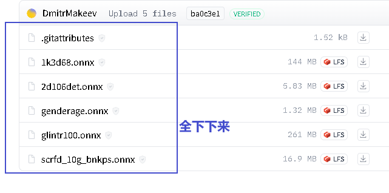
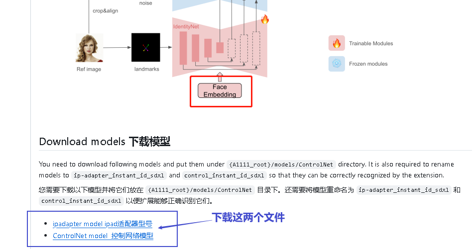
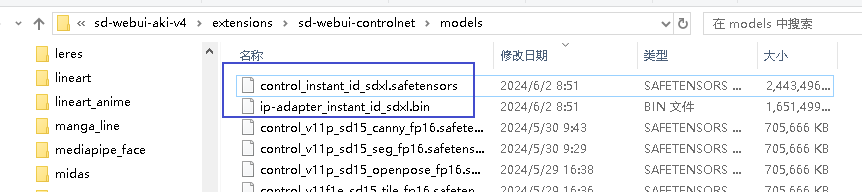
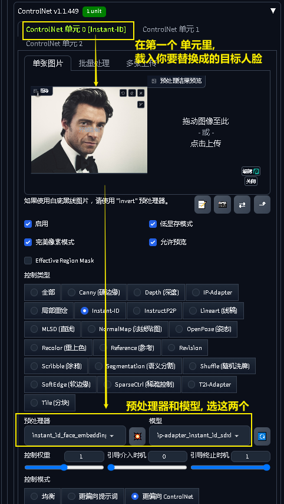
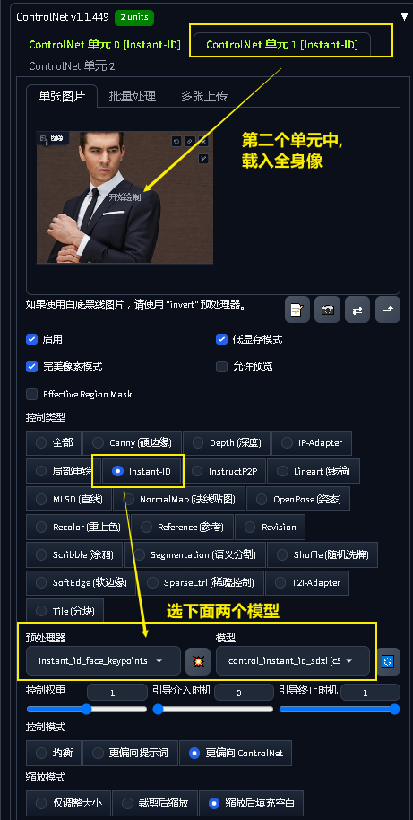

= instant id
:toc: left
:toclevels: 3
:sectnums:
:stylesheet: myAdocCss.css

'''

== web ui 版  instant id

官网地址: +
https://github.com/InstantID/InstantID

https://github.com/Mikubill/sd-webui-controlnet/discussions/2589

[.small]
[options="autowidth" cols="1a,1a"]
|===
|Header 1 |Header 2

|下载预处理器
|https://huggingface.co/DIAMONIK7777/antelopev2/tree/main

然后把这些预处理器, 拷贝到下面的目录里:  +
C:\software\+++sd-webui-aki-v4 origin\sd-webui-aki-v4\extensions\sd-webui-controlnet\annotator\downloads\insightface\models\antelopev2

|下载模型
|地址为: +
https://github.com/Mikubill/sd-webui-controlnet/discussions/2589

注意: 下载的这两个文件, 要改名成:  ip-adapter_instant_id_sdxl 和 control_instant_id_sdxl , 以便扩展能够正确识别它们。 然后把它们放入如下目录中 +
C:\software\+++sd-webui-aki-v4 origin\sd-webui-aki-v4\extensions\sd-webui-controlnet\models

|下面就可以启动 sd web ui 中 来使用了
|注意, instant id 只能在 sdxl 大模型中使用.

sdxl 系列:        step 20, CFG 3-5 +
sdxl turbo 系列:  step 7-9, CFG 1-1.5 +

|图生图中
|

官网教程是 +
https://github.com/Mikubill/sd-webui-controlnet/discussions/2589

|文生图中
| 只要第一个单元就行了, 不需要第二个单元

|===

== comfyui版 instant id

[.small]
[options="autowidth" cols="1a,1a"]
|===
|Header 1 |Header 2

|安装节点 instant id
|image:img/0006.png[,]

image:img/0007.png[,]

|
|
|===

