= Flux Krea
:toc: left
:toclevels: 3
:sectnums:
:stylesheet: myAdocCss.css

'''

== 关于gguf模型

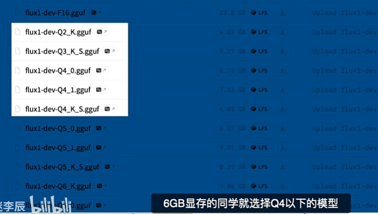

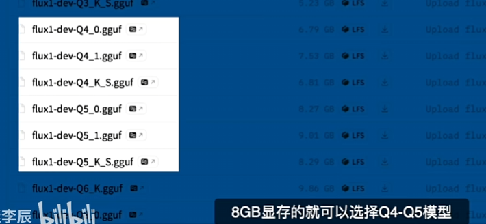

数值越大, 效果越好.

'''

== 关于 NF4 模型

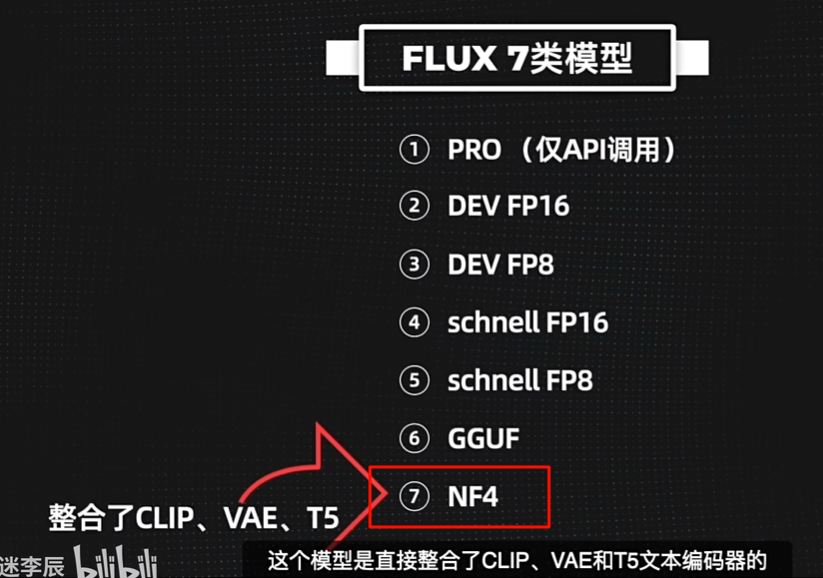

因为它整合了 clip, vae 模型, 所以容量也会比gguf 模型更大些. 不过 8g显存也能跑.

比如, 4070显卡, 生成1024*1024的图

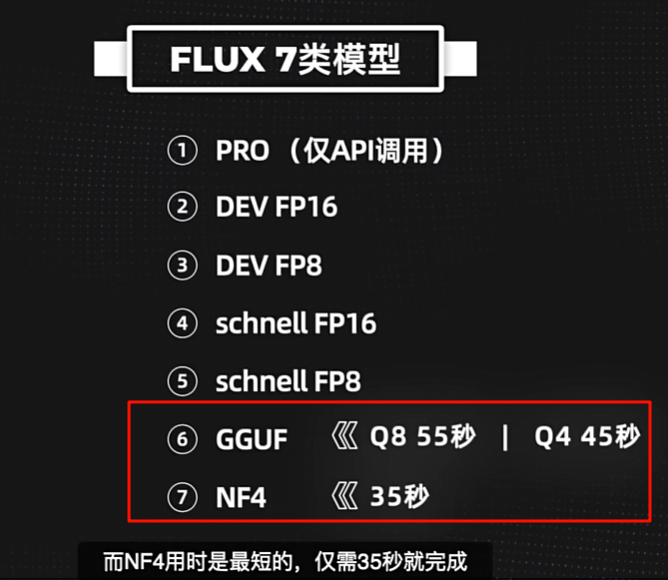

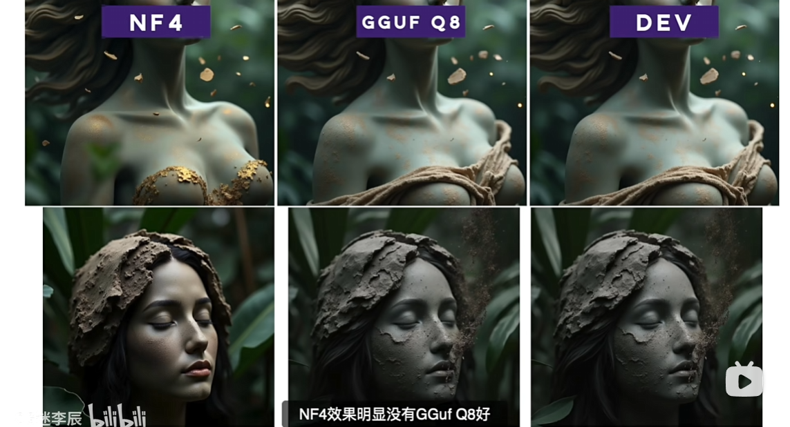

模型存放目录:

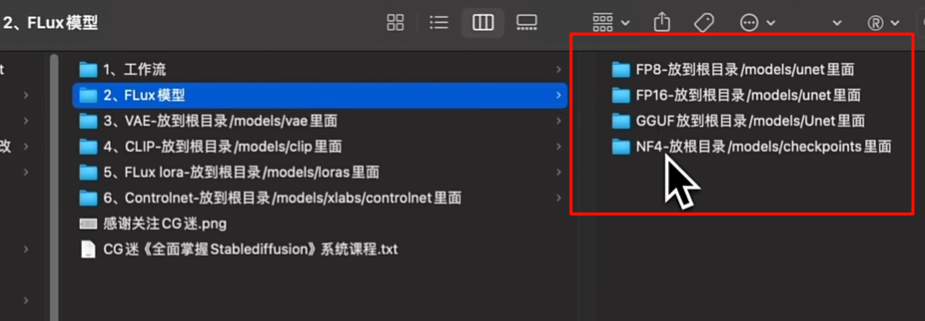

默认comfyui只能使用标准的flux模型, 如果大家想要使用GGuf和NF4模型,

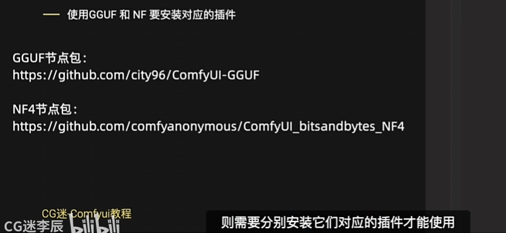

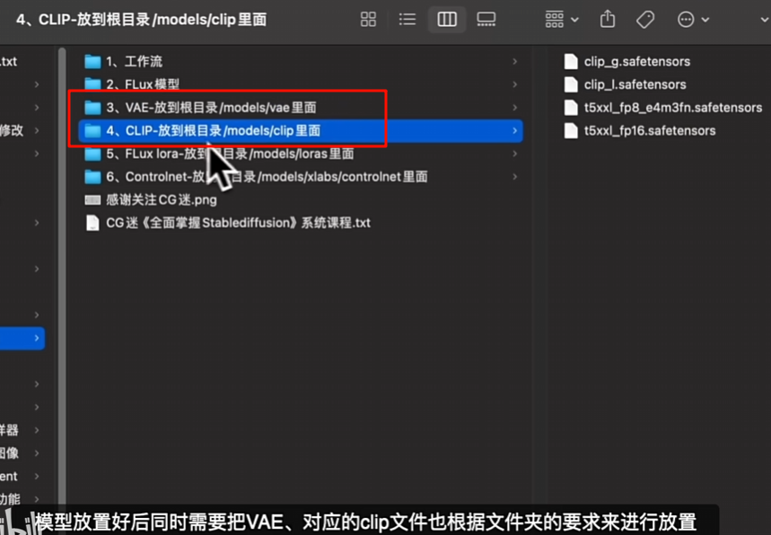

'''

== 安装 krea

所有模型的链接地址:

以下是相关模型链接，分别是Flux Krea Dev 和 Qwen_image，我提供了FP8版本和GGUF量化版本。（需魔法）

==== [Flux Krea Dev] 模型相关链接：

[.small]
[options="autowidth" cols="1a,1a"]
|===
|Header 1 |Header 2

|✨ Diffusion Model扩散模型（FP8版模型）
|flux1-krea-dev_fp8_scaled.safetensors
https://huggingface.co/Comfy-Org/FLUX.1-Krea-dev_ComfyUI/resolve/main/split_files/diffusion_models/flux1-krea-dev_fp8_scaled.safetensors

|✨ Flux.1-Krea GGUF模型下载：
|https://huggingface.co/QuantStack/FLUX.1-Krea-dev-GGUF/tree/main

|✨ Text Encoder（文本编码器模型）
|clip_l.safetensors模型： +
https://huggingface.co/comfyanonymous/flux_text_encoders/blob/main/clip_l.safetensors

t5xxl_fp16.safetensors模型： +
https://huggingface.co/comfyanonymous/flux_text_encoders/resolve/main/t5xxl_fp16.safetensors

t5xxl_fp8_e4m3fn_scaled.safetensors模型： +
https://huggingface.co/comfyanonymous/flux_text_encoders/resolve/main/t5xxl_fp8_e4m3fn_scaled.safetensors

|✨ VAE模型：
|ae.safetensors +
https://huggingface.co/Comfy-Org/Lumina_Image_2.0_Repackaged/resolve/main/split_files/vae/ae.safetensors

|===

==== [Qwen_image] 模型相关链接：（需魔法）

https://huggingface.co/city96/Qwen-Image-gguf

[.small]
[options="autowidth" cols="1a,1a"]
|===
|Header 1 |Header 2

Diffusion model扩散模型（FP8版模型）

|✨ qwen_image_fp8_e4m3fn.safetensors
|https://huggingface.co/Comfy-Org/Qwen-Image_ComfyUI/resolve/main/split_files/diffusion_models/qwen_image_fp8_e4m3fn.safetensors

|Qwen_image_distill
|✨ qwen_image_distill_full_fp8_e4m3fn.safetensors
https://huggingface.co/Comfy-Org/Qwen-Image_ComfyUI/resolve/main/non_official/diffusion_models/qwen_image_distill_full_fp8_e4m3fn.safetensors

|✨ qwen_image_distill_full_bf16.safetensors
|https://huggingface.co/Comfy-Org/Qwen-Image_ComfyUI/resolve/main/non_official/diffusion_models/qwen_image_distill_full_bf16.safetensors)

|✨ Qwen GGUF量化模型：
|Qwen-Image-gguf +
https://huggingface.co/city96/Qwen-Image-gguf/tree/main

|✨ 4步或8步加速 LoRA模型： +
|https://github.com/ModelTC/Qwen-Image-Lightning?tab=readme-ov-file

|✨ Text encoder文本编码模型： +
|qwen_2.5_vl_7b_fp8_scaled.safetensors +
https://huggingface.co/Comfy-Org/Qwen-Image_ComfyUI/resolve/main/split_files/text_encoders/qwen_2.5_vl_7b_fp8_scaled.safetensors

|✨ VAE模型：
|qwen_image_vae.safetensors +
https://huggingface.co/Comfy-Org/Qwen-Image_ComfyUI/resolve/main/split_files/vae/qwen_image_vae.safetensors

|===

[.small]
[options="autowidth" cols="1a,1a"]
|===
|Header 1 |Header 2

|在ComfyUI中使用Nunchaku
|安装ComfyUI-Nunchaku 插件到 custom_nodes 文件夹

手动安装方法 +

1.在custom_nodes 文件夹中打开cmd, 输入下面命令: +
....
git clone https://github.com/mit-han-lab/ComfyUI-nunchaku nunchaku_nodes
....

2.进入到 nunchaku_nodes 目录后，安装依赖：

....
cd ComfyUI/custom_nodes/nunchaku_nodes
pip install -r requirements.txt  //注意: 直接用这个命令, 会速度很慢, 我们可以换国内镜像源来安装,命令如下

用国内镜像源安装
python -m pip install -i https://mirrors.tuna.tsinghua.edu.cn/pypi/web/simple -r requirements.txt
....

国内镜像源的原理, 是只要在原始pip命令中, 加入下面高亮的行就行了 +
python -m pip install #-i https://mirrors.tuna.tsinghua.edu.cn/pypi/web/simple# -r requirements.txt

安装 根据自己Python和PyTorch来下载对应的.whl文件，比如我的

Python：3.12.4

torch：2.5.1+cu121

Window版本

则选择

nunchaku-0.2.0+torch2.5-cp312-cp312-win_amd64.whl

https://huggingface.co/mit-han-lab/nunchaku/tree/main

.每次装新节点后，需要重启 ComfyUI（关掉再开，不只是刷新网页）。否则 ComfyUI 不会重新加载新节点。

---

或
使用Comfy-CLI命令行来安装 +
comfy-cli is a command line tool that makes it easier to install and manage Comfy. +
comfy-cli 是一个命令行工具 ，可以更轻松地安装和管理 Comfy。

comfy-cli  的说明 +
https://docs.comfy.org/comfy-cli/getting-started

用 Comfy-CLI 来安装 ComfyUI-Nunchaku 插件 +
https://nunchaku.tech/docs/ComfyUI-nunchaku/get_started/installation.html

....
git clone https://github.com/comfyanonymous/ComfyUI.git
cd ComfyUI
pip install -r requirements.txt
....

|该模型有不同的量化版本. 效果排序如下图
|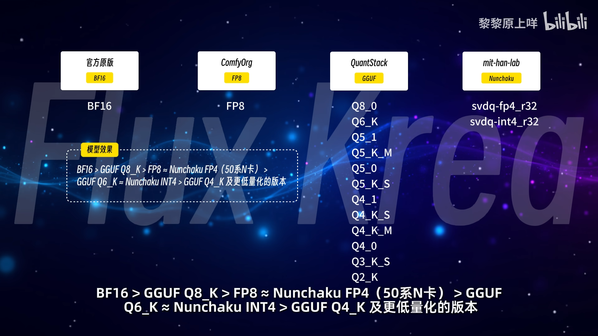

8g显存选 nunchaku (双节棍；索连棍) +
50系显卡, 选 FP4 格式. +
#非50系显卡, 选 INT4 格式.# +

下载地址 +
https://huggingface.co/nunchaku-tech/nunchaku-flux.1-krea-dev/tree/main

模型要放在
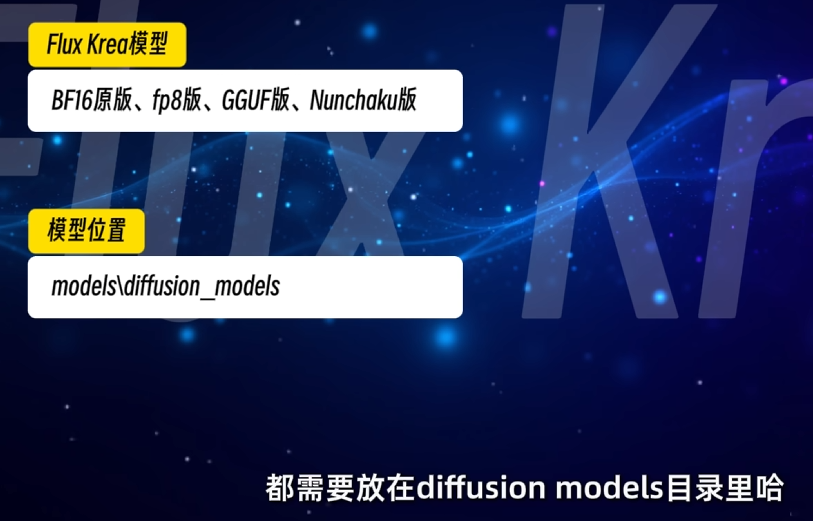

|使用GGUF模型需要额外安装ComfyUI-GGUF插件 +
Nunchaku模型需要ComfyUi-nunchaku插件
|

|clip 和 vae模型, 是和原始的 flux 模型使用的是一样的. +
|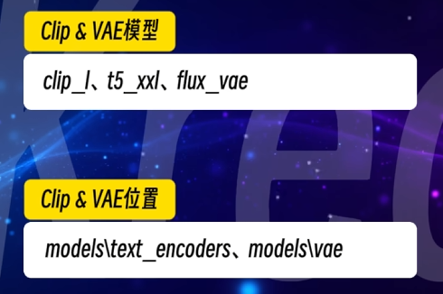

|===

'''

== krea ggux 模型

https://huggingface.co/QuantStack/FLUX.1-Krea-dev-GGUF/tree/main

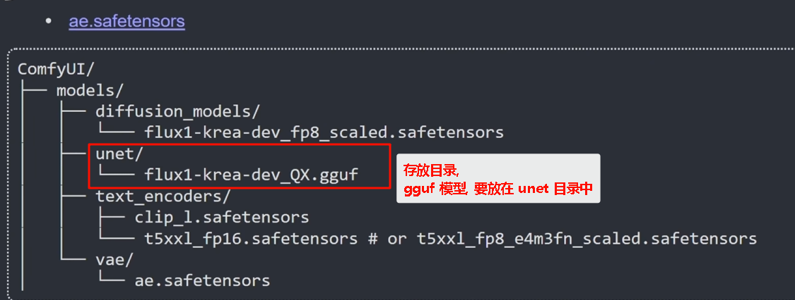

'''

== Qwen-Image-Edit-2509-GGUF

https://huggingface.co/QuantStack/Qwen-Image-Edit-2509-GGUF

