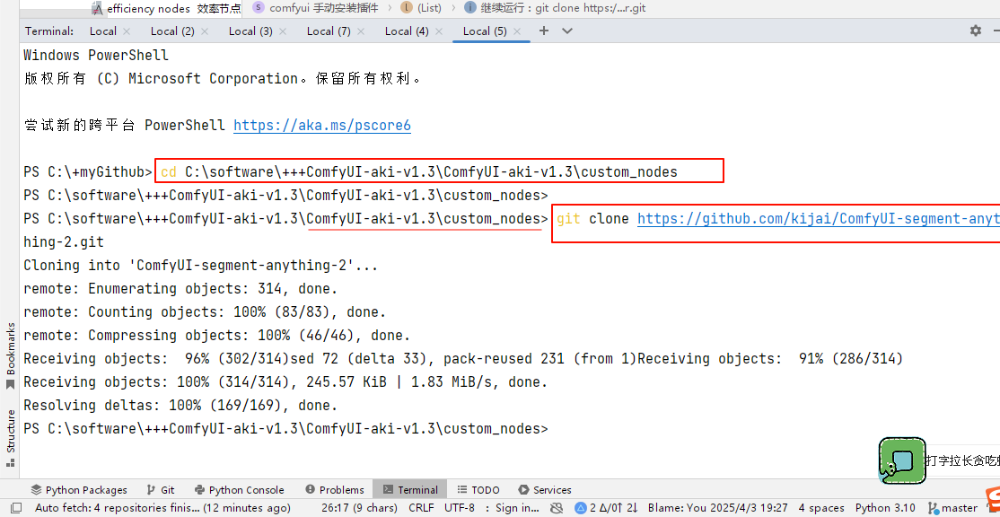

= comfyui 手动安装插件
:toc: left
:toclevels: 3
:sectnums:
:stylesheet: myAdocCss.css

'''

下面的目录中, 就是你插件的存放目录 +
C:\software\+++ComfyUI-aki-v1.3\ComfyUI-aki-v1.3\custom_nodes

在ComfyUI中插件叫做custom node，所有的custom node都装在ComfyUI安装目录下的custom_nodes文件夹中. +
类比webui的extensions文件夹.

单个插件的安装与webui类似，*把插件 git clone 到custom_nodes文件夹里即可。*

[.my1]
.title
====

例如安装ComfyUI Manager这个插件：
https://github.com/ltdrdata/ComfyUI-Manager

分三步：

- 命令行窗口中运行：cd D:\COMFYUI路径XXXX\custom_nodes
- 继续运行：git clone https://github.com/ltdrdata/ComfyUI-Manager.git
- 重启 ComfyUI

====
